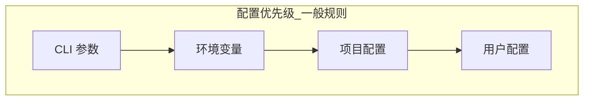
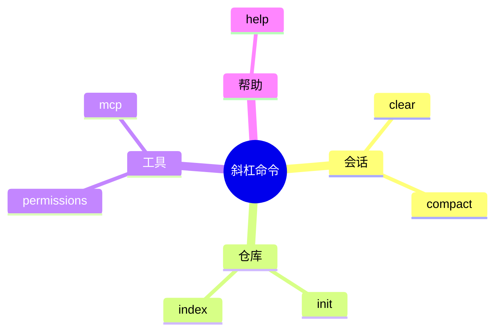

# 附录 B · 命令速查表

> **说明**：斜杠命令与 CLI 开关随版本变化较快，下表为 **V2 教程整理版**。若与终端内 `help` 或官方文档冲突，**以运行时输出为准**。路径以 macOS/Linux 为例。

---

## 1. 配置与状态文件位置（总表）

| 类别 | 典型路径（示意） | 用途 |
|------|------------------|------|
| 用户级配置 | `~/.config/claude-code/` 或产品文档指定目录 | 全局偏好、默认模型、忽略规则 |
| 项目级配置 | 仓库根目录 `.claude/`、`CLAUDE.md` 等 | 项目规则、文档入口 |
| Shell 集成 | `~/.zshrc` / `~/.bashrc` | PATH、别名、非交互变量 |
| 凭据 | OS 钥匙串 / `~/.config/...` 下加密存储（依实现） | API Key、令牌 |
| 日志 | 产品日志目录（见 `doctor` 输出） | 排障、审计 |



---

## 2. 常用 CLI 参数（大表）

| 参数 / 子命令 | 说明 | 备注 |
|---------------|------|------|
| `--help` / `-h` | 显示帮助 | 首选真相源 |
| `--version` | 版本号 | 提 issue 时附上 |
| `doctor` / `diagnose`（若有） | 自检网络、权限、模型 | 排障第一步 |
| `--print` / `non-interactive` 类 | 脚本/CI 非交互 | 注意秘文进日志 |
| `--allowedTools` 类 | 限制工具集 | 安全相关 |
| `--mcp-config` 类 | 指定 MCP 配置路径 | 多项目隔离时常用 |
| `--verbose` / `--debug` | 详细日志 | 生产流水线慎用 |

> 具体子命令名请以 `claude --help` 为准；不同发行渠道命名可能不同。

---

## 3. 环境变量（大表）

| 变量名（示意） | 作用 | 安全提示 |
|----------------|------|----------|
| `ANTHROPIC_API_KEY` | 调用 Claude API | 勿提交 git；CI 用密钥管理 |
| `ANTHROPIC_BASE_URL` | 自定义网关 | 确认证书与租户策略 |
| `HTTP(S)_PROXY` | 代理 | 企业网络常见 |
| `NO_COLOR` | 关闭 ANSI 颜色 | 日志采集友好 |
| `CI=true` | 检测 CI 环境 | 可触发非交互/限权模式 |
| `NODE_OPTIONS` | Node 运行时参数 | 可能影响子进程 |
| `CLAUDE_CODE_*` 类（若有） | 产品专属开关 | 查官方文档列表 |

---

## 4. 斜杠命令 / 内置指令（教学汇总）

下列为 **常见模式** 的分类表；实际以交互界面提示为准。

### 4.1 会话与上下文

| 斜杠命令（示意） | 功能 |
|------------------|------|
| `/clear` | 清空或折叠上下文 |
| `/compact` | 压缩历史 |
| `/resume` | 恢复会话（若支持） |
| `/rename` | 重命名会话 |

### 4.2 仓库与搜索

| 斜杠命令（示意） | 功能 |
|------------------|------|
| `/init` | 初始化项目助手配置 |
| `/index` | 触发/刷新索引（若有） |
| `/grep` 类 | 快速搜索入口 |

### 4.3 工具与权限

| 斜杠命令（示意） | 功能 |
|------------------|------|
| `/permissions` | 查看或重置授权 |
| `/mcp` | MCP 连接管理 |
| `/tools` | 列出可用工具 |

### 4.4 帮助与调试

| 斜杠命令（示意） | 功能 |
|------------------|------|
| `/help` | 命令帮助 |
| `/bug` | 收集诊断信息（若有） |



---

## 5. 自然语言指令模板（可复制）

| 场景 | 模板 |
|------|------|
| Bug 修复 | 「在分支 `{branch}` 上修复 `{issue}`：先复现，再写失败测试，再最小修复；禁止扩大范围。」 |
| 重构 | 「行为不变重构 `{module}`：列出公开 API 不变清单；每步可编译通过。」 |
| 加测试 | 「为 `{path}` 补充覆盖 `{场景}` 的测试，使用现有测试框架与风格。」 |
| 文档 | 「面向 `{读者}` 更新 `{path}`：包含示例命令与常见错误。」 |
| 安全审查 | 「审查 `{PR}` 的秘文、注入、路径穿越风险；输出分级结论。」 |
| 性能 | 「分析 `{path}` 的热路径，给出可验证的基准或复杂度说明。」 |

---

## 6. Git 与 Agent 协作常用命令

| 命令 | 用途 |
|------|------|
| `git status -sb` | 快速看改动面 |
| `git diff` | 审查 Agent 改动 |
| `git stash push -m "wip"` | 人类临时接管前保存 |
| `git worktree add` | 并行尝试不同方案 |

---

## 7. MCP 速查

| 项 | 说明 |
|----|------|
| 配置文件 | 常在项目或用户目录 JSON（见官方文档） |
| 启动失败 | 先查端口、路径、Node 版本 |
| 权限 | 按最小暴露注册工具 |

---

## 8. 排障清单（命令级）

| 步骤 | 命令/动作 |
|------|-----------|
| 1 | 运行 `doctor` 或等价自检 |
| 2 | `curl` / 代理探测（网络） |
| 3 | 降 `verbose` 日志并脱敏后提交 issue |
| 4 | 最小仓库复现 |

---

## 9. CI 片段示例（伪代码）

```yaml
# 示例：仅教学，非可直接运行配置
jobs:
  agent-smoke:
    runs-on: ubuntu-latest
    env:
      ANTHROPIC_API_KEY: ${{ secrets.ANTHROPIC_API_KEY }}
    steps:
      - uses: actions/checkout@v4
      - name: Print version
        run: claude --version
      - name: Non-interactive task
        run: claude --help
```

---

## 10. 与模型相关的常用开关（示意表）

| 开关类型 | 示例（依产品而定） | 用途 |
|----------|-------------------|------|
| 模型别名 | `opus` / `sonnet` 等 | 切换能力/成本档位 |
| 温度 | `temperature` | 创造性 vs 确定性（编程常偏低） |
| 最大输出 | `max_tokens` 类 | 限制单次生成长度 |

---

## 11. 工作区忽略与索引（概念表）

| 文件/机制 | 用途 |
|-----------|------|
| `.gitignore` | git 与部分索引器尊重的忽略规则 |
| `.cursorignore` 类产品文件 | 限制 IDE/Agent 索引范围 |
| `CLAUDE.md` 类项目说明 | 注入稳定项目规范（注意秘文） |

---

## 12. 常用排错环境变量

| 变量（示意） | 场景 |
|--------------|------|
| `SSL_CERT_FILE` | 企业 MITM 证书 |
| `NODE_TLS_REJECT_UNAUTHORIZED` | **慎用**，仅排障临时 |
| `DEBUG` / `DEBUG=*` | 库级详细日志 |

---

## 13. 自然语言指令扩展模板

| 场景 | 模板 |
|------|------|
| 依赖升级 | 「将 `{pkg}` 升级到 `{version}`：跑测试与类型检查，列出破坏性变更对照。」 |
| 国际化 | 「为 `{组件}` 抽取文案到 `{i18n路径}`，禁止硬编码中文留在 JSX。」 |
| API 对接 | 「实现 `{endpoint}` 客户端：超时、重试、错误映射、单元测试各一例。」 |
| 迁移 | 「从 `{旧库}` 迁到 `{新库}`：分 PR、每步可运行、附回滚说明。」 |

---

## 14. 小结

- **真相源**：`--help` > 官方文档 > 本书附录。
- **安全**：环境变量与日志脱敏优先于「先跑起来」。
- **模板**：自然语言也要 **结构化**（目标/约束/验收）。

---

*附录 B · V2 教学稿*
