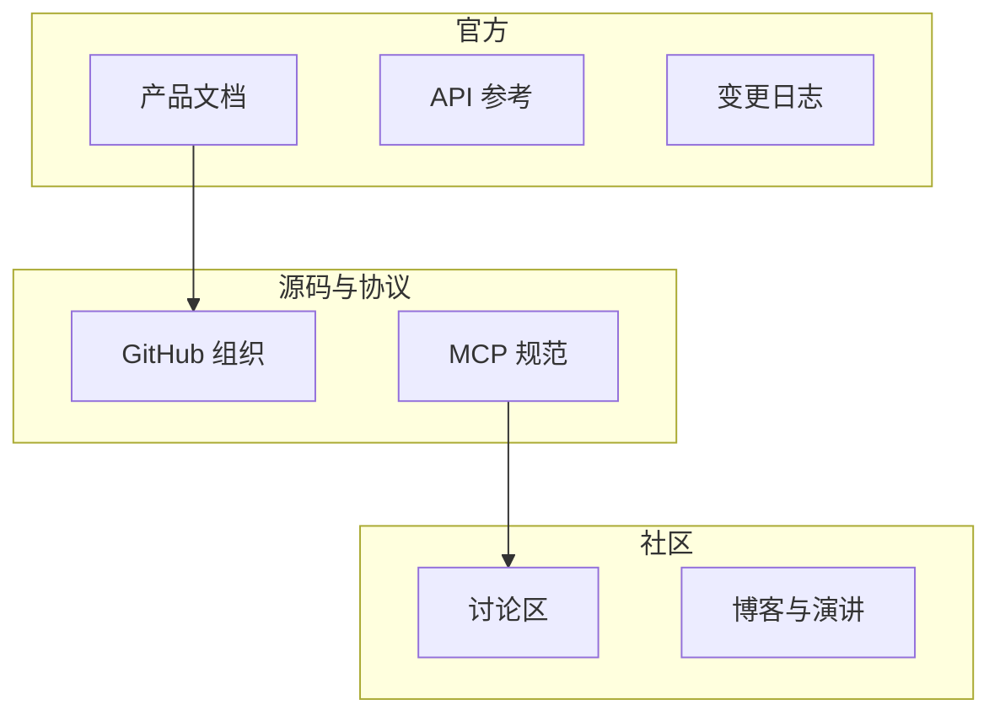
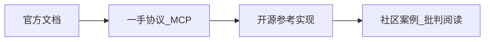

# 附录 D · 推荐阅读与外部资源

> **说明**：链接均为 **教程编写时常见入口**，不保证永久有效；请在访问前核对域名与证书。企业内网需遵守贵司上网策略。

---

## 1. 资源地图

---

## 2. 官方文档（英文为主）

| 主题 | URL | 备注 |
|------|-----|------|
| Anthropic 文档总入口 | https://docs.anthropic.com/ | 模型、API、策略 |
| Claude API 参考 | https://docs.anthropic.com/en/api/ | 请求/流式/错误码 |
| 消息与工具使用指南 | https://docs.anthropic.com/en/docs/build-with-claude/tool-use | 工具调用模式 |
| MCP 介绍 | https://modelcontextprotocol.io/ | 协议与生态 |
| MCP 规范仓库 | https://github.com/modelcontextprotocol/specification | 版本与变更 |

---

## 3. 源码与仓库（学习向）

| 主题 | URL | 备注 |
|------|-----|------|
| MCP TypeScript SDK | https://github.com/modelcontextprotocol/typescript-sdk | 服务端/客户端示例 |
| Continue | https://github.com/continuedev/continue | 开源 IDE 扩展 |
| Aider | https://github.com/Aider-AI/aider | 终端 pair programming |

---

## 4. 源码分析文章（中文）

| 主题 | 说明与检索建议 |
|------|------------------|
| 「Claude Code 架构」 | 在搜索引擎或技术社区检索 **Claude Code 源码 分析**、**Agent 循环** |
| 「MCP 实战」 | 检索 **MCP 服务器 搭建**、**工具注册** |
| 「上下文工程」 | 检索 **RAG Agent 编程**、**长上下文 成本** |

> 具体文章 URL 变化频繁，本书以 **检索词 + 官方一手文档** 为主锚点。

---

## 5. 源码分析文章（英文）

| 主题 | 说明与检索建议 |
|------|------------------|
| Tool use / function calling | 检索 **Anthropic tool use best practices** |
| Agent harness | 检索 **LLM agent loop design**、**ReAct** |
| Security | 检索 **prompt injection**、**LLM agent sandbox** |

---

## 6. 视频教程（检索向）

| 平台 | 检索关键词 |
|------|------------|
| YouTube | `Claude Code tutorial`, `MCP server tutorial` |
| Bilibili | `Claude Code 教程`, `MCP 入门` |

---

## 7. 社区讨论

| 平台 | URL 或说明 |
|------|------------|
| GitHub Discussions | 各项目仓库内 |
| Hacker News | https://news.ycombinator.com/ 检索相关标题 |
| Reddit | r/LocalLLaMA、r/MachineLearning 等（注意噪声） |

---

## 8. 安全与合规阅读

| 主题 | 检索建议 |
|------|----------|
| 供应链 | **SLSA**、**npm supply chain** |
| 数据保护 | **GDPR**、贵司隐私政策 |
| 秘文管理 | **GitHub secret scanning** |

---

## 9. 经典论文与概念（选读）

| 概念 | 说明 |
|------|------|
| ReAct | 推理与行动交错范式 |
| RLHF / RLAIF | 对齐与行为塑造（背景向） |
| RAG | 检索增强生成与 Agent 结合 |

---

## 10. 本书建议阅读顺序

---

## 11. 引用规范建议

- 优先引用 **版本化** 文档（带日期或 commit）。
- 转载社区文章请核对 **许可证**。

---

## 12. 安全纵深阅读（链接或检索）

| 主题 | 入口 |
|------|------|
| OWASP LLM Top 10 | 检索 `OWASP LLM Top 10` 官方页面 |
| Prompt Injection | 检索 `prompt injection mitigation` |
| SLSA 供应链 | https://slsa.dev/ |

---

## 13. 工程实践书单（检索向）

| 方向 | 检索词 |
|------|--------|
| 可观测性 | `OpenTelemetry`、分布式追踪 |
| 测试 | `testing pyramid`、契约测试 |
| 发布 | `feature flags`、`canary deployment` |

---

## 14. 中文社区与聚合（注意甄别质量）

| 类型 | 说明 |
|------|------|
| 聚合站 | 关注 **原出处** 与 **发布日期** |
| 翻译文 | 对照英文一手文档核对术语 |

---

*附录 D · V2 教学稿 · 外链需读者自行验证时效性*
