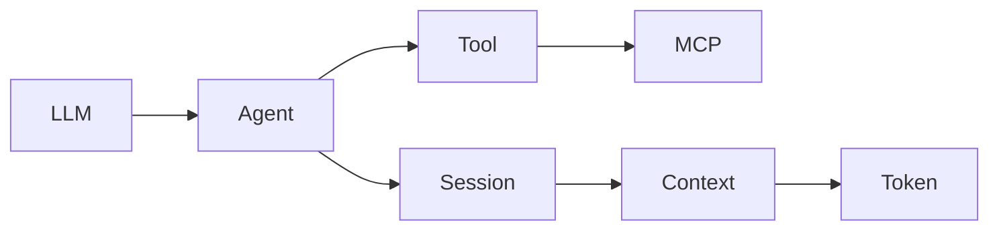

# 附录 E · 中英术语对照表

> **说明**：同一英文词在不同产品中有不同译法，本表取 **教学常用译法**；括号内为可替换说法。

---

## 术语表（60+）

| 英文 | 中文 | 简要解释 |
|------|------|----------|
| Agent | 智能体 / Agent | 能感知环境、调用工具、多步推进任务的系统 |
| AI Agent | AI 智能体 | 以模型为推理核、外围含工具与策略的 Agent |
| Anthropic | Anthropic（人名/公司名） | Claude 系列模型与相关产品的开发方 |
| API Key | API 密钥 | 访问云端 API 的凭据，需保密与轮换 |
| API | 应用程序接口 | 程序间调用约定，含认证、限流、错误语义 |
| Allowlist | 允许列表 | 仅显式列出的操作/工具可被自动执行 |
| Audit trail | 审计轨迹 | 关键动作的可追溯记录 |
| Bash / Shell | Shell / 终端命令 | 在操作系统层执行命令的接口 |
| Blast radius | 影响半径 | 一次故障或错误变更波及的系统范围 |
| Branch | 分支 | 版本控制中并行开发线 |
| BYOK | 自备密钥 | Bring Your Own Key，使用自有 API Key |
| Cache | 缓存 | 复用先前结果以降低延迟与成本 |
| Canary deployment | 金丝雀发布 | 小流量验证后再全量发布 |
| Checkpoint | 检查点 | 长任务中可恢复或回滚的中间状态 |
| CI | 持续集成 | Continuous Integration，自动化构建与测试 |
| CLI | 命令行界面 | Command Line Interface |
| Claude | Claude | Anthropic 的对话与工具模型产品线名称 |
| Claude Code | Claude Code | 面向终端/仓库的编程 Agent 产品形态（教程语境） |
| Commit | 提交 | 将变更记录到版本库的快照 |
| Compression (context) | （上下文）压缩 | 将历史折叠为摘要以节省窗口 |
| Context window | 上下文窗口 | 模型单次可见的 token 上限 |
| Context | 上下文 | 提示、历史、检索结果等的总和 |
| Coordinator | 协调器 | 多 Agent 任务拆分与合并模块 |
| Copilot | 副驾驶 / Copilot | 辅助编程产品统称（多厂商使用） |
| Cursor | Cursor | 一款 AI IDE 产品名 |
| Denylist / Blocklist | 拒绝列表 | 明确禁止的动作或域 |
| Diff | 差异 | 两个版本之间的改动对比 |
| E2E test | 端到端测试 | 覆盖完整用户路径的测试 |
| Embedding | 嵌入向量 | 文本/代码的稠密向量表示，用于检索 |
| Flaky test | 不稳定测试 | 间歇性失败、与环境或时序相关的测试 |
| Fork | 分叉 / 复刻 | 复制仓库以独立演进 |
| Git | Git | 分布式版本控制工具 |
| GitHub | GitHub | 代码托管与协作平台 |
| Hallucination | 幻觉 | 模型生成看似合理但事实错误的内容 |
| Harness | 套架 / 运行时框架 | 驱动模型循环、工具调用与状态机的代码 |
| Human-in-the-loop | 人类在环 | 关键步骤需人工确认或审批 |
| IDE | 集成开发环境 | Integrated Development Environment |
| Indexing | 索引 | 为检索对仓库建立结构或向量索引 |
| Issue | 议题 / 工单 | 缺陷或任务跟踪条目 |
| JSON Schema | JSON 模式 | 描述 JSON 结构与字段约束 |
| JWT | JWT 令牌 | 常用于无状态认证的令牌格式（若涉及网关） |
| Least privilege | 最小权限 | 仅授予完成任务所需的最小能力 |
| Lint | 静态检查 | 代码风格与部分错误的静态分析 |
| LLM | 大语言模型 | Large Language Model |
| MCP | 模型上下文协议 | Model Context Protocol，工具与资源的标准化扩展 |
| Merge | 合并 | 将分支变更合入目标分支 |
| Multimodal | 多模态 | 同时处理文本、图像等多种输入 |
| OAuth | OAuth | 一种常见授权协议（企业集成场景） |
| Patch | 补丁 | 一组文件的增量改动 |
| Permission | 权限 | 能否执行某类操作的判定 |
| Plugin | 插件 | 可扩展能力的模块 |
| PoC | 概念验证 | Proof of Concept，小规模试点 |
| PR | 拉取请求 | Pull Request，代码评审与合并请求 |
| Prompt | 提示词 | 发给模型的指令与上下文片段 |
| RAG | 检索增强生成 | Retrieval-Augmented Generation |
| Rate limit | 限流 | API 调用频率上限 |
| Retry | 重试 | 失败后的再次尝试（需幂等配合） |
| Rollback | 回滚 | 恢复到变更前状态 |
| Sandbox | 沙箱 | 隔离执行环境以限制破坏范围 |
| Schema | 模式 / 结构约束 | 数据或工具输入输出的结构定义 |
| Secret | 密钥 / 秘文 | 密码、令牌等敏感信息 |
| Session | 会话 | 一次连续交互的状态边界 |
| Slash command | 斜杠命令 | 以 `/` 开头的交互式指令 |
| SSE | 服务器推送事件 | Server-Sent Events，流式响应常用 |
| SSO | 单点登录 | Single Sign-On |
| Streaming | 流式输出 | 分块返回模型生成内容 |
| Subagent | 子智能体 | 被委派子任务的 Agent 实例 |
| System prompt | 系统提示 | 会话级稳定规则与角色设定 |
| Telemetry | 遥测 | 使用情况与诊断数据的上报（需合规） |
| Token | 词元 / Token | 模型计费与窗口计量的基本单位 |
| Tool use | 工具调用 | 模型发起结构化工具请求的能力 |
| Tool | 工具 | Agent 可调用的外部能力单元 |
| TUI | 终端用户界面 | Text-based UI |
| Typecheck | 类型检查 | 静态类型系统验证 |
| Windsurf | Windsurf | 一款 AI IDE 产品名 |
| Worktree | 工作树 | Git 同一仓库多检出目录的机制 |
| Zero trust | 零信任 | 默认不信任、持续验证的安全模型 |

---

## 概念关系简图

---

## 使用建议

- 写 **中英文混排 PR 描述** 时，可固定一套译名（本表为起点）。
- 对外文档 **首次出现** 可用「中文（English）」格式。

---

*附录 E · V2 教学稿 · 共 67 条术语*
