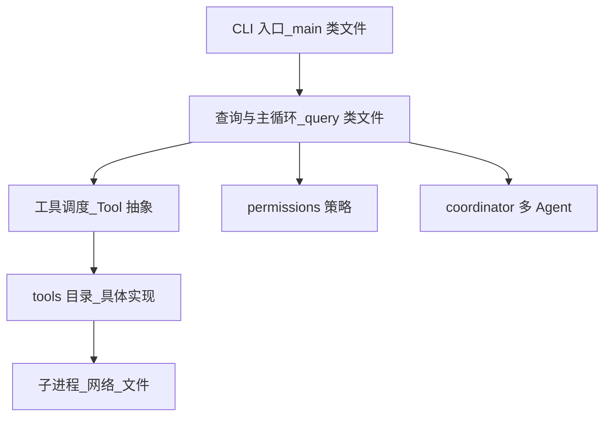
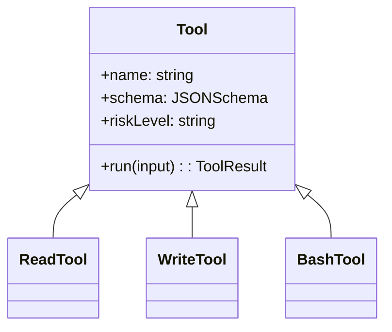

# 附录 A · 源码文件索引（教学用模块地图）

> **说明**：下列路径、行数与职责为 **V2 教程级「示意索引」**，用于建立阅读大型 Agent/CLI 代码库时的心智模型；真实上游仓库随版本迭代会变化，**请以你本地 checkout 为准**（可用 `wc -l`、`cloc` 自行核对）。核心论点不变：**入口薄、循环厚、工具散、权限横切**。

---

## 1. 总览：从入口到一次请求的旅程



**表 A-1：旅程与典型文件职责**

| 阶段 | 典型模块 | 读者关注点 |
|------|----------|------------|
| 启动 | CLI 入口 | 参数解析、配置加载、日志初始化 |
| 会话 | 会话状态 | 历史、压缩、检查点 |
| 循环 | query / loop | 模型往返、工具选择、终止条件 |
| 执行 | tools/* | IO 边界、错误格式、超时 |
| 横切 | permissions | 默认拒绝、升级路径、审计钩子 |

---

## 2. 核心文件索引（高信号）

**表 A-2：关键源码文件（教学示意）**

| 文件路径（示意） | 行数（示意） | 功能描述 |
|------------------|-------------|----------|
| `src/main.tsx` 或 `cli/main.ts` | ~4684 | CLI 入口、命令分发、全局初始化、部分 UI 渲染 |
| `src/query.ts`（或 `session/query.ts`） | ~1730 | **核心循环**：模型调用、工具编排、消息折叠与重试 |
| `src/Tool.ts`（或 `tools/Tool.ts`） | ~793 | 工具抽象基类：schema、执行、权限声明、结果封装 |
| `src/tools/**/*.ts` | 若干 | 读文件、写文件、执行命令、搜索、提交等原子能力 |
| `src/permissions/**` | 若干 | 策略引擎：允许列表、会话级授权、持久化偏好 |
| `src/coordinator/**` | 若干 | 子 Agent 委派、任务分片、结果合并 |
| `src/config/**` | 若干 | 配置合并：文件、环境变量、CLI 覆盖 |
| `src/mcp/**` 或 `integrations/mcp` | 若干 | MCP 客户端生命周期与路由 |
| `src/ui/**` / `tui/**` | 若干 | 终端 UI、富文本、进度与确认框 |

> 行数为 **教程标注量级**，用于表达「何处最厚」；非精确审计。

---

## 3. 按模块分组的大表

### 3.1 CLI 与启动链

| 路径模式 | 职责 |
|----------|------|
| `**/cli*.ts` | 子命令：`chat`、`doctor`、`mcp` 等 |
| `**/argv*.ts` | 参数规范化 |
| `**/logger*.ts` | 结构化日志、脱敏 |

### 3.2 会话与上下文

| 路径模式 | 职责 |
|----------|------|
| `**/session*.ts` | 会话 ID、元数据 |
| `**/context*.ts` | 上下文装配、相关文件解析 |
| `**/compress*.ts` | 历史摘要与折叠策略 |
| `**/cache*.ts` | 工具/检索缓存（若有） |

### 3.3 模型与供应商

| 路径模式 | 职责 |
|----------|------|
| `**/anthropic*.ts` | 官方 API 客户端、流式解析 |
| `**/model*.ts` | 路由、降级、重试 |
| `**/streaming*.ts` | SSE/chunk 处理 |

### 3.4 工具系统

| 路径模式 | 职责 |
|----------|------|
| `**/Tool.ts` | 接口与注册 |
| `**/tools/read*.ts` | 安全读盘与编码 |
| `**/tools/write*.ts` | 补丁应用、冲突检测 |
| `**/tools/bash*.ts` 或 `exec` | 命令执行与沙箱 |
| `**/tools/grep*.ts` / `glob` | 仓库内搜索 |



### 3.5 权限与策略

| 路径模式 | 职责 |
|----------|------|
| `**/permissions/policy*.ts` | 规则求值 |
| `**/permissions/store*.ts` | 用户选择持久化 |
| `**/sandbox*.ts` | 进程/网络隔离（若存在） |

### 3.6 协调与多 Agent

| 路径模式 | 职责 |
|----------|------|
| `**/coordinator/*.ts` | 任务拆分、子会话 |
| `**/agent*.ts` | 角色定义、提示边界 |
| `**/handoff*.ts` | 上下文交接格式 |

### 3.7 测试与夹具

| 路径模式 | 职责 |
|----------|------|
| `**/__tests__/**` | 单元与集成 |
| `**/e2e/**` | 端到端（若有） |
| `**/fixtures/**` | 仓库样例 |

---

## 4. 「4756 个模块」在索引中的读法

教学上可把「模块」理解为：**每一个可独立失败、需要独立版本策略的单元**——不仅指文件数，也指 npm 包、动态加载插件、MCP 服务器进程。索引的价值是让你知道 **该从哪里下刀**：

| 症状 | 优先翻的目录 |
|------|----------------|
| 工具调用失败 | `tools/*` + `Tool.ts` |
| 权限弹窗异常 | `permissions/*` |
| 循环卡住/重复 | `query.ts` + 会话压缩 |
| MCP 连不上 | `mcp/*` + 配置合并 |

---

## 5. 阅读顺序建议（8 小时版）

| 小时 | 文件/目录 | 目标 |
|------|-----------|------|
| 1 | CLI 入口 | 知道命令如何落到会话 |
| 2–3 | `query.ts` | 理解主循环与工具调度 |
| 4 | `Tool.ts` + 2 个具体工具 | 理解契约 |
| 5 | `permissions` | 理解默认拒绝 |
| 6 | `coordinator` | 理解多 Agent |
| 7–8 | 测试夹具 | 看「官方认为的正确行为」 |

---

## 6. 与本书正文的映射

| 正文主题 | 索引锚点 |
|----------|----------|
| 工具治理 | `Tool.ts`、`tools/*` |
| 安全 | `permissions/*`、危险工具实现 |
| 上下文 | `query.ts`、压缩与缓存模块 |
| 多 Agent | `coordinator/*` |

---

## 7. 自助生成索引命令（读者可执行）

```bash
# 按行数列出前 30 个 TypeScript 文件（示例）
find . -name "*.ts" -not -path "*/node_modules/*" -print0 | xargs -0 wc -l | sort -nr | head -n 30
```

---

## 8. 变更追踪建议

| 实践 | 说明 |
|------|------|
| 锁版本 tag | 对照 release note |
| 记 diff | 升级后重跑「8 小时阅读」中的关键路径 |
| 维护团队私有索引 | 在 `docs/internal/` 放一页「我们 fork 的差异」 |

---

## 9. 小结

- **入口**薄：**CLI**。
- **心脏**厚：**query/loop**。
- **手脚**散：**tools/**。
- **交规**横切：**permissions/**。
- **车队**可选：**coordinator/**。

---

## 10. 图表索引

| 图 | 类型 |
|----|------|
| 图 A-1 | flowchart 总览 |
| 图 A-2 | classDiagram 工具类 |

---

*附录 A · V2 教学稿 · 路径与行数需以实际仓库为准*
