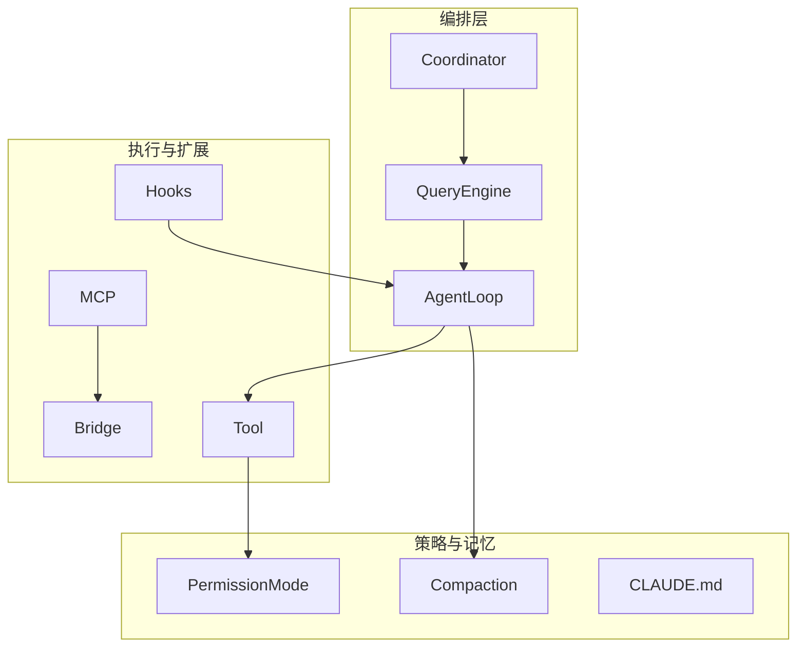
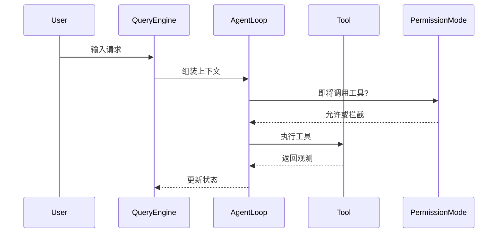
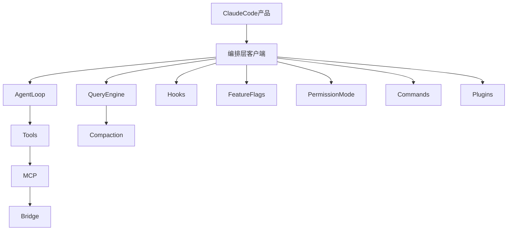

# 术语表：把「行话」变成你能用的口令

> **本节学习目标**
>
> - 掌握 **30+** 个本书高频术语，能在对话中正确使用英文原名与中文释义。
> - 通过 **生活类比** 把抽象概念钉在记忆里。
> - 借助 **Mermaid 关系图** 理解术语之间的调用与包含关系。

---

## 使用说明

- 下表按 **概念域** 分组；每组附 **类比** 与 **在 Claude Code 语境下的提示**。  
- 若某实现细节随社区重建仓库版本变化，本书以 **教学一致性** 优先，必要时注明「以你本地 checkout 为准」。



---

## A. Agent 与对话核心

| 术语 | 英文 / 缩写 | 解释 | 生活类比 |
|------|-------------|------|----------|
| **智能体循环** | Agent Loop | 模型在「思考 → 选行动 → 看结果 → 再思考」之间循环，直到任务结束或被打断。 | 餐厅后厨：接单、切配、下锅、尝味、补盐，直到出餐。 |
| **查询引擎** | QueryEngine | 把用户输入、历史消息、系统提示等 **编排** 成可提交给模型与工具层的一次「查询」处理管线。 | 机场值机柜台：收证件、打登机牌、行李贴条、指引登机口。 |
| **协调器** | Coordinator | 在多模块或多子代理之间分配步骤、合并结果、处理冲突的高层角色（具体类名以源码为准）。 | 电影场记 + 副导演：谁上场、谁先说话、台词错了谁重拍。 |
| **对话压缩** | Compaction | 当上下文过长时，对历史进行 **摘要、裁剪或结构化折叠**，腾出 token 窗口。 | 行李箱装不下时，把厚羽绒服换成真空袋。 |
| **验证代理** | Verification Agent | 用于对主代理输出或工具结果做 **二次校验** 的逻辑（如静态检查、对拍、规则引擎）。 | 试卷上的「第二阅卷老师」。 |

---

## B. 工具、权限与安全

| 术语 | 英文 / 缩写 | 解释 | 生活类比 |
|------|-------------|------|----------|
| **工具** | Tool | 模型可调用的外部能力单元（读文件、跑命令、搜索等），通常有 schema 与实现。 | 瑞士军刀上的每一把小工具。 |
| **权限模式** | Permission Mode | 决定工具调用前是否需要用户确认、默认允许列表、沙箱边界等策略集合。 | 小区门禁：业主卡 / 访客登记 / 装修临时证。 |
| **功能开关** | Feature Flags | 按用户、环境或随机百分比打开/关闭某功能，用于灰度与实验。 | 游乐园「试运营」项目：只有持蓝票的游客能进。 |
| **钩子** | Hooks | 在生命周期的固定点插入自定义逻辑（前后置、审计、改写）。 | Word 文档的「保存前自动跑宏」。 |



---

## C. 协议、桥接与项目记忆

| 术语 | 英文 / 缩写 | 解释 | 生活类比 |
|------|-------------|------|----------|
| **模型上下文协议** | MCP | 一种让 AI 应用以标准方式连接外部数据源与工具生态的协议（Anthropic 推动）。 | USB-C：不同厂家设备用同一接口充电传数据。 |
| **桥** | Bridge | 在 CLI 与 MCP 服务、子进程或宿主环境之间转发消息与生命周期的组件。 | 口岸大桥：车辆换向、检查、计费。 |
| **CLAUDE.md** | CLAUDE.md | 项目根或约定路径下的 **持久说明文件**，给模型提供风格、命令、目录约定等长期记忆。 | 新同事入职文件夹里的「我们团队怎么协作」。 |

---

## D. 工程与构建相关

| 术语 | 英文 / 缩写 | 解释 | 生活类比 |
|------|-------------|------|----------|
| **Source Map** | `.map` | 将压缩/打包后的 JS 映射回原始 TS 源的文件，便于调试。 | 翻译书里的「边注」：英文版页码对照中文版段落。 |
| **npm 包** | npm package | 发布到 npm registry 的 tarball，内含 `package.json` 声明的入口与文件列表。 | 超市货架上的「预制菜包装盒」。 |
| **.npmignore** | `.npmignore` | 告诉 npm **不要** 打包哪些路径；若配置失误，可能把不该上传的文件打进包。 | 搬家纸箱上写「此箱勿封」却还是被胶带封死了。 |
| **Stub 模块** | Stub | 仅占位、返回空实现或最小实现的模块，用于让 TypeScript 编译通过。 | 电影拍摄时的「替身站位」，后期再换真演员。 |
| **Coordinator（文件域）** | coordinator/ | 源码树中常与「多步骤任务编排」相关的目录（具体以仓库为准）。 | 交响乐团指挥台附近的乐谱架区。 |

---

## E. 产品与社区语境

| 术语 | 英文 / 缩写 | 解释 | 生活类比 |
|------|-------------|------|----------|
| **Claude Code** | Claude Code | Anthropic 的终端 AI 编程代理产品，负责在本地/远程环境中辅助开发。 | 住在终端里的「结对程序员」。 |
| **客户端编排层** | client orchestration | 相对「模型推理服务」而言，运行在用户侧的调度、工具、UI、配置逻辑。 | 外卖 App：店家做饭是云端，骑手调度是客户端周边系统。 |
| **泄露 vs 入侵** | leak vs breach | 泄露常指 **误发布** 敏感产物；入侵强调 **未授权访问**。二者法律评价不同。 | 把日记本落在公交上 vs 有人撬锁进你家偷日记。 |
| **社区重建** | community reconstruction | 爱好者根据泄露或公开片段 **恢复可浏览源码树** 的努力，常缺构建脚本。 | 用碎瓷片拼出花瓶形状，但可能缺几块。 |

---

## F. 扩展术语（补足 30+）

| 术语 | 简要解释 |
|------|----------|
| **Assistant** | 常与对话侧、建议侧 UI 或子系统相关（具体命名以源码为准）。 |
| **Buddy** | 源码树中可能出现的辅助模块/实验名，宜对照目录而非臆测功能。 |
| **Plugins** | 插件机制：在核心外加载扩展命令或工具。 |
| **Commands** | 用户可触发的子命令实现目录（如 `src/commands` 一类）。 |
| **Services** | 长生命周期服务：配置、遥测、会话等（如 `src/services`）。 |
| **Utils** | 通用工具函数集合，避免业务目录臃肿。 |
| **main.tsx / main.ts** | CLI 或 UI 入口之一，常体积巨大，是阅读锚点。 |
| **query.ts** | 与查询/会话管线强相关的核心文件之一。 |
| **Tool.ts** | 工具抽象定义或基类可能出现的位置。 |
| **R2** | Cloudflare R2 对象存储；若构建链上传产物，可能与发布物存储相关（教学语境下常作为「CDN/桶」代称）。 |
| **Bun** | 高性能 JS 运行时/工具链；某些构建默认行为（如生成 Source Map）会影响发布物。 |
| **TypeScript** | 带类型的 JavaScript 超集；本书源码主线语言。 |
| **Registry** | 工具/命令的注册表模式：名字到实现的映射。 |
| **Telemetry** | 匿名或脱敏的使用数据上报（若实现存在，应以隐私政策为准）。 |
| **Sandbox** | 限制文件/网络/子进程权限的执行环境策略（概念层）。 |

---

## G. 关系速查：谁包含谁？



---

## H. 易混淆对比表

| 对比组 | A | B | 记忆口诀 |
|--------|---|---|----------|
| 协议 vs 实现 | MCP | Bridge | MCP 是「插座标准」，Bridge 是「插线板」。 |
| 循环 vs 引擎 | Agent Loop | QueryEngine | Loop 像「心跳」，Engine 像「血液循环系统」。 |
| 压缩 vs 权限 | Compaction | Permission Mode | 一个管「记不记得住」，一个管「让不让做」。 |
| 钩子 vs 插件 | Hooks | Plugins | Hooks 像「事件」，Plugins 像「配件包」。 |

---

## I. 关键源码「指路牌」（示意片段）

下列代码 **仅为教学示意**，帮助你把术语和「可能在源码里长什么样」联系起来：

```typescript
// PermissionMode: 策略枚举或配置对象（示意）
type PermissionMode = "default" | "acceptEdits" | "plan" | "bypass";

// Tool: 名字 + 入参 schema + 执行体（示意）
interface ToolDefinition {
  name: string;
  description: string;
  execute: (input: unknown) => Promise<unknown>;
}

// Compaction: 可能在对话历史过长时触发（示意）
async function maybeCompactThread(thread: Message[]): Promise<Message[]> {
  if (estimateTokens(thread) > SOFT_LIMIT) return summarize(thread);
  return thread;
}
```

---

## J. 推荐阅读顺序（针对术语表）

1. 先扫 **A、B** 两组（Agent + 工具权限）。  
2. 再读 **C**（MCP / CLAUDE.md）。  
3. 遇到构建新闻时回到 **D**（Source Map / npm）。  
4. 写读书报告前复习 **H**（易混表）。

---

## K. 空白笔记区（可自行打印填写）

| 我自己造的句子（用上 5 个术语） |
|--------------------------------|
|                                |

---

术语表会随全书更新而增补。若你在社区重建仓库里发现 **同名不同义** 的文件（例如两个 `Tool.ts`），以 **路径前缀** 区分，并在笔记本里画一张「同名文件地图」——这是阅读超大仓库的必备习惯。下一节：[`setup.md`](./setup.md) 把环境一次配稳。
