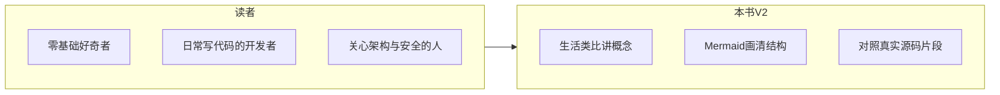
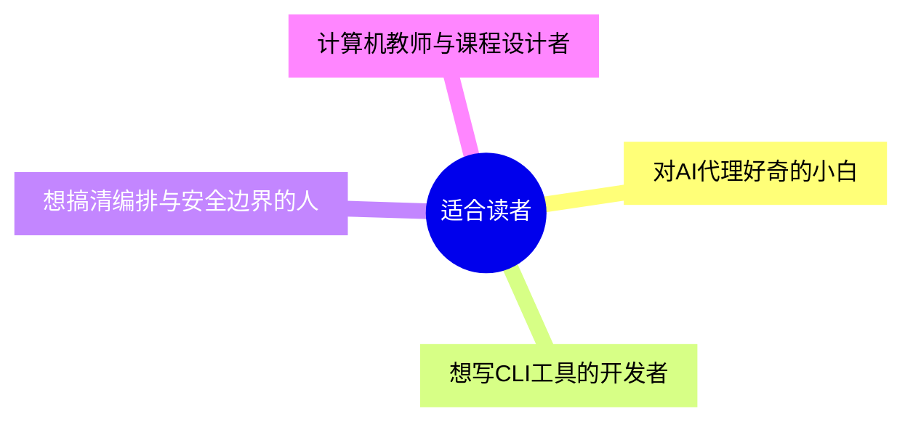
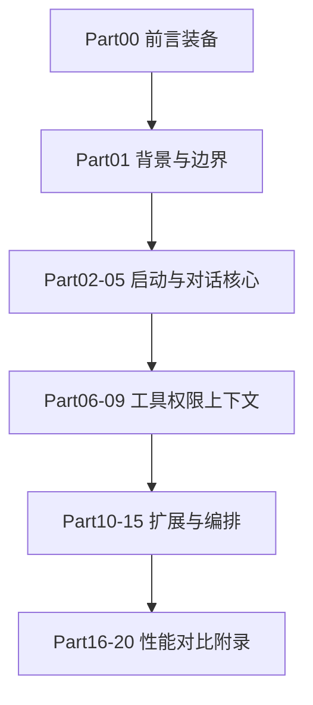
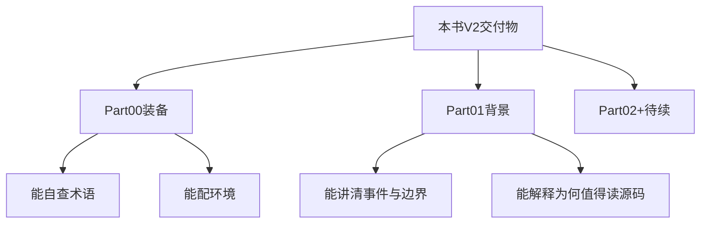
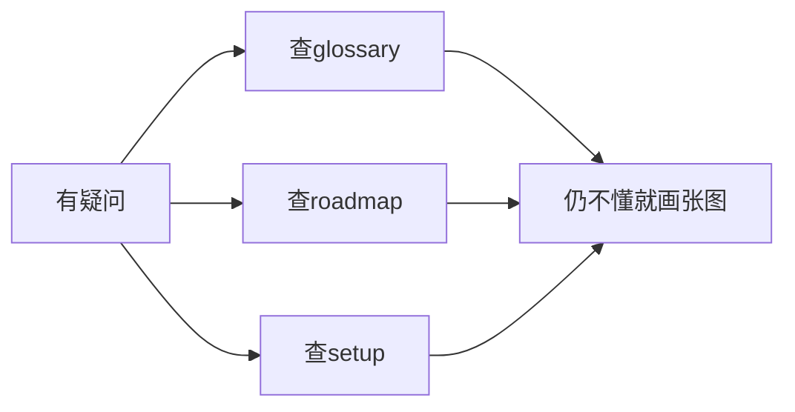

# 前言：关于《Claude Code 完全指南 V2》

> **本节学习目标**
>
> - 理解本书 V2 与 V1 的定位差异，以及为何以「51 万行真实源码」为主线。
> - 判断自己是否属于本书的目标读者，并知道如何搭配路线图阅读。
> - 掌握全书 20 篇的结构地图，能按「小白 / 开发者 / 架构师」三种节奏自学。

---

## 一本书的诞生：从终端里的「小助手」到可读的工程史诗

如果把 **Claude Code** 想象成一位住在你终端里的「私人管家」，那么 Anthropic 官方发布的 npm 包，就是这位管家每天出门时穿的「制服」。2026 年 3 月底，有研究者发现：这件制服的内衬里，不小心缝进了一张「建筑蓝图」——一张体积约 **60MB** 的 `cli.js.map`（Source Map）。透过它，社区得以一窥约 **51.2 万行 TypeScript**、**1903 个文件** 构成的客户端编排层。

本书 **V2** 要做的，不是八卦泄露本身，而是把这次「意外透明」变成 **零基础也能跟上的教学叙事**：像读一部长篇小说那样，从背景、地图、术语、环境，一路走进 Agent 循环、工具系统、权限与安全设计。



---

## V2 新特色：我们改了什么？

| 维度 | V1（假设的通用 Agent 教程） | V2（本书） |
|------|---------------------------|------------|
| 素材来源 | 多为概念图、伪代码、公开文档 | 以 **npm 包中意外附带的 Source Map** 所还原的 TS 结构为锚点 |
| 叙事粒度 | 常停在「Agent 会调工具」 | 深入到 **QueryEngine、Coordinator、Compaction、Hooks、MCP** 等工程细节 |
| 读者假设 | 常假设已会 Node/CLI | **从零解释** 终端、包管理、Source Map、构建链 |
| 可视化 | 以文字为主 | **每节至少 1～2 个 Mermaid**，把「谁在调用谁」画成图 |
| 伦理立场 | 或回避或偏激 | 专设 **法律与伦理** 篇，区分「误发布」与「黑客攻击」 |

**生活类比**：V1 像「旅游手册上的景点照片」；V2 像「意外拿到景区施工图纸后，导游带着你边走边对照」——照片能激发兴趣，图纸能解释为什么路这么修。

---

## 谁适合读这本书？



| 读者画像 | 你会得到什么 | 可能觉得吃力的部分 |
|----------|--------------|---------------------|
| **零基础小白** | 术语表、环境搭建、大量类比与图 | 偶尔出现的 TypeScript 语法（我们会放慢讲解） |
| **日常开发者** | 模块边界、调用链、工程习惯 | 超大仓库的心智负担（用路线图拆碎） |
| **架构 / 安全方向** | 权限模式、验证代理、Feature Flags 等设计话题 | 需自行对照社区重建仓库的版本差异 |

---

## 全书 20 篇结构概览（路线图级目录）

下面这张表是「全书楼层导览」。**数字代表建议阅读顺序的大致区块**；具体三条路径（小白 / 开发者 / 架构师）见 [`roadmap.md`](./roadmap.md)。

| 篇次 | 主题方向（规划） | 一句话期待 |
|------|------------------|------------|
| **Part 00** | 前言、路线图、术语、环境 | 把地图和装备配齐 |
| **Part 01** | 泄露背景、源码规模、社区、学习价值、法律伦理 | 知道「我们在读什么」与边界 |
| **Part 02** | 仓库解剖：入口、`main`、启动链路 | 从 `node` 按下回车到进程活起来 |
| **Part 03** | 配置与 `CLAUDE.md`、用户目录约定 | 像「住户公约」一样的项目记忆 |
| **Part 04** | Query 与对话状态机 | 把聊天想成「前台接线员」 |
| **Part 05** | Agent Loop：计划—执行—观察 | 餐厅后厨的出菜流水线 |
| **Part 06** | Tool 抽象与注册表 | 工具箱里每把扳手的编号 |
| **Part 07** | Permission Mode 与安全闸门 | 小区门禁 vs 万能钥匙 |
| **Part 08** | Compaction 与上下文压缩 | 行李箱塞不下时的「真空收纳」 |
| **Part 09** | MCP：模型上下文协议与 Bridge | 给 AI 接「外设驱动」 |
| **Part 10** | Hooks 与扩展点 | 音乐会上的「间奏插段」 |
| **Part 11** | Feature Flags 与实验功能 | 游乐园里「未开放区域」的开关 |
| **Part 12** | Coordinator 与多角色协同 | 剧组里导演、场记、灯光的分工 |
| **Part 13** | Verification Agent（若源码可见） | 专职「复查作业」的第二意见 |
| **Part 14** | Assistant / Buddy 等子系统边界 | 同一品牌下的不同产品线 |
| **Part 15** | Plugins 与生态位 | App Store 与系统内核的分界 |
| **Part 16** | 性能：冷启动、缓存、I/O | 为什么有时「卡一下」 |
| **Part 17** | 测试与可观测性 | 给黑盒装玻璃窗 |
| **Part 18** | 与 IDE / 编辑器集成思路 | 终端代理如何「伸长手臂」 |
| **Part 19** | 对比其他 Agent 框架 | 站在巨人肩膀上看差异 |
| **Part 20** | 附录：重建仓库、哈希与校验、延伸阅读 | 自学者的「工具房」 |



---

## 如何使用本书：四种读法

1. **顺读法**：从 Part 00 一路往下，适合时间充裕、想建立完整心智模型的人。  
2. **问题导向**：先翻 [`glossary.md`](./glossary.md)，再跳到对应篇——像查字典后读例句。  
3. **对照源码**：先完成 [`setup.md`](./setup.md)，本地打开社区重建的目录，书中引用片段时跟着跳转。  
4. **小组共读**：每周固定一篇，用 Mermaid 图在白板上复现——教是最好的学。

**关键源码片段（示意）**：真实仓库中，入口附近往往会出现类似「启动 CLI、挂载子命令、初始化服务」的串联。下面是一段 ** pedagogical 伪代码**，仅用于说明阅读方式（非逐字摘录）：

```typescript
// 阅读本书时，请把下面当作「导游旗」——指向你要打开的 real 文件
async function bootstrapCli() {
  const config = await loadUserAndProjectConfig();
  const engine = new QueryEngine(config);
  await engine.attachToolsFromRegistry();
  return engine.runInteractiveLoop();
}
```

---

## 与 V1 对比总表（本书自我定位）

| 项目 | V1 | V2 |
|------|----|----|
| 核心隐喻 | 「学会用 Agent」 | 「读懂 Agent 背后的工程」 |
| 必备前置 | 常含隐式假设 | **显式** 提供环境搭建与术语表 |
| 图表密度 | 中等 | **每节 1～2+** Mermaid |
| 伦理与法律 | 可选 | **独立成篇** |
| 社区重建仓库 | 或略提 | **作为实践抓手**（clone、stub、依赖逆向） |

---

## V2 新增与强化（速查）

| V2 块 | 你多得到什么 |
|-------|----------------|
| **Part 00 四件套** | `index` / `roadmap` / `glossary` / `setup` 把「地图、路标、词典、帐篷」一次配齐 |
| **Part 01 五连章** | 事件—规模—社区—价值—伦理，形成完整背景闭环 |
| **图表纪律** | 每节至少 **1～2** 个 Mermaid，强制把「关系」画出来 |
| **对标真实体量** | 反复锚定 **512K 行**、**1903 文件**、地标文件名，避免空谈 |
| **社区语境** | 明确 **重建仓库** 与 **官方产品** 的边界，减少误读 |



---

## 谁可能暂时不适合本书？

| 情况 | 说明 |
|------|------|
| 只想「一键用神功」 | 本书偏 **理解与工程**，不保证读完变高手 |
| 完全拒绝打开终端 | 至少完成 `setup.md` 的最低要求再考虑 |
| 需要法律意见 | 本书 **非律师函替代品**，见 1.5 |

---

## 前言篇 FAQ

**问：V2 还需要买 V1 吗？**  
答：若 V1 是另一套叙事，可把 V1 当「使用手册」，V2 当 **源码导游**；是否购买取决于你对重复内容的容忍度。

**问：我必须读完 20 Part 吗？**  
答：不必。按 [`roadmap.md`](./roadmap.md) 选路径；**最低限度**也建议读完 Part 00 + Part 01。

**问：没有官方源码授权还能学吗？**  
答：学习行为与材料来源需 **自担合规责任**；本书鼓励 **教育性阅读** 与 **流程教训总结**，见 1.5。

**问：Mermaid 图在 GitHub 上渲染失败怎么办？**  
答：用 VS Code / Cursor 插件预览，或导出 SVG；本书节点标签已尽量用引号包裹含特殊字符的文本。



---

## 读书小组建议流程（每周 90 分钟）

| 分钟 | 环节 | 产出 |
|------|------|------|
| 0～10 | 轮流复述上周一张图 | 巩固记忆 |
| 10～40 | 共读指定节 | 标注术语 |
| 40～70 | 本地搜代码关键词 | 共享屏幕 |
| 70～90 | 画一张新 Mermaid | 上传笔记库 |

**生活类比**：读书小组像 **羽毛球固定局**——重点不是单次赢分，而是 **每周肌肉记忆**。

---

## Part 00～01 文件一览（仓库内路径）

| 路径 | 角色 |
|------|------|
| `docs/part00-preface/index.md` | 本书导览与 V2 说明（本文） |
| `docs/part00-preface/roadmap.md` | 三条学习路径与学时 |
| `docs/part00-preface/glossary.md` | 30+ 术语 |
| `docs/part00-preface/setup.md` | 环境搭建 |
| `docs/part01-background/index.md` | 1.1 事件始末 |
| `docs/part01-background/02-source-overview.md` | 1.2 规模与目录 |
| `docs/part01-background/03-community.md` | 1.3 社区重建 |
| `docs/part01-background/04-why-learn.md` | 1.4 学习价值 |
| `docs/part01-background/05-legal-ethics.md` | 1.5 法律伦理 |

---

## 致谢与声明

本书 **教育目的** 讲解客户端编排层的设计思想；**不鼓励** 任何未授权分发、破解服务或绕过条款的行为。Anthropic 的产品条款与许可证以官方为准；社区重建仓库的版权与合规状态因仓库而异，请读者自行判断。

下一页建议阅读：[学习路线图 `roadmap.md`](./roadmap.md) → [术语表 `glossary.md`](./glossary.md) → [环境搭建 `setup.md`](./setup.md)。

---

## 附录：阅读心态检查表

| 自检项 | 是 / 否 |
|--------|---------|
| 我愿意先画图再记名词 | ☐ |
| 我能接受「一次只读懂一层调用栈」 | ☐ |
| 我会把泄露事件当作 **工程案例** 而非娱乐新闻 | ☐ |
| 我会在本地动手打开文件，而不是只滑手机 | ☐ |

当你勾选越来越多「是」时，V2 的长途旅行会轻松许多。祝阅读愉快。
