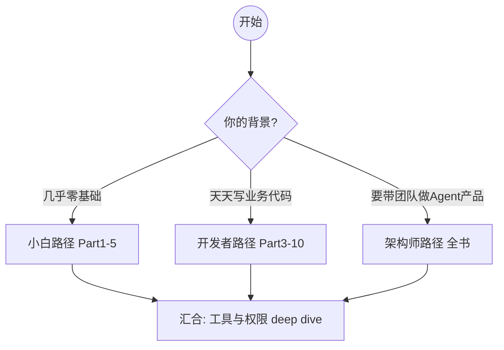
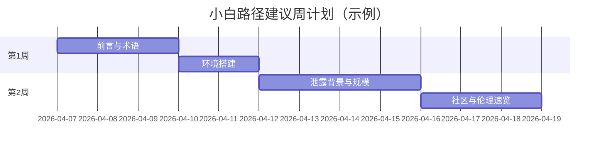
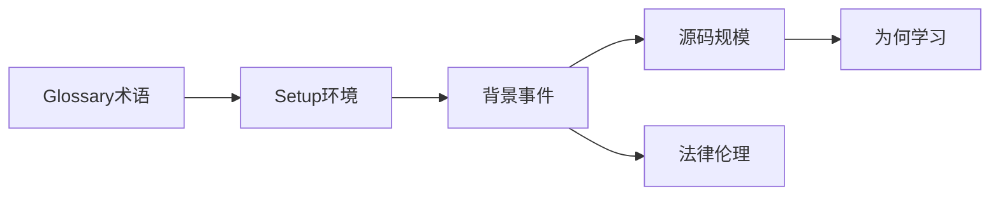
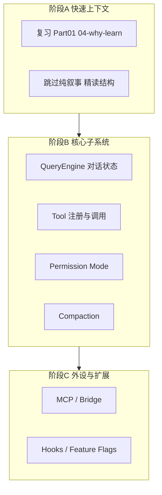
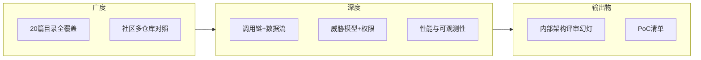
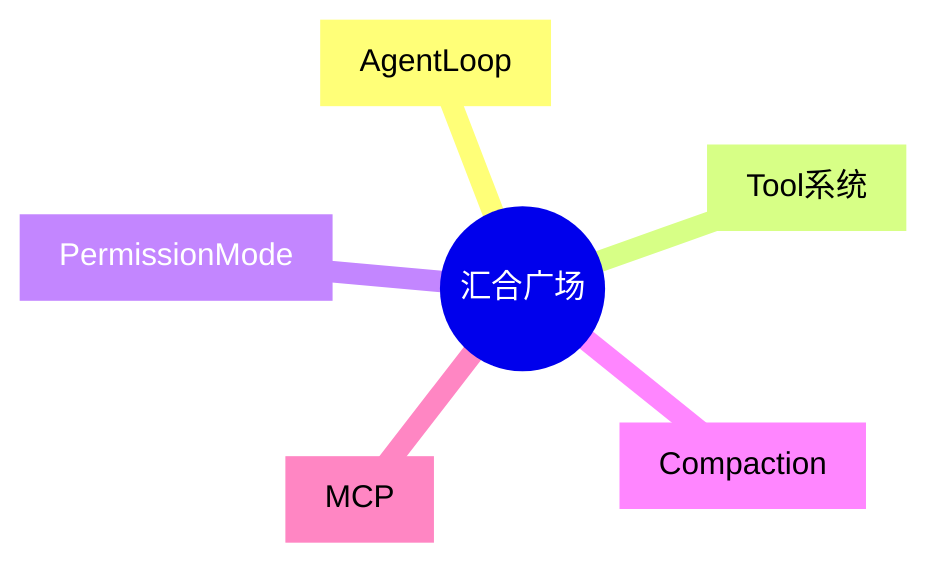

# 学习路线图：三条路径，同一种好奇心

> **本节学习目标**
>
> - 在 **小白路径、开发者路径、架构师路径** 之间做出选择，并了解各自投入时间。
> - 能用 Mermaid 图向他人解释三条路径的分叉与汇合点。
> - 把「篇次」与「周计划」对应起来，避免在 51 万行代码前迷失。

---

## 为什么需要路线图？

想象你要逛一座 **51 万间房** 的博物馆：如果没有地图，你会在第一个展厅就累趴下。本书把内容拆成 **20 个 Part**（见 [`index.md`](./index.md)），再用三条 **学习路径** 告诉你：若只有周末、若每晚一小时、若想一口气吃透架构，分别该怎么走。



---

## 时间估算的说明

下表中的 **「预计学习时间」** 指：以中文阅读 + 偶尔本地打开文件 + 手绘/复现 Mermaid 为准，**不包括** 你从零重写一个 Claude Code 的时间。

| 路径 | 覆盖篇次 | 预计总时长（宽松） | 预计总时长（紧凑） |
|------|----------|--------------------|--------------------|
| 小白路径 | Part 01～05（侧重 01 与 02） | **约 18～28 小时** | **约 10～14 小时** |
| 开发者路径 | Part 03～10 | **约 35～50 小时** | **约 22～30 小时** |
| 架构师路径 | Part 01～20 全书 | **约 80～120 小时** | **约 50～70 小时** |

**生活类比**：小白路径像「学会看地铁图并坐通三条线」；开发者路径像「考下驾照并开城市快速路」；架构师路径像「读完整个城市的交通规划白皮书」。

---

## 路径一：小白路径（建议 Part 01～05）

**适合**：第一次听说 Source Map、npm 包体积、Agent Loop；希望先建立信心再碰大仓库。



### 小白路径章节清单

| 顺序 | 文件 / 篇 | 你要搞定什么 |
|------|-----------|--------------|
| 1 | `part00-preface/index.md` | 知道全书结构与 V2 特色 |
| 2 | `glossary.md` | 先扫一遍，不必背，留个印象 |
| 3 | `setup.md` | 本机能 `git clone`、能打开 `.ts` |
| 4 | `part01-background/index.md` | 理解事件时间线与 Source Map 角色 |
| 5 | `part01-background/02-source-overview.md` | 记住「1903 文件 / 512K 行」量级 |
| 6 | `part01-background/03-community.md` | 知道社区如何「拼图」 |
| 7 | `part01-background/04-why-learn.md` | 建立「AI 之外 90%」的心智 |
| 8 | `part01-background/05-legal-ethics.md` | 建立合法合规阅读习惯 |
| 9 | （后续 Part 02～05） | 入口、`main`、Query、Loop 初识 |

### 小白路径 Mermaid：知识依赖



**里程碑**：能向朋友用 **3 分钟** 讲清楚「cli.js.map 是什么」「为什么这不算传统意义上的黑客入侵」。

---

## 路径二：开发者路径（建议 Part 03～10）

**适合**：熟悉 TypeScript / Node，想快速定位「工具怎么注册」「权限怎么拦」「上下文怎么压」。



### 开发者路径周节奏（示例）

| 周次 | 主题 | 建议产出 |
|------|------|----------|
| 1 | Part 01 速览 + 本地仓库跑通 | 一份你自己的「目录导览笔记」 |
| 2 | 入口与配置链路 | 手绘启动序列图 |
| 3 | Agent Loop + Tool | 表格列出 10 个你最关心的工具名 |
| 4 | 权限 + Compaction | 写一页「如果我来设计 2.0」草案 |
| 5 | MCP + Hooks | 给团队内部分享 20 分钟 |

**关键源码阅读提示（示意）**：在超大文件中，优先搜索 `class`、`export async function`、以及 `registerTool` 一类语义锚点——像在海里找浮标。

```typescript
// 开发者路径常用「阅读锚点」伪代码
interface ToolRegistry {
  register(def: ToolDefinition): void;
  dispatch(name: string, input: unknown): Promise<unknown>;
}
```

---

## 路径三：架构师路径（全书 Part 01～20）

**适合**：要做内部 Agent 平台、关心审计与多租户、需要对比业界方案。



### 架构师路径时间拆分（参考）

| 模块 | 内容块 | 建议学时 |
|------|--------|----------|
| 基础 | Part 00～01 | 8～12 h |
| 核心链路 | Part 02～05 | 15～22 h |
| 工具与安全 | Part 06～09 | 18～25 h |
| 扩展与编排 | Part 10～15 | 20～30 h |
| 性能与对比 | Part 16～20 | 15～22 h |

**生活类比**：架构师路径不是「旅游」，而是「带着测量仪做城市体检」——你会反复问：边界在哪？失效模式是什么？谁能绕过？

---

## 三条路径的汇合点

无论你从哪条路上来，最终都会在以下概念上 **汇合**（后续篇目会展开）：

| 汇合概念 | 一句话 |
|----------|--------|
| Agent Loop | 计划、行动、观察、再计划的循环 |
| Tool | 模型以外的「手脚」 |
| Permission Mode | 哪些手脚要先敲门 |
| Compaction | 记忆太长时的裁剪与摘要 |
| MCP | 标准化的外接能力协议 |



---

## 自测：你该选哪条路？

| 问题 | 更偏「是」则倾向 |
|------|------------------|
| 我看到 `tsconfig.json` 会心慌 | **小白路径** |
| 我能独立写一个 Express 中间件 | **开发者路径** |
| 我要写 ADR 和安全评审 | **架构师路径** |
| 我只想周末翻翻 | 小白路径 + **只读 Part 01** |
| 我要给团队定规范 | 架构师路径 + **强制读完法律伦理篇** |

---

## 与本书其他文档的衔接

- 术语迷路 → [`glossary.md`](./glossary.md)  
- 机器没配好 → [`setup.md`](./setup.md)  
- 全书导览 → [`index.md`](./index.md)  

---

## 附录：每日 45 分钟模板（可复制）

| 分钟 | 动作 |
|------|------|
| 0～5 | 复习昨天的一张 Mermaid 图 |
| 5～25 | 读一节正文 + 对照术语表 |
| 25～40 | 本地打开 1～2 个相关 `.ts` 文件 |
| 40～45 | 用三句话写「今天我搞懂了…」 |

坚持四周，小白路径的核心篇就能扎实走完第一轮。下一程，我们在 [`glossary.md`](./glossary.md) 里把名词换成你能使唤的「口令」。
