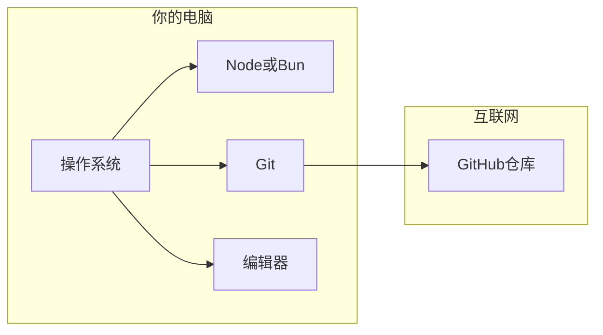
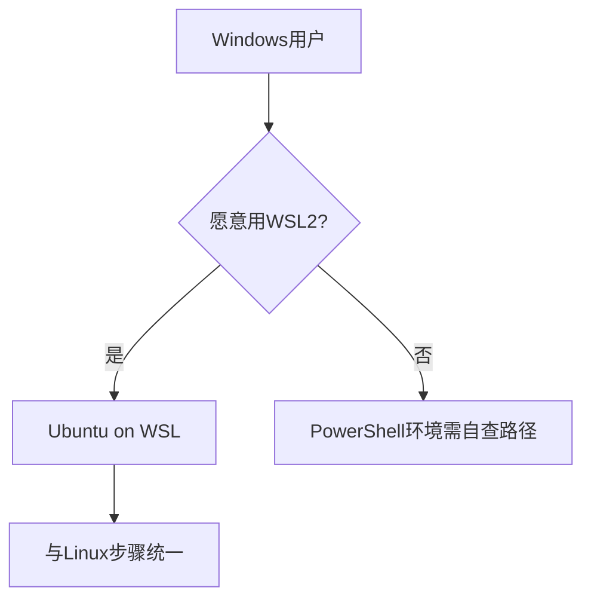
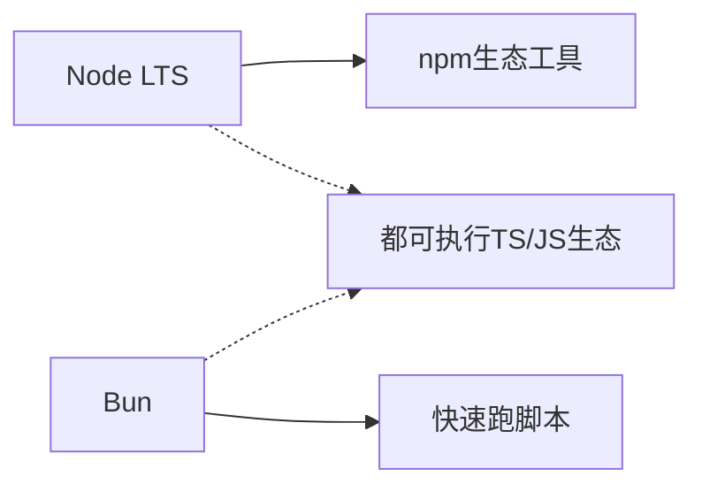
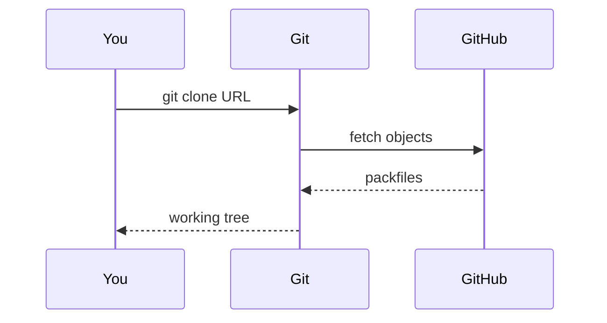
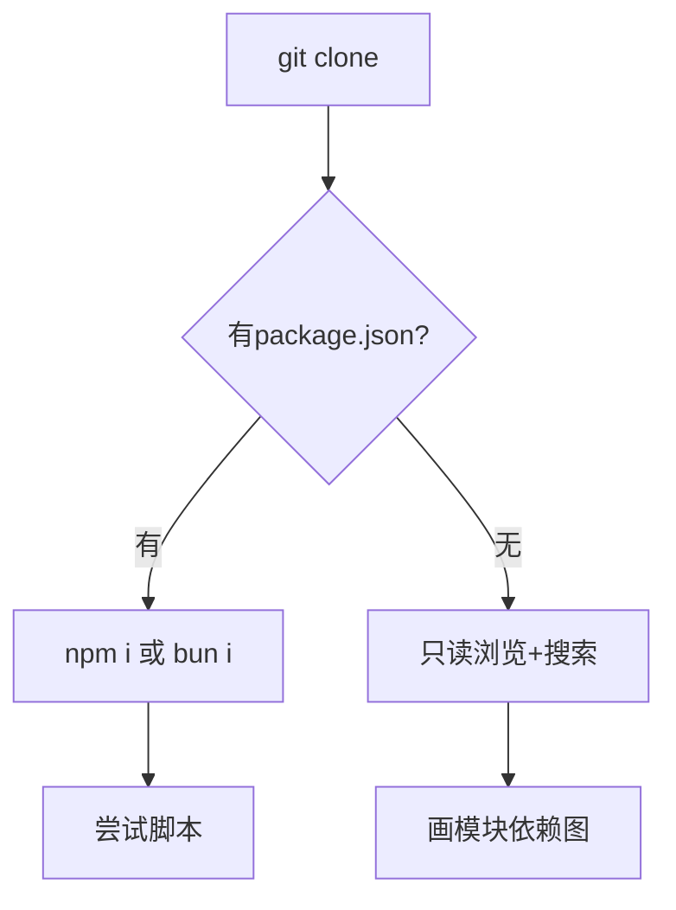
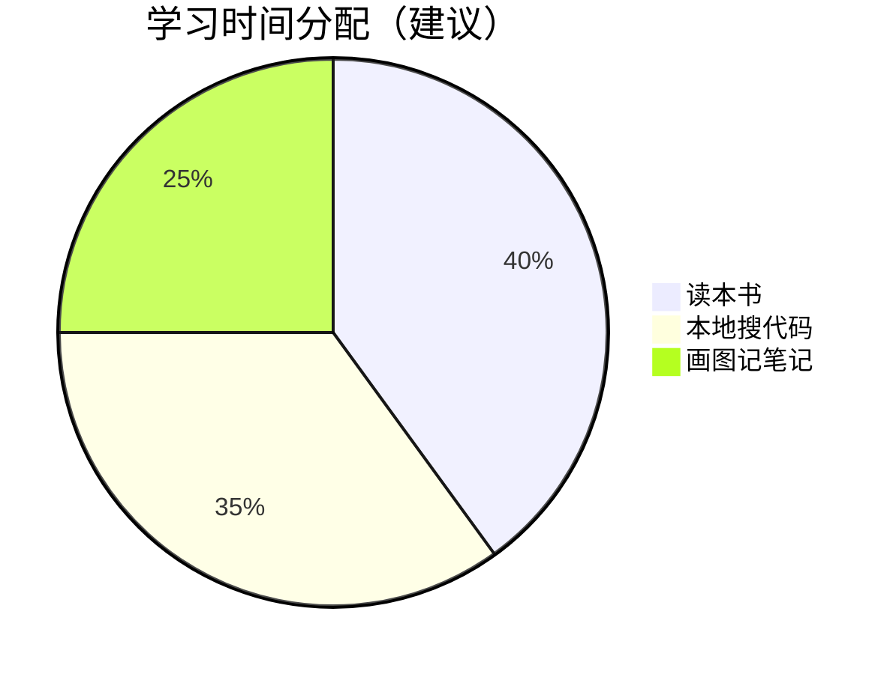
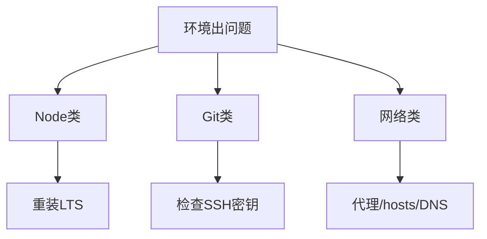

# 环境搭建：工欲善其事，必先利其器

> **本节学习目标**
>
> - 在 macOS / Linux / Windows（WSL2 推荐）上完成 **Node.js、Bun（可选）、Git** 的安装与版本自检。
> - 能使用 **HTTPS 或 SSH** 克隆社区重建仓库，并理解为何可能没有完整 `package.json`。
> - 配置 **VS Code / Cursor** 等编辑器，获得 TypeScript 跳转、搜索、大纲视图的良好体验。

---

## 总览：你的「考古工作台」长什么样？



**生活类比**：读 51 万行源码像 **考古发掘**——Node/Bun 是铲子，Git 是记录坑位的笔记本，编辑器是放大镜和标签盒。

---

## 1. 操作系统建议

| 系统 | 建议 | 原因 |
|------|------|------|
| **macOS** | 直接跟本书步骤 | 与多数开发者文档一致 |
| **Linux** | 任选主流发行版 | 路径与权限更透明 |
| **Windows** | **优先 WSL2（Ubuntu）** | 避免路径大小写、脚本换行、符号链接坑 |



---

## 2. 安装 Node.js（推荐 LTS）

### 2.1 为什么需要 Node？

即使 Claude Code 的某些脚本用 Bun 构建，**社区重建仓库** 往往仍依赖 Node 生态工具（`npm`、`npx`、语言服务）。把 Node 装好，等于备好「通用螺丝刀」。

### 2.2 安装方式对比

| 方式 | 优点 | 缺点 |
|------|------|------|
| **官网安装包** | 最简单 | 多版本切换不便 |
| **nvm / fnm** | 多版本共存 | 多一步学习成本 |
| **包管理器**（brew 等） | 与系统集成 | 版本可能滞后 |

### 2.3 自检命令

在终端执行：

```bash
node -v
npm -v
```

**期望**：`node` 为 **当前 LTS 主版本线**（例如 v22.x 或官方当时推荐的 LTS，以 nodejs.org 为准）；`npm` 能正常输出版本号。

### 2.4 常见故障

| 现象 | 可能原因 | 处理方向 |
|------|----------|----------|
| `command not found: node` | 未安装或未加入 PATH | 重装或检查 shell 配置 |
| 权限错误 | 全局目录不可写 | 用 nvm/fnm 或修复目录权限 |
| 公司代理 | 证书拦截 | 配置 `npm config set proxy` 或信任证书 |

---

## 3. 安装 Bun（可选但推荐）

### 3.1 Bun 与本次泄露新闻的关系

公开讨论中提到：**Bun 默认行为可能生成 Source Map**，若发布流程未剔除，容易导致 `.map` 进入 npm tarball。学习 Bun 有助于你理解 **构建链默认值 = 安全与合规的盲区**。

### 3.2 安装

官方一键脚本会随时间更新，请以 [https://bun.sh](https://bun.sh) 为准。装好后自检：

```bash
bun -v
```

### 3.3 Node vs Bun：并存策略



**生活类比**：Node 像 **国标电源**；Bun 像 **快充头**——很多设备两个都能充，但别混用不认识的线。

---

## 4. 安装 Git

### 4.1 为什么必须会 Git？

社区仓库频繁更新；你要 **diff、blame、checkout 到某提交** 对照本书例子。不会 Git，就像考古不用分层记录。

### 4.2 安装与配置

```bash
git --version
git config --global user.name "Your Name"
git config --global user.email "you@example.com"
```

### 4.3 SSH vs HTTPS

| 方式 | 适合 | 备注 |
|------|------|------|
| **HTTPS** | 新手最快 | 可能需要 token |
| **SSH** | 长期开发 | 需生成 `~/.ssh/id_ed25519` 并加到 GitHub |



---

## 5. 克隆「社区重建」源码的方法

### 5.1 仓库示例（教学引用）

本书背景中常提及：

- `leaked-claude-code`（体量与 star 数会变化）  
- `sanbuphy` 等分析向仓库（ star 较高，偏结构化导读）  

**重要**：本书 **不提供** 具体侵权或未授权完整分发物的链接；请你只克隆 **你确认合法** 的公开仓库，并遵守其许可证与 GitHub 政策。

### 5.2 克隆命令模板

```bash
mkdir -p ~/src && cd ~/src
git clone https://github.com/OWNER/REPO.git claude-code-study
cd claude-code-study
git log -1 --oneline
```

### 5.3 你可能遇到的「不完整仓库」

| 情况 | 说明 | 应对 |
|------|------|------|
| 缺 `package.json` | 重建者只提供源码树 | 用编辑器只读浏览，不强求 `npm i` |
| 大量 **stub** | 为通过类型检查占位 | 阅读接口签名，理解意图 |
| 依赖需逆向 | 私有包名未公开 | 把 import 当「购物清单」，逐项查公开替代品 |



---

## 6. 推荐编辑器配置（VS Code / Cursor）

### 6.1 必装扩展（建议）

| 扩展 | 作用 |
|------|------|
| **TypeScript / JavaScript**（内置） | 类型提示与跳转 |
| **ESLint**（如项目有配置） | 风格与常见错误 |
| **Markdown All in One** | 读本书配套笔记 |
| **Mermaid** 预览类扩展 | 预览本文图表 |

### 6.2 `settings.json` 片段（可选）

下列设置提升大仓库体验（路径与键名以编辑器版本为准）：

```json
{
  "editor.tabSize": 2,
  "editor.wordWrap": "on",
  "typescript.tsserver.maxTsServerMemory": 8192,
  "search.exclude": {
    "**/node_modules": true,
    "**/dist": true
  }
}
```

### 6.3 大文件阅读技巧

| 技巧 | 快捷键 / 操作（常见绑定） |
|------|---------------------------|
| 按符号跳转 | Command Palette → Go to Symbol |
| 全局搜索 | `rg` 或编辑器搜索（尊重 `.gitignore`） |
| 折叠无关区域 | Fold All / 手动折叠 |
| 书签 | 扩展或 TODO 注释 |


**生活类比**：读 4000 行文件像读 **字典**：没人从第一页背到最后一页，都是先查索引。

---

## 7. 可选：终端增强

| 工具 | 用途 |
|------|------|
| **tmux** | 分屏：一边 `git`，一边 `rg` |
| **fd / ripgrep** | 比默认搜索更快（可选） |

示例 ripgrep：

```bash
rg "class QueryEngine" -n .
```

---

## 8. 网络与磁盘

| 资源 | 粗估 | 建议 |
|------|------|------|
| 磁盘 | 视仓库大小，**数 GB 级** 不罕见 | 预留空间给 `.git` |
| 网络 | clone 可能较慢 | 镜像或浅克隆 `git clone --depth 1` |



---

## 9. 验证清单（打勾即用）

| 检查项 | 命令 / 结果 |
|--------|-------------|
| Node 可用 | `node -v` |
| Git 可用 | `git --version` |
| 能克隆公开仓库 | `git clone ...` 成功 |
| 编辑器能打开 `.ts` | 有语法高亮 |
| 能全局搜索字符串 | `rg` 或 IDE 搜索成功 |

---

## 10. 下一步

环境就绪后，请回到 **Part 01**：

- [`../part01-background/index.md`](../part01-background/index.md) 了解事件时间线  
- [`glossary.md`](./glossary.md) 随时查词  

---

## 附录 A：WSL2 快速备忘（Windows）

1. 启用 WSL2 与虚拟机平台（微软文档为准）。  
2. 安装 Ubuntu。  
3. 在 Ubuntu 内安装 Node、Git。  
4. **项目文件放在 Linux 文件系统**（`/home/...`），不要放在 `/mnt/c/...` 以避免 I/O 与权限问题。

---

## 附录 B：公司电脑合规提示

若你在企业设备上操作：

- 先问清 **是否允许** 克隆第三方重建仓库。  
- 勿将 **内部代码** 与外部仓库混在同一工作区。  
- 遥测、上传、云同步策略以公司安全规范为准。

---

## 附录 C：故障树（简版）



当你的编辑器第一次成功跳转到某个 `export function` 的定义时，你会感到：51 万行不再是洪水，而是一条 **可以溯流而上** 的河。装备齐了吗？我们进背景篇。
