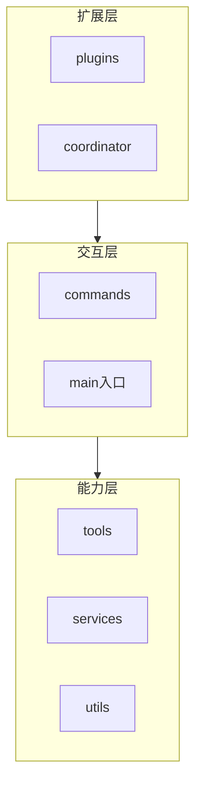
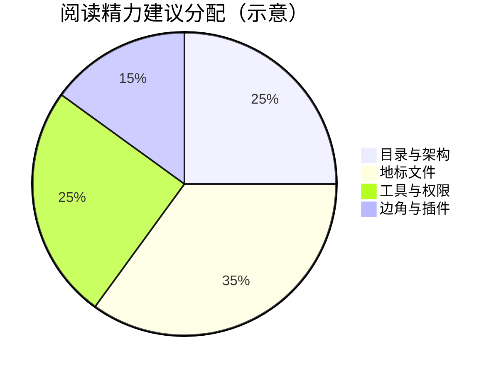
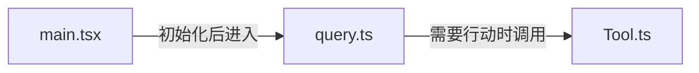
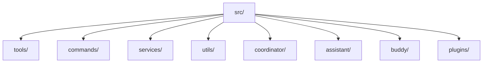
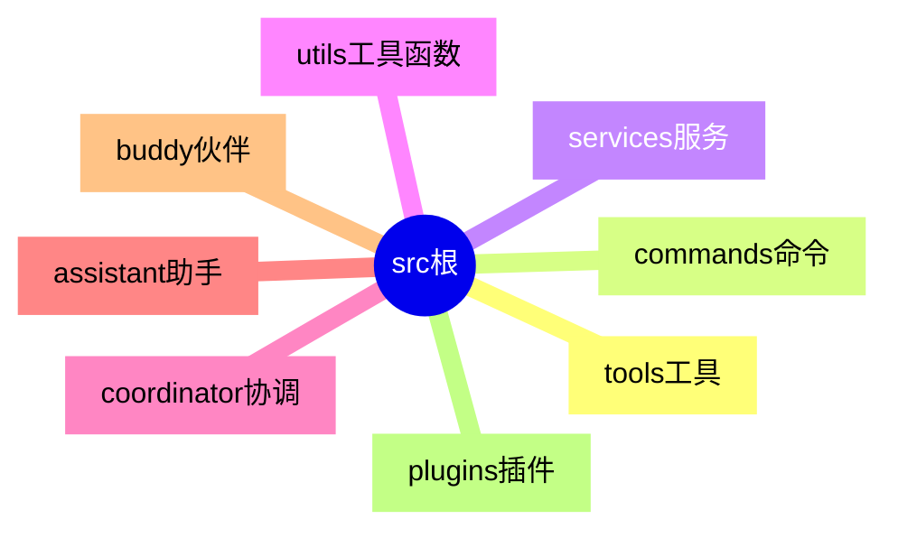
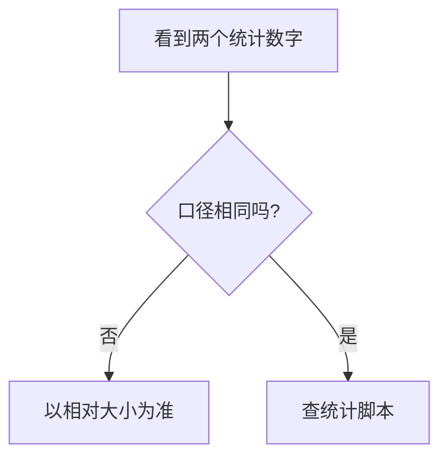
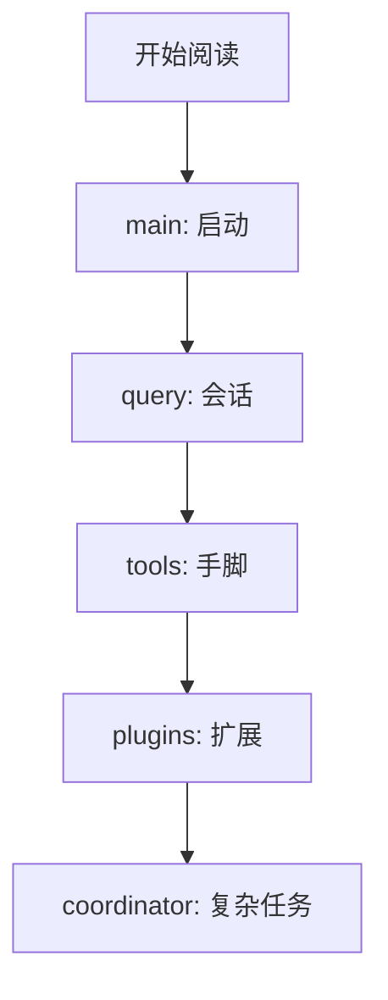
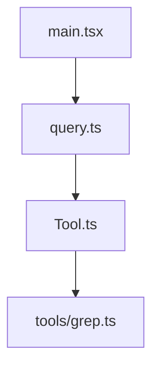
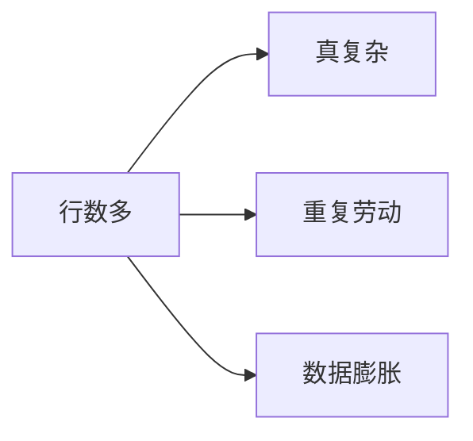

# 1.2 源码规模全貌：五十一万行不是「一个文件」，而是一座城

> **本节学习目标**
>
> - 用 **表格 + 图** 建立对 **1903 文件 / 约 51.2 万行** 的数量级直觉。
> - 认识主要目录分工：`tools`、`commands`、`services`、`utils`、`coordinator`、`assistant`、`buddy`、`plugins` 等。
> - 知道 **`main.tsx`（约 4684 行）**、**`query.ts`（约 1730 行）**、**`Tool.ts`（约 793 行）** 这类「地标文件」在阅读策略中的意义。

---

## 开场：别被数字吓到

**51.2 万行** 听起来像一辈子读不完。但城市也有上千万人口——你不需要认识每一个人，只需要 **地铁图、行政区、几个地标广场**。

本书把 Claude Code 客户端编排层想象成一座 **垂直城市**：

- **地下**：工具与系统调用（`tools`、部分 `services`）  
- **地面**：命令行入口与用户交互（`commands`、`main`）  
- **空中**：协调、插件、扩展（`coordinator`、`plugins`）  
- **市政厅**：配置、会话、核心查询管线（`query`、`services`）



---

## 规模总表（教学用锚点数字）

下列数字来自本书背景材料；你本地 checkout 可能因重建版本不同而略有偏差。

| 指标 | 数量级 | 备注 |
|------|--------|------|
| 文件数 | **1903** | 含 TS/TSX 等（以社区统计口径为准） |
| 代码行数 | **约 512,000** | TypeScript 为主 |
| 超大单文件 | 多个 **1000+ 行** | 阅读时宜「符号跳转」而非线性刷 |



**生活类比**：1903 个文件像 **1903 个街区门牌**；你不会挨家敲门，你会查 **邮编分区**。

---

## 地标文件：三个「城市广场」

| 文件（示例路径以重建仓库为准） | 约行数 | 角色比喻 | 阅读建议 |
|--------------------------------|--------|----------|----------|
| `main.tsx` | **4684** | **机场航站楼**：人流进出、指示牌最多 | 先画「启动→子命令→主循环」 |
| `query.ts` | **1730** | **市政调度中心**：一次 query 如何被处理 | 对照 Agent Loop 术语表 |
| `Tool.ts` | **793** | **工具博物馆导览册**：抽象层级高 | 先读接口再读实现 |



**类比**：

- `main` 像 **酒店前台**：你一进大堂就被分流。  
- `query` 像 **客服工单系统**：问题编号、转接、回访。  
- `Tool` 像 **外包服务商名录**：每项服务有合同模板（schema）。

---

## 目录结构鸟瞰（概念图）

> 下列目录名为 **典型** 命名；请以你本地树为准。



### 表格：目录 → 职责（教学版）

| 目录 | 一句话职责 | 生活类比 |
|------|--------------|----------|
| **tools** | 对外能力的具体实现与注册 | 工具房里的电钻、扳手 |
| **commands** | CLI 子命令、用户显式操作入口 | 遥控器上的按钮 |
| **services** | 长生命周期能力：配置、会话、集成 | 物业中心：水电抄表 |
| **utils** | 共享小函数，避免复制粘贴 | 公用螺丝刀抽屉 |
| **coordinator** | 多步骤任务协调、状态推进 | 婚礼司仪的流程卡 |
| **assistant** | 与助手体验相关的模块集合 | 导游小旗与讲解词 |
| **buddy** | 辅助/伙伴式交互或实验功能（以源码为准） | 旅伴 App：提醒喝水 |
| **plugins** | 插件加载与扩展边界 | App Store 里的第三方模块 |



---

## 模块数量叙事：4756 与「文件」的差异

背景材料中有时出现 **「4756 个模块文件」** 一类统计，与 **1903 文件** 似乎不一致。常见原因包括：

| 口径 | 可能含义 |
|------|----------|
| **物理文件数** | 磁盘上的 `.ts` 数量 |
| **模块单元数** | 含 barrel 导出、子路径、生成文件等统计 |
| **工具链统计** | bundler 图节点数 |

**建议**：把数字当作 **量级灯塔**，不要在本书学习阶段纠结个位数差异。



---

## 依赖与构建：为什么「clone 了也跑不起来」？

社区重建版常见痛点：

| 痛点 | 解释 |
|------|------|
| 缺 `package.json` | 无法一键安装依赖 |
| **60+ npm 依赖** 需逆向 | 私有 scope 或内部包名占位 |
| **90+ stub** | 只为类型检查存在的空壳 |


**类比**：你拿到的是 **建筑剖面图** 而不是 **精装房**——能学结构，别强求当晚入住。

---

## 关键源码片段（示意）：Tool 抽象

下面是一段 **教学伪代码**，展示阅读 `Tool.ts` 一带时你会寻找的结构：

```typescript
// 示意：真实源码更复杂
export interface ToolContext {
  cwd: string;
  signal: AbortSignal;
}

export abstract class Tool {
  abstract readonly name: string;
  abstract run(input: unknown, ctx: ToolContext): Promise<unknown>;
}
```

读到这里你可以自问：

1. **权限**在哪里介入？（前后是否有 `PermissionMode`）  
2. **遥测**是否包裹 `run`？  
3. **错误**如何回到 `QueryEngine`？

---

## 关键源码片段（示意）：Query 管线

```typescript
// 示意：query 文件常包含「状态机」味道
type QueryPhase = "collect" | "plan" | "act" | "summarize";

async function advanceQuery(state: QueryState): Promise<QueryState> {
  switch (state.phase) {
    case "collect":
      return { ...state, phase: "plan" };
    case "plan":
      return { ...state, phase: "act" };
    default:
      return state;
  }
}
```

**类比**：Query 像 **快递路由扫描**——包裹每到一个分拣中心就换状态。

---

## 阅读策略对比表

| 策略 | 适合 | 风险 |
|------|------|------|
| 从 `main` 顺序往下滚 | 想有「电影感」 | 极易在 4000 行迷路 |
| 从 `Tool` 抽象倒推 | 想搞清能力边界 | 可能缺上下文 |
| 从 `commands` 用户路径切入 | 有 CLI 使用经验 | 可能漏后台服务 |
| **折中（推荐）** | `main` 找启动 → `query` 找状态 → `tools` 找实现 | 需自己做笔记 |



---

## 体量对比：和常见开源项目比一比

| 项目类型 | 粗略体量感 | 说明 |
|----------|------------|------|
| 小型 CLI 工具 | 数千～一万行 | 单仓库可读性强 |
| 中型应用 | 数万～十万行 | 需要模块化纪律 |
| **本客户端编排层** | **五十万行级** | 接近「语言服务」或大型 IDE 插件体量 |
| 浏览器内核 | 千万行以上 | 不在同一比较平面 |

**结论**：这是 **严肃工业软件**，不是课后习题。

---

## Mermaid：文件依赖的「虚构示例」

真实依赖需用工具生成；下图仅帮助建立直觉：



---

## 与 Part 00 术语的挂钩

| 术语 | 在目录中的「家」 |
|------|------------------|
| Tool | `tools/` + `Tool.ts` 一带 |
| QueryEngine | `query.ts` 及关联 services |
| MCP / Bridge | 常在 `services` 或集成子目录 |
| Hooks | 可能在 core 生命周期附近 |
| Feature Flags | `utils` 或 `services` 配置层 |

---

## 实战小练习

1. 本地运行 `find . -name '*.ts' | wc -l` 与仓库说明对比。  
2. 列出体积最大的 10 个文件：`find . -name '*.ts' -print0 | xargs -0 wc -l | sort -n | tail`。  
3. 为 `coordinator` 画一张 **仅含公开导出符号** 的草图。

---

## 下一节导航

- **1.3 社区反应**：[`03-community.md`](./03-community.md)  
- **路线图**：[`../part00-preface/roadmap.md`](../part00-preface/roadmap.md)  

---

## 附录：「行数」如何误导人？

| 陷阱 | 说明 |
|------|------|
| 生成代码 | 可能膨胀行数但不代表人工复杂度 |
| 长模板字符串 | UI 或提示词占行 |
| 重复模式 | 多个类似 command 文件 |



---

## 附录：笔记本模板

**今日地标文件**：________________  
**三个最有趣符号名**：________________  
**一句类比**：________________  

---

当你能在白板上画出 `main → query → tool` 的箭头，你已经拥有这座城的 **旅游巴士路线**。下一站：社区如何在废墟旁搭起帐篷、架起望远镜——[`03-community.md`](./03-community.md)。
