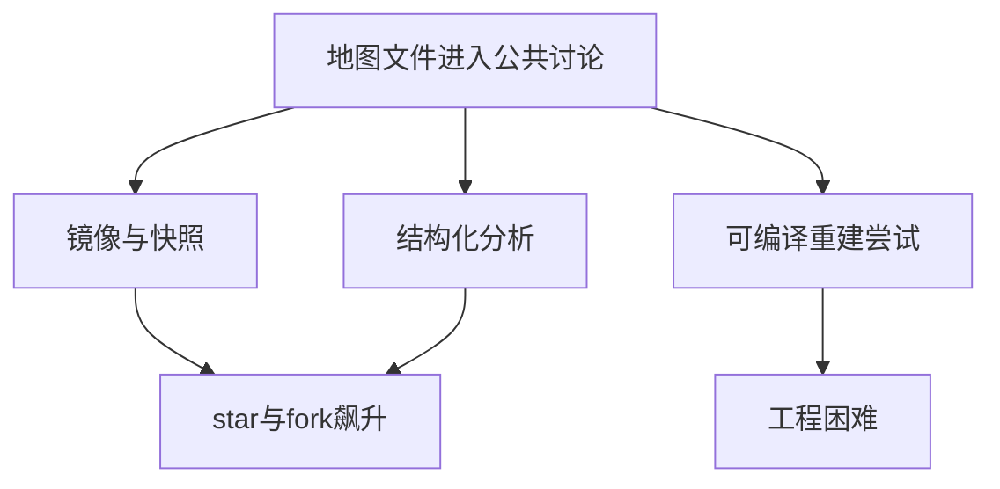
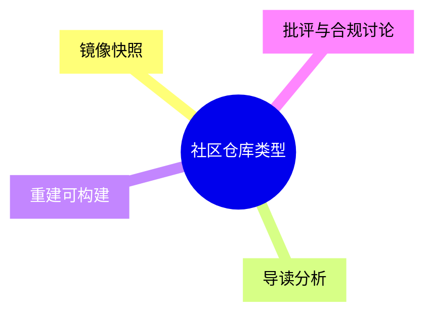
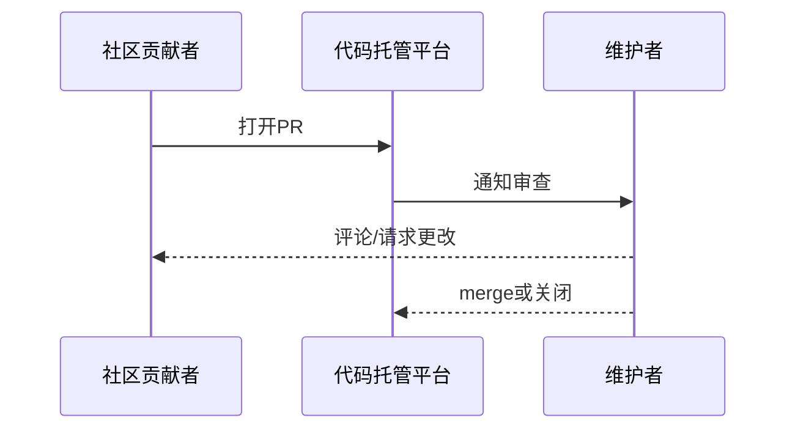
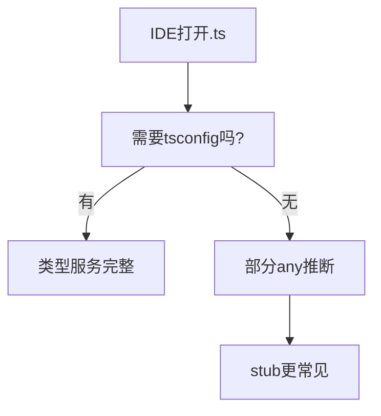
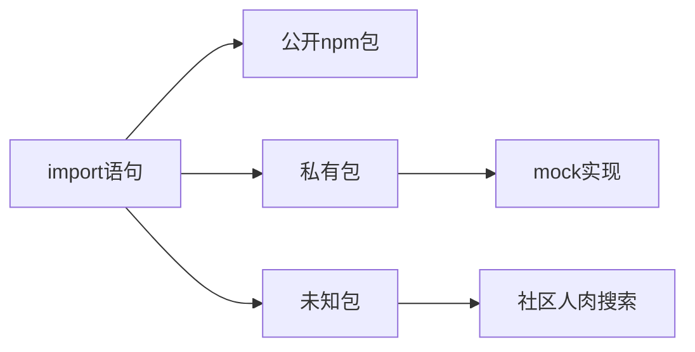
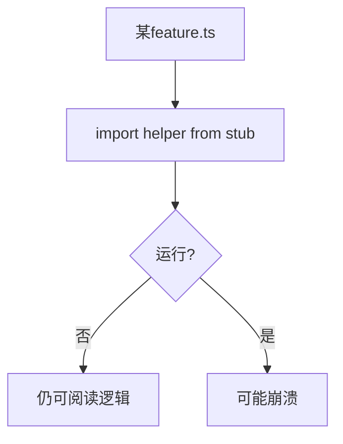
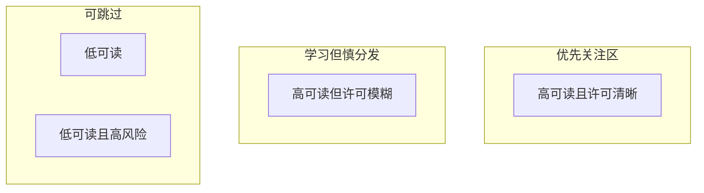
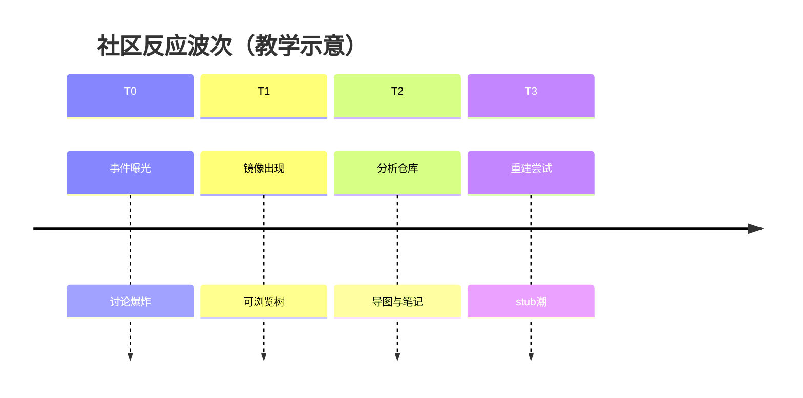

# 1.3 社区反应与重建：当一千双手伸向同一张地图

> **本节学习目标**
>
> - 了解 **GitHub** 上出现的代表性仓库类型：**镜像/重建**（如 leaked-claude-code）、**分析导读**（如 sanbuphy）、以及其他二次整理（如 xorespesp 等命名在传播中的出现）。
> - 理解 **PR #41391**、**#41518** 一类数字在社区叙事中的含义（常以「向官方或相关仓库提议修复/讨论」的形式出现——具体以链接与描述为准）。
> - 掌握社区重建的三类硬骨头：**缺 package.json/tsconfig/build**、**60+ 依赖逆向**、**90+ stub 模块**。

---

## 故事开头：图书馆闭馆了，但目录卡飞出来了

如果把官方闭源产品比作 **闭馆图书馆**，Source Map 事件就像 **目录卡被风吹到广场上**。于是：

- 有人 **把卡片一张张捡起装订**（镜像仓库）；  
- 有人 **写导读书**告诉你哪张卡片对应哪个书架（分析仓库）；  
- 有人 **尝试复原借书系统**（补 `package.json`、补脚本）。

这不是浪漫化——这是在描述 **信息一旦公开扩散后的典型生态反应**。



---

## 仓库光谱：不是只有一种「社区版」

### 1. leaked-claude-code 一类：镜像/聚合

传播中常提到 **leaked-claude-code** 仓库获得 **数百 star** 量级（具体数字随时间变化）。这类仓库往往：

- 提供 **可浏览** 的目录树；  
- 可能附带 **说明** 与 **对比**；  
- **许可证与合规状态各异**，读者必须自行判断。

**类比**：像 **复印店装订册**——方便传阅，但不等于出版社正式出版物。

### 2. sanbuphy 分析向仓库：导读与地图

背景信息称 **sanbuphy** 相关仓库可达 **万级 star**（以 GitHub 实时为准）。此类工作价值常在：

- **模块说明**、**调用关系图**、**阅读顺序建议**；  
- 降低 **零基础** 读者的入门成本。

**类比**：像 **故宫导览小程序**——你不一定懂建筑学，但能知道「先中轴线再东西六宫」。

### 3. xorespesp 等名称

不同帖子会点名不同仓库；本书不绑定单一链接。建议你以 **「高星 + 最近更新 + 明确许可证」** 三要素筛选。



---

## Star 数说明：热度 ≠ 正确性

| 信号 | 能说明什么 | 不能说明什么 |
|------|------------|--------------|
| **高 star** | 话题性强、传播广 | 法律上「可自由使用」 |
| **低 star** | 可能更细分或较新 | 技术差 |
| **fork 多** | 二次实验活跃 | 上游维护稳定 |

**生活类比**：网红餐厅排队长，不代表 **食品安全评级** 最高。

---

## Pull Request 叙事：#41391 与 #41518

社区讨论里常出现 **PR 编号**，用来指代：

- 对 **相关开源周边** 的修复建议；  
- 对 **示例项目** 的文档修订；  
- 或对 **误发布链路** 的 **工具链改进提案**。

本书 **无法在不引用实时链接的情况下** 保证每个编号对应的标题永久准确。请你在阅读时：

1. 打开 PR 链接看 **标题与描述**；  
2. 分辨它是 **官方仓库** 还是 **社区 fork**；  
3. 看 **合并状态** 与 **讨论焦点**。



### 教学用对照表（占位符式）

| PR 编号（示例） | 可能主题方向（需自行点开核对） |
|-----------------|--------------------------------|
| **#41391** | 与发布物、忽略规则、或文档相关的修补讨论 |
| **#41518** | 与工具链、map 处理、或工作流相关的跟进 |

> **注意**：上表为 **叙事脚手架**；写论文或新闻报道时请替换为 **可核验引用**。

---

## 重建挑战一：没有「户口本」的源码树

### 缺 `package.json`

| 后果 | 体验 |
|------|------|
| 无依赖声明 | `npm install` 无从下手 |
| 无 scripts | 无法 `npm run build` |
| 无入口字段 | 难对齐「谁最先执行」 |

**类比**：你捡到一整车 **乐高散件**，但没有盒子封面图。

### 缺 `tsconfig.json` / 构建脚本

| 后果 | 体验 |
|------|------|
| 编辑器推断弱 | 跳转与类型提示打折 |
| 无法整体 `tsc` | 只能「单片阅读」 |



---

## 重建挑战二：60+ npm 依赖逆向

### 这意味着什么？

即使 `.ts` 文件齐了，`import` 语句仍可能指向：

- 公开包；  
- **作用域私有包**（`@internal/...` 一类示意）；  
- **已改名或已废弃** 包。

### 社区策略

| 策略 | 优点 | 缺点 |
|------|------|------|
| **用公开替代品 stub** | 能编译 | 运行行为不同 |
| **最小实现 mock** | 可跑部分路径 | 工作量大 |
| **只读不做运行时** | 合规风险低 | 不能「一键启动」 |



**类比**：菜谱写「秘制酱料」，你得用 **近似调料** 复刻味道。

---

## 重建挑战三：90+ stub 模块

### stub 是什么？

**Stub** 是「仅占位」的模块：导出空对象、抛 `not implemented`、或返回默认值，让类型检查先过。

| stub 的善意 | stub 的恶意（对学习者） |
|--------------|-------------------------|
| 让 IDE 不红 | 误以为功能真存在 |
| 标注依赖边界 | 运行时才爆炸 |



**生活类比**：舞台剧 **B 角** 站台上撑场，观众以为戏完整，其实主角台词还没背。

---

## 社区协作模式：像开源，但不等于开源

| 维度 | 典型开源项目 | 社区重建树 |
|------|--------------|------------|
| 许可证 | 明确 | **可能混乱或缺失** |
| 上游 | 可提 PR | **不一定有官方回应渠道** |
| 目标 | 跑起来 | **读起来** 已是胜利 |

### 仓库价值象限（表格版）



| 象限 | 特征 | 建议 |
|------|------|------|
| 高可读 + 许可清晰 | 接近理想 | 优先 star 与跟进 |
| 高可读 + 许可模糊 | 常见 | **只学习不分发** |
| 低可读 | 价值有限 | 换分析向仓库 |
| 低可读 + 高风险 | 避免 | 不碰 |

---

## 与本书 V2 的衔接：我们如何使用社区材料？

1. **概念与目录** 以多源交叉为主。  
2. **代码片段** 标注为「示意」除非逐字来自你本地文件。  
3. **伦理与法律** 强制读 **1.5**。

---

## 关键源码片段（示意）：stub 长什么样？

```typescript
// stub/logger.ts（示意）
export const logger = {
  info: (..._args: unknown[]) => {},
  error: (..._args: unknown[]) => {},
};
```

看到这种文件，请在笔记本写：**「此处声音被关静音」**——读主流程时别指望日志帮你调试。

---

## 时间线：社区热度（示意）



---

## 对比表：你在社区能获得的三种「战利品」

| 战利品 | 你得到什么 | 你得不到什么 |
|--------|------------|--------------|
| **镜像树** | 文件文本 | 官方支持 |
| **分析文章** | 心智模型 | 100% 准确调用链 |
| **可跑 fork** | 部分演示 | 与商业版一致的行为 |

---

## 下一节导航

- **1.4 为什么值得学**：[`04-why-learn.md`](./04-why-learn.md)  
- **术语**：[`../part00-preface/glossary.md`](../part00-preface/glossary.md)  

---

## 附录：安全与研究伦理清单

| 问题 | 建议 |
|------|------|
| 我能转发 tarball 吗？ | 先看清版权与条款 |
| 我能用来训练模型吗？ | 另涉数据权利，不在本书范围 |
| 我能公开完整镜像吗？ | **高风险**，咨询法律顾问 |

---

## 附录：给教师的课堂讨论题

1. 「Star 数」是不是同行评审？  
2. stub 会不会让 **学生误以为系统已完成**？  
3. 如果把此案例写进 **软件工程课**，应放在哪一章（发布工程？安全？合规？）  

---

社区的力量在于 **快速把沉默的二进制变成可讨论文本**；社区的边界在于 **合法与尊重原作者劳动**。下一站，我们回答最朴素的问题：「学它到底图啥？」——[`04-why-learn.md`](./04-why-learn.md)。
