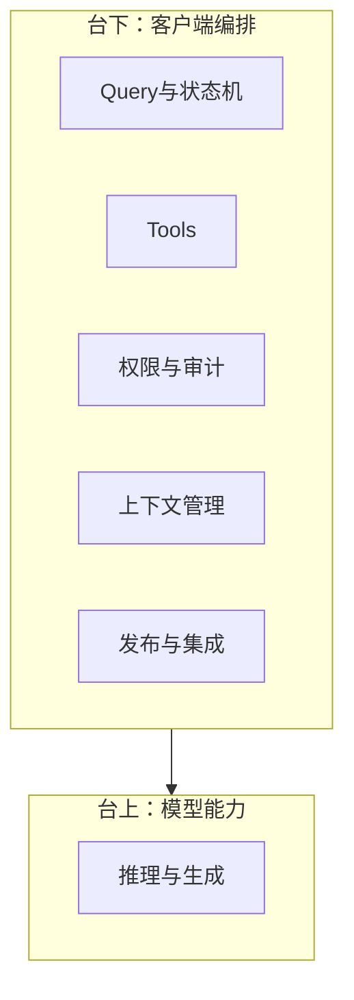
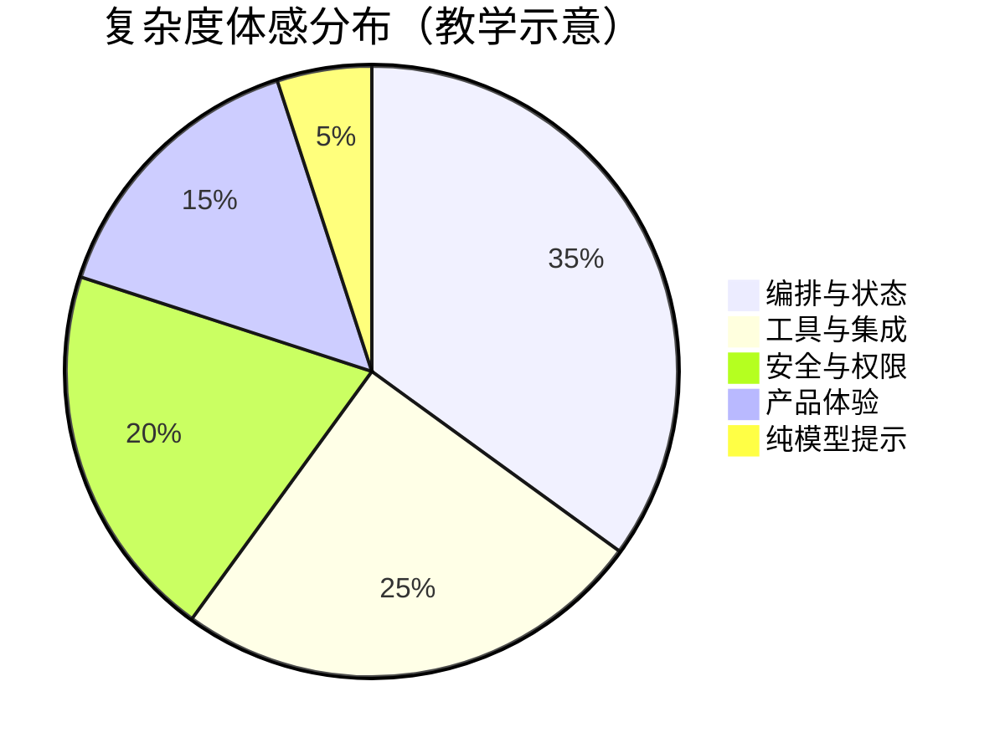
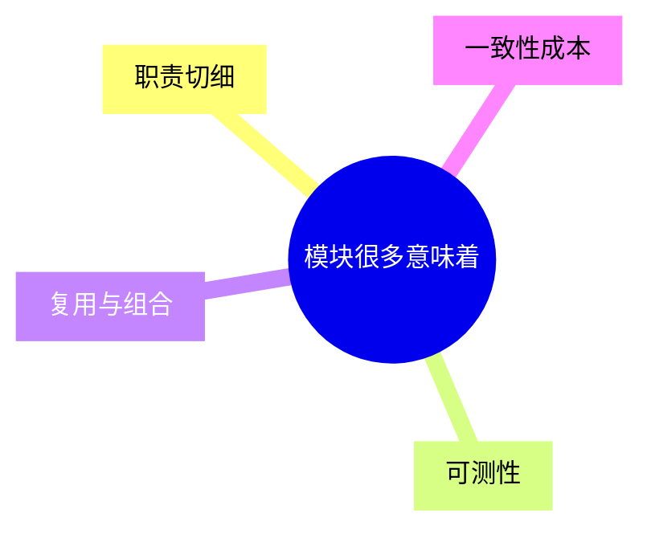
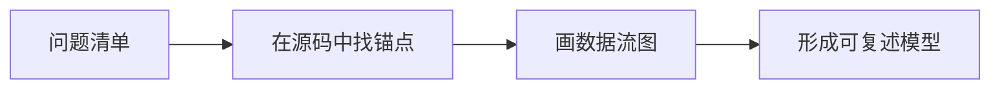
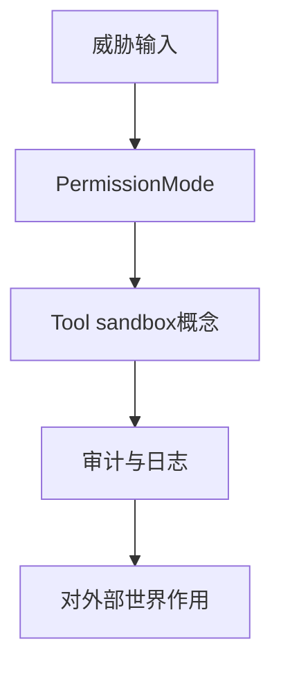
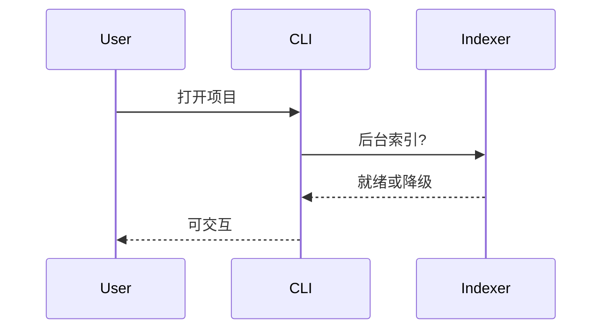
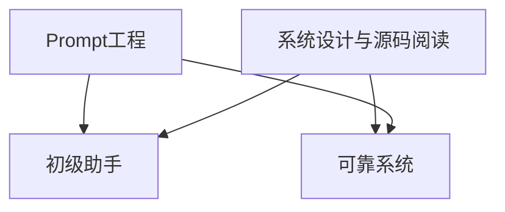

# 1.4 为什么值得学：AI Agent 的力气，多半花在「AI 之外」

> **本节学习目标**
>
> - 理解核心论点：**「AI Agent 90% 的工作量在 AI 之外」**——编排、工具、权限、上下文、产品化。
> - 把 **4756 个模块文件**（或等价统计口径）还原为 **可感知的工程现实**：不是炫技，是分工。
> - 建立四大学习价值框架：**架构**、**工程化**、**安全设计**、**性能优化**。

---

## 一个反直觉的真相：魔法在台上，戏班在台下

如果把 **大语言模型** 想象成 **台上一分钟的天才魔术师**，那么 Claude Code 这类产品就是 **整个马戏团**：

- 灯光音响（**终端 UI / 编辑器集成**）  
- 道具机关（**Tool 与 MCP**）  
- 保安与检票（**Permission Mode**）  
- 剧本与提词（**系统提示、CLAUDE.md、Compaction**）  
- 巡演后勤（**配置、遥测、发布**）

观众鼓掌给魔术师，但 **巡演能不能跑下来**，取决于台下这帮人。



**本节论点**：读这 **51 万行**，是在读 **马戏团运营手册**，不是在读「魔术揭秘」。

---

## 「90% 在 AI 之外」到底指什么？

### 拆解表

| 工作块 | 「在 AI 之外」的部分 | 生活类比 |
|--------|----------------------|----------|
| **输入** | 读取本地文件、git 状态、linter 输出 | 秘书先帮你整理桌面 |
| **行动** | 调 CLI、改文件、跑测试 | 手替你去拧螺丝 |
| **约束** | 哪些行动要确认、哪些默认拒绝 | 家长给未成年人的门禁 |
| **记忆** | 会话窗口、摘要、项目级长期说明 | 旅行箱与旅行日记分工 |
| **失败** | 重试、超时、降级、错误展示 | 外卖小哥改路线 |



> 饼图比例为 **教学修辞**；真实项目应靠度量（日志、耗时剖析）验证。

---

## 4756 个「模块文件」意味着什么？

### 不是 4756 个「聪明大脑」

初学者容易把「模块」想成 **4756 个 AI**。实际上，它们多数是：

| 类型 | 可能的职责 | 类比 |
|------|--------------|------|
| **命令** | 解析 argv、子命令分发 | 遥控器按键固件 |
| **工具实现** | 单一能力封装 | 瑞士军刀每一格 |
| **服务** | 会话、配置、网络 | 物业办公室 |
| **类型与协议** | DTO、事件、接口 | 合同模板 |
| **UI 片段** | 渲染、表格、进度 | 仪表盘刻度 |



### 与 1903 物理文件的关系

见 **1.2**：统计口径不同会导致数字不同。你要记住的是 **数量级**——这是一个 **需要工具化阅读** 的仓库，而不是「周末随手翻完」的博客。

---

## 学习价值一：理解 AI Agent 架构（心智模型的底盘）

### 你将能回答的问题

| 问题 | 读源码前 | 读源码后（目标） |
|------|----------|------------------|
| 工具调用谁来做？ | 「模型吧？」 | **编排层** 解析、校验、执行、回收结果 |
| 权限怎么做细？ | 「弹窗？」 | **策略模式**、默认、白名单、会话级覆盖 |
| 上下文太长怎么办？ | 「截断？」 | **Compaction**、摘要策略、结构化折叠 |
| 外接数据库怎么接？ | 「写脚本？」 | **MCP**、Bridge、生命周期 |



**类比**：学开车不只是学「引擎爆炸原理」，还要学 **离合器、刹车、路权**——Agent 产品同理。

---

## 学习价值二：工程化实践（能抄作业的那种）

### 典型工程题在源码里都有「标本」

| 工程题 | 可能在源码里的痕迹 |
|--------|--------------------|
| 大仓库如何拆模块？ | 目录边界、`index.ts` 导出策略 |
| 如何避免循环依赖？ | 实际也可能存在技术债——对比「理想 vs 现实」 |
| 如何做配置分层？ | 用户目录 / 项目目录 / 环境变量 |
| 如何做错误边界？ | tool 执行 try/catch、用户可见错误码 |

```typescript
// 教学示意：错误边界常见写法
async function runToolSafely(run: () => Promise<unknown>) {
  try {
    return { ok: true as const, value: await run() };
  } catch (e) {
    return { ok: false as const, error: normalizeError(e) };
  }
}
```

**类比**：像看 **米其林后厨的分工表**——你未必开餐厅，但你能学会「什么叫专业」。

---

## 学习价值三：安全设计（默认不信任）

### Agent = 高权限自动化 = 高风险面

| 风险 | 设计回应（概念层） |
|------|--------------------|
| 误删文件 | 权限确认、沙箱、回收策略 |
| 泄露密钥 | 忽略规则、敏感扫描、脱敏日志 |
| 供应链投毒 | 依赖锁定、完整性校验（视实现而定） |
| 诱导攻击 | 系统提示、工具白名单、人机确认 |



**类比**：自动驾驶不仅要会开，还要 **知道什么时候必须让人类握方向盘**。

---

## 学习价值四：性能优化（体感来自毫秒堆叠）

| 体感问题 | 可能优化面 |
|----------|------------|
| 启动慢 | 懒加载、分包、减少同步 IO |
| 打字卡 | UI 与重任务解耦、Worker（若有） |
| 大仓库搜索慢 | 索引、忽略规则、限流 |



**类比**：像 **地铁高峰调度**——单列车快不够，要全线协同。

---

## 和「只学 Prompt」的路线对比

| 路线 | 优点 | 盲区 |
|------|------|------|
| **只学 Prompt** | 上手快 | 很难做可靠产品 |
| **学 Agent 编排源码** | 理解边界与失败模式 | 门槛高、耗时 |
| **两者结合** | 理论与实践互补 | 需要自律路线图 |



---

## 谁可能「不值得」按本书深度学？

诚实地列一下：

| 情况 | 建议 |
|------|------|
| 只想用产品完成任务 | 官方文档优先 |
| 完全不想碰代码 | 读本书 Part 00～01 即可 |
| 期待读完就能复制商业产品 | 法律与工程都不现实 |

---

## 关键源码片段（示意）：编排层「包住」模型

```typescript
// 示意：客户端编排常见结构
async function handleUserTurn(userText: string) {
  const state = await loadConversationState();
  const policy = await resolvePermissionMode(state);
  const prompt = buildSystemPrompt({ state, policy });
  const modelOut = await callModel({ prompt, userText });
  const actions = parseToolCalls(modelOut);
  return executeWithPolicy(actions, policy);
}
```

看到 `resolvePermissionMode` 与 `executeWithPolicy` 了吗？那就是 **90% 戏班** 的入口。

---

## 与职业路径的映射

| 角色 | 读本书的收益 |
|------|--------------|
| **前端/Node 工程师** | 提升对大型 TS 仓库的阅读力 |
| **平台工程师** | 借案例理解工具化自动化边界 |
| **安全工程师** | 借案例建立 Agent 威胁模型 |
| **学生** | 把「AI 课」落到软件工程地面 |

---

## 下一节导航

- **1.5 法律与伦理**：[`05-legal-ethics.md`](./05-legal-ethics.md)  
- **学习路线图**：[`../part00-preface/roadmap.md`](../part00-preface/roadmap.md)  

---

## 附录：21 天「价值强化」日记模板

| 天 | 今日问题 | 在源码中找的锚点 | 一句收获 |
|----|----------|------------------|----------|
| 1 |  |  |  |
| 2 |  |  |  |

---

## 附录：反驳常见偏见

| 偏见 | 回应 |
|------|------|
| 「不就是个壳？」 | 壳决定 **可靠性与边界** |
| 「模型换代就白学？」 | 编排模式 **跨模型复用** |
| 「我读不完 51 万行？」 | 本书教你 **用地图读城** |

---

当你能平静地说出「模型只是组件之一」，你就从 **AI 观众席** 坐到了 **工程排练厅**。最后一站：法律与伦理——[`05-legal-ethics.md`](./05-legal-ethics.md)。
