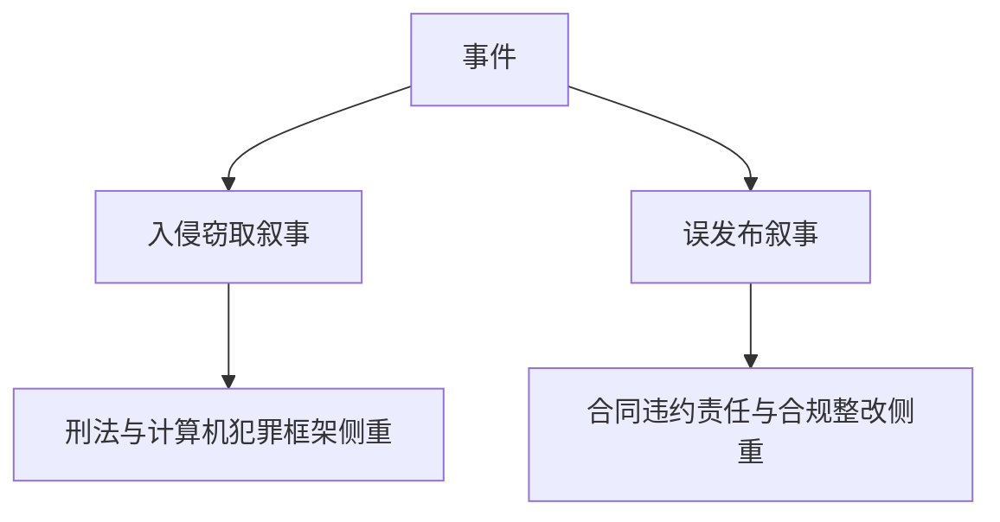
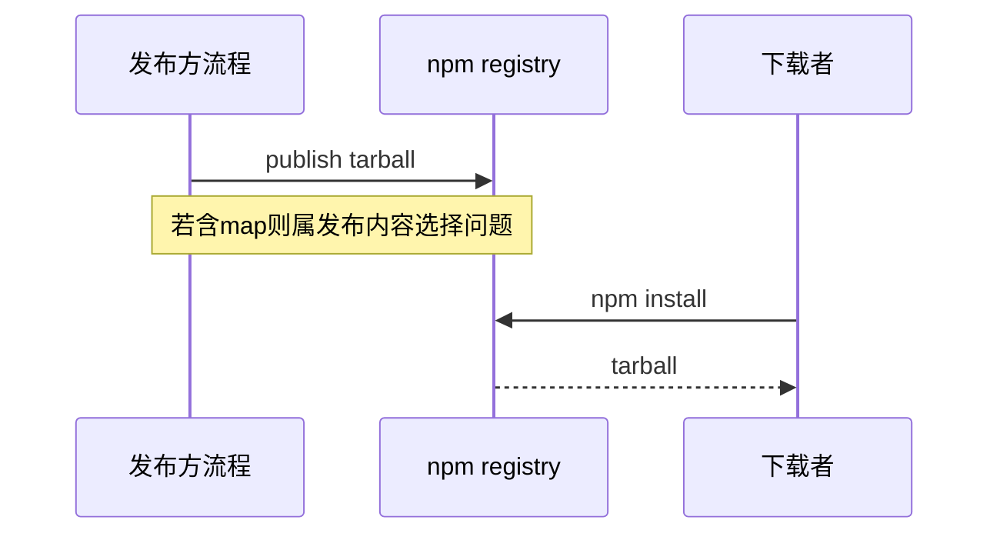
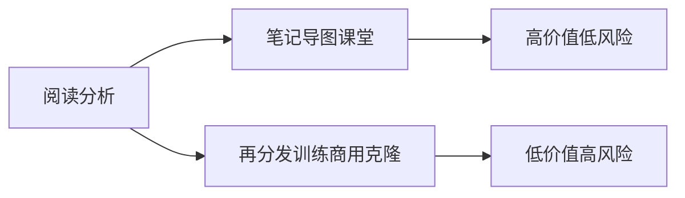
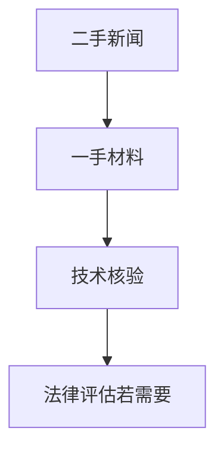
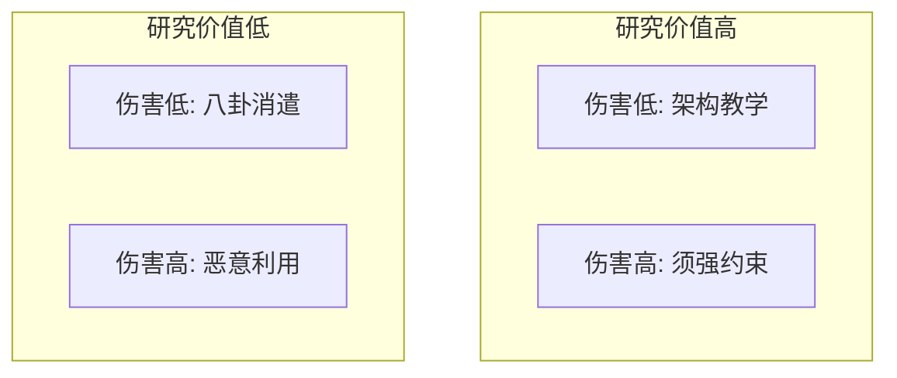
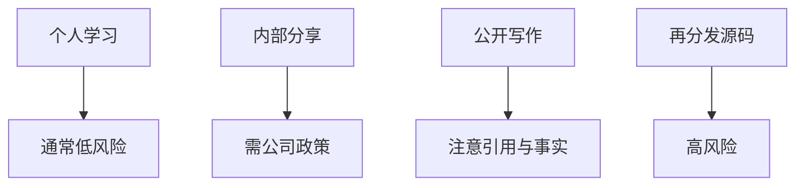
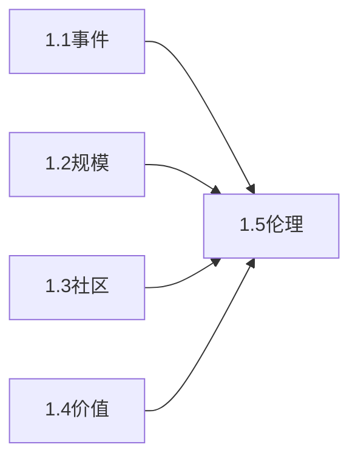

# 1.5 法律与伦理：我们读的是「公开可得文本」，但不是「任意使用许可证」

> **本节学习目标**
>
> - 区分 **Source Map 误发布** 与 **黑客入侵** 在叙事与归责上的差异（不等同于法律结论）。
> - 明确本书立场：**教育目的** 的架构学习；**不鼓励** 侵权分发与恶意利用。
> - 了解 **Anthropic 可能的回应方向**（以官方声明为准）与 **开源社区常见讨论轴线**。

---

## 第一句话：先把情绪分类

当新闻标题写「源码泄露」时，读者脑子里可能同时出现两种电影：

1. **间谍片**：有人潜入服务器偷走核心机密。  
2. **生活片**：印刷厂误把内部流程单订进杂志里卖给读者。

**Source Map 进入 npm 包** 更接近哪一种？在多数公开叙述里，它更像 **流程失误导致的敏感产物外流**，而不是典型的 **入侵窃取**。  

但这句判断是 **大众传播层面的分类**，不是 **法院判决**。



**生活类比**：同样是「你的东西被别人拿到了」，**被偷** 与 **你自己掉在路上** 的处理路径不同。

---

## 概念对照表：泄露 vs 黑客攻击（教学用）

| 维度 | Source Map **误发布**（常见描述） | **黑客攻击**（典型描述） |
|------|-----------------------------------|---------------------------|
| 起点 | 构建/发布链路 | 未授权访问 |
| 主观意图（讨论焦点） | 过失/流程缺陷 | 恶意/牟利/破坏 |
| 技术入口 | 公开 npm 下载 | 漏洞利用、凭证窃取等 |
| 归责讨论 | 供应链、CI/CD、清单审计 | 取证、追责、应急响应 |
| 用户体感 | 「更新包变大」 | 「服务宕机/数据被改」 |



**重要**：现实案件可能 **混合多种因素**；本书表格是 **学习脚手架**。

---

## 教育目的使用：本书允许的「读法」

### 我们鼓励的

| 行为 | 说明 |
|------|------|
| **个人本地阅读** 社区重建或你自己合法获得的文本 | 建立架构认知 |
| **画流程图、写笔记、课堂讨论** | 引用时注明来源与不确定性 |
| **把教训写进内部培训**：发布工程、合规清单 | 脱敏、不要夹带未授权完整源码 |

### 我们不鼓励的

| 行为 | 原因 |
|------|------|
| **未经授权** 大规模再分发完整源码树 | 版权与许可风险 |
| 用于 **绕过产品条款** 或 **克隆商业产品** | 合同与不正当竞争风险 |
| 将材料用于 **训练模型** 并声称「合法默认」 | 数据权利复杂，需单独评估 |



**类比**：大学解剖课允许你 **学习人体结构**，不允许你 **把标本挂网上卖**。

---

## Anthropic 的回应：应如何阅读新闻？

企业回应可能包含（**以官方为准**）：

- **承认/调查** 发布物异常；  
- **撤回/替换** 某些版本包；  
- **加强** 发布流程与监控；  
- **声明** 影响范围（例如强调非模型权重）。

本书无法提供 **实时声明全文**；请你训练一个习惯：

1. 找 **官方博客 / 安全公告 / npm 版本变更** 一手材料；  
2. 区分 **事实陈述** 与 **公关措辞**；  
3. 对「完全无害」类表述保持 **技术性追问**（地图是否可还原？是否含注释与路径信息？）。



---

## 开源社区的讨论轴线：大家在吵什么？

### 轴线 A：「这算不算开源？」

| 观点 | 要点 |
|------|------|
| **不算** | 无明确 OSI 许可证意图；属泄露文本 |
| **像开源** | 可阅读、可讨论、社区重建活跃 |

**本书立场**：**法律状态 ≠ 社区行为**。你可以 **像读开源一样读**，但别 **像用开源一样默认授权**。

### 轴线 B：「研究价值 vs 道德风险」



|  | 低伤害 | 高伤害 |
|--|--------|--------|
| **高研究价值** | 架构教学、合规改进 | 需强约束与伦理审查 |
| **低研究价值** | 八卦传播 | 恶意利用 |

### 轴线 C：「对竞品与生态的影响」

- 正向：推动行业 **发布工程** 成熟；  
- 负向：刺激 **恶意 fork** 与 **钓鱼工具链**。

---

## 研究者的位置：Chaofan Shou 叙事中的角色

公开描述中，研究者承担的是 **观察者与通报者** 功能：

| 常见伦理要求 | 说明 |
|--------------|------|
| **负责任披露** | 给厂商修复窗口（若适用） |
| **避免利用漏洞造成破坏** | 区分验证与攻击 |
| **证据链清晰** | 可复核、可重复 |

**类比**：记者报道「超市货架上有异物」，不是鼓励顾客哄抢，而是推动 **召回与整改**。

---

## 开发者个人合规清单（建议打印）

| 步骤 | 自检 |
|------|------|
| 1 | 我是否只在自己机器阅读？ |
| 2 | 我是否避免把完整树上传公有云？ |
| 3 | 我是否在公司政策允许范围内？ |
| 4 | 我是否区分「学习笔记」与「再发布」？ |
| 5 | 我是否在文章里避免煽动性用语？ |



---

## 与学生、教师的特别说明

| 角色 | 建议 |
|------|------|
| **学生** | 把案例当 **软件工程与安全课** 教材，不要当「破解教程」 |
| **教师** | 明确 **作业边界**：分析架构可以，传播未授权完整包不可以 |

---

## 关键「法律词汇」小白解释

| 词 | 超短解释 |
|----|----------|
| **版权** | 对表达形式的保护 |
| **许可** | 版权人允许你怎么用 |
| **合同** | 使用产品时同意的条款 |
| **商业秘密** | 非公知、能带来价值、采取保密措施的信息 |

> 本书 **不是法律意见**。涉诉或商业决策请咨询执业律师。

---

## 与 1.1～1.4 的闭环



- **1.1** 告诉你发生了什么；  
- **1.2** 告诉你规模；  
- **1.3** 告诉你社区怎么做；  
- **1.4** 告诉你为什么值得学；  
- **1.5** 告诉你 **学的时候别踩线**。

---

## 源码片段（示意）：发布清单审计思路

```bash
# 教学示意：在发布前检查 tarball 是否含 map
npm pack --dry-run 2>/dev/null | rg "\\.map$" || true
```

这不是「攻击技巧」，这是 **每个发布工程师都该会的自检**。

---

## 下一程

完成 Part 01 后，请回到路线图选择路径：

- [`../part00-preface/roadmap.md`](../part00-preface/roadmap.md)  
- 进入 Part 02（全书规划）时，请携带 **两张图**：事件时间线 + `main→query→tool` 调用草图。

---

## 附录：常见问答（FAQ）

**问：我读社区仓库会违法吗？**  
答：取决于 **你所在法域**、**仓库许可**、**你做什么**。个人本地学习通常讨论较多，但别替代律师意见。

**问：我能写「完整还原指南」吗？**  
答：写作本身可能涉 **教唆分发** 风险；更稳妥是写 **架构级分析** 与 **发布工程教训**。

**问：官方会不会追究读者？**  
答：一般公共讨论聚焦 **责任方与流程**；但 **大规模传播** 另当别论。

---

## 附录：情绪日记（自我调节用）

| 我读新闻时的情绪 | 更建设性的下一步 |
|------------------|------------------|
| 兴奋 | 打开 `setup.md` 配环境 |
| 愤怒 | 写「发布 checklist」给团队 |
| 恐惧 | 只读公开合法材料 |
| 冷漠 | 先读 `04-why-learn.md` |

---

## 结语：学习的尊严来自边界

真正专业的学习者，会把 **好奇心** 变成 **可验证的理解**，把 **热点** 变成 **长期能力**。当我们尊重法律与伦理边界时，知识才会 **站得住脚**。

恭喜你读完 **《Claude Code 完全指南 V2》第 1 篇**。下一篇，我们将从 **入口文件** 真正走进这座城——记得带上地图。
