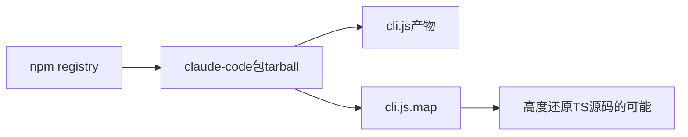
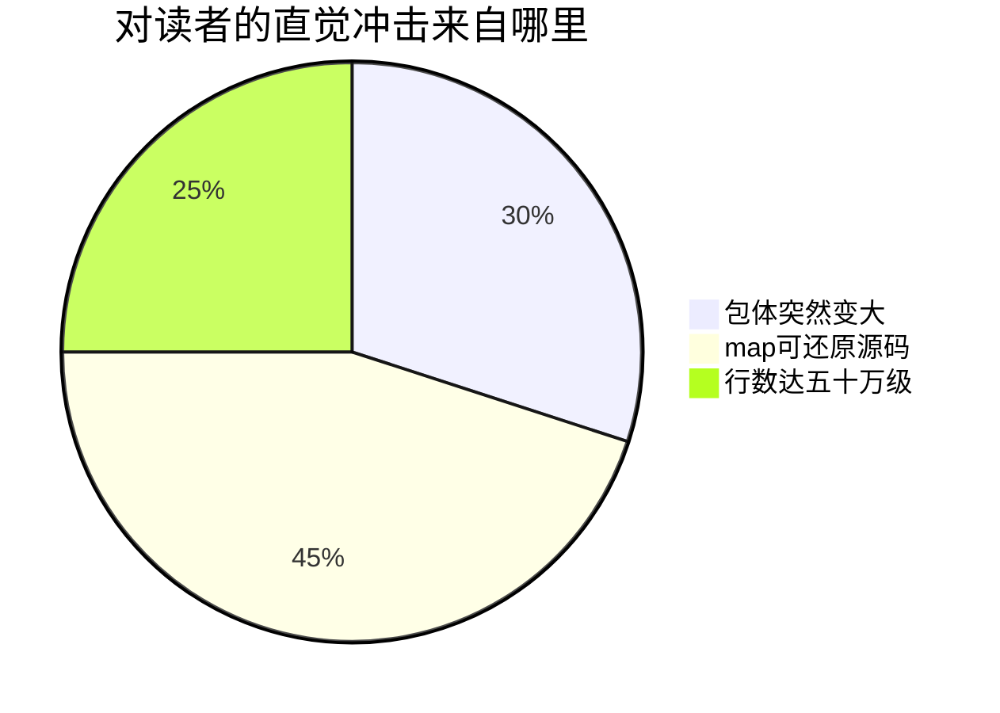
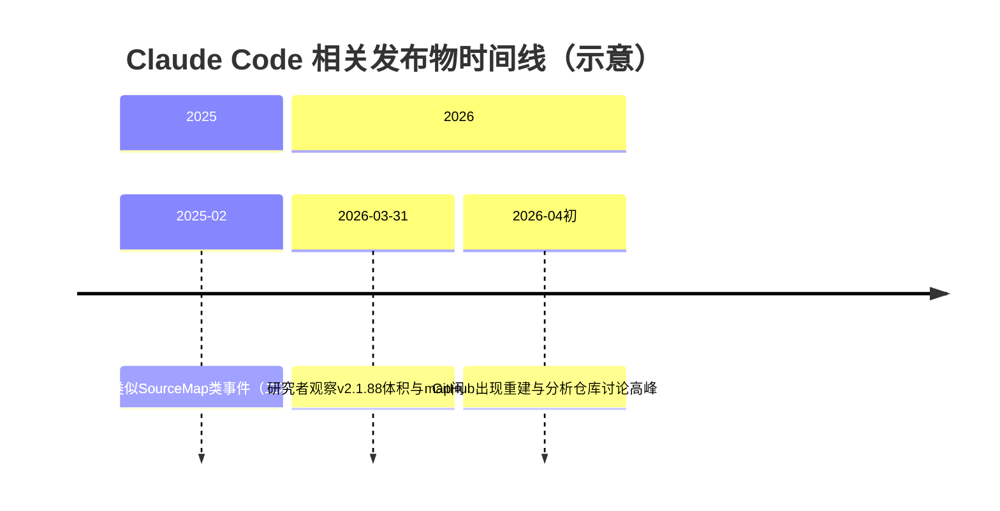
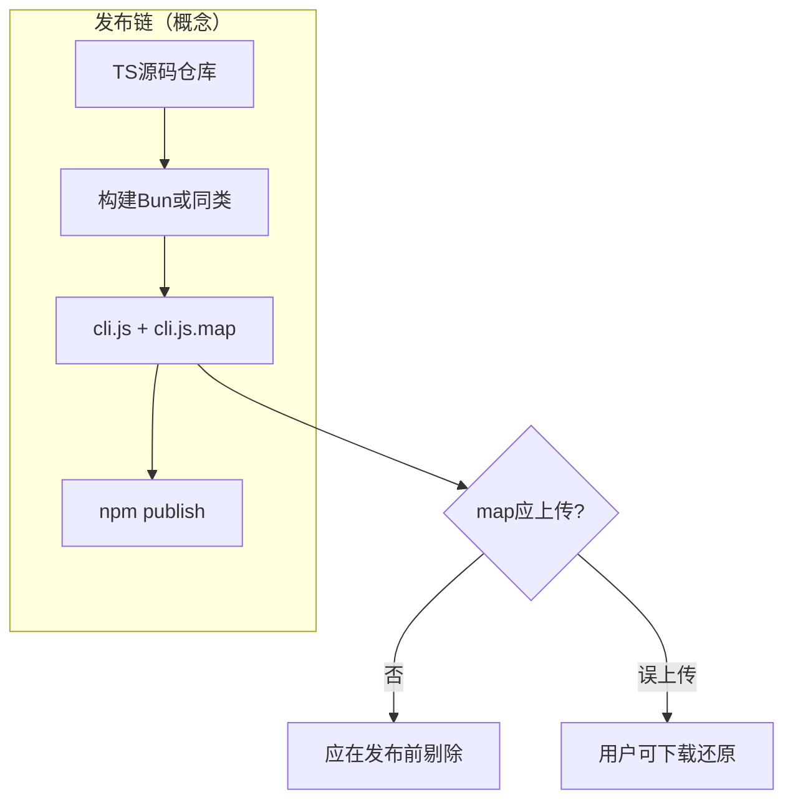
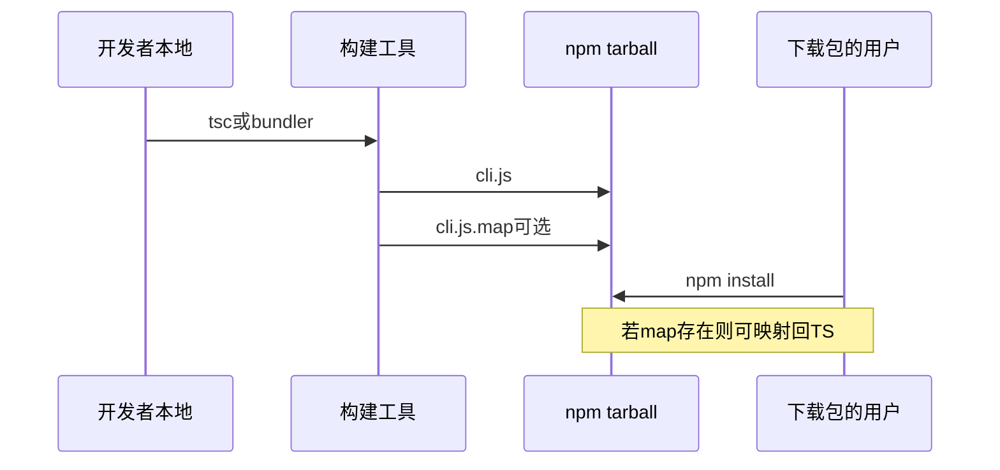
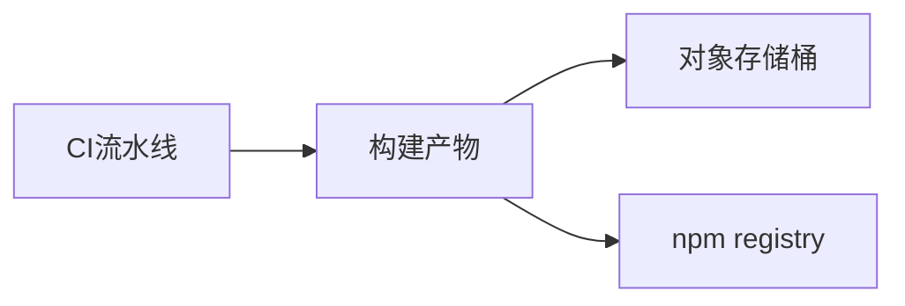
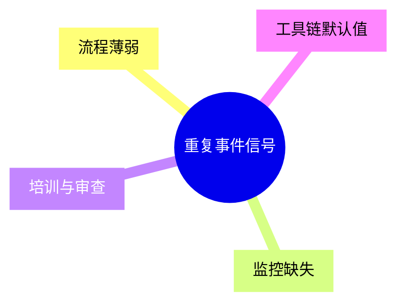

# 1.1 泄露事件始末：当「调试地图」搭上了公开发货的便车

> **本节学习目标**
>
> - 按时间线复述 **2026-03-31** 前后社区观察到的 npm 包异常与 Source Map 争议。
> - 解释 **cli.js.map**、**体积从约 17MB 到约 31MB** 等事实在工程上意味着什么。
> - 理解 **Bun 默认 Source Map**、**.npmignore 漏洞**、**R2 存储桶** 等关键词在叙事中的角色（区分「传闻」与「可验证机制」）。

---

## 导语：一盒变重的「快递」

想象你在网上买了一盒 **标称 17MB 的饼干**。快递到手一掂，沉得离谱——上秤发现 **31MB**。你撕开包装，发现除了饼干，还塞了一本 **60MB 厚的「工厂内部工艺流程图册」**（而且图册本该只留在厂里）。

对软件来说，那本「图册」就是 **Source Map**：它让工程师能把压缩后的 `cli.js` **对照回** TypeScript 源码行号。对终端用户而言，它通常 **不该出现在公开发布的 npm tarball 里**——就像顾客不该收到工厂图纸。

本书这一部分讲 **故事脉络**；下一节讲 **源码规模**；法律与伦理见 `05-legal-ethics.md`。

---

## 人物与发现（公开叙述层面）

公开讨论中常提到安全研究者 **Chaofan Shou** 对 **Anthropic** 发布到 npm 的 **Claude Code v2.1.88** 包的观察：**包体异常膨胀**，并指向 **Source Map** 文件的存在。具体技术细节以研究者公开材料与 npm 上可核验的发布物为准。



**生活类比**：研究者像 **质检员**——不是「黑进工厂」，而是「买到市售品后发现多了一张不该附带的图纸」。

---

## 体量数字：为什么社区会震惊？

下面数字来自本书 **教学引用** 的背景材料（具体以你本地核验的包版本为准）：

| 项目 | 约数 / 描述 |
|------|-------------|
| 包体积变化 | 约 **17MB → 31MB** |
| 多出的 Source Map | 约 **60MB** 级别讨论（`cli.js.map`） |
| 还原规模叙事 | 约 **51.2 万行** TypeScript、**1903** 个文件 |
| 内容性质 | **客户端编排层**；**非** 模型权重 |



**类比**：模型权重像 **可口可乐秘方**；客户端源码像 **自动售货机的机械结构**——泄露后者仍然严重，但不要混谈成「配方被偷」。

---

## 时间线：把散落的报道拼成一张图

下列时间线为 **教学用整理**，日期与事件描述综合公开讨论与历史类似案例；正式引用请回溯一手来源。



### 表格版时间线

| 阶段 | 时间（约） | 发生了什么 | 技术侧关注点 |
|------|------------|------------|--------------|
| 先例记忆 | **2025-02** | 社区回忆/对比「曾经也发生过」 | 发布流程是否系统性风险 |
| 触发观察 | **2026-03-31** | npm 包体积与 map 文件引发讨论 | tarball 内容清单审计 |
| 扩散分析 | **2026-04** | 重建仓库、导图、文章井喷 | 合规、版权与教育边界 |



---

## Source Map 到底是什么？

### 一句话

Source Map 是 **压缩/打包代码** 与 **原始源码位置** 之间的索引。

### 稍微展开

当你把 TypeScript 编译成单文件 `cli.js` 时：

- 浏览器或 Node 实际执行的是 `cli.js`。  
- 若同时生成 `cli.js.map`，调试器可以把错误栈 **映射回** `.ts` 行号。  

**若 `.map` 与 `.js` 一起发布到 npm**，下载者就有机会 **高度还原** 源码结构（配合反编译/格式化工具）。



### 类比表

| 概念 | 类比 |
|------|------|
| `cli.js` | 餐厅给顾客的「成品菜」 |
| `cli.js.map` | 后厨墙上贴的「切配与火候笔记」 |
| npm 包 | 外卖盒 |
| 误塞 map | 外卖盒里夹了整张后厨 SOP |

---

## Bun 与「默认生成 Source Map」的讨论

公开分析中常提到：**Bun** 在构建链路里 **可能默认生成 Source Map**。这意味着：

- 若 CI/CD **没有显式关闭** map 输出，产物目录里会出现 `.map`。  
- 若 `.npmignore` 或 `files` 白名单 **没有排除** map，tarball 就会 **带着地图出货**。

**重要**：这是 **流程与默认值** 的讨论，不是「Bun 有错」或「某一方故意」的单选题——工程上更像 **瑞士奶酪模型**：每层一个小洞，叠在一起就会穿。


---

## .npmignore 与 files 字段：「装箱单」事故

npm 打包规则可以简单理解为：

- `package.json` 的 **`files`** 字段：「只装这些」。  
- **`.npmignore`**：「别装这些」（类似 `.gitignore`）。  

若规则 **漏写**、**被覆盖**、或与构建输出目录 **不同步**，就会出现「以为没装，其实装了」。

| 机制 | 作用 | 典型失误 |
|------|------|----------|
| `files` | 白名单 | 写了 `dist` 但没排除 `dist/**/*.map` |
| `.npmignore` | 黑名单 | 规则不覆盖新目录 |
| 预处理脚本 | 复制产物 | 把 `build/` 整个拷进待发布树 |

**生活类比**：搬家时列了「书房要装箱」，结果把书房 **抽屉里的机密笔记本** 也扫进去了——不是小偷进屋，是 **装箱单不细**。

---

## R2 存储桶：它在叙事里扮演什么？

部分讨论将发布物与 **Cloudflare R2** 一类对象存储联系起来，用以解释 **大文件分发** 或 **构建产物托管**。本书建议读者：

- 把 R2 理解为 **「放安装包的仓库货架」**；  
- 具体某产品是否使用、如何使用，以官方架构为准，避免过度臆测。



---

## 2025 年 2 月：「又一次」为何刺痛神经？

若同类事件 **重复发生**，社区情绪会从「偶然」转向「系统性疑问」：

| 视角 | 问题 |
|------|------|
| 工程 | 发布 checklist 是否缺自动化校验？ |
| 合规 | 是否应监控 tarball 文件类型与大小基线？ |
| 生态 | 竞争对手、恶意镜像站是否会长期存档？ |



---

## 与「黑客攻击」的边界（预告）

本节只建立事实感；法理与伦理展开见 **1.5**。此处给出口诀：

- **误发布**：像 **把机密复印件落在复印店取件台**。  
- **入侵**：像 **有人撬锁进文印室偷复印件**。  

二者都可能造成损失，但 **归责与响应** 不同。

---

## 关键「源码片段」长什么样？（教学示意）

你下载到的 map 并不会等于「漂亮的 `.ts` 文件树」，但会极大降低还原成本。下面是一段 **虚构的** map 片段结构示意：

```json
{
  "version": 3,
  "file": "cli.js",
  "sources": ["../src/entry.ts", "../src/tooling/registry.ts"],
  "sourcesContent": ["/* 可能被内联的源码片段 */"],
  "mappings": "AAAA;AAAA;AAAA;"
}
```

真实文件中 `mappings` 是压缩编码；`sourcesContent` 是否存在取决于生成选项。** point**：只要信息足够，工具链就能 **重建** 近似原始仓库。

---

## 本节小结表

| 关键词 | 你应带走的理解 |
|--------|----------------|
| v2.1.88 | 体量异常引发 scrutiny 的版本锚点之一 |
| cli.js.map | Source Map；调试友好 ≠ 公开发布友好 |
| 17→31MB | 用户侧可感知的「变重」 |
| Bun | 默认值与构建链一环 |
| .npmignore | 装箱黑名单；失误可导致 map 漏网 |
| R2 | 对象存储叙事中的「货架」隐喻 |
| 编排层 | 泄露讨论聚焦客户端逻辑，不是权重 |

---

## 延伸思考题

1. 若你是发布负责人，会如何设计 **「禁止 .map 入 tarball」** 的 CI 断言？  
2. Source Map 是否应区分 **内网调试包** 与 **公网包** 两种发布通道？  
3. 社区重建仓库对 **安全研究** 是助力还是误导（许可证碎片化）？

---

## 下一节导航

- **1.2 源码规模全貌**：[`02-source-overview.md`](./02-source-overview.md)  
- **术语复习**：[`../part00-preface/glossary.md`](../part00-preface/glossary.md)  

---

## 附录：对话剧本（帮助小白复述）

**小明**：听说 Claude Code 被黑了？  
**小红**：更准确说，是 **公开发布的安装包** 里 **多带了调试地图**，别人能 **还原大量 TS 源码**。这不等于「模型权重泄露」，但很严肃。  
**小明**：为啥会带？  
**小红**：常见是 **构建默认生成 map** + **发布清单没剔除** + **监控没报警** 叠在一起——像搬家装箱不检查抽屉。

---

## 附录：检查清单（企业发布用）

| 步骤 | 检查项 |
|------|--------|
| 1 | `npm pack --dry-run` 列出 tarball 内容 |
| 2 | 搜索 `.map` 后缀 |
| 3 | 对比上一版本体积差异阈值 |
| 4 | 对 `sourcesContent` 内联策略做显式配置 |
| 5 | Artifacts 分「公网」「内网调试」通道 |

---

当时间线在你脑海里从散点连成折线，你会发现：这不是单一「坏人坏事」的惊悚片，而是一部 **流程喜剧里的悲剧桥段**——而我们要做的，是从桥段里学到 **如何把门关好**。继续读 1.2，看看这 51 万行「城市」的地图长什么样。
