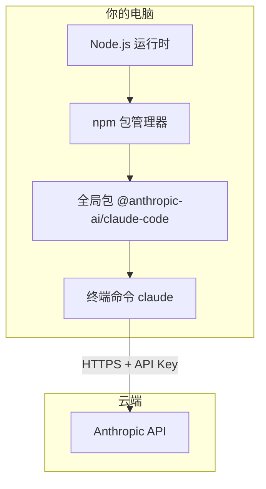
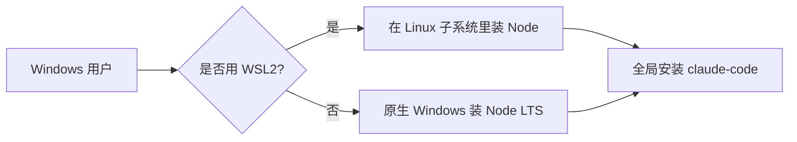
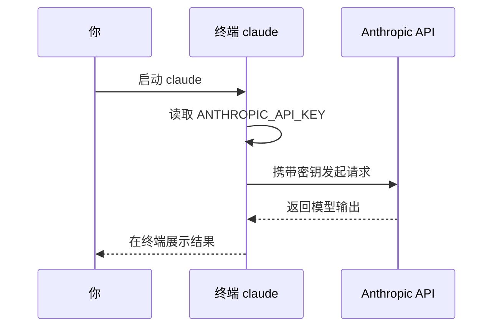

# 2.2 安装全流程

> **本节目标**：在 macOS、Linux 或 Windows 上装好 Claude Code，配置 Anthropic API 密钥，并用 `claude` 命令完成首次验证。  
> **预计时间**：首次约 15–30 分钟（含下载 Node 与网络等待）。

---

## 学习目标

- 能解释：为什么需要先装 **Node.js**（用于全局 `npm` 包）。
- 能独立完成：`npm install -g @anthropic-ai/claude-code`。
- 能在 [Anthropic Console](https://console.anthropic.com/) 创建 **API Key** 并妥善保存。
- 能在项目目录执行 `claude`，看到正常启动而非报错。

---

## 安装前的直觉：Claude Code 住在哪里？

把 Claude Code 想成「装在系统里的一个全局命令」：



- **Node.js**：提供运行 JavaScript 工具链的环境（Claude Code 以 npm 包分发）。
- **npm install -g**：把 CLI 装到「全局」，任意目录都能敲 `claude`。
- **API Key**：证明「这是你付费/配额内的调用」，别泄露、别提交到 Git。

---

## 第一步：安装 Node.js

### 为什么要装 Node？

Claude Code 通过 **npm** 发布。没有 Node，就没有稳定的 `npm` 来装全局 CLI。  
（实现上 Claude Code 自身技术栈含 Bun/TS 等，但**你作为用户**当前主流安装路径仍是 **Node + npm**。）

### 版本建议

- 使用 **当前的 LTS（长期支持）版** Node 通常最省心。
- 安装完成后在终端验证：

```bash
node -v
npm -v
```

应看到类似：

```text
v22.x.x
10.x.x
```

### macOS 安装方式（任选其一）

| 方式 | 适合人群 | 命令或操作 |
|------|----------|------------|
| 官网安装包 | 不想折腾 | [https://nodejs.org/](https://nodejs.org/) 下载 LTS `.pkg` |
| Homebrew | 已用 brew | `brew install node` |
| nvm | 需要多版本切换 | 按 nvm 文档安装后再 `nvm install --lts` |

### Linux 安装方式（示例）

**Debian / Ubuntu（示意，版本号以官方为准）：**

```bash
# 示例：使用 NodeSource 或发行版仓库，任选团队认可的方式
curl -fsSL https://deb.nodesource.com/setup_lts.x | sudo -E bash -
sudo apt-get install -y nodejs
```

**Fedora / RHEL 系：**

```bash
sudo dnf install nodejs npm
```

验证同样使用 `node -v` 与 `npm -v`。

### Windows 安装方式

| 方式 | 说明 |
|------|------|
| 官网 MSI | 从 [nodejs.org](https://nodejs.org/) 安装 LTS，勾选「Add to PATH」 |
| winget | `winget install OpenJS.NodeJS.LTS`（以本机 winget 源为准） |
| WSL2 | **推荐**：在 WSL 的 Ubuntu 里按 Linux 步骤安装，终端体验更接近文档示例 |



> **小白提示**：若在 Windows 原生 PowerShell 里路径、换行与 macOS 不同，优先查官方文档或团队规范；很多开发者最终会选择 **WSL2 + Ubuntu** 统一环境。

---

## 第二步：全局安装 Claude Code

在**任意**终端执行：

```bash
npm install -g @anthropic-ai/claude-code
```

### 常见现象

| 现象 | 可能原因 | 处理方向 |
|------|----------|----------|
| `EACCES` 权限错误 | 全局目录无写权限 | macOS/Linux：配置 npm 前缀到用户目录，或用 `nvm`；避免长期 `sudo npm` |
| 下载很慢 | 网络或 registry | 换网络、配置镜像（遵守公司合规） |
| `command not found: claude` | PATH 未包含全局 bin | 重新打开终端；检查 `npm bin -g` 输出是否在 PATH |

安装完成后验证：

```bash
claude --version
# 或
claude -h
```

若能输出版本或帮助信息，说明 **CLI 已就位**。

---

## 第三步：获取 Anthropic API 密钥

1. 浏览器打开：**[https://console.anthropic.com/](https://console.anthropic.com/)**  
2. 登录或注册账号。  
3. 进入 API Keys（名称可能随控制台改版略有不同），**Create Key**。  
4. **复制密钥**，粘贴到安全位置（密码管理器）。  
5. **不要**把密钥写进公开仓库、截图发群、或贴在 issue 里。

### 配置到环境变量（推荐）

**macOS / Linux（当前终端会话临时生效）：**

```bash
export ANTHROPIC_API_KEY="sk-ant-api03-............"
```

**写入 shell 配置文件（长期生效，示例为 zsh）：**

```bash
echo 'export ANTHROPIC_API_KEY="sk-ant-api03-............"' >> ~/.zshrc
source ~/.zshrc
```

**Windows（PowerShell 当前会话）：**

```powershell
$env:ANTHROPIC_API_KEY = "sk-ant-api03-............"
```

> 具体密钥前缀以控制台显示为准；若团队使用 **配置文件或 SSO**，以内部文档为准。



---

## 第四步：首次运行 `claude` 验证

1. 进入一个**测试用**目录（避免误改重要项目）：

```bash
mkdir -p ~/sandbox-cc-test
cd ~/sandbox-cc-test
git init   # 可选：许多工作流假设在仓库内
```

2. 启动：

```bash
claude
```

3. **期望**：出现交互界面或提示，能够输入自然语言；若报错，记录完整报错英文/中文。

### 故障排查速查

| 报错线索 | 检查项 |
|----------|--------|
| API key / authentication | `echo $ANTHROPIC_API_KEY` 是否为空；Windows 检查对应 env |
| network / timeout | 代理、防火墙、公司 MITM 证书 |
| rate limit | 配额、账单、组织策略 |

---

## 与「42 工具 / 权限模式」的关系（预告）

安装本身不展示全部工具。进入交互后，当代理需要 **读文件、改文件、执行 bash** 时，你会看到**权限提示**——这正是多工具 + 权限模式的外在表现。详情见 `04-edit-files.md` 与 `05-run-commands.md`。

---

## 本节命令清单（可复制）

```bash
# 1) 检查 Node
node -v && npm -v

# 2) 全局安装
npm install -g @anthropic-ai/claude-code

# 3) 验证 CLI
claude --version

# 4) 设置密钥（示例）
export ANTHROPIC_API_KEY="你的密钥"

# 5) 在空目录试跑
mkdir -p ~/sandbox-cc-test && cd ~/sandbox-cc-test
claude
```

---

## 小结

- **Node.js + npm** 是官方分发路径上的标准入口；装好后用 **全局 npm 包** 得到 `claude` 命令。
- **API Key** 来自 Anthropic 控制台，通过环境变量注入最通用。
- **首次验证** = 在测试目录运行 `claude`，确认能连上 API 并进入交互。

上一章：[2.1 总览 ←](./index.md) · 下一章：[2.3 第一次对话 →](./03-first-chat.md)
