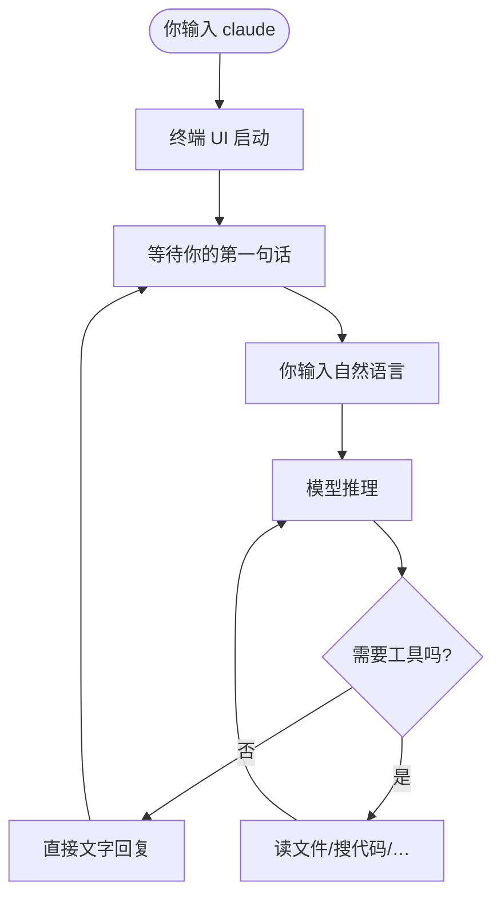
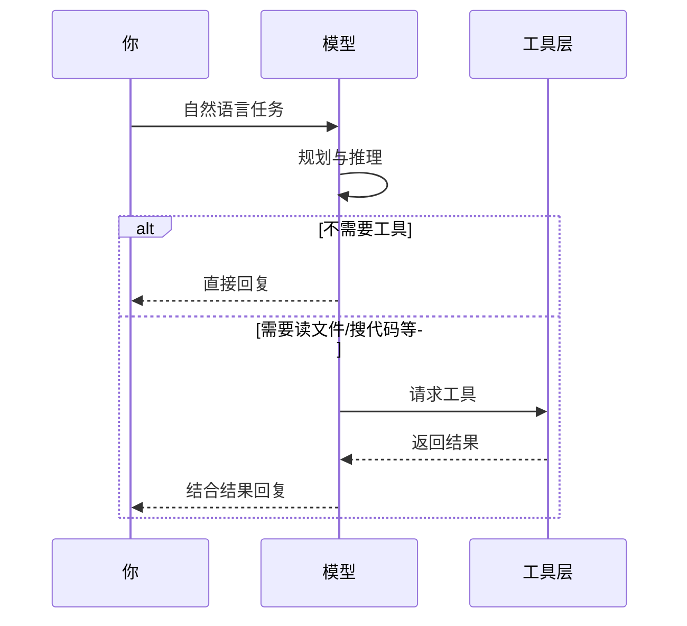
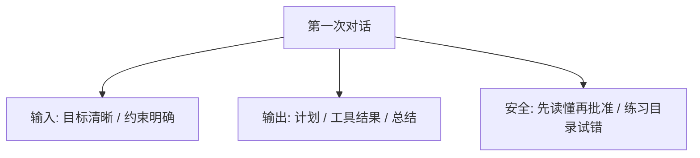

# 2.3 第一次对话

> **本节目标**：启动 `claude`，完成一轮最简单的问答，看懂终端里「你说了什么 / 模型回了什么 / 中间有没有工具」，并能用一张图描述「思考—行动—回答」的节奏。

---

## 学习目标

- 能在空项目或练习目录中**稳定启动** Claude Code。
- 能区分：**用户输入**、**助手可见回复**、**工具调用块**（若界面展示）。
- 能用生活类比理解：代理不是「瞬间魔法」，而是**多步推理 + 可选动作**。

---

## 启动：像打开一个「专注聊天的终端窗口」

在已配置 `ANTHROPIC_API_KEY` 的前提下，进入目录并执行：

```bash
cd ~/sandbox-cc-test   # 或你的真实项目根
claude
```

**生活类比**：你不是打开微信聊天框，而是打开一个**只谈代码与命令**的窗口——它**能看到当前文件夹**里的文件（在得到读权限后），但**不会自动乱改**，除非你让它做并批准相关权限。



---

## 第一次说什么？三个由浅入深的示例

### 示例 A：纯问答（通常不涉及改文件）

在提示符处输入（中文即可，以下为示意）：

```text
用三句话解释什么是 Git 里的 commit，完全不懂的人也能听懂。
```

**你可能看到**：

- 一段结构化解释（分段、列表）。
- **没有**文件变更、**没有**执行 `git` 命令——因为任务只需语言回答。

### 示例 B：与当前目录相关（可能触发读目录/读文件）

先放一个文件：

```bash
echo "hello" > note.txt
```

再问：

```text
当前目录下有哪些文件？note.txt 里写了什么？
```

此时代理往往会走 **列出目录 / 读取文件** 的工具链（具体界面以你版本为准）。  
你会遇到 **权限确认**（例如是否允许读取）——**先按提示选 y/n**，这是安全设计。

### 示例 C：明确要求「只解释、不要改」

```text
接下来只回答我的问题，不要修改任何文件、不要运行命令。
```

这有助于你**观察纯对话形态**，建立信心；后续再放开让代理动手。

---

## 理解输入与输出格式

### 你的输入（User Message）

- 自然语言，中英均可。
- 可以很长：贴日志、贴报错、描述需求。
- 建议习惯：**一次一个目标**，例如「先解释报错，再给出修复步骤」。

### 模型的输出（Assistant）

常见包含几类信息（不同 UI 皮肤下排版不同）：

| 块类型 | 含义 | 小白怎么读 |
|--------|------|------------|
| 说明文字 | 推理与计划 | 先看这段，确认它**理解对你的任务** |
| 工具调用提议 | 将执行读/写/bash | 注意是否要你按 **y** 批准 |
| 工具结果摘要 | 命令输出、文件片段 | 核对是否**符合你预期** |
| 最终总结 | 可执行结论 | 保存为笔记或照做 |

### 伪代码：一次对话在系统里大致长什么样

下面**不是**真实 API 载荷，只是帮助建立心智模型：

```text
[System] 你是终端编程代理，工作目录 /Users/you/project ...
[User]   用三句话解释 commit ...
[Assistant] commit 就像给项目拍一张「可回退的快照」...
```

当需要工具时，可想象为额外插入：

```text
[Assistant → Tool] Read(path="note.txt")
[Tool → Assistant] hello
[Assistant] 文件里只有一行 hello ...
```



---

## 「思考过程」怎么可视化？

Claude Code 的具体 UI 会随版本调整，但你可以用**固定套路**观察「思考感」：

1. **计划段**：先列 1–3 步（例如「先读 package.json」「再跑测试」）。
2. **行动段**：出现工具名或命令预览。
3. **结果段**：文件片段、终端输出截断展示。
4. **收尾段**：总结 + 下一步建议。

**生活类比**：像医生问诊——**先问病史（读文件）**，**再开检查（跑命令）**，**最后给处方（改代码）**；你不会希望医生不做检查就乱开刀。

---

## 第一次对话的推荐检查清单

- [ ] `ANTHROPIC_API_KEY` 已设置，`claude` 能启动。
- [ ] 完成至少 **1 次纯问答**。
- [ ] 完成至少 **1 次涉及读文件** 的问答，并**看清权限提示**。
- [ ] 知道如何 **退出**（常见为 `exit`、Ctrl+C 或界面提示；以当前版本帮助为准）。
- [ ] 知道 **`/help`** 可查看内置命令（详见 `07-cheatsheet.md`）。

---

## 常见新手问题

| 问题 | 简短回答 |
|------|----------|
| 我说中文可以吗？ | 可以；模型对中文支持良好。 |
| 它会自动把我电脑删光吗？ | 危险操作通常需你批准；仍建议用测试目录练习。 |
| 为什么有时很慢？ | 模型推理 + 网络 + 工具执行耗时；复杂任务多步更久。 |
| 报错看不懂怎么办？ | 把**完整报错**复制进对话，并说明「我刚执行了什么命令」。 |

---

## 与后文衔接

- **要改文件了** → 阅读 [2.4 编辑文件实操](./04-edit-files.md)，重点 **FileRead → FileEdit** 与 **y/n**。
- **要跑 npm test 了** → 阅读 [2.5 运行命令实操](./05-run-commands.md)。

---

## 小结

- **第一次对话** = 启动 `claude` + 从纯问答过渡到「读当前目录」。
- 终端里的回复往往不是「一句话」，而是 **计划 → 工具 → 结果 → 总结** 的链条。
- **权限提示**是安全阀：先读提示再按 **y**，养成肌肉记忆。

---

## 对话截图替代：自建「对话记录」习惯

终端内容不便截图时，可在练习笔记本里固定记录四列：

| 时间 | 我输入的要点 | 代理做了什么（读/写/命令） | 我的收获或失误 |
|------|----------------|-----------------------------|----------------|
|  |  |  |  |

坚持 5 次以后，你会明显更清楚**钱和时间花在哪**。

---

## 与「React Ink 终端 UI」相关的体验提示

Claude Code 的界面用 **React Ink** 等技术绘制，可能出现：

- **重绘**：输出更新时整屏滚动方式与纯 shell 不同。
- **热键冲突**：某些终端默认快捷键与 TUI 抢焦点。

若遇到显示错乱，优先尝试：**放大终端窗口**、**换一款终端应用**、**更新 Claude Code 版本**。

---

## 示例对话脚本（可复制微调）

**脚本 1：自我介绍式**

```text
我是编程新手。请用不超过 200 字说明：你会如何帮我学这个仓库？
先不要读文件，只基于一般经验回答。
```

**脚本 2：约束式**

```text
接下来请用「步骤 1/2/3」回答。若需要工具，请先说明将使用哪类工具以及为什么。
```

**脚本 3：复盘式**

```text
上一轮回答里，哪些结论是确定的，哪些只是推测？请用两列表格说明。
```

---

## 本节与核心概念对照

| 核心概念 | 在本节的体现 |
|----------|----------------|
| 终端 AI 编程代理 | 你在 shell 里启动 `claude` |
| 四种能力 | 本节以**对话**为主；读文件在示例 B 露头 |
| 42 工具 | 不必数清；先建立「有时会调用工具」的直觉 |
| 权限模式 | 首次在工具调用处遇到 **y/n** |

---

## 延伸阅读（心智模型）



上一章：[2.2 安装 ←](./02-installation.md) · 下一章：[2.4 编辑文件 →](./04-edit-files.md)
