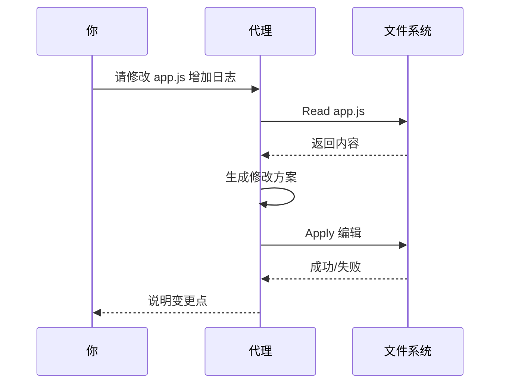
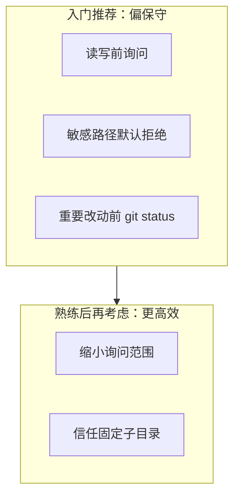

# 2.4 编辑文件实操

> **本节目标**：让 Claude Code **创建并修改**你磁盘上的文件；理解 **先读后写** 的常见模式；对 **y/n 权限提示** 有明确判断标准。  
> **安全提醒**：在练习目录操作；涉及删除、批量重写时格外谨慎。

---

## 学习目标

- 能口述：**为什么代理往往要先读文件再编辑**。
- 能完成：创建新文件、修改现有文件、让代理**解释 diff 思路**。
- 看到权限提示时，能判断：**这次允许会不会越界**。

---

## 生活类比：改作文 vs 瞎编

- **不读文件就改** = 没看你作文就重写——容易跑题、覆盖错段落。
- **FileRead → 再 FileEdit** = 先通读，再在原稿上批改——**上下文对齐**，冲突更少。

Claude Code 内置多类工具（总量约 **42** 个工具的概念），其中与文件强相关的大致包括：**读取**、**搜索**、**写入/编辑**等。不同版本命名可能略有差异，但**「读→改」**节奏是通用的。


---

## 准备工作：一个最小练习项目

```bash
mkdir -p ~/cc-edit-demo
cd ~/cc-edit-demo
claude
```

在对话里可以说：

```text
请在本目录创建一个 README.md，用中文写项目名称「练习仓」和一句简介，不要写其他文件。
```

---

## 流程拆解：FileRead → FileEdit（概念层）

下表用**逻辑名称**描述流程；你终端里看到的工具名可能叫 `Read`、`Edit`、`Write` 等，**不必死记拼写**，重在理解顺序。

| 步骤 | 代理在做什么 | 你为什么要在意 |
|------|----------------|------------------|
| 1. 发现目标 | 决定改哪个路径 | 路径错了会改错文件 |
| 2. Read | 拉取当前内容 | 避免覆盖无关部分、对齐编码风格 |
| 3. 计划补丁 | 决定插入/替换哪些片段 | 大改前先看它计划是否合理 |
| 4. Edit/Write | 应用变更 | **此时磁盘会真的变化** |
| 5. 汇报 | 总结改了什么 | 你用 `git diff` 或打开文件核对 |



---

## 权限提示（y/n）到底在问什么？

当界面出现类似「是否允许读取/写入某路径」时，可以按下面问题快速决策：

| 自检问题 | 若答案为「是」则倾向 |
|----------|----------------------|
| 路径是否在我**本意**的项目内？ | 更安全 |
| 是否是**敏感文件**（.env、密钥、私钥）？ | **先 n**，改用脱敏示例 |
| 是否会**大面积删除**我看不见的内容？ | **先 n**，要求「先展示 diff 计划」 |
| 我是否**备份**或已提交 Git？ | 更有底气按 y |

**生活类比**：装修工要拆一面墙，**先让你签字**——y 不是「随便你」，而是「我确认这面墙可以拆」。

---

## 实操示例 1：创建新文件

**你说：**

```text
新建 src/greet.ts，导出一个函数 greet(name: string): string，
返回 `Hello, ${name}!`，并加一行注释说明用途。
```

**期望结果**：

- 代理可能先确认目录结构，再写入文件。
- 若需创建 `src/`，可能伴随**写权限**提示。

**你本地验证：**

```bash
cat src/greet.ts
```

---

## 实操示例 2：修改现有文件

先手动建一个「有瑕疵」的文件：

```bash
mkdir -p src
printf "export function add(a,b){return a+b}\n" > src/math.ts
```

**你说：**

```text
给 src/math.ts 里的 add 补上 TypeScript 类型标注，并格式化得更易读，不要改函数行为。
```

**期望观察点**：

- 是否出现 **Read** 再 **Edit**。
- 改完后运行（若你环境有 `tsc`）：

```bash
npx tsc --noEmit 2>/dev/null || echo "若无 tsconfig 可忽略"
```

---

## 源码片段：改前 vs 改后（示意）

**改前 `src/math.ts`：**

```typescript
export function add(a,b){return a+b}
```

**改后（示意，非唯一正确答案）：**

```typescript
/** 返回两数之和 */
export function add(a: number, b: number): number {
  return a + b;
}
```

在对话里你可以追加一句：

```text
请用要点列表说明：你改了哪些 token，为什么不会改坏行为。
```

这能训练你**读代理的解释**，而不是盲信。

---

## 实操示例 3：拒绝与纠正

若代理提议写入错误路径，直接说：

```text
不要写在 src/math.ts，请改为 src/utils/math.ts，其他要求不变。
```

若你已按了 **y** 但发现不对：

- **立即**用 Git 回滚（若已 `git init`）：

```bash
git checkout -- src/math.ts
# 或
git restore src/math.ts
```

这衔接下一篇 Git 专章的安全习惯。

---

## 与「42 工具 / 权限模式」的关系

- **工具多** ≠ 一次全用上；与文件相关的几次调用就会拼出完整故事。
- **权限模式**决定：是否每次询问、是否信任某目录、是否允许大范围替换。入门阶段建议**偏保守**：**多询问、少自动**。



---

## 故障排查

| 现象 | 可能原因 | 建议 |
|------|----------|------|
| 提示无写权限 | 目录只读或沙箱 | 检查目录权限；换到有写权限的路径 |
| 改完编码乱码 | 原文件非 UTF-8 | 说明编码；必要时先统一 UTF-8 |
| 与本地编辑器冲突 | 同时手改同一文件 | 一方改时另一方先停 |

---

## 本节练习清单

- [ ] 创建一个新文件并通过 `cat` 验证。
- [ ] 修改一个已有文件并理解代理的**读→改**顺序。
- [ ] 故意给错路径，观察代理如何纠正或询问。
- [ ] 至少一次对 **y/n** 选择 **n**，看代理是否给出替代方案。

---

## 小结

- **文件编辑**是代理最有力的能力之一，也是**最需要你盯紧**的能力。
- **FileRead → FileEdit** 是为减少「瞎改」的标准节奏。
- **y/n** 是你的签字权；不确定就 **n**，并要求**先展示计划或 diff**。

上一章：[2.3 第一次对话 ←](./03-first-chat.md) · 下一章：[2.5 运行命令 →](./05-run-commands.md)
