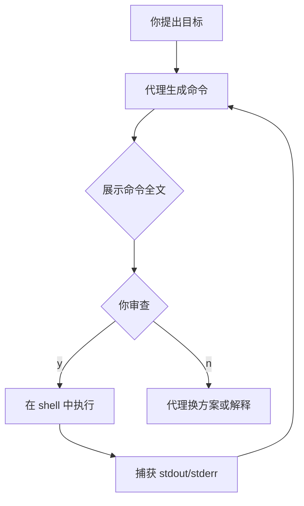
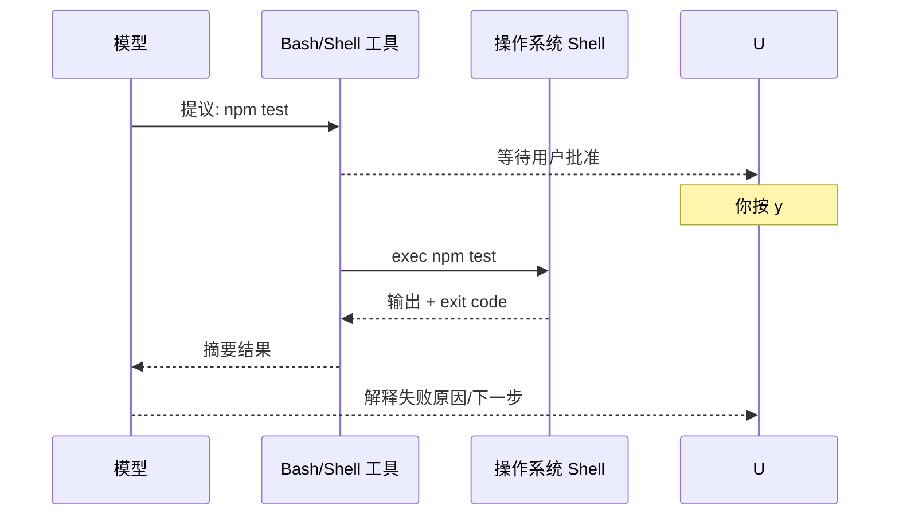
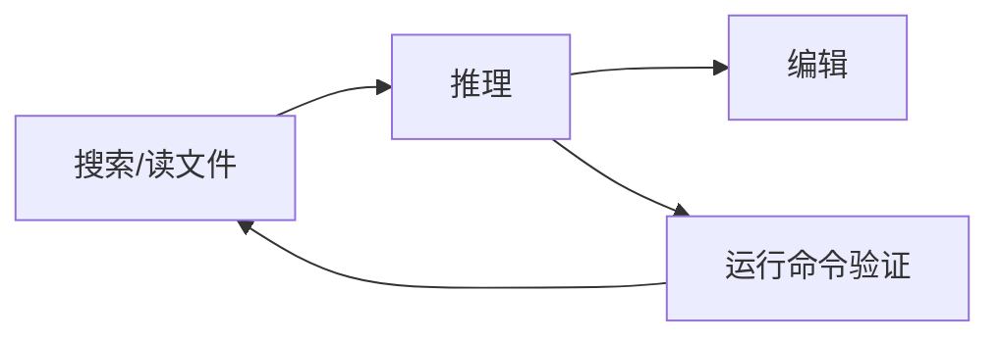

# 2.5 运行命令实操

> **本节目标**：让 Claude Code 提议并（在你批准后）**执行终端命令**；理解 **Bash 类工具**在干什么；建立**命令审批**的安全习惯。  
> **安全提醒**：永远先看完整命令再按 y；涉及 `rm`、`curl | sh`、改系统配置要特别警惕。

---

## 学习目标

- 能说明：为什么执行命令必须经过你确认（默认情况下）。
- 能完成：让代理运行 `npm`、`git`、测试命令，并阅读终端输出摘要。
- 知道：**代理看到的输出**可能截断，必要时自己本地重跑对照。

---

## 生活类比：你是机长，代理是副驾驶

- **副驾驶可以提议**：「建议现在放下起落架（跑测试）」。
- **你推杆才算数**：按 **y** 才是「我授权执行」。
- **恶劣天气要复飞**：命令里有可疑管道、远程脚本、递归删除——**果断 n**。



---

## BashTool / Shell 执行：工作原理（小白版）

实现细节上，Claude Code 使用 **Bun 运行时 + TypeScript** 组织逻辑，并通过工具层把「跑一条 shell 命令」封装成模型可调用的能力。你在 UI 里常看到：

1. **命令预览**：完整或接近完整的字符串。
2. **工作目录**：在哪个文件夹执行（cwd）。
3. **超时/输出限制**：过长输出会被截断展示。

**不必背内部类名**，记住用户侧事实即可：**这是一条会在你机器上真实执行的 shell 命令**。

| 概念 | 人话 |
|------|------|
| 工具调用 | 模型说「我要跑终端」 |
| 审批 gate | 终端前加一道你的 y/n |
| 退出码 | 0 通常成功，非 0 常表示失败（依命令而定） |



---

## 命令审批机制：你应该看什么？

在按 **y** 之前，至少检查：

| 检查项 | 反例（要警惕） |
|--------|----------------|
| 是否是**你认识的**子命令？ | `curl ... \| bash` |
| 路径是否在**你的项目**内？ | `cd / && rm -rf` |
| 会不会改**全局环境**？ | `sudo ...`、`brew install`（视场景） |
| 会不会**上传**代码或密钥？ | 不明 `scp`、`rsync` 到陌生主机 |

**好习惯**：让代理**先解释每条 flag**，你再批准。

---

## 实操示例 1：`npm` 脚本

在已有 `package.json` 的项目里（可让代理先生成一个最小 demo）：

**你说：**

```text
请读取 package.json，列出 scripts 里有哪些命令，并建议一个适合检查代码风格的命令；
若存在则运行它，运行前把完整命令给我看，我批准后再执行。
```

**期望**：出现 `npm run lint` 或类似；你核对后按 y。

---

## 实操示例 2：单元测试

**你说：**

```text
运行测试套件。若失败，根据报错定位到具体测试文件并给出修复建议；修复前先说明打算改哪些行。
```

**期望节奏**：

1. 跑 `npm test` / `pnpm test` / `pytest` 等（以项目为准）。
2. 解析失败日志。
3. 可能回到 **读文件 → 改文件**（见上一节）。

---

## 实操示例 3：`git` 只读命令（为下一节铺垫）

**你说：**

```text
只运行 git 只读命令：git status 和 git log -1 --oneline，不要改任何东西。
```

这练习两件事：**命令审批** + **区分只读与写入**。

---

## 输出截断与「自己再跑一遍」

代理贴给你的终端输出可能是**摘要**。当出现：

- 报错行号对不上；
- 似乎成功但本地仍失败；

请在**自己的终端**原样重跑：

```bash
npm test 2>&1 | tee /tmp/test.log
```

把 `/tmp/test.log` 关键段贴回对话。

---

## 与四种能力的关系

Claude Code 的四类能力里，本节对应 **「运行命令」**，并常与 **「搜索代码」「编辑文件」** 组合：



---

## 常见坑

| 坑 | 说明 |
|----|------|
| 环境不一致 | 代理用的 shell 环境变量可能与你手动终端不同；以文档与实测为准 |
| 交互式命令 | `vim`、密码输入类命令不适合自动化；改要非交互 flag |
| Windows 路径 | WSL 与 CMD 路径差异；统一用一种终端 |

---

## 本节练习清单

- [ ] 批准一次 **npm** 类命令，确认输出被正确解释。
- [ ] **拒绝**一次命令（按 n），观察代理是否换用更安全步骤。
- [ ] 对失败测试做一次「本地重跑 + 贴日志」闭环。

---

## 小结

- **Bash/Shell 工具** = 把 shell 命令接到模型上；**真实执行**发生在你机器上。
- **审批机制**是最后一道防线：**看清再 y**。
- **验证**时信日志、信本地复现，而不只信摘要。

---

## Bash 单行 vs 多行：让代理「展示再执行」

有时代理会拼接长命令，你可要求：

```text
把将要执行的命令用代码块完整展示，换行符保持可读；
我回复「批准」后你再请求执行。
```

这能减少「一行里藏十个管道」的误按 y。

---

## 环境变量与命令行为

| 变量族 | 可能影响 |
|--------|----------|
| `PATH` | 找到的是哪个 `node`/`python` |
| `NODE_ENV` | 依赖是否走 dev/prod 分支 |
| `HTTP(S)_PROXY` | 企业网络下 API 与包下载 |

若「我手动终端可以、代理不行」，第一件事：**对比 `env` 输出**（注意脱敏）。

---

## 非交互标志速查（减少卡住）

| 工具 | 常见非交互 flag（示例） |
|------|---------------------------|
| npm | `npm ci`、`--yes`（视子命令） |
| apt | `-y` |
| npx | `--yes` |

**原则**：自动化时尽量避免 `vim`、`less` 内分页停留。

---

## 实操示例 4：失败命令的「分层诊断」

**你说：**

```text
上次 bash 命令退出码非 0。请按顺序：
1) 复述命令与工作目录
2) 解释 stderr 关键行
3) 给出两条修复路径：保守与激进
不要自动重试，等我选择。
```

这训练你把代理当**参谋**，而不是自动驾驶。

---

## 与 Bun 运行时（实现侧）的一句话关系

Claude Code 自身常用 **Bun** 等现代运行时开发与分发；你在本机执行的 **npm 包装 CLI** 后，内部如何启动属于实现细节。**省钱与稳定**仍取决于：少跑无意义命令、先看再 y。

---

## 本节命令审批「红名单」（建议直接 n）

| 模式 | 示例特征 |
|------|----------|
| 远程管道安装 | `curl ... \| sh`、`wget -O- ... \| bash` |
| 递归删除 | `rm -rf /`、`rm -rf /*`、删上级目录 |
| 乱配 sudo | 不明目的的 `sudo tee /etc/...` |
| 乱改远程 | `git push --force`（见 Git 专章） |

---

## 练习记录表

| 日期 | 批准的命令 | 退出码 | 事后评价（值/不值） |
|------|------------|--------|----------------------|
|  |  |  |  |

上一章：[2.4 编辑文件 ←](./04-edit-files.md) · 下一章：[2.6 Git 工作流 →](./06-git-workflow.md)
