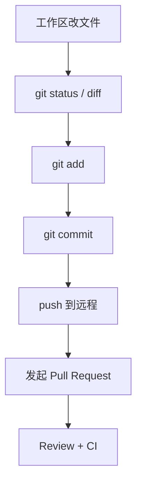
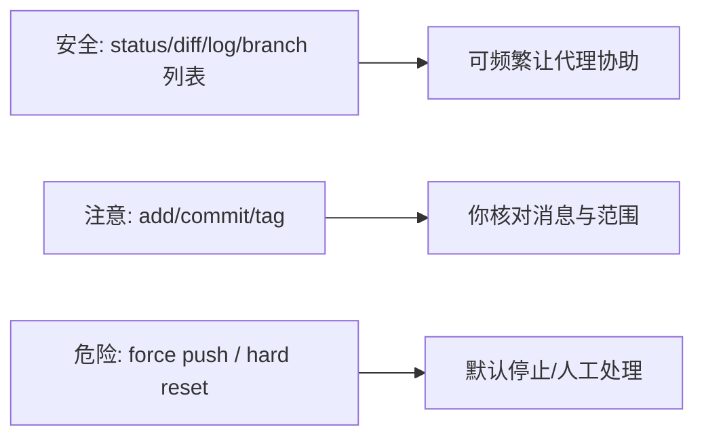
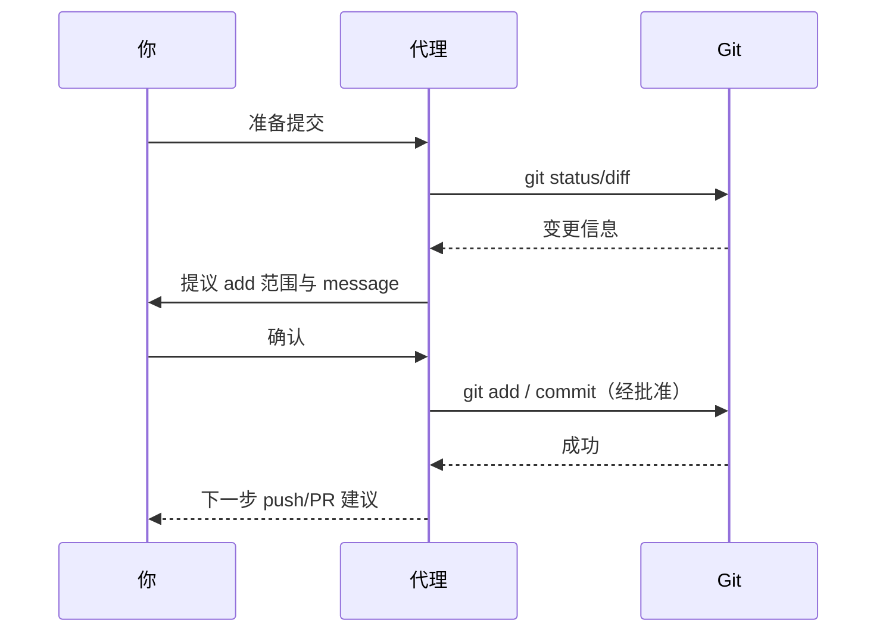
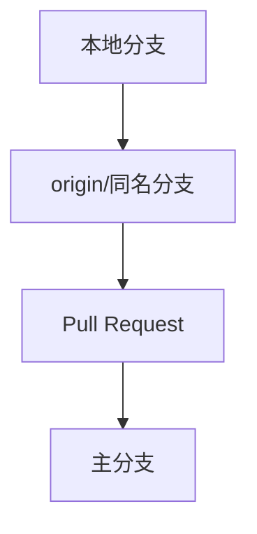

# 2.6 Git 工作流

> **本节目标**：让 Claude Code 协助 **status / diff / commit / 分支 / PR 草稿**；理解 **Git 安全协议**：哪些操作默认应拒绝或必须人工复核。  
> **安全提醒**：永远不要让代理在未经你理解的情况下执行 **改写历史的危险命令**。

---

## 学习目标

- 能区分：**只读 git 命令** vs **写入历史/远程** 的命令。
- 能完成：一次由代理辅助的 **add + commit**（信息清晰）。
- 能背熟两条红线：**不随意 `push --force`**、**不随意 `reset --hard`**。

---

## 生活类比：Git 是「时光机 + 交接班日志」

- **`git status`**：看看桌上文件谁动过。
- **`git diff`**：具体改了哪几行。
- **`commit`**：写一条**交接说明**，以后自己能看懂。
- **PR（Pull Request）**：请同事/CI 评审的「正式申请」。

代理适合帮你**起草说明、整理改动、跑检查**；**是否合并、是否强推**，必须是你或团队的决策。



---

## Git 安全协议（本指南的默认约定）

下列命令在**新手与多数团队场景**下应**极其谨慎**或由**人工单独执行**：

| 命令族 | 风险 | 本指南态度 |
|--------|------|------------|
| `git push --force` / `-f` | 覆盖远程历史，可能删掉同事提交 | **默认不要**让代理做；确需时由你亲自执行并确认 |
| `git reset --hard` | 丢弃本地未提交/未保护改动 | **默认不要**；先备份或 `stash` |
| `git clean -fd` | 删除未跟踪文件 | 高风险；先看 `git clean -n` |
| 改写历史的 rebase + push | 协作冲突、误丢记录 | 仅在你理解影响时 |



**一句话**：代理可以是「秘书」，但**签字的必须是你**。

---

## 实操示例 1：从改动到提交

前置：在练习仓库里让代理改过文件（见 2.4）。

**你说：**

```text
执行 git status 和 git diff --stat，总结改了哪些文件；
然后写一个符合 Conventional Commits 的 commit message 草稿（中文说明即可），
我确认后你再给出 git add 与 git commit 的具体命令——我批准后再运行。
```

**你检查**：

- `git diff` 是否包含**意外文件**（如 `.env`）？
- commit message 是否**准确**？

---

## 实操示例 2：分支与功能开发（轻量流程）

**你说：**

```text
基于当前 main 创建分支 feature/greet-readme，切换过去，
把 README 里加一行「由 Claude Code 练习生成」，然后提交。
不要 push。
```

**期望**：出现 `git checkout -b` 或 `git switch -c`（依 Git 版本）。

---

## 实操示例 3：PR 描述草稿

当你已 push 分支（**由你决定何时 push**）后：

**你说：**

```text
根据本次分支相对 main 的 diff，写一份 PR 描述：包含背景、改动点、测试说明、风险；
用 Markdown 输出，我复制到 GitHub/GitLab。
```

代理通常**不需要**写权限即可完成（纯文本）；若它提议跑 `gh pr create`，同样要走 **命令审批**。

---

## 与「协调工作流」能力的关系

四类能力中的 **协调工作流**，在 Git 场景体现为：

1. 读差异 → 2. 跑测试 → 3. 修失败 → 4. 再 diff → 5. 提交说明  
这是一串**有顺序的多步任务**，代理擅长串联，但**每一步仍要你把关关键闸门**。



---

## `.gitignore` 与密钥（必读习惯）

在让代理「顺手提交」前，确认：

- `.env`、`*_key.pem`、令牌文件已在 **.gitignore**。
- 若代理提议 `git add .`，**先看列表**再 y。

---

## 团队协作时的额外规则

| 场景 | 建议 |
|------|------|
| 公司预提交钩子 | 代理跑命令可能触发 husky；失败时把钩子日志贴回对话 |
| 主分支保护 | 不能直接 push main 时，一律走 PR |
| fork 工作流 | 先确认 remote 名称与上游 |

---

## 故障排查

| 问题 | 方向 |
|------|------|
| 提交包含大文件 | 用 `git reset`（soft）撤回提交索引；改 .gitignore；必要时 git rm --cached |
| 合并冲突 | 先 `git status`，人工打开冲突文件；代理可协助读冲突块 |
| 身份未配置 | 配置 `user.name` / `user.email`（一次性） |

---

## 本节练习清单

- [ ] 完成一次 **add + commit**，message 由代理起草、你改过再提交。
- [ ] 明确拒绝一次 **force push** 类提议（若代理误提）。
- [ ] 生成一份 **PR 描述 Markdown** 并保存为团队模板雏形。

---

## 小结

- Git 协作里，代理擅长 **草稿与自动化命令串联**；你负责 **范围、历史安全、远程策略**。
- **安全协议**：默认远离 **`push --force`** 与 **`reset --hard`**。
- 提交前永远 **status + diff**，密钥不进仓。

---

## `git add -p` 与代理协作（进阶但实用）

当你只想提交**一部分改动**时，可以要求：

```text
不要 git add .，请教我使用 git add -p 交互式挑选；
若环境不允许交互，请给出等价方案（例如拆分文件或手动备份后还原）。
```

这能显著降低「把调试垃圾文件一并提交」的概率。

---

## 提交信息模板（Conventional Commits 中文混合版）

| 字段 | 示例 |
|------|------|
| type | `feat` / `fix` / `docs` / `chore` |
| scope | `web`、`api` |
| subject | `修复登录态过期未刷新` |

**整行示例**：`fix(web): 处理 token 过期后的静默登出`

让代理按此模板生成时，加上：**「subject 不超过 50 字」**。

---

## 远程与分支：先画图再动手



**口语指令**：

```text
请用 ASCII 或 Mermaid 画出当前分支相对 main 的关系，
并说明如果要开 PR 还需要哪些 git 命令（不要执行）。
```

---

## 与「6 种权限模式」的交叉点

Git 写入（commit、checkout）往往触发**写工作区**或**改 .git** 相关操作；在较严权限下会多次询问。  
**建议**：练习阶段保持严格；熟练后可在**可信仓库路径**适度放宽，但**永远不要对全局 `~` 目录放权**。

---

## 团队协作话术（复制给同事）

```text
我们约定：Claude Code 可以协助 git status/diff/commit message，
但任何 --force、--hard、历史改写类命令必须人工在本机执行。
PR 描述可由 AI 起草，但责任人必须通读 diff。
```

---

## 故障案例簿（填空用）

| 现象 | 当时执行的命令 | 根因 | 正确姿势 |
|------|------------------|------|----------|
| 提交巨大二进制 |  |  |  |
| 把 .env 提交上去 |  |  |  |

上一章：[2.5 运行命令 ←](./05-run-commands.md) · 下一章：[2.7 命令速查表 →](./07-cheatsheet.md)
