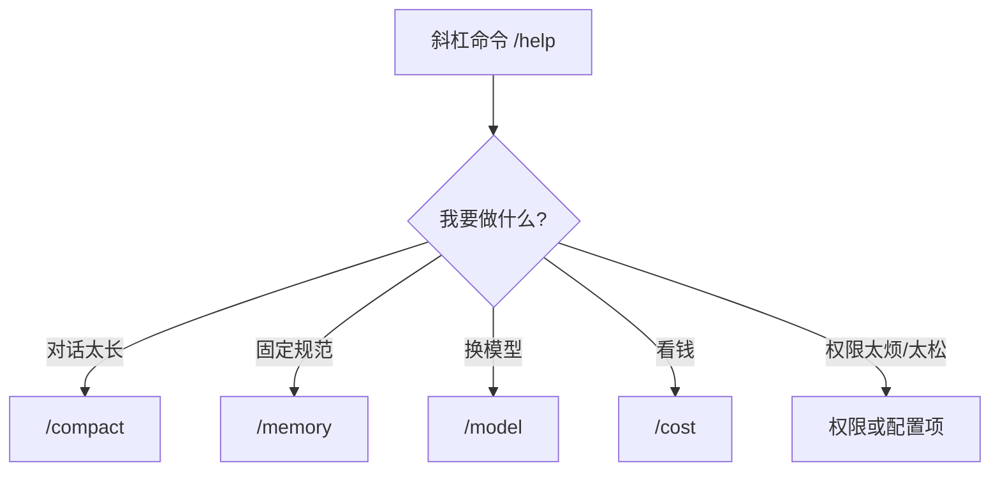
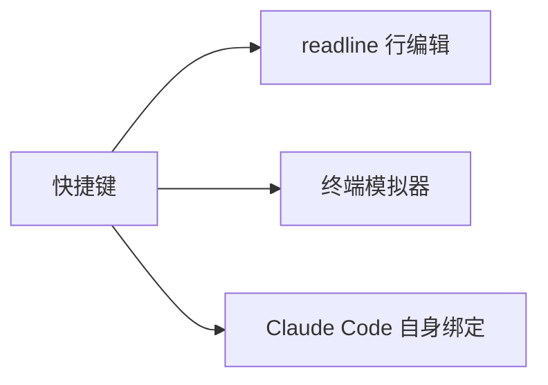
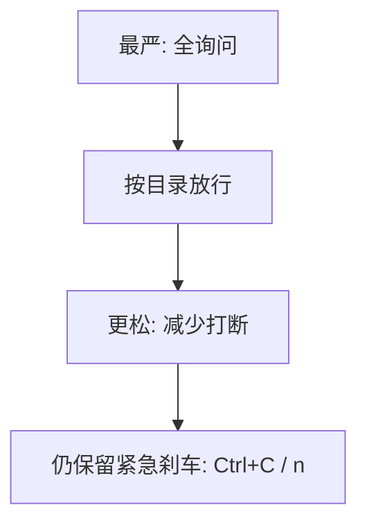
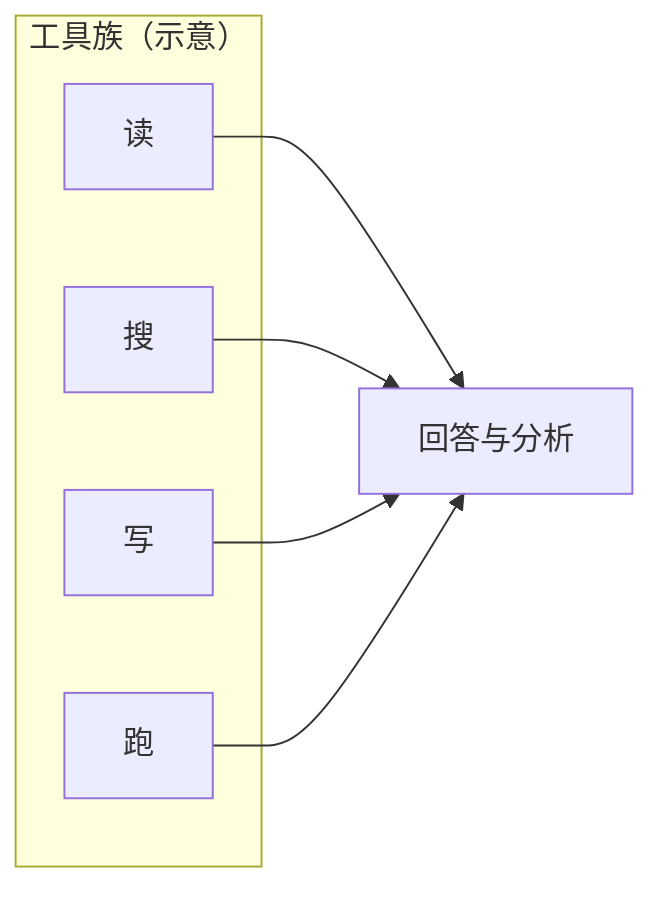

# 2.7 命令速查表

> **本节目标**：一页收藏 **斜杠命令**、**常用自然语言指令**、**快捷键**与**配置入口**。  
> **说明**：Claude Code 持续迭代，个别命令名以你本机 `/help` 为准；下表覆盖**入门最常用的语义**。

---

## 学习目标

- 能快速打开 `/help` 并定位所需子命令。
- 知道 **`/compact`**、**`/memory`**、**`/model`**、**`/cost`** 分别在什么场景用。
- 能把自然语言指令写成「目标 + 约束 + 验收标准」三段式。

---

## 斜杠命令总览（大表）

下列命令为**教学整理版**；若与当前版本不一致，以终端内 **`/help`** 输出为准。

| 命令 | 典型作用 | 小白什么时候用 |
|------|----------|----------------|
| `/help` | 显示内置帮助 | 忘了有哪些斜杠命令时**第一站** |
| `/compact` | 压缩/整理上下文 | 对话很长、开始变慢或答非所问时 |
| `/clear` | 清空屏幕或会话上下文（依版本） | 想「换话题从零开始」 |
| `/memory` | 管理长期记忆相关项（依版本） | 想固定团队规范、个人偏好 |
| `/model` | 切换或查看模型 | 要在 **Opus / Sonnet** 等与成本、速度间权衡 |
| `/cost` | 查看费用/用量线索（依版本） | 心里没底时看一眼「烧钱节奏」 |
| `/permissions` 或类似 | 权限模式相关（名称以 help 为准） | 调整 **工具审批** 的严格程度 |
| `/init` / `/doctor` 类 | 初始化、诊断环境（若有） | 安装异常、连不上 API 时 |
| `/resume` 类 | 恢复会话（若有） | 断线后继续刚才的上下文 |
| `/export` 类 | 导出对话（若有） | 需要留档复盘 |



---

## 常用自然语言指令模板

把指令想成 **「目标 + 约束 + 验收」**，代理更少跑偏。

| 场景 | 模板示例 |
|------|----------|
| 只读分析 | 「只阅读 `src/a.ts`，解释 `foo` 函数做什么，**不要修改任何文件**。」 |
| 小步改代码 | 「在 `utils/date.ts` 增加 `formatIso(d: Date)`，**补单测**，改完 **跑测试**。」 |
| 修 bug | 「复现步骤：… 当前报错：… 请先 **定位文件与行号**，再给出 **最小修复**。」 |
| 重构 | 「把 `legacy.js` 里重复逻辑抽到 `helpers`，**行为不变**，用测试证明。」 |
| Git | 「`git status` 里这些改动，帮我写 **commit message**，**不要 push**。」 |
| 省钱 | 「回答尽量短；若需长文先列提纲；**不要随便读整个 node_modules**。」 |

**生活类比**：你对快递员说「放门口鞋柜上、别按门铃」——**约束越清楚，事故越少**。

---

## 键盘快捷键（通用习惯 + 终端注意）

终端应用快捷键因系统与终端模拟器而异，下表为**常见约定**；若无效请查本机终端设置。

| 操作 | macOS 常见 | Windows/Linux 常见 |
|------|------------|---------------------|
| 中断当前任务 | `Ctrl + C` | `Ctrl + C` |
| 清屏 | `Cmd + K` 或 `Ctrl + L` | `Ctrl + L` |
| 粘贴 | `Cmd + V` | `Ctrl + Shift + V` 或右键 |
| 搜索滚动缓冲区 | `Cmd + F` | `Ctrl + Shift + F`（视终端而定） |
| 光标到行首/尾 | `Ctrl + A` / `Ctrl + E` | 同左（readline） |



> **提示**：Claude Code 基于 **React Ink** 等终端 UI 技术，部分快捷键可能与 shell **抢焦点**；冲突时以官方文档为准。

---

## 配置选项与环境变量（速查）

以下为**入门最常遇到**的配置入口；完整列表以官方 README / 文档为准。

| 类型 | 名称/示例 | 作用 |
|------|-----------|------|
| 环境变量 | `ANTHROPIC_API_KEY` | API 鉴权 |
| 环境变量 | `ANTHROPIC_BASE_URL`（若适用） | 自定义 API 端点（企业网关等） |
| 项目文件 | `CLAUDE.md` | 给代理的**固定说明**：技术栈、命令、禁忌 |
| 忽略文件 | `.gitignore` | 避免把密钥与构建产物提交 |
| 权限相关 | 依版本的 settings / config | 控制工具自动批准范围 |

**`CLAUDE.md` 最小示例：**

```markdown
# 项目说明
- 包管理: pnpm
- 测试: pnpm test
- 禁止: 不要执行 rm -rf / 与任何 force push
- 风格: TypeScript strict，优先函数式小组件
```

---

## 与「6 种权限模式」相关的使用口诀

权限模式名称以你版本为准，可从 **`/help`** 或设置中查看。入门可记：

| 态度 | 行为 |
|------|------|
| 练习期 | **能多问就多问**；所有写盘与 bash 都手动 y |
| 日常开发 | 信任子目录（如 `src/`），敏感路径仍询问 |
| 高危目录 | `.env`、`~/.ssh`、系统目录 — **永远警惕** |



---

## 自然语言 → 工具链 对照（概念）

| 你说的话 | 代理可能做的事 |
|----------|----------------|
| 「看看这个报错」 | 读日志文件 / 读相关源码 |
| 「跑一下测试」 | Bash：`npm test` 等 |
| 「搜一下谁调用了 X」 | 代码搜索工具 |
| 「提交一下」 | git 命令序列（需你审） |

---

## 调试对话的三句「咒语」

1. 「**先复述**你理解的任务，再动手。」  
2. 「**每一步**只做一件事，做完停顿等我确认。」  
3. 「若需要权限，**先解释**为什么需要。」

---

## 本节自测

- [ ] 在会话里输入 `/help`，截图或复制保存到笔记。
- [ ] 故意发一个很长的对话后试 `/compact`（若有），观察前后差异。
- [ ] 写好自己的 **`CLAUDE.md`** 骨架并放入真实项目。

---

## 小结

- **斜杠命令**是终端里的「快捷菜单」：`/help` 为根。
- **自然语言**写清楚 **目标 / 约束 / 验收**，代理更稳。
- **配置**优先 **`CLAUDE.md` + 环境变量**，与 **权限模式** 搭配使用。

---

## 按场景查表：我该说什么？

| 我想… | 一条指令示例 |
|------|----------------|
| 只看不动手 | 「只读分析，不要写文件不要跑命令」 |
| 小步迭代 | 「每次只改一个文件，改完等我确认」 |
| 加速写测试 | 「为 `src/foo.ts` 写 vitest 用例，覆盖边界」 |
| 国际化 | 「把界面文案抽到 `locales/zh.json`，不要改业务逻辑」 |
| 性能 | 「先 profile 再优化，禁止过早微优化」 |

---

## 与内置「约 42 工具」的映射（概念级）

不必背诵工具 ID，可按**动词**记忆：

| 动词 | 你常下的口令 |
|------|----------------|
| 读 | 「读取 `...` 前 80 行」 |
| 搜 | 「全仓搜 `deprecatedX` 的引用」 |
| 写 | 「新建 `...`」「把第 N 段替换为 …」 |
| 跑 | 「在非交互方式跑 `pnpm test`」 |
| 协调 | 「列出任务清单再逐项执行」 |



---

## 退出、挂起与会话生命周期

| 动作 | 常见操作 |
|------|----------|
| 结束当前程序 | `exit` 或 `Ctrl+C`（注意是否中断正在跑的命令） |
| 暂时离开 | 关闭终端标签前确认**无长任务** |
| 续聊 | 若版本支持 resume，按 `/help` 查找对应命令 |

---

## 「反模式」口令合集（少踩坑）

| 反模式 | 为什么不好 |
|--------|------------|
| 「你随便改」 | 范围无限 → Token 与风险双高 |
| 「读整个项目」 | 上下文爆炸 → 又贵又慢 |
| 「帮我执行网上脚本」 | 供应链风险 |
| 「不用测试」 | 回归不可见 |

---

## 备份：纯文本速记卡

```text
/help          → 帮助根入口
/compact       → 压缩上下文
/memory        → 记忆与偏好（依版本）
/model         → 模型切换
/cost          → 费用线索（依版本）
Ctrl+C         → 中断
CLAUDE.md      → 项目固定说明
先 y 前三问    → 路径? 敏感? 可回滚?
```

---

## 版本漂移时的自检清单

- [ ] 运行 `/help`，与本页表格逐条对照**是否改名或新增**。
- [ ] 记录你当前 `claude --version` 在笔记顶部。
- [ ] 重大升级后**重读官方 Release Notes** 一段。

上一章：[2.6 Git 工作流 ←](./06-git-workflow.md) · 下一章：[2.8 费用与省钱 →](./08-cost-tips.md)
