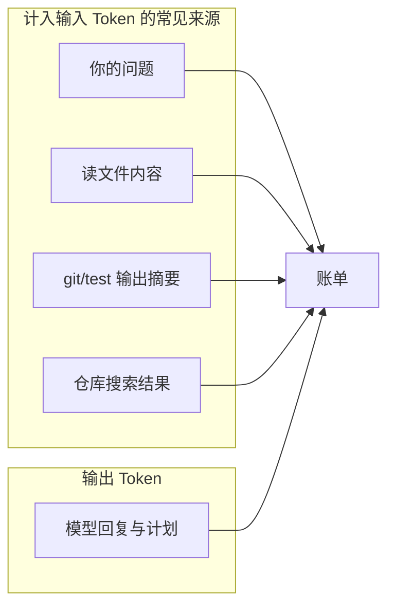
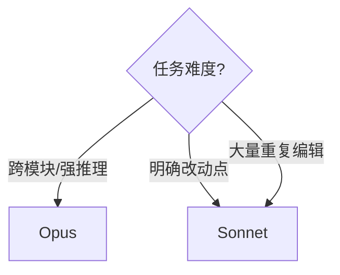
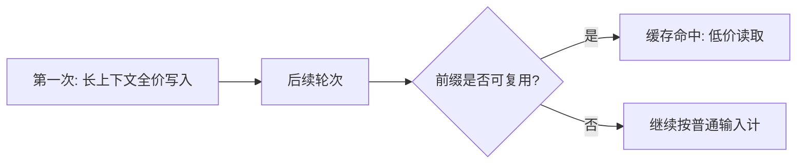
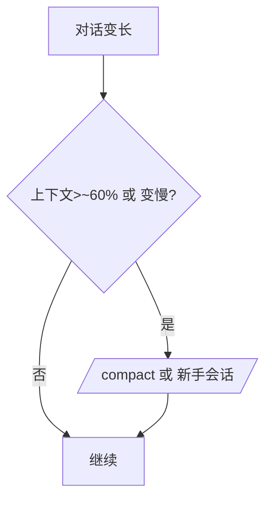
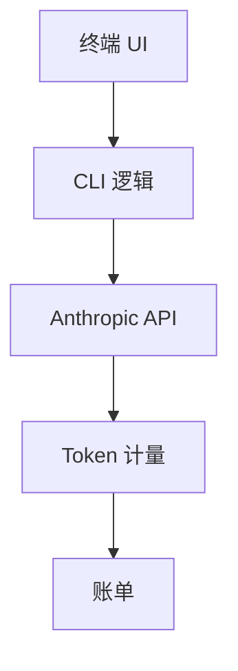
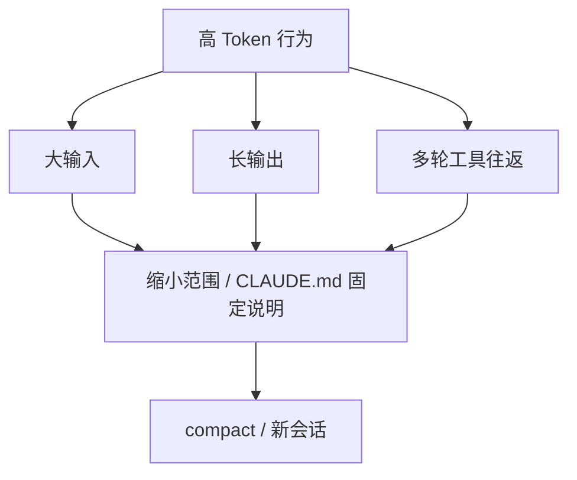

# 2.8 费用与省钱技巧

> **本节目标**：理解 **Anthropic API 按 Token 计费**；知道 **Opus / Sonnet** 大致价差与适用场景；掌握 **缓存、/compact、CLAUDE.md、模型选择** 等降本习惯。  
> **声明**：单价与套餐以 [Anthropic 官方定价页](https://www.anthropic.com/pricing) 为准；下文 **美元区间** 为社区常见经验量级，用于建立直觉，**非财务承诺**。

---

## 学习目标

- 能解释：**输入 Token** 与 **输出 Token** 为何都计费。
- 能说明：**提示缓存（prompt caching）** 为何可能显著省钱。
- 能执行：`/compact`、手动压缩长对话、用 `CLAUDE.md` 固定重复信息。
- 能根据任务选 **合适模型**：笨重任务用强模型，机械活用最便宜够用的。

---

## Token 计费原理（小白版）

把 Token 粗想成「**模型读写的词块**」：英文常 1 词≈若干 token，中文通常 **字数越多 token 越多**。

| 项目 | 人话 |
|------|------|
| 输入 Token | 你发的指令 + 代理读的文件 + 工具返回的内容，**进入模型窗口**都算 |
| 输出 Token | 模型生成给你的文字、计划、代码块 |
| 计费 | 一般 **输入价 ≠ 输出价**；总价 = 各段用量 × 单价 |



**生活类比**：Token 像**通话分钟**——不只听你说话，**对方复述整本说明书**也会狂烧分钟。

---

## Opus 与 Sonnet：怎么选？（对比表）

具体名称以控制台为准；以下为**能力 vs 成本**的通用对比框架。

| 维度 | Opus 系（更强） | Sonnet 系（均衡/更快） |
|------|----------------|------------------------|
| 复杂推理 | 通常更强 | 足够应对多数日常开发 |
| 速度 | 往往更慢 | 往往更快 |
| 单价 | 更高 | 相对较低 |
| 适合任务 | 架构设计、疑难 bug、跨模块重构 | 改接口、写测试、文档、脚手架 |

**口诀**：**越「想破头」的活越值得 Opus；越「有套路」的活越适合 Sonnet。**



---

## 缓存：为什么能省很多钱？

**提示缓存（Prompt Caching）** 的大意是：把**重复出现的长上下文**（例如固定系统说明、反复附带的 `CLAUDE.md`、稳定的大段代码）标记为可缓存后，后续请求**重读这些部分**时按 **缓存读取价** 计费，而非全价输入。

| 场景 | 无缓存 | 有缓存（直觉） |
|------|--------|----------------|
| 长会话反复带同一份「项目宪法」 | 每次都按普通输入全价算 | 大块只付**缓存命中**的低价 |
| 典型体感（社区经验） | 重度 Opus 会话 **约 $50–100**（无缓存、长上下文） | **约 $10–19**（有缓存、相似前缀多） |

官方常给出 **缓存读取** 远低于普通输入的单价；教学中可记一个数量级：**缓存读取约 $0.50 / 百万 Token** 这一档（以官网为准）。

> **注意**：能否命中缓存、如何组织前缀，依赖 **API 与客户端实现**；Claude Code 用户侧重点是：**减少无意义重复、把稳定内容放固定文件**。



---

## `/compact`：对话太长就「收成摘要」

当上下文膨胀时，模型「看得见」的窗口里塞满旧对话，**既贵又容易糊涂**。

| 做法 | 作用 |
|------|------|
| `/compact`（若版本支持） | 把冗长历史 **压缩成较短摘要** 再继续 |
| 新开会话 + 粘贴「当前状态」 | 人工做极简 handoff |

**与 60% 规则**：社区经验是 **上下文用到约 60%** 时，主动压缩或拆会话，**性价比与准确率**更稳（非严格科学阈值，当作习惯）。



---

## `CLAUDE.md`：把「每次都要交代的话」写一次

重复说明技术栈、命令、目录结构 = **每轮都在烧同样的输入 Token**。

**推荐固定写清：**

- 包管理器与安装命令（`pnpm i` / `npm ci`）
- 测试命令
- 目录约定（`apps/web`、`packages/core`）
- **安全红线**（禁止的操作）

示例片段：

```markdown
# Claude 项目说明
- 安装: pnpm install
- 测试: pnpm test
- 主应用在 apps/web
- 不要读取或上传 .env
```

---

## 省钱技巧清单（可打印）

| 技巧 | 预期收益 |
|------|----------|
| 稳定前缀放 `CLAUDE.md` | 少重复、易触发缓存友好结构 |
| 长对话用 `/compact` | 降输入长度、减糊涂回复 |
| ~60% 上下文时主动压缩/拆会话 | 控制单价与质量 |
| 简单任务选 Sonnet | 直接降单位成本 |
| 让模型「先给计划再动手」 | 减少无效工具往返 |
| 避免「全文搜索整个大仓」式指令 | 缩小读文件范围 |
| 本地先 `git diff` / 小范围贴代码 | 减少整文件反复读取 |

---

## 费用直觉区间（再次强调：非承诺）

以下为 **教学用区间**，帮助你判断「会不会很贵」：

| 场景 | 经验区间（美元，粗略） |
|------|------------------------|
| 无缓存、长会话、强模型 Opus | **约 $50–100** |
| 有缓存、重复前缀多、合理压缩 | **约 $10–19** |
| 缓存读取单价量级 | 约 **$0.50 / 百万 Token**（读缓存段；以官网为准） |

**务必**：以控制台 **用量与账单** 为准，定期 `/cost` 或到网页后台核对。

---

## 与 Claude Code 技术栈的间接关系

Claude Code 使用 **Bun + TypeScript + React Ink** 等实现终端体验；**计费不发生在 Bun 层**，而是 **调用 Anthropic API 时按 Token** 结算。性能优化（更快 UI）改善体验，但**省钱核心仍在 Token 策略**。



---

## 本节自测

- [ ] 用自己的话向同事解释「输入 Token 从哪来」。
- [ ] 写一份 **`CLAUDE.md`**，列出三条以上稳定信息。
- [ ] 在长对话中试一次 **`/compact`**（若可用），记录前后体感。
- [ ] 打开官方定价页，记下 **当前** Sonnet/Opus 的输入输出单价。

---

## 小结

- **Token** = 计费的「字数/词块」；**工具返回的大段文本**也会推高输入。
- **缓存 + 压缩 + CLAUDE.md** 是三板斧：**少重复、短上下文、固定前缀**。
- **模型选择**是直接的杠杆：**难活强模型，套路活省着用**。

---

## 账单异常排查（从便宜到费事）

| 步骤 | 做什么 |
|------|--------|
| 1 | 在控制台看 **按模型/按天** 聚合是否突增 |
| 2 | 回忆是否 **反复粘贴超大日志** |
| 3 | 检查是否 **无压缩长会话** 连跑数小时 |
| 4 | 搜索仓库是否有人 **提交了 API Key**（立即轮换密钥） |

---

## 与「四种能力」相关的计费热点

| 能力 | 容易烧 Token 的行为 | 省钱替代 |
|------|----------------------|----------|
| 编辑文件 | 反复整文件读写 | 指定行区间；先 `git diff` 贴片段 |
| 运行命令 | 超大 stdout 全进上下文 | 管道到文件，只贴摘要 |
| 搜索代码 | 太宽的关键词 | 缩小目录；先用 `rg` 本地粗搜 |
| 协调工作流 | 一步失败仍疯狂重试 | 要求「失败即停，给两条假设」 |



---

## 会话预算制（给团队或个人）

| 角色 | 建议 |
|------|------|
| 个人学习 | 每日设心理上限；用 `/cost` 或控制台对照 |
| 团队 Lead | 强模型仅开给**攻坚频道**；日常 Sonnet |
| 公司财务 | 走**组织账单 + 项目标签**（若产品支持） |

---

## 延伸阅读：官方与社区

- 定价以 **Anthropic 官网** 为准；本文区间仅供**数量级**感受。
- 社区中的「省钱技巧」需二次验证：**安全**（不泄露代码）与**合规**（公司政策）。

---

## 空白模板：我的省钱规则（请填写）

```markdown
- 默认模型: ________
- 何时升级到强模型: ________
- 上下文超过 ____% 必 compact/新开会话
- 禁止代理读取: ________ 目录
- 每月预算心理线: ________ 元/美元
```

上一章：[2.7 命令速查表 ←](./07-cheatsheet.md) · 返回：[2.1 总览 ←](./index.md)
