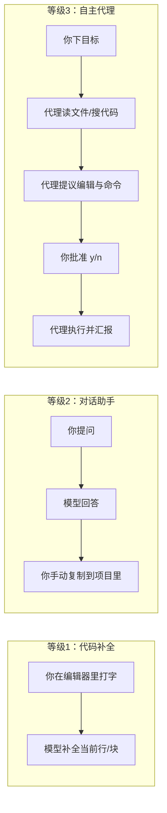
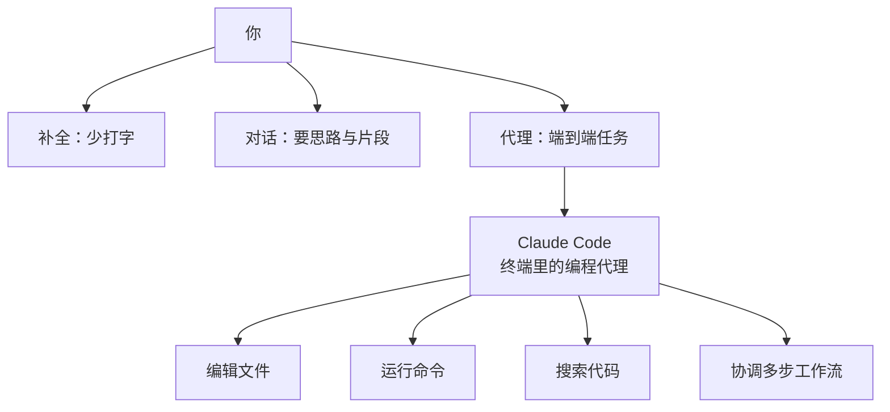

# 第2篇：小白快速上手 · 总览

> **本篇定位**：零基础读者从「听说过 AI 写代码」到「能在终端里用 Claude Code 干活」的入门路径。  
> **前置知识**：会用电脑、能打开终端（命令行）、愿意复制粘贴命令。

---

## 本篇学习目标

完成第2篇后，你应该能够：

1. **说清楚**：AI 编程助手分哪三档，Claude Code 属于哪一档、和 Cursor 等工具有何不同。
2. **装得上**：在 macOS / Linux / Windows 上安装 Claude Code，并配置 API 密钥。
3. **聊得动**：启动 `claude`，完成第一次对话，看懂终端里的输入输出。
4. **改得了**：让代理读取、创建、修改文件，并理解 `y/n` 权限提示在保护什么。
5. **跑得通**：批准或拒绝 Bash 命令，知道测试、`npm`、`git` 等常见用法。
6. **管得好 Git**：在安全前提下让代理协助提交、分支与 PR，避开危险操作。
7. **查得快**：会用斜杠命令与速查表，并了解费用与省钱习惯。

---

## 2.1 什么是 AI 编程助手？

### 一句话定义

**AI 编程助手**是用大语言模型帮你理解代码、改代码、跑命令的一类工具。差别在于：**它只能「给建议」**，还是**能「动手改文件、跑终端」**。

### 生活类比：装修房子的三种方式

想象你要装修一套房子：

| 方式 | 像什么 | 你能得到什么 |
|------|--------|----------------|
| **代码补全** | 师傅站在旁边，你砌墙时他递砖、递水泥 | 你仍是一砖一瓦自己干，只是少打字、少查文档 |
| **对话助手** | 你打电话问设计师：「客厅怎么配色？」他口述方案 | 方案很详细，但**锤子还在你手里**，你得自己买材料、自己施工 |
| **自主代理（Agent）** | 你雇一个**工长**：你说「把厨房改成开放式」，他拆墙、走水电、对接橱柜——**每步关键动作会请你签字** | 你管目标和验收，**执行链条由代理串联** |

**Claude Code** 就是第三种里的「终端工长」：**在命令行里运行**，能读项目、改文件、跑 `npm`/`git`/测试，并通过权限提示让你把关。



---

### 三等级技术对比（从「补全」到「代理」）

| 维度 | 代码补全（如 Copilot 行内） | 对话助手（如 ChatGPT 网页） | 自主代理（如 Claude Code） |
|------|---------------------------|---------------------------|---------------------------|
| **主要界面** | 编辑器内联 | 聊天窗口 | **终端 + 文本界面（如 React Ink）** |
| **是否改你磁盘上的文件** | 通常只插入光标处 | 不直接改，除非你复制粘贴 | **可直接编辑工作区文件** |
| **是否跑终端命令** | 一般不跑 | 一般不跑（或需插件） | **可提议并执行（需你批准）** |
| **上下文** | 当前文件/邻近文件 | 你粘贴的内容 + 对话 | **整仓搜索、多文件、工具链** |
| **适合场景** | 快写函数、补样板 | 问概念、要小段代码 | **多步骤需求：重构、修 bug、跑测试** |



---

### Claude Code 的核心画像（与本篇后文呼应）

- **形态**：终端里的 **AI 编程代理**，不是浏览器插件为主。
- **四类能力**：**编辑文件**、**运行命令**、**搜索代码**、**协调工作流**（多步任务拆成读→改→测→提交）。
- **技术栈（实现侧）**：以 **Bun** 为运行时、**TypeScript** 编写、**React Ink** 做终端 UI（你看到的是字符界面，背后是成熟组件模型）。
- **工具与权限**：内置约 **42 个工具**、多种**权限模式**（后文安装与实操会反复遇到「是否允许读/写/执行」）。
- **计费**：走 **Anthropic API**，按 **Token** 计费；具体区间见 `08-cost-tips.md`。

---

### Claude Code 与 Cursor / Copilot Agent / Windsurf 对比

> 说明：各产品迭代快，下表侧重**入门读者该理解的差异维度**，而非某一版本的精确功能清单。

| 对比项 | Claude Code | Cursor | GitHub Copilot（含 Agent 向能力） | Windsurf |
|--------|-------------|--------|-----------------------------------|----------|
| **主战场** | 终端 | 编辑器深度集成 | 编辑器 + GitHub 生态 | 编辑器 + 流程化 Agent |
| **和你日常写代码的位置** | 另开一个终端会话，与 IDE 并行 | 几乎「长在 VS Code 系里」 | 在支持的 IDE 里 | 在支持的 IDE 里 |
| **改文件方式** | 工具调用写入工作区 | 多光标/Composer 等 | 依模式与版本而定 | 流式编辑与任务流 |
| **跑命令** | 强项：Bash 工具链 + 审批 | 有终端集成，体验因版本而异 | 依环境与扩展而定 | 常与工作流绑定 |
| **适合谁** | 习惯终端、希望代理**完整操作仓库**的人 | 希望**少切窗口**、编辑器即中枢的人 | 已在 GitHub/Microsoft 栈里的人 | 喜欢「任务流」编辑器体验的人 |

**选型口诀**：

- 你已经 **IDE 不离手**：Cursor / Windsurf 可能更「顺手」。
- 你希望 **SSH 到服务器、纯终端环境、CI 旁路调试**：Claude Code 很合拍。
- 你公司 **强制 GitHub Copilot**：可把它当「补全 + 部分代理」，与 Claude Code 是否并存取决于团队政策与预算。

---

### 本节小结

- AI 编程助手不是单一物种：从**补全**、**对话**到**代理**，自主程度递增。
- **Claude Code = 终端里的自主代理**，强项是**文件 + 命令 + 搜索 + 多步工作流**，用权限 gate 保证你不失控。
- 与 Cursor 等相比：**战场在终端**，适合愿意把「工长」放在 shell 里的开发者。

---

## 本篇章节导航

| 章节 | 文件 | 内容提要 |
|------|------|----------|
| 2.1 | 本文 | AI 助手三等级、产品对比、装修类比 |
| 2.2 | [02-installation.md](./02-installation.md) | 安装与 API 密钥 |
| 2.3 | [03-first-chat.md](./03-first-chat.md) | 第一次对话 |
| 2.4 | [04-edit-files.md](./04-edit-files.md) | 编辑文件与权限 |
| 2.5 | [05-run-commands.md](./05-run-commands.md) | 运行命令与审批 |
| 2.6 | [06-git-workflow.md](./06-git-workflow.md) | Git 与安全边界 |
| 2.7 | [07-cheatsheet.md](./07-cheatsheet.md) | 斜杠命令与快捷键 |
| 2.8 | [08-cost-tips.md](./08-cost-tips.md) | Token 计费与省钱 |

---

## 延伸阅读（概念备忘）

```text
# 你在后文会反复看到的词
Token      — API 计费的文本单位（可粗理解为「词块」）
工具 Tool   — 模型调用的能力：读文件、写文件、执行 bash 等
权限 Permission — 是否允许本次读/写/执行；常表现为 y/n
工作区 Workspace — 你 cd 进去的那个项目根目录
```

---

## 常见误解（入门必读）

| 误解 | 实际情况 |
|------|----------|
| 「装了 Claude Code 就不用学编程」 | 代理加速执行，但**架构、调试、Code Review**仍依赖你 |
| 「代理永远懂我的项目」 | 它依赖**读到的文件与工具结果**；交代不清就会猜 |
| 「按 y 只是走流程」 | **y 是法律意义上的授权**；恶意或错误命令同样可能执行 |
| 「终端里的一定比 IDE 里安全」 | 安全取决于**权限与审查**，与界面形态无必然关系 |

---

## 学习路径建议（7 天极简版）

| 天 | 建议动作 |
|----|----------|
| 1 | 读完 2.1–2.2，完成安装与 `claude` 启动 |
| 2 | 完成 2.3，纯问答 + 读文件各 3 次 |
| 3 | 完成 2.4，创建与修改各 2 个文件 |
| 4 | 完成 2.5，`npm test` 或等价命令闭环 |
| 5 | 完成 2.6，一次完整 `commit`（不 push） |
| 6 | 背 `/help` 与速查表，整理自己的 `CLAUDE.md` |
| 7 | 读 2.8，给自己定「模型 + 压缩」规则 |


---

## 术语迷你表

| 英文 | 中文习惯说法 |
|------|----------------|
| Agent | 代理 / 智能体 |
| Tool | 工具（读文件、执行命令等） |
| Permission | 权限 / 批准 |
| Workspace | 工作区 / 项目根目录 |
| Context | 上下文（当前对话+附带内容） |
| Token | 计费与窗口单位（词块） |

---

## 把「Claude Code」放进你的日常工位

你可以把日常开发想象成**双屏**：左屏 IDE 写代码，右屏终端跑 `claude` 做「工长」。  
它不是要替代 IDE，而是把 **多文件、多命令、多步骤** 的脏活累活串成流水线——**你仍然在掌舵**。

| 工位元素 | 角色 |
|----------|------|
| IDE | 细粒度编辑、调试器、可视化 Git |
| 终端 + Claude Code | 批量读写、跑脚本、搜全仓、生成提交说明 |
| 官方文档与 `/help` | 纠偏与版本新特性 |

下一章：[2.2 安装全流程 →](./02-installation.md)
