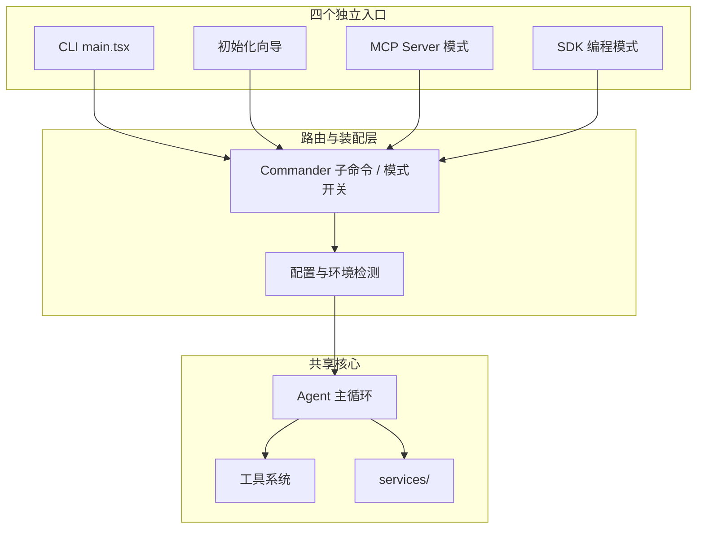
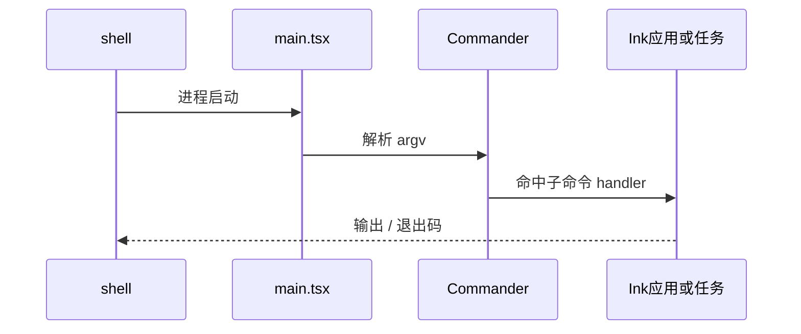
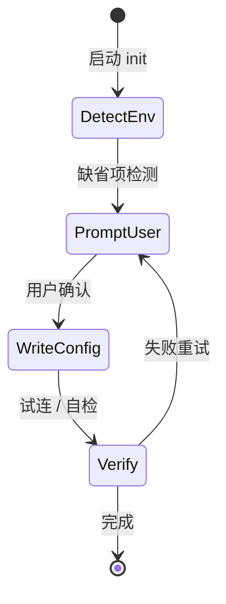
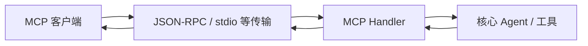
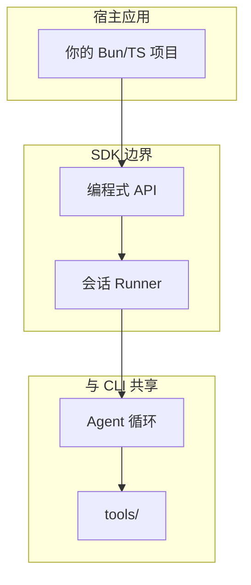
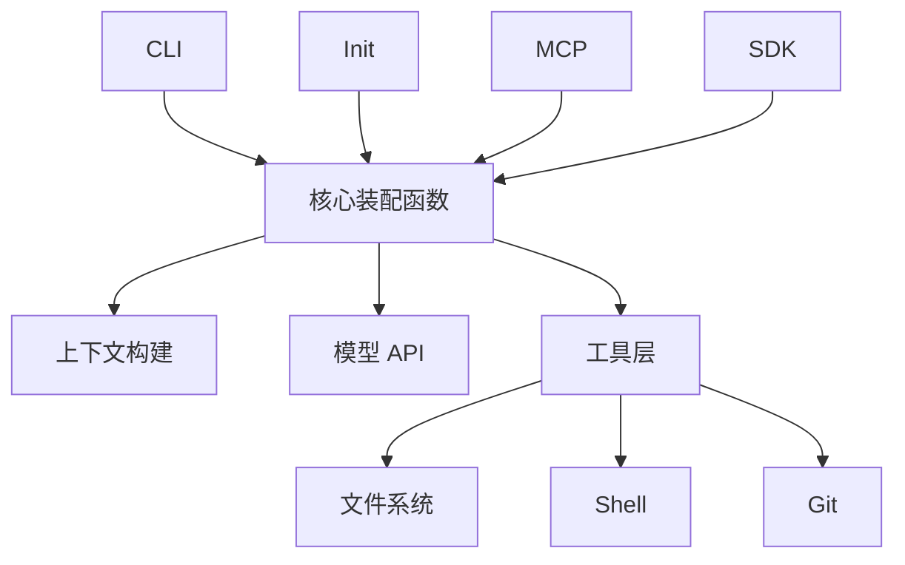

# 3.2 四个独立入口：同一颗「大脑」，四条「大门」

## 学习目标

完成本节后，你将能够：

1. 说出 Claude Code 的 **CLI、初始化、MCP、SDK** 四种入口各自解决什么问题
2. 在脑图中定位「用户从哪进来」与「核心 Agent 循环在哪汇合」
3. 理解为什么「多入口」是操作系统式软件的特征，而不是简单的「多子命令」
4. 为后续阅读 `main.tsx`、Bridge、MCP 传输层文档预留接口认知

---

## 3.2.1 为什么需要四个入口？

**生活类比**：同一栋写字楼（核心能力），可以：

- **正门刷卡**（CLI：开发者日常终端交互）
- **装修入驻登记**（初始化：首次配置、引导、写入设置）
- **外卖与物流通道**（MCP：外部客户端通过标准协议「投递任务」）
- **物业 API**（SDK：把能力嵌入你自己的 Node/Bun 应用）

若只有一个 `claude chat` 入口，就像办公楼只开一扇门——**流量形态**和**集成方式**会被迫扭曲。四入口的本质是 **deployment profile（部署剖面）分离**。

---

## 3.2.2 四入口一览表

| 入口 | 典型触发方式 | 主要用户 | 核心价值 |
|------|----------------|----------|----------|
| **CLI** | 终端执行主程序 | 日常开发者 | 全功能 TUI、交互、调试 |
| **初始化流程** | `init` / 首次向导 | 新用户 / 新机器 | 降低上手摩擦、写入配置 |
| **MCP 模式** | 作为 MCP Server 启动 | IDE / 编排器 / 第三方 | 标准协议互操作 |
| **SDK 模式** | 在代码中 `import` 调用 | 工具作者、自动化 | 可编程、可测试、可嵌入 |



---

## 3.2.3 CLI 入口（`main.tsx` + Commander）

**CLI** 是最直观的入口：用户在 shell 中启动进程，**参数解析 → 子命令分发 → 启动 Ink 应用或一次性任务**。



**关键直觉**：`main.tsx` 体量极大（教学材料中常引用约 **4684 行** 量级），它不仅是 `main()`，更是**命令注册表 + 全局副作用初始化**的聚集地。精读时宜按「子命令文件」切片，而非通读。

**伪代码锚点**：

```typescript
// 教学用伪代码：展示「入口 = 注册 + 解析 + 派发」
import { Command } from "commander";

const program = new Command();
program.command("mcp").action(runMcpServerMode);
program.command("init").action(runInitFlow);
// default: 进入交互式 CLI
program.parse(process.argv);
```

---

## 3.2.4 初始化流程入口

初始化解决的是 **「这台机器、这个仓库、这位用户」** 三元组的首次契约：

- 配置目录、认证、模型端点（视版本与产品策略）
- 可能与 **Feature Flags**、遥测开关、向导 UI 联动
- 与 CLI 共享 **services/**（日志、配置、环境探测）



**类比**：不是「买咖啡」（单次交易），而是「办会员卡 + 录入口味偏好」——之后每次 CLI 启动都更顺滑。

---

## 3.2.5 MCP 服务模式入口

**MCP（Model Context Protocol）** 模式下，Claude Code 作为 **Server**，对外暴露能力；客户端（可能是 Cursor、自建编排器等）通过协议与之对话。



**价值**：把「终端里的代理」变成 **可插拔的后端服务**。同一套 `tools/` 与权限逻辑可被多种宿主复用。

**阅读延伸**：`src/services/` 下与 MCP 传输、会话相关的模块（具体文件名随版本变化，抓住 **transport / session** 关键词即可）。

---

## 3.2.6 SDK 编程模式入口

SDK 模式面向 **「我想在自己的脚本里驱动 Claude Code」**：

- 更强的 **可测试性**（相对交互式 TUI）
- 适合 CI、批处理、内部平台集成
- 与 CLI 共享类型与核心服务，但 **UI 层可能极薄或旁路**



**类比**：CLI 是「去餐厅吃饭」；SDK 是「订外卖到你家厨房」——**菜还是同一套后厨标准**，只是取餐接口不同。

---

## 3.2.7 四入口如何「汇合」到同一核心？

无论哪条门进入，最终都希望在 **同一套**：

- **工具定义与执行管线**
- **权限与确认策略**
- **上下文与系统提示词构建**
- **流式响应解析与 tool_use**

上汇合，否则会出现「MCP 能做的事 CLI 不能做」的 **语义分叉**，维护成本爆炸。



---

## 3.2.8 常见误解

| 误解 | 澄清 |
|------|------|
| 「MCP 是另一个 Claude Code」 | 它是 **同一核心的不同传输与宿主** |
| 「SDK 会绕过权限」 | 策略由 **配置与实现** 决定；SDK 不等于无门禁 |
| 「init 只是一次性脚本」 | 它与 **全局服务** 深度耦合，影响后续所有入口体验 |

---

## 本节小结

- **四入口** = 四种 **接入形态**，不是四个无关程序。
- Commander 在 CLI 路径上扮演 **前台路由**；MCP/SDK 是 **侧门与货梯**。
- 读懂「汇合点」后，阅读 `main.tsx` 时就知道 **哪些代码是入口特化，哪些是共享心脏**。

**上一节**：[index.md](./index.md) · **下一节**：[`03-directory-structure.md`](./03-directory-structure.md)
