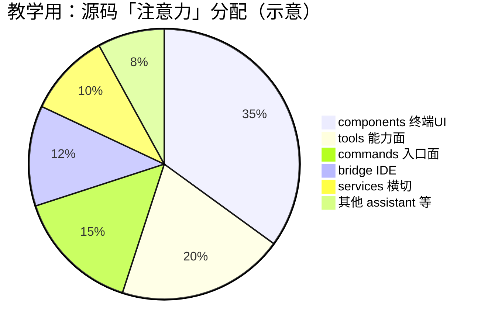
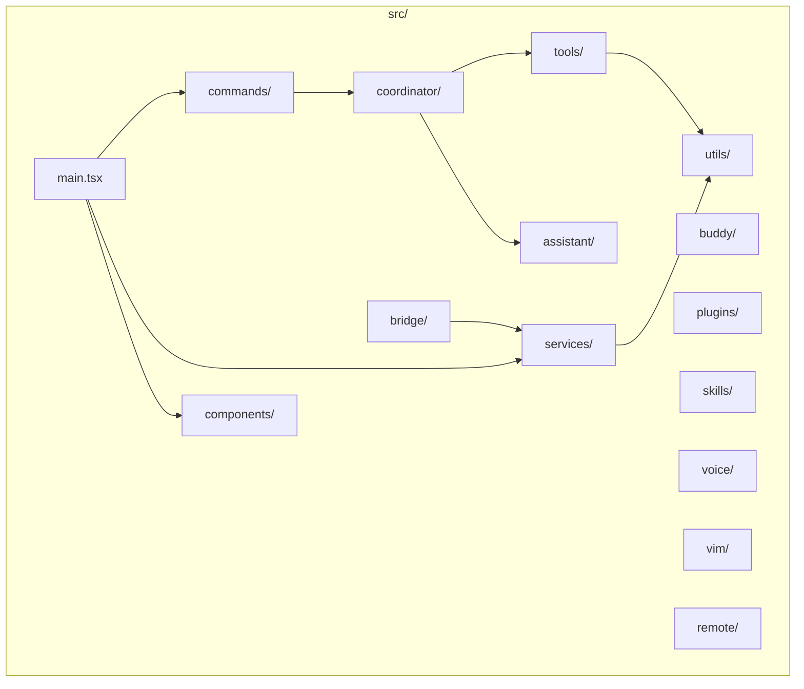
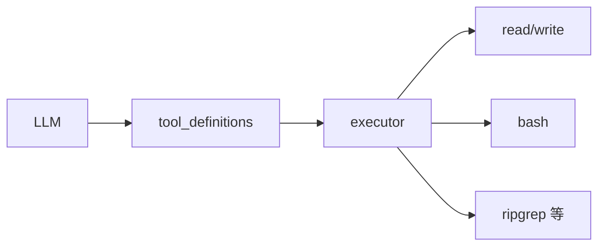
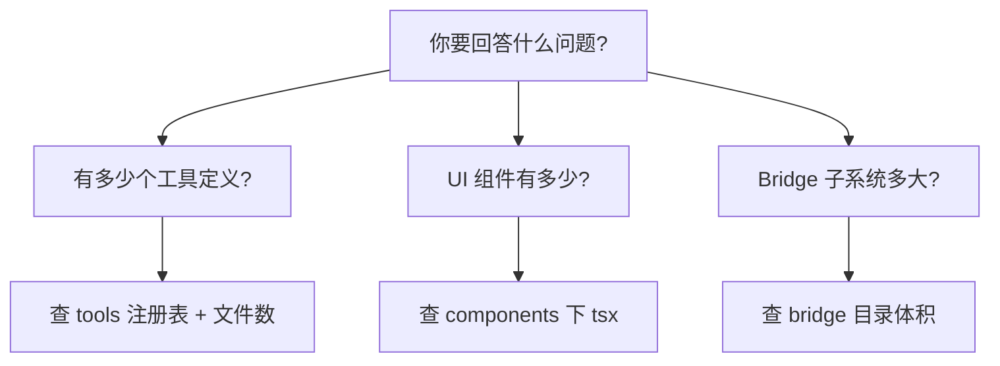
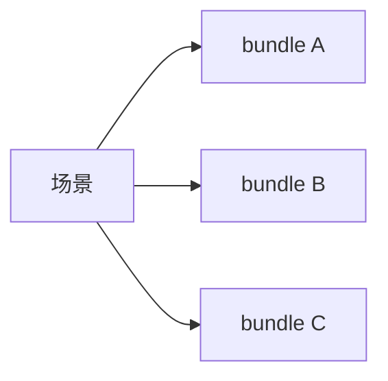
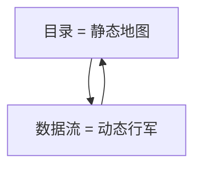

# 3.3 目录结构全景：`src/` 地图与统计心智模型

## 学习目标

完成本节后，你将能够：

1. 说出 `src/` 下 **tools、commands、services、bridge、components** 等一级目录的职责
2. 用一张「树 + 表」快速估算模块规模（文件数会随版本波动，掌握**数量级**即可）
3. 理解「为什么组件目录极大、工具目录中等、bridge 自成子系统」
4. 制定自己的源码阅读路线（从入口 → 命令 → 协调器 → 工具）

---

## 3.3.1 生活类比：城市功能区

把 `src/` 想象成一座城市：

| 目录 | 类比 | 一句话职责 |
|------|------|------------|
| `commands/` | **各区政府办事大厅** | 用户显式发起的子命令入口 |
| `tools/` | **市政工程队** | 真正「动手」的读写、执行、搜索 |
| `services/` | **水电气网络** | 认证、配置、MCP、遥测等横切能力 |
| `coordinator/` | **交通指挥中心** | 多代理、任务编排、路由（视版本命名） |
| `assistant/`（KAIROS） | **专家顾问团** | 高阶助手逻辑、与模型交互的专项 |
| `buddy/` | **随行助理** | 辅助交互、伙伴式体验相关 |
| `components/` | **商业地产幕墙** | Ink/React 终端 UI 组件，数量巨大 |
| `bridge/` | **城际轻轨** | 与 IDE 的跨进程协议与会话 |
| `plugins/`、`skills/` | **加盟店与培训手册** | 扩展与可复用技能 |
| `voice/`、`vim/`、`remote/` | **专线设施** | 语音、Vim 模式、远程会话 |

---

## 3.3.2 规模统计表（教学用近似值）

> **说明**：下列数字来自本教程编写时的**典型开源快照**与社区梳理，**仅作量级参考**。你本地克隆后应以 `find` / `cloc` 为准。

| 路径（相对 `src/`） | 近似文件数 | 备注 |
|---------------------|------------|------|
| `tools/` | **约 42** | 每个工具一个或一组文件 |
| `commands/` | **50+** | 与 CLI 子命令大致对应 |
| `bridge/` | **约 31** | IDE 通信子系统集中 |
| `components/` | **约 389** | UI 密度最高 |
| `services/` | 数十 | 横切模块 |
| `utils/` | 数十 | 通用工具函数 |
| `coordinator/` | 若干 | 编排与多代理 |
| `assistant/` | 若干 | KAIROS 相关 |
| `plugins/`、`skills/` | 若干 | 生态扩展 |



---

## 3.3.3 `src/` 树形全景（精简教学版）

下列树为 **结构教学版**：省略大量文件，仅保留一级与关键二级节点。

```text
src/
├── main.tsx                 # 巨型 CLI 入口（Commander 路由、全局初始化）
├── commands/                # 50+ 子命令实现
├── tools/                   # ~42 工具（Agent 的「手」）
├── services/                # 认证、配置、MCP、遥测、错误处理…
├── utils/                   # 通用函数、字符串、路径、重试等
├── coordinator/             # 编排、多代理协作相关
├── assistant/               # KAIROS 等助手子系统
├── buddy/                   # 伙伴式交互
├── plugins/                 # 插件加载与扩展点
├── skills/                  # Skills 机制
├── voice/                   # 语音子系统
├── vim/                     # Vim 模式绑定与逻辑
├── remote/                  # 远程会话相关
├── bridge/                  # ~31 文件：IDE 协议、会话、传输
├── components/              # ~389 个 React/Ink 组件
└── …                        # 其他随版本增减的目录
```



---

## 3.3.4 三个「高密度」目录为什么要单独记住？

### 1）`tools/`：Agent 的「系统调用」

每个工具 ≈ 向模型暴露的一个 **capability**。工具多 ≠ 功能杂，而是 **边界清晰**：读文件、写文件、执行 bash、搜索、提交信息…



### 2）`bridge/`：IDE 不是「另一个 UI」，而是 **协程式共生**

Bridge 子系统处理 **消息协议、会话、传输、与 IDE 的能力对齐**。没有它，Claude Code 仍是强终端产品；有了它，变成 **编辑器内工作流** 的一等公民。

### 3）`components/`：终端 UI 也是 **前端工程**

**389** 个组件说明：终端并非「printf 日志」，而是 **完整组件树 + 布局 + 交互状态机**。

---

## 3.3.5 与其他篇的映射

| 你想搞懂… | 优先目录 |
|-----------|----------|
| 子命令从哪进 | `commands/` + `main.tsx` |
| 模型如何改仓库 | `tools/` |
| 为什么 IDE 能联动 | `bridge/` |
| 配置、登录、MCP | `services/` |
| 多代理怎么跑 | `coordinator/` + `assistant/` |
| Feature Flags | `services/`（遥测与 flags 相关子模块） |

---

## 3.3.6 自己动手：刷新统计数据（可选）

在克隆的仓库根目录（示例命令，按你环境调整）：

```bash
# 仅统计一级目录下直接子文件数（示例）
find src/tools -maxdepth 1 -type f | wc -l
find src/commands -maxdepth 1 -type f | wc -l
find src/bridge -type f | wc -l
find src/components -type f | wc -l
```

**类比**：别背「精确人口普查」，要背「哪个区是商业区、哪个区是工业区」。

---

## 本节小结

- `src/` 的骨架 = **入口（main/commands）+ 手（tools）+ 基础设施（services/utils）+ 编排（coordinator/assistant）+ 界面（components）+ IDE（bridge）+ 扩展（plugins/skills）**。
- 文件数量级的意义在于分配 **阅读耐心**：UI 与 bridge 需要「按场景」读，不宜盲扫。
- 下一节我们将沿 **数据流** 把目录串成动态故事：[`04-data-flow.md`](./04-data-flow.md)

**上一节**：[02-four-entries.md](./02-four-entries.md)

---

## 3.3.7 统计口径说明：如何自己数文件？

教学文档中的 **42 / 50+ / 31 / 389** 等数字，建议你在本地用统一口径复核：

| 统计对象 | 建议命令思路 | 说明 |
|----------|----------------|------|
| 某目录下 TS 文件数 | `find path -name '*.ts' \| wc -l` | 含子目录 |
| 仅顶层命令文件 | `maxdepth 1` | 更接近「子命令入口文件」语义 |
| 组件数 | `find components -name '*.tsx' \| wc -l` | TSX 占比高 |



**注意**：**行数**与**文件数**不是一回事——`main.tsx` 可能单文件抵上百个小 util。

---

## 3.3.8 「横向」阅读法：按场景而非按字母序

| 场景 | 阅读 bundle |
|------|----------------|
| 想改终端配色与布局 | `components/` + `ink/` + Design System 文档 |
| 想加一个新工具 | `tools/` + 权限相关 + 测试 |
| 想理解 IDE 如何下发指令 | `bridge/` + `services/` |
| 想理解多代理 | `coordinator/` + `assistant/` + swarm 专章 |



---

## 3.3.9 反模式：目录漫游三小时一无所获

1. **从 `utils/` 随机点开**：容易陷入 **碎片化函数**，失去全局观。  
2. **从 `components/` 首文件顺序通读**：组件之间 **耦合方向** 不明显，建议 **从页面/容器组件向下**。  
3. **忽略 `bridge/`**：如果你关心 IDE 集成，跳过它会 **系统性盲区**。

---

## 3.3.10 与数据流篇的对照记忆



- **目录**回答：**代码住在哪**  
- **数据流**回答：**运行时谁先于谁**

两篇合起来，才是 **可读源码的双眼**。
