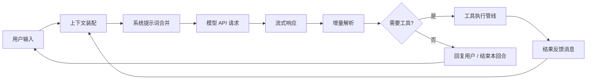
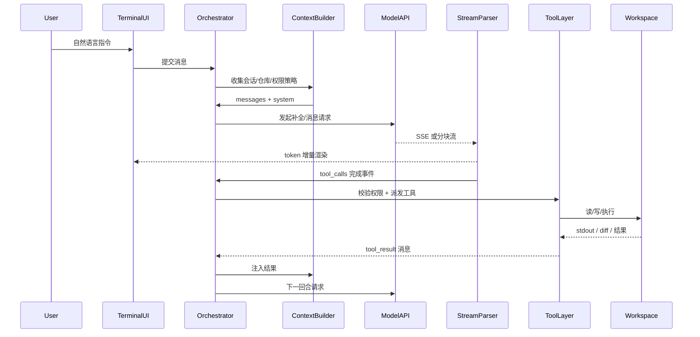
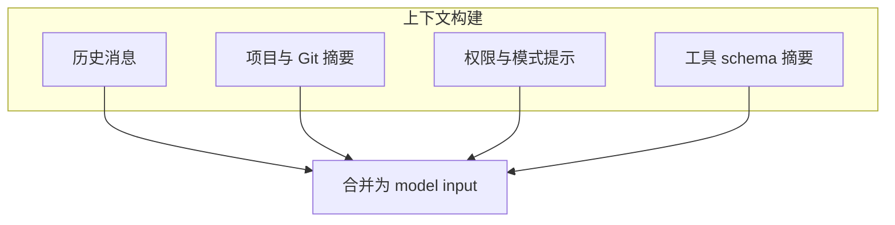
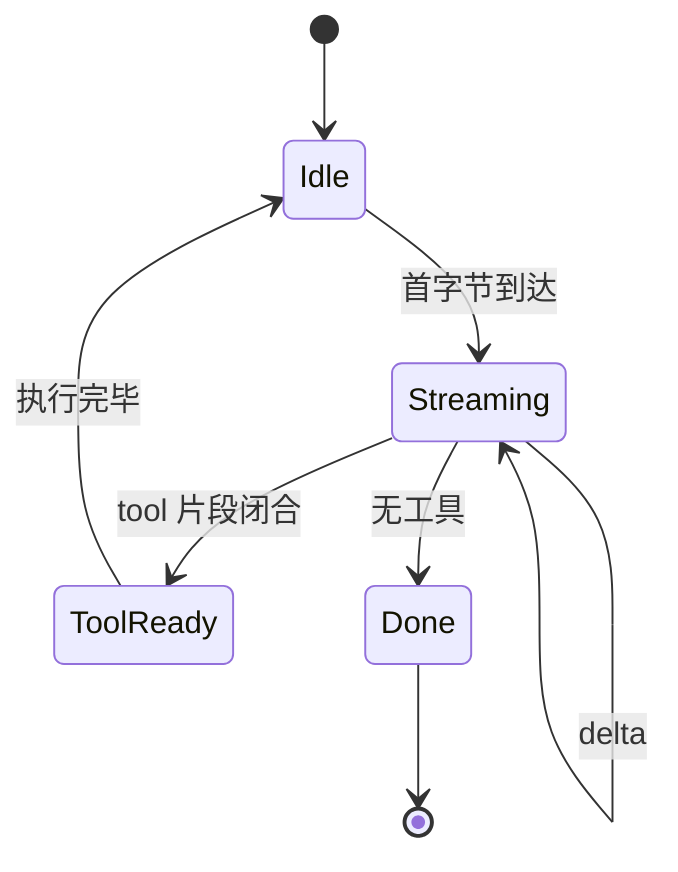
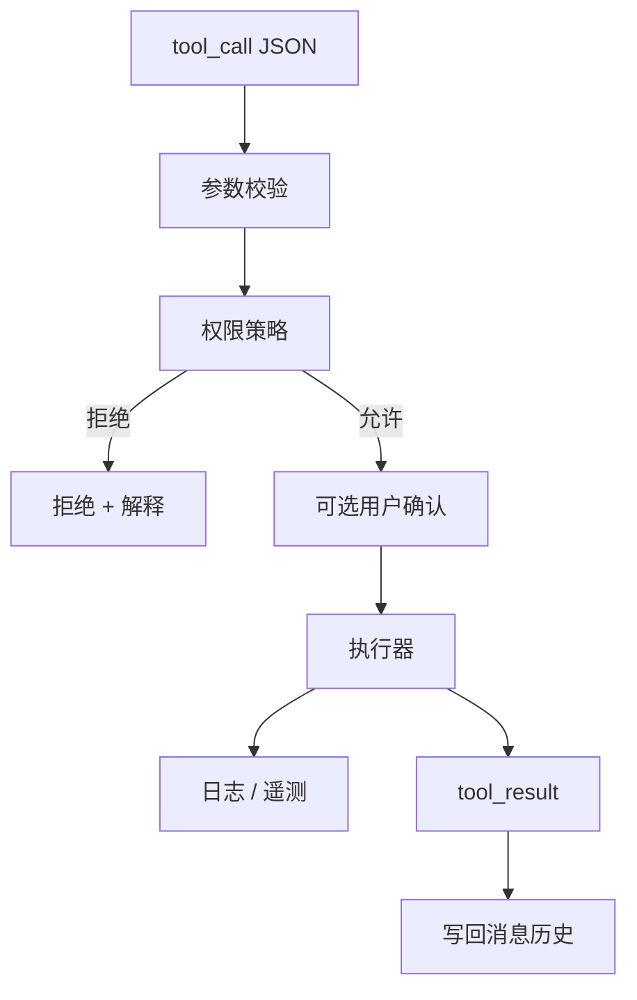
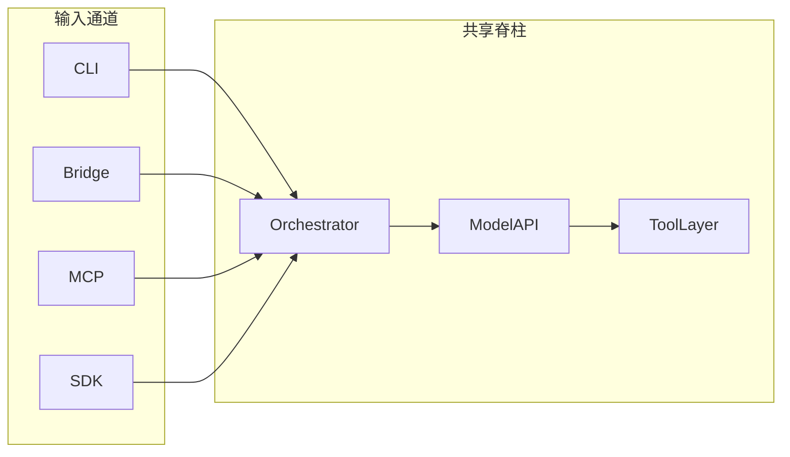
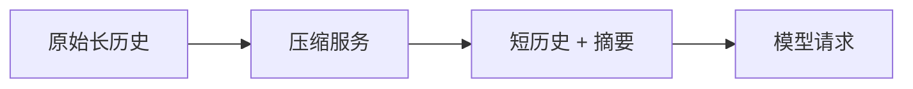

# 3.4 数据流全景：从一句话到工具执行再回环

## 学习目标

完成本节后，你将能够：

1. 画出 **用户输入 → 系统提示词 → API → 流式响应 → tool 执行 → 结果回注 → 下一回合** 的闭环
2. 解释「流式」为何同时服务 **体验**（逐字显示）与 **协议**（提前解析 tool 片段）
3. 区分 **模型侧消息** 与 **本地侧状态**（会话、权限、压缩上下文）
4. 将数据流与 `tools/`、`services/`、`coordinator/` 的职责对齐

---

## 3.4.1 生活类比：急诊分诊台

你把症状告诉分诊护士（**用户输入**），护士整理成病历摘要（**系统提示词 + 上下文**），医生思考并开检查单（**模型 + tool_use**），检验科出结果（**工具执行**），医生再根据结果决定下一步（**下一回合**）。**这不是线性流水线**，而是 **带反馈的循环**。

---

## 3.4.2 主循环数据流（总图）



---

## 3.4.3 序列图：完整回合（教学版）

下列序列图刻意 **略去** 具体类名，突出 **数据如何流动**：



---

## 3.4.4 系统提示词与上下文：「模型看到的宇宙」

| 组成部分 | 典型内容 | 本地来源（概念） |
|----------|----------|------------------|
| **系统提示词** | 行为约束、工具说明格式、安全策略摘要 | 模板 + 动态拼接 |
| **对话历史** | user/assistant/tool 消息序列 | 会话存储 |
| **仓库元数据** | 路径、Git 状态摘要、项目结构提示 | 启动预取 + 工具 |
| **压缩/摘要** | 过长历史的摘要块 | context compression 服务 |



**关键直觉**：模型 **不直接看到你的硬盘**；它看到的是 **你允许进入提示词的文本与结构化 tool 结果**。这就是安全与隐私的 **第一道闸门**（后续还有权限与确认）。

---

## 3.4.5 流式响应：为什么不是「等整包 JSON」？

1. **体验**：终端 UI 可以 **逐 token 渲染**，降低体感延迟。
2. **协议**：部分实现中，工具调用参数可能 **随流到达**，解析器需 **增量状态机**。
3. **中断**：用户可取消或限流，流式更易协作 **取消令牌**。



---

## 3.4.6 工具执行管线：从 `tool_use` 到真实副作用



**类比**：`tool_use` 是 **法院传票**；权限系统是 **法警**；执行器是 **执行官**——没有法警与执行官，传票不会自动变成现实动作。

---

## 3.4.7 与 Bridge / MCP / SDK 的差异点（数据流视角）

| 通道 | 用户输入从哪来 | 工具结果展示在哪 |
|------|----------------|------------------|
| **CLI TUI** | 终端组件事件 | Ink 组件树 |
| **Bridge** | IDE 消息 | IDE UI + 可能回显终端 |
| **MCP** | 客户端 JSON-RPC | 由客户端决定 |
| **SDK** | 函数参数 | 由宿主程序记录 |

**共同点**：**尽量共享** `Orchestrator → API → ToolLayer` 主轴，避免重复实现。



---

## 3.4.8 错误与重试：数据流里的「暗河」

生产级 Agent 循环不仅有「成功路径」，还包括：

- **API 429 / 5xx**：退避重试、切换路由（视实现）
- **工具失败**：将 **stderr / 异常** 封装为 `tool_result`，让模型自我纠错
- **用户拒绝权限**：将拒绝原因反馈给模型，请求替代方案

**伪代码**：

```typescript
// 教学用：工具结果无论成功失败，都应结构化回注
async function runTool(call: ToolCall): Promise<ToolResult> {
  try {
    const out = await executor.dispatch(call);
    return { ok: true, content: out };
  } catch (err) {
    return { ok: false, error: serializeError(err) };
  }
}
```

---

## 3.4.9 与压缩 / 记忆的关系（点到为止）

当历史过长时，**上下文压缩**或 **记忆提取**会在 **CTX** 阶段改写进入模型的内容：



详见其他篇「context compression / memory」专章；本篇只需记住：**数据流在进 API 前可能被「减肥」**。

---

## 本节小结

- Agent 的本质是 **带工具反馈的循环**，不是 HTTP 一次请求。
- **流式**同时服务 UI 与解析；**工具层**是副作用边界。
- 多入口只替换 **输入输出适配层**，不应替换 **脊柱数据流**。

**上一节**：[03-directory-structure.md](./03-directory-structure.md) · **下一节**：[`05-tech-stack.md`](./05-tech-stack.md)
