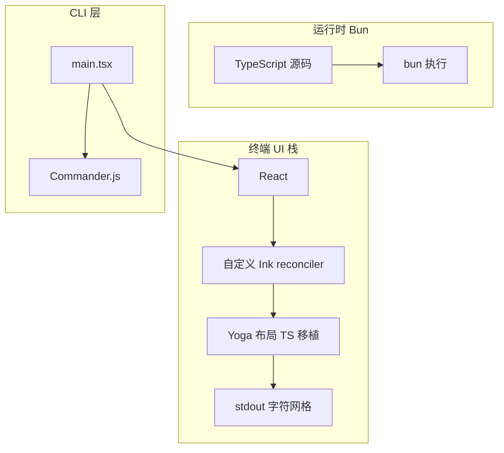
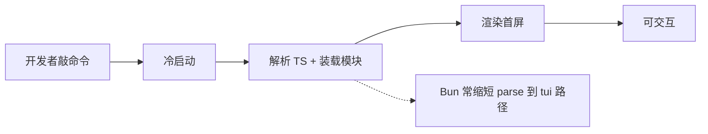
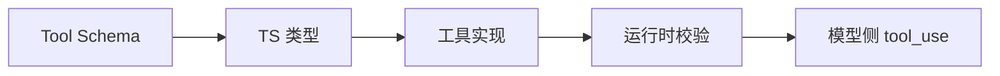
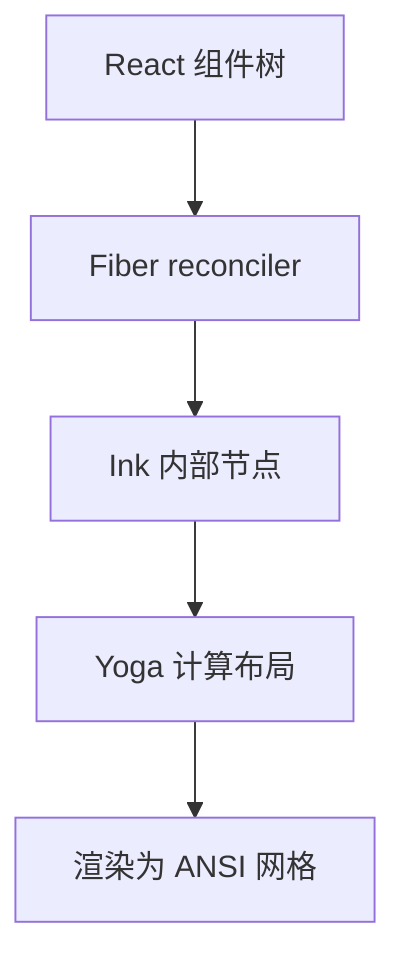
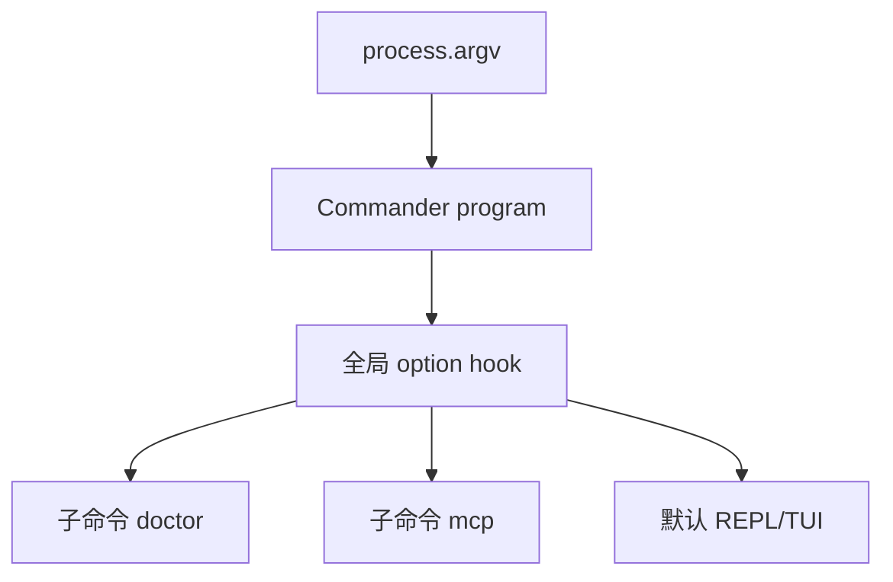
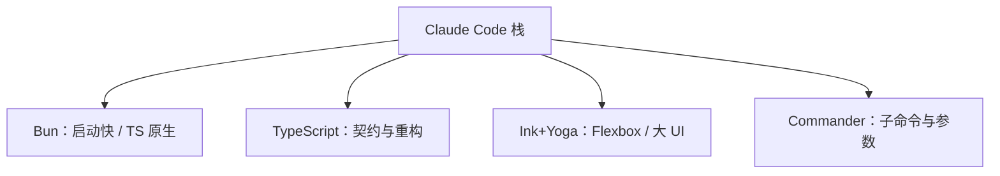

# 3.5 技术栈深度解析：Bun、TypeScript、自研 Ink、Commander

## 学习目标

完成本节后，你将能够：

1. 解释为何 Claude Code 选择 **Bun** 作为运行时，以及它与 Node.js 的取舍
2. 说明 **TypeScript** 在大型 Agent 系统中的工程价值（不仅是「类型好看」）
3. 描述 **自研 Ink + 纯 TS Yoga** 的技术动机：布局一致性、可控性、性能
4. 定位 **Commander.js** 在 `main.tsx` 中的角色：声明式子命令路由

---

## 3.5.1 总览：技术栈一张表

| 层级 | 选型 | 一句话 |
|------|------|--------|
| **运行时** | Bun | 极速启动、原生 TS、工具链一体化 |
| **语言** | TypeScript | 大规模协作、工具契约与 schema 友好 |
| **终端 UI** | 自研 React Ink + Yoga(TS) | 非标准 npm `ink` 包；布局引擎可控 |
| **CLI 路由** | Commander.js | 子命令注册与参数解析 |
| **React** | 与自定义 reconciler 配合 | 终端 Fiber 树 + 增量更新 |



---

## 3.5.2 Bun vs Node.js：不是「谁更好」，而是「谁更贴脸」

| 维度 | Node.js | Bun |
|------|---------|-----|
| **启动延迟** | 成熟但偏重 | 通常更低，适合 CLI 频繁启动 |
| **TS 开箱** | 需 transpile 或 loader | **原生 TS** 路径更顺 |
| **包管理** | npm/pnpm/yarn 生态 | 内置安装器（团队策略决定是否混用） |
| **生态兼容** | 最广 | 高兼容但偶有边缘包差异 |
| **调试心智** | 资料最多 | 增长快，需跟版本 |

**生活类比**：Node 像 **国际机场**——航班最全；Bun 像 **城市快线**——去市中心（交互式 CLI）更快。Agent 产品对 **冷启动 + 反馈延迟** 敏感，Bun 的画像更匹配。



**批判性思维**：若你的插件生态强依赖 **仅 Node 测试过的 native addon**，需评估 Bun 兼容性——这是所有新运行时的共同题。

---

## 3.5.3 TypeScript：为什么 Agent 系统「几乎必然」TS 化？

1. **工具契约**：工具入参/出参与 **JSON schema**、RPC 消息高度同构；TS 类型 + zod 等库减少 **线上才发现的字段错误**。
2. **大规模协作**：`components/` 数百文件，无类型导航成本指数上升。
3. **重构安全**：权限模型、消息协议一改，**类型报错**是最好的回归测试之一。



**类比**：TS 像 **建筑结构工程师签字**——不是保证永不塌，而是 **明显违规会在图纸上标红**。

---

## 3.5.4 自研 Ink：为什么不用标准 npm `ink`？

公开文档与社区源码阅读中常见结论：**Claude Code 使用深度定制 Ink**，原因通常包括：

| 动机 | 说明 |
|------|------|
| **布局控制** | 终端复杂面板需要更细的 **测量与重排** 策略 |
| **性能** | 大组件树下减少 reconcile 与输出抖动 |
| **交互** | 与 Vim 模式、滚动、diff 视图等深度耦合 |
| **一致性** | 与内部 Design System 对齐（见终端 UI 专章） |

### Yoga：Flexbox 在终端里「算几何」

浏览器有布局引擎；终端只有 **行列网格**。Yoga（Meta 开源）负责 **Flexbox 约束求解**。Claude Code 侧为 **纯 TypeScript 移植/集成**，避免 native 绑定带来的 **跨平台与构建**痛点。



**生活类比**：React 是 **剧本**；Fiber 是 **导演分镜**；Yoga 是 **舞台布景测量**；ANSI 输出是 **演员站位**。

### 关键源码片段（教学还原）

```tsx
// 概念来自 ink/components/Box.tsx：flex 属性进入 Yoga
function Box({ flexDirection = "row", children, ...style }: Props) {
  return (
    <ink-box
      style={{
        flexDirection,
        ...style,
      }}
    >
      {children}
    </ink-box>
  );
}
```

`<ink-box>` 说明：**宿主元素不是 DOM**，而是 Ink 自定义 **内部类型**，由 reconciler 创建对应 **终端节点**。

---

## 3.5.5 Commander.js：`main.tsx` 的「交通总枢纽」

**main.tsx**（约 **4684 行** 量级）承载：

- **全局** `import` 副作用顺序（需谨慎）
- **program** 实例上挂载大量 `.command()`
- **option** 与 **hook**（版本检查、telemetry、debug）

```typescript
// 教学用最小示例：展示 Commander 的心智模型
import { Command } from "commander";

const program = new Command();
program
  .name("claude-code")
  .option("-d, --debug", "verbose logging");

program
  .command("doctor")
  .description("自检环境")
  .action(async () => {
    // -> src/commands/... 类似结构
  });

await program.parseAsync(process.argv);
```



**阅读策略**：不要线性阅读 4000 行；用 **「搜 `.command(`」** 建立索引表，再跳读对应 `src/commands/*.ts`。

---

## 3.5.6 技术栈组合带来的「系统性格」



- **快**：Bun + 流式 API + 增量渲染 → **体感敏捷**
- **重 UI**：Ink 组件爆炸 → **前端工程化**
- **强 CLI**：Commander → **可发现性**（`--help` 文化）

---

## 3.5.7 常见面试式追问（自测）

| 问题 | 简答方向 |
|------|----------|
| 为什么不用 Electron？ | 终端优先、远程 SSH、低图形依赖 |
| Yoga 解决什么？ | **布局计算**；不是语法高亮本身 |
| 自研 Ink 的最大成本？ | 与上游同步、维护 reconciler 边缘行为 |

---

## 本节小结

- **Bun + TS** 服务 **启动速度与工程规模**；**Ink + Yoga** 服务 **终端复杂 UI**；**Commander** 服务 **CLI 可维护路由**。
- 把这三者连起来，就理解为何它不是「几十行的 python 脚本代理」。

**上一节**：[04-data-flow.md](./04-data-flow.md) · **下一节**：[`06-comparison.md`](./06-comparison.md)
