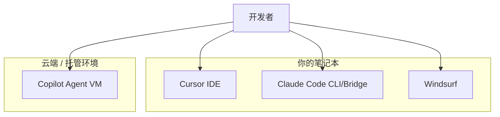
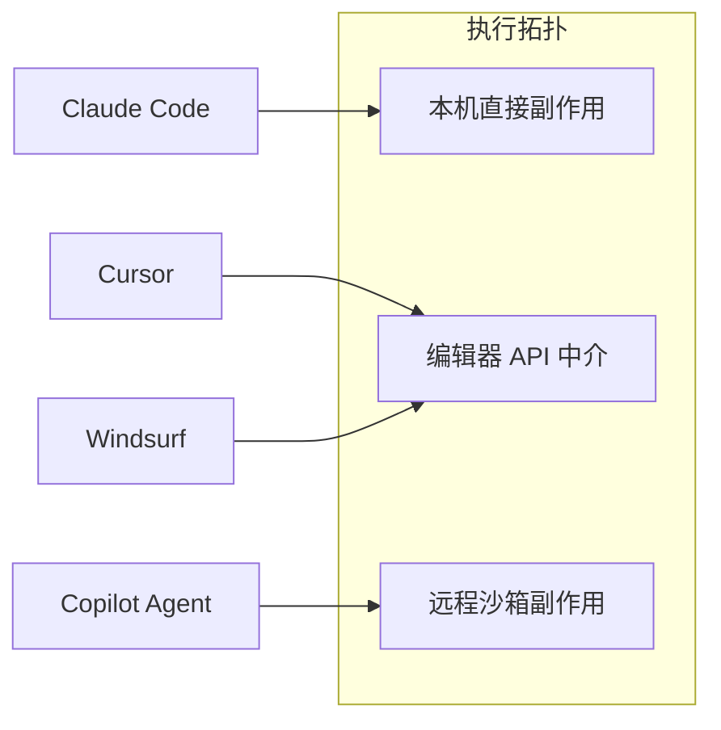
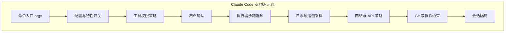
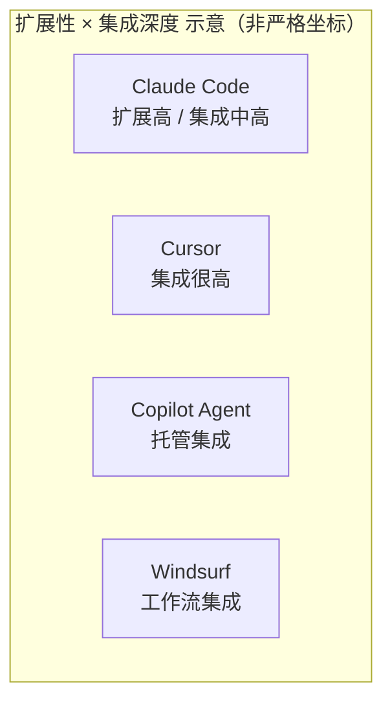
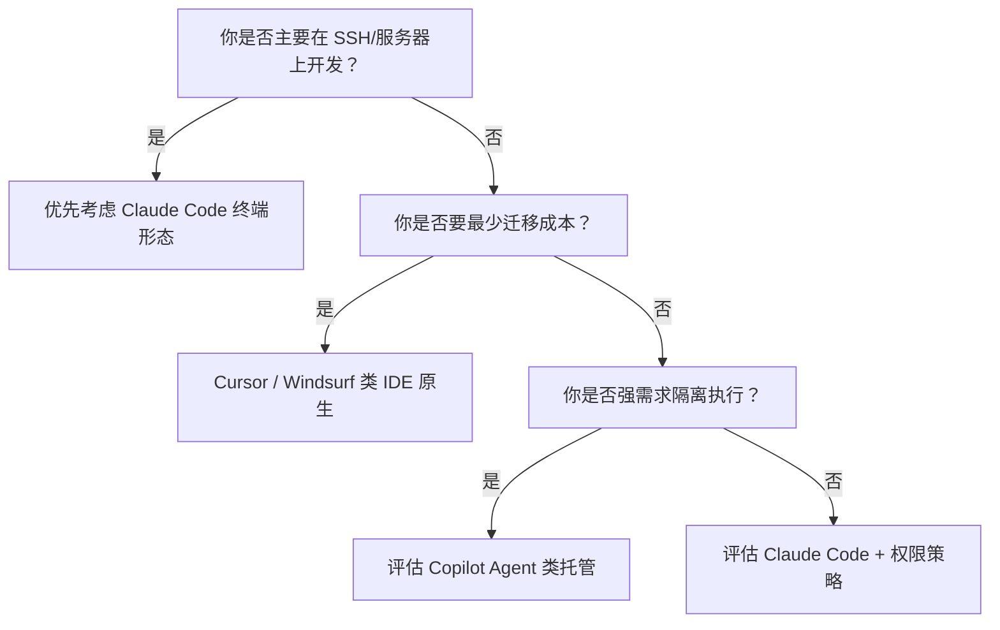
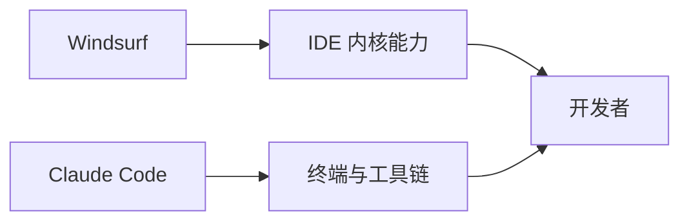
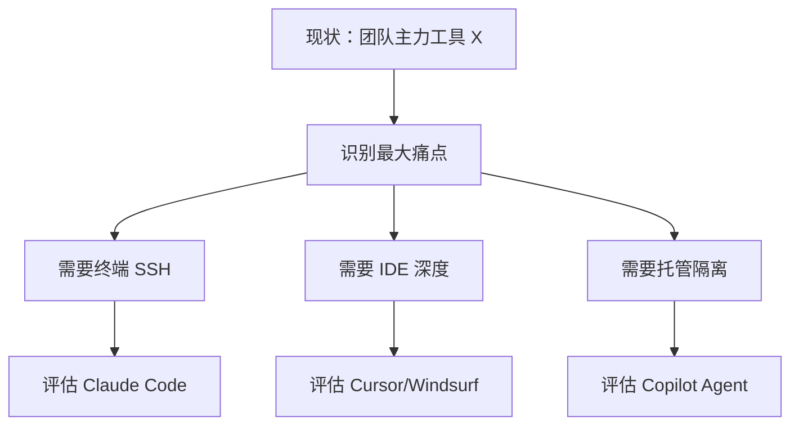
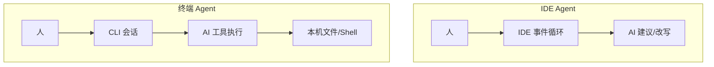

# 3.6 架构对比：Claude Code、Cursor、Copilot Agent、Windsurf

## 学习目标

完成本节后，你将能够：

1. 用一张表对比 **执行环境、安全模型、扩展方式、成本结构** 四个维度
2. 用三个生活类比记住：**坐旁边**（Cursor）、**远程虚拟机**（Copilot Agent）、**本机代理 + 多层安检**（Claude Code）
3. 理解「没有绝对最好，只有场景最匹配」的选型逻辑
4. 将 Windsurf 放入「编辑器原生 Agent」谱系中定位

---

## 3.6.1 三维隐喻：你在哪干活？

| 工具 | 一句话隐喻 | 你的电脑角色 |
|------|------------|--------------|
| **Cursor** | 专家**坐你旁边看你操作** | 主战场；AI 深嵌编辑器 |
| **GitHub Copilot Agent** | 专家在**另一间机房（VM）**折腾 | 你的机器更多是「遥控台」 |
| **Claude Code** | 专家**直接用你的电脑**，但要过 **9 层安检** | 主战场；终端/Bridge 驱动 |
| **Windsurf** | 编辑器内的 **Cascade** 流 | 主战场；产品化工作流 |

---

## 3.6.2 执行方式对比

| 维度 | Claude Code | Cursor | Copilot Agent | Windsurf |
|------|-------------|--------|---------------|----------|
| **主交互面** | 终端 TUI +（可选）IDE Bridge | IDE 内嵌面板 | 以 Agent 会话为中心（托管） | IDE 内嵌 Cascade |
| **代码访问路径** | 本机工作区直接读写 | 本机工作区（编辑器 API） | 远程克隆/沙箱（产品演进中） | 本机工作区 |
| **适合 SSH 远程机** | 强（终端原生） | 中（依赖远程开发链路） | 强（不依赖你本机编译环境） | 中 |
| **批处理 / 脚本化** | 强（SDK、CLI） | 中 | 中 | 弱到中 |

---

## 3.6.3 安全模型对比（重点）

**Claude Code** 常被描述为 **「直接用你电脑，但多层安检」**：

- **权限门控**：敏感工具需显式允许或用户确认（策略可配置）
- **可见性**：动作发生在你的用户权限下——**与「方便」同源的风险**需靠 UX 与策略缓解
- **审计**：终端日志、Git 状态、部分遥测（视版本与设置）

**Cursor**：

- 深度集成编辑器与 LSP；**凭据与文件访问**通常跟随编辑器工作区信任模型
- 用户感知为「AI 在 IDE 里改」——心理距离近，但**本质仍是本机副作用**

**Copilot Agent**：

- **隔离红利**：远程环境可限制对本地机的直接触碰
- **数据出境与代码上传**：企业合规维度需单独评估

**Windsurf**：

- 与本机工作区交互；安全故事与 **IDE 信任边界 + 产品策略** 绑定

| 安全维度 | Claude Code | Cursor | Copilot Agent | Windsurf |
|----------|-------------|--------|---------------|----------|
| **默认信任面** | 本机用户权限 | 本机 + 插件 | 托管环境边界 | 本机 |
| **隔离强度** | 中（进程内 + 策略） | 中 | 高（相对本地） | 中 |
| **用户可感知确认** | 强（工具批准 UX） | 中到强 | 中 | 中到强 |
| **企业治理** | 依赖本地策略与网络 | 依赖 IDE 策略 | 易推「不上本地」叙事 | 依赖供应商 |

> 说明：上图中「9 层」为 **教学概括**，真实实现是 **矩阵式策略**，并非严格串行 9 个函数；但利于零基础建立 **「不是裸 exec」** 的直觉。

---

## 3.6.4 扩展性对比

| 扩展机制 | Claude Code | Cursor | Copilot Agent | Windsurf |
|----------|-------------|--------|---------------|----------|
| **MCP** | 原生服务端/客户端生态位 | 支持 MCP（宿主侧） | 视产品与版本 | 视产品与版本 |
| **插件 / Rules** | Plugins、Skills、`.md` 技能包 | Rules、MCP、扩展 | 生态在 GitHub 侧演进 | 规则/工作流产品化 |
| **可编程嵌入** | **SDK 模式**强 | 弱（偏配置） | 中 | 弱到中 |
| **开源可控** | 可读源码（许可证以仓库为准） | 闭源为主 | 闭源为主 | 闭源为主 |

> 上图仅为 **定性示意**；精确产品能力请以官方文档为准。

---

## 3.6.5 成本与计费心智

计费模型随时间与套餐变化极大，本节只给 **架构视角**：

| 角度 | Claude Code | Cursor | Copilot Agent | Windsurf |
|------|-------------|--------|---------------|----------|
| **算力在哪** | 调用模型 API（你或组织的密钥/套餐） | 供应商打包 | 常与 Copilot 订阅绑定 | 供应商打包 |
| **本机成本** | CLI 进程 + 工具执行 | IDE 常驻 | 本地较轻 | IDE 常驻 |

**类比**：Claude Code 像 **自己加油的车**（API/用量可见）；部分 IDE Agent 像 **共享汽车会员**（套餐打包，单价不透明）。

---

## 3.6.6 选型决策树（零基础友好）

---

## 3.6.7 综合对比总表

| 项目 | Claude Code | Cursor | GitHub Copilot Agent | Windsurf |
|------|-------------|--------|----------------------|----------|
| **执行拓扑** | 本机终端/Bridge | 本机 IDE | 托管为主 | 本机 IDE |
| **交互范式** | 对话式 Agent + 工具 | 编辑中辅助 + Agent | Agent 任务流 | Cascade 工作流 |
| **安全直觉** | 本机权限 + 显式门控 | 本机 IDE 信任边界 | 远程沙箱隔离 | 本机 IDE 信任边界 |
| **扩展** | MCP、Plugin、Skill、SDK | MCP、Rules | GitHub 生态 | 产品内工作流 |
| **开源** | 可读源码为主 | 闭源 | 闭源 | 闭源 |
| **典型人群** | 多仓库、脚本化、终端派 | 前端/全栈日常 IDE 用户 | GitHub 中心化团队 | 追求 IDE 一体化体验 |

---

## 本节小结

- **执行环境**决定风险轮廓：**本机直连** vs **远程托管** 没有绝对优劣。
- Claude Code 的差异点 = **终端原生 + 可编程 SDK + MCP + 显式工具权限链**。
- 对比表应随产品发布更新；架构维度比「功能 checkbox」更耐久。

**上一节**：[05-tech-stack.md](./05-tech-stack.md) · **下一节**：[`07-startup.md`](./07-startup.md)

---

## 3.6.8 Windsurf 补充：「编辑器原生 Agent」谱系

Windsurf 通常被放在 **深度 IDE 集成** 象限：强调 **工作流一体化**（编辑、索引、Agent 面板、文档跳转）。与 Claude Code 的 **终端优先** 形成互补：

| 维度 | Windsurf | Claude Code |
|------|----------|-------------|
| **主战场** | 编辑器内 | 终端 +（可选）Bridge |
| **心智入口** | Cascade / 面板 | CLI / SDK |
| **脚本化自动化** | 相对弱 | SDK 强 |

---

## 3.6.9 企业场景下的四条「治理问题」

| 治理问题 | Claude Code | Cursor | Copilot Agent | Windsurf |
|----------|-------------|--------|---------------|----------|
| **代码是否离开本机** | 取决于 API 与配置 | 取决于供应商与模式 | 常见上传至托管侧 | 取决于供应商 |
| **审计日志** | CLI + 服务可组合 | IDE 生态 | 平台侧为主 | 平台侧为主 |
| **最小权限** | 工具级策略 | 工作区信任 | 沙箱边界 | 工作区信任 |
| **供应链（开源）** | 可读源码为主 | 闭源 | 闭源 | 闭源 |

> 表格为 **架构向提问清单**，不是合规结论；真实采购需法务与信息安全评估。

---

## 3.6.10 迁移成本：团队已经在用 X，怎么办？

**建议**：先做 **2 周试点**，用同一批任务（重构、修 bug、写测试）记录 **完成时间、返工次数、事故数**，再谈「信仰」。

---

## 3.6.11 第二幅对比心智图：「谁握着鼠标？」

**读图**：不是「谁更 AI」，而是 **交互循环绑定在哪种系统调用接口上**。

---

## 3.6.12 本篇自检清单

- [ ] 我能用 **1 句话**区分 Cursor 与 Claude Code 的 **执行面**  
- [ ] 我能解释 **托管 Agent** 的安全 **红利与代价**  
- [ ] 我知道 **Windsurf** 在表格中处于 **IDE 原生** 位置，而非终端工具  

完成以上三点，对比篇即可 **毕业**。
