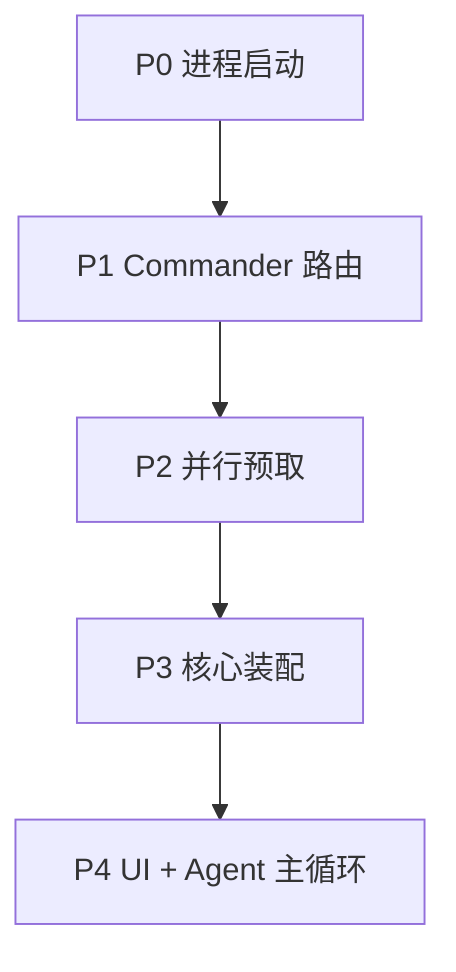
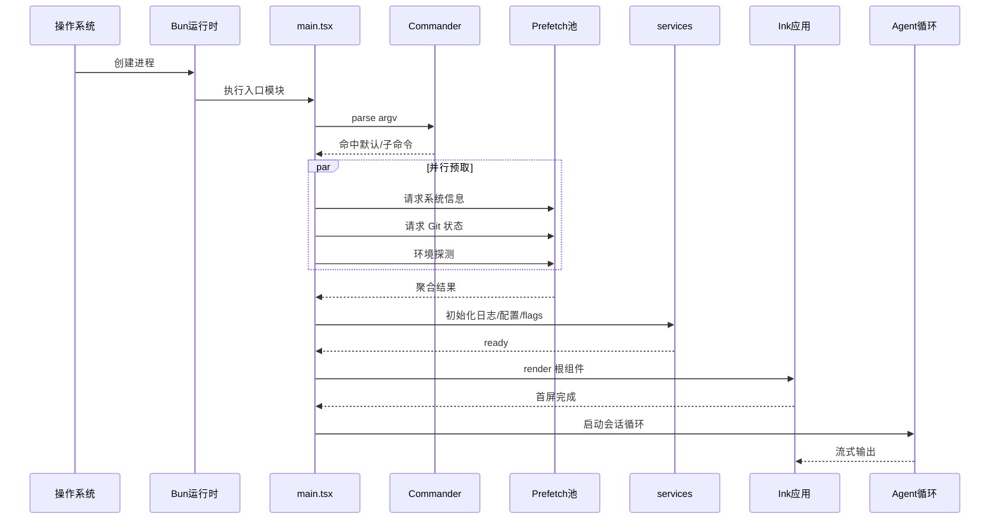
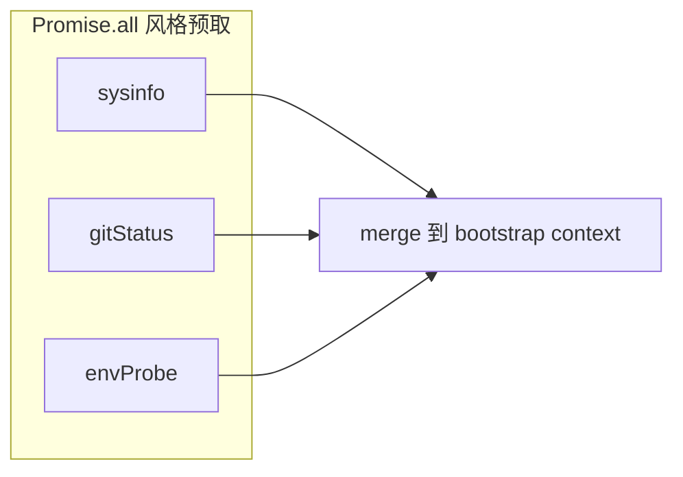
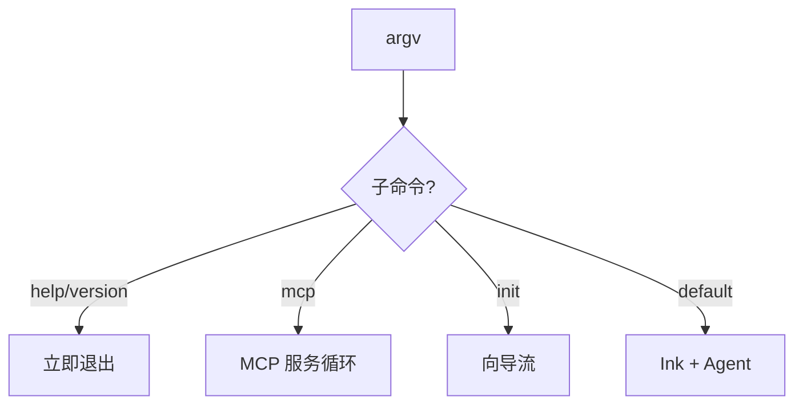
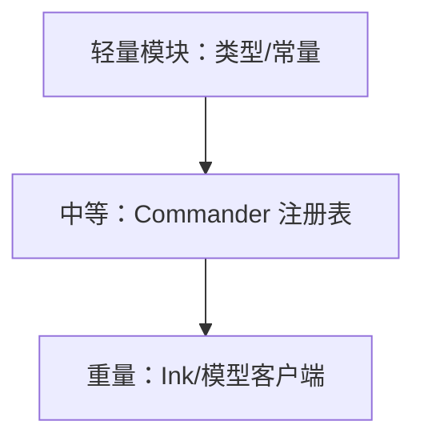
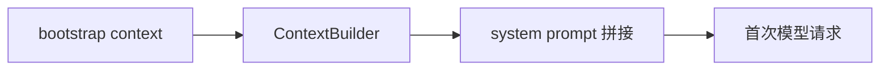
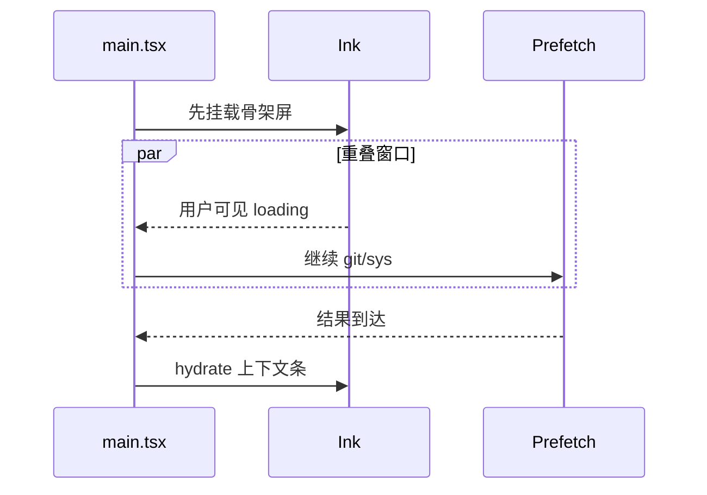

# 3.7 启动流程详解：从进程诞生到 Agent 主循环

## 学习目标

完成本节后，你将能够：

1. 按时间顺序复述 **Commander 解析 → 环境预取 → 核心初始化 → 主循环** 四阶段
2. 解释为何 **CPU/内存/OS/Git** 等信息适合 **并行预取**（降低首屏与首 token 前阻塞）
3. 在时序图中标出 **可与 UI 渲染重叠** 的阶段
4. 对接 `08-main-entry.md` 中 `main.tsx` 的分段阅读策略

---

## 3.7.1 生活类比：餐厅开店流程

早上开店时，优秀店长会 **同时** 做几件事：检查水电表（**系统信息**）、确认今日进货单（**Git/项目状态**）、打开收银机（**配置加载**）、布置门面（**首屏 UI**）。**串行**每件事会让第一位顾客等太久；**并行 + 关键路径合并**才是体验。

---

## 3.7.2 启动阶段总览

| 阶段 | 主要工作 | 用户可感知 |
|------|----------|------------|
| **P0 进程启动** | Bun 解析入口、装载 `main.tsx` 依赖图 | 极短延迟 |
| **P1 Commander** | `argv` 解析、命中子命令、全局 option | `--help` 秒回 |
| **P2 并行预取** | CPU/内存/OS、Git 状态、环境探测 | 缩短「可输入」时间 |
| **P3 核心装配** | services 挂载、日志 sink、特性开关、认证状态 | 错误或 banner |
| **P4 Agent/UI** | Ink 根组件挂载、会话恢复、进入主循环 | 交互就绪 |



---

## 3.7.3 时序图：启动路径（默认交互模式）



---

## 3.7.4 为何「并行预取」值得单独强调？

1. **Git 状态**（分支、脏文件、最近提交）常被注入 **系统提示词或上下文卡片**——早拿到早装配。
2. **OS/CPU/内存** 可能用于 **遥测分层、特性开关、错误诊断**（`doctor` 类命令也复用）。
3. **预取失败不应阻塞启动**：应有 **降级**（空值 + 稍后重试），否则 SSH 弱网环境体验崩。



**伪代码**：

```typescript
// 教学用：表达「并行 + 容错」意图
async function prefetchBootstrapContext(cwd: string) {
  const [sys, git, env] = await Promise.all([
    safe(() => readSystemSummary()),
    safe(() => readGitSummary(cwd)),
    safe(() => probeEnvironment()),
  ]);
  return { sys, git, env, partialFailures: ... };
}
```

---

## 3.7.5 Commander 子命令的「早退」路径

并非所有启动都进入 Agent 主循环：

| 子命令类型 | 典型行为 | 是否进入 TUI |
|------------|----------|----------------|
| `--version` / `--help` | 打印后 `exit(0)` | 否 |
| `doctor` | 自检后退出 | 否或极简 UI |
| `mcp` | 进入服务模式 | 否（另一主循环） |
| 默认 | 会话式 CLI | 是 |



---

## 3.7.6 初始化顺序：小心「循环依赖」

大型 `main.tsx` 常见风险：**import 副作用顺序**导致难以调试的循环依赖。工程上常见对策：

- **analytics / 日志** 模块 **延迟 attach sink**（见 services 专章）
- **重型单例** 延迟到 **已知子命令路径** 再加载
- **动态 import** 切分 MCP/SDK 路径



---

## 3.7.7 与「数据流篇」的衔接点

启动结束时，`bootstrap context` 会流入 **ContextBuilder**：



---

## 3.7.8 故障排查清单（零基础）

| 现象 | 可能阶段 | 排查方向 |
|------|----------|----------|
| 卡在首屏很久 | P2 预取 | Git 超大仓库、网络卷延迟 |
| 一启动就报错退出 | P3 服务 | 认证、配置路径、权限 |
| UI 花屏/闪烁 | P4 Ink | 终端兼容、TERM、字体宽度 |
| 子命令找不到 | P1 Commander | argv、别名、安装版本 |

---

## 3.7.9 第二幅时序图：强调「预取与 UI 重叠」

在真实实现中，**首帧渲染** 有时可与 **部分预取** 重叠（取决于版本优化）：



> 是否重叠属于 **实现细节**；本节目的是让你知道：**启动优化**常发生在这个交叉区。

---

## 本节小结

- 启动 = **路由（Commander）** + **情报（并行预取）** + **装配（services）** + **呈现与循环（Ink + Agent）**。
- **并行预取**是操作系统式软件常见的 **hide latency** 技巧。
- 阅读 `main.tsx` 时，用 **子命令** 与 **import 深度** 两轴切片，避免淹没在单行文件中。

**上一节**：[06-comparison.md](./06-comparison.md) · **下一节**：[`08-main-entry.md`](./08-main-entry.md)
