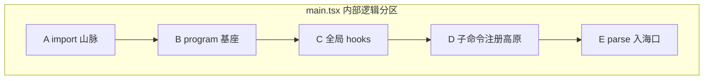
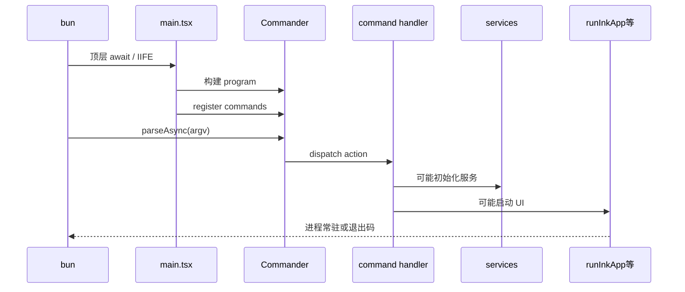
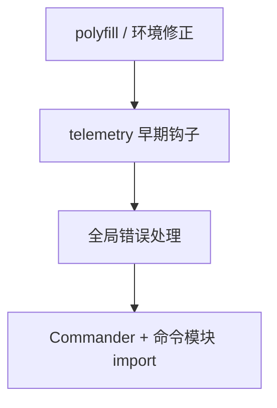
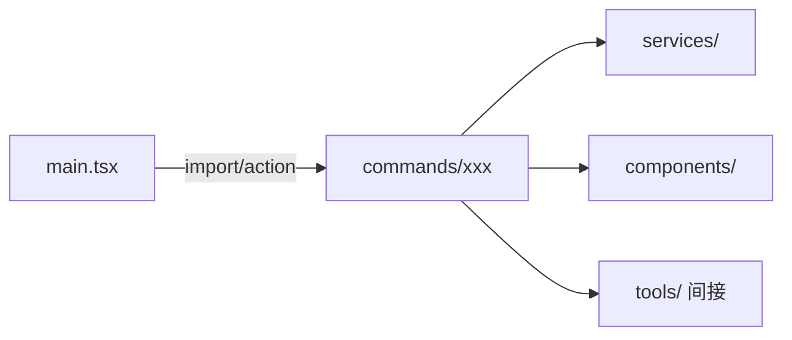
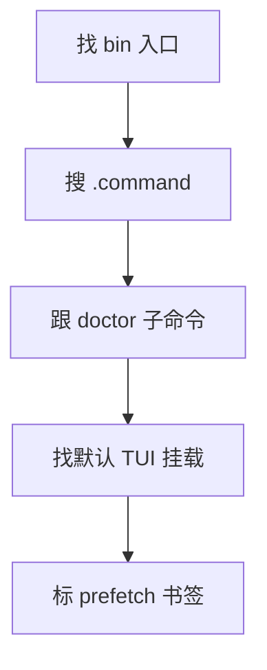

# 3.8 `main.tsx` 入口分析：4684 行如何拆解？

## 学习目标

完成本节后，你将能够：

1. 解释为什么 `main.tsx` 会膨胀到 **数千行**（注册表 + 全局初始化 + 模式分支）
2. 给出 **推荐的模块阅读顺序**（从 Commander 索引到各 `commands/` 文件）
3. 识别 **五类代码块**：import 区、program 定义、全局 hook、子命令注册、默认入口
4. 建立 **调用链心智图**：从 `parse` 到具体 `action` 函数

---

## 3.8.1 生活类比：总机接线室

`main.tsx` 像 **公司总机**：不处理每一笔业务细节，但 **所有电话都得先经过它**，它决定 **转接到哪个分机（子命令）**。若把分机逻辑也全写在总机室里，房间就会 **4684 行** 这么拥挤——因此源码里常有 **「注册在此，实现在 commands/」** 的模式。

---

## 3.8.2 结构分解（五段论）

> 行号为 **教学示意**；你本地仓库请以搜索与标签为准。

| 区块 | 典型内容 | 阅读优先级 |
|------|----------|------------|
| **A：顶部 import** | 副作用敏感；全局面单例 | ⭐ 最后精读 |
| **B：program 基座** | `name/description/version`、全局 option | ⭐⭐⭐ |
| **C：中间件式 hook** | 预检、telemetry、debug、环境变量 | ⭐⭐⭐ |
| **D：子命令注册** | `.command(...).action(...)` 高密度区 | ⭐⭐⭐⭐⭐ |
| **E：parse 与兜底** | `parseAsync`、默认行为、未命中处理 | ⭐⭐⭐⭐ |



---

## 3.8.3 调用链：从进程到业务 handler



---

## 3.8.4 关键源码片段（高度简化的教学模型）

下列代码 **不是** 逐字拷贝开源仓库，而是展示 **结构骨架**，便于你对照真源码：

```typescript
// --- 区块 B：program 基座（示意） ---
import { Command } from "commander";

const program = new Command();
program
  .name("claude")
  .description("Agentic coding assistant")
  .version(VERSION_FROM_BUILD);

program.option("--debug", "enable verbose diagnostics");
```

```typescript
// --- 区块 D：子命令注册（示意） ---
program
  .command("doctor")
  .description("Check local environment")
  .action(async () => {
    const { runDoctor } = await import("./commands/doctor");
    await runDoctor();
  });

program
  .command("mcp")
  .description("Run MCP server mode")
  .action(async () => {
    const { runMcpServer } = await import("./commands/mcp");
    await runMcpServer();
  });
```

```typescript
// --- 区块 E：解析（示意） ---
await program.parseAsync(process.argv);
```

**阅读技巧**：在仓库内搜索 **`.command(`** 的命中列表，生成你自己的 **「子命令目录」** CSV，比死记行号更有效。

---

## 3.8.5 模块初始化顺序：为什么 import 区「看起来很乱」？



**原则**：**越靠前越像操作系统内核初始化**——动一行可能影响全局。新手应 **避免「顺手改 import 顺序」**。

---

## 3.8.6 `main.tsx` vs `commands/`：职责边界

| 文件 | 应该薄还是厚？ | 原因 |
|------|----------------|------|
| `main.tsx` | **中等偏厚** | 注册表天然膨胀；但仍应 **避免** 把复杂业务写满 |
| `commands/*.ts` | **业务主场** | 可测、可拆、可懒加载 |



---

## 3.8.7 4684 行的「反模式信号」与工程现实

**不是缺点，而是权衡**：

- **优点**：所有入口 **一眼可搜**；发布流水线简单（单入口）
- **风险**：合并冲突频繁、新人心理门槛高
- **缓解**：动态 import、把大块逻辑迁到 `commands/`、`bootstrap/` 类目录（若版本已拆分）

---

## 3.8.8 实战阅读路线（90 分钟版）

1. **15 min**：从 `package.json` 找到实际 bin 指向的入口文件（通常为 `main.tsx` 或编译产物）。
2. **20 min**：全文搜索 `.command(`，把子命令名抄到笔记。
3. **25 min**：选一个 **非默认** 子命令（如 `doctor`）顺藤摸到 `commands/`，走通 **import 链**。
4. **20 min**：回到默认路径，找 **Ink** `render(` 或等价调用，理解 **UI 挂载点**。
5. **10 min**：对照 `07-startup.md` 把 **预取** 相关函数在 `main` 中 **打书签**。



---

## 3.8.9 与四入口的映射（交叉引用）

| 模式 | 在 `main.tsx` 中的体现 |
|------|-------------------------|
| CLI | 默认 action + Ink |
| Init | `init` 子命令注册 |
| MCP | `mcp` 子命令或 flag 分支 |
| SDK | 可能 **独立入口文件**；或 `main` 中极薄 re-export（视版本） |

---

## 3.8.10 调试建议（零基础）

```bash
# 示意：打印 argv 与版本（勿在生产脚本滥用）
claude --help
claude doctor
```

在源码中临时加日志时，优先使用 **已有 debug flag** 路径，而不是散落 `console.log`——否则多进程/Bridge 场景下 **日志交错** 难读。

---

## 本节小结

- `main.tsx` = **CLI 操作系统 bootloader + 子命令注册表**。
- **调用链**终点在 `commands/`，**能力链**终点在 `tools/` + `services/`。
- 学会 **搜索驱动阅读**，比 **线性通读 4684 行** 更符合人类认知。

**上一节**：[07-startup.md](./07-startup.md) · **下一节**：[`09-dependencies.md`](./09-dependencies.md)
