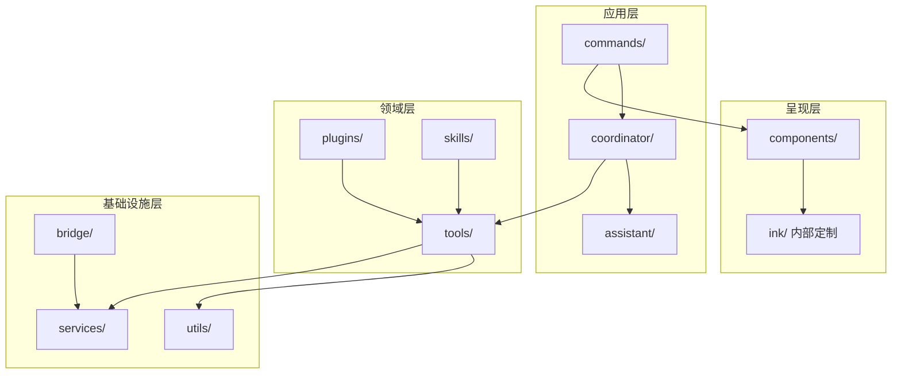
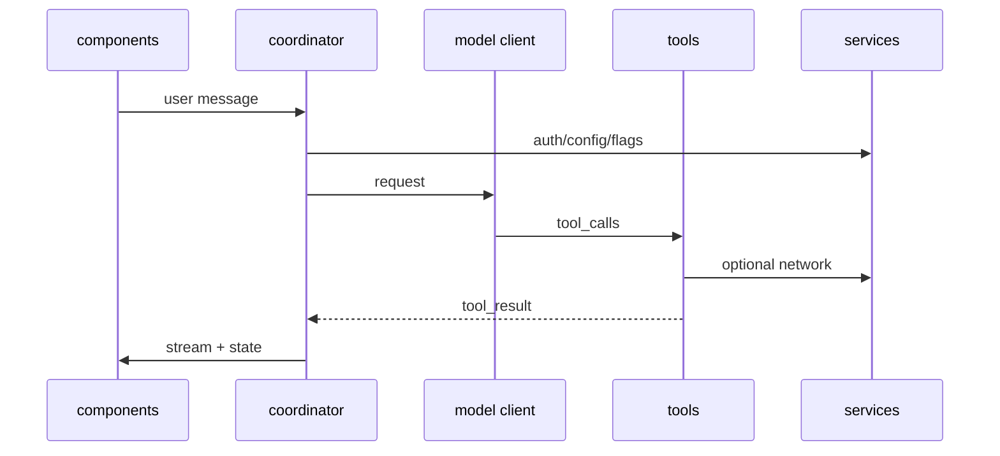
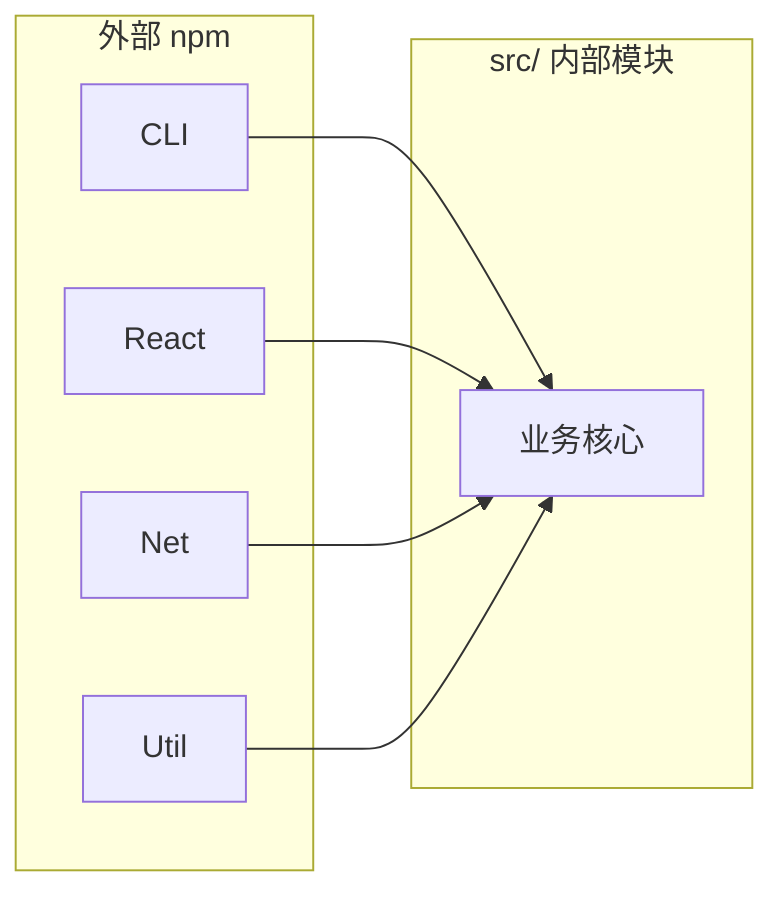
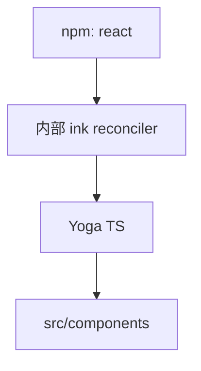
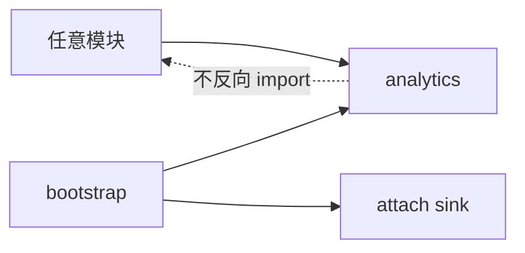
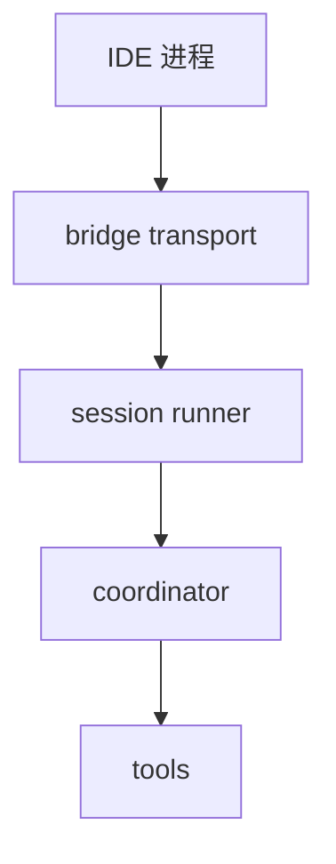
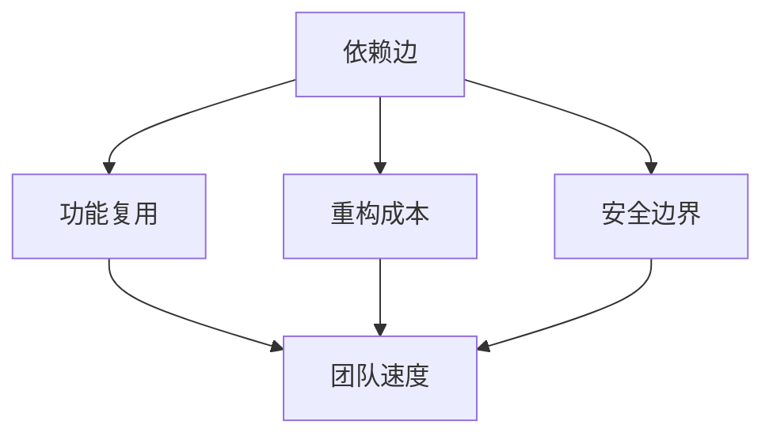

# 3.9 模块依赖关系：从「依赖图」理解演进边界

## 学习目标

完成本节后，你将能够：

1. 读出 **核心模块依赖图** 的主干方向（UI → 编排 → 服务 → 工具）
2. 解释为何要 **隔离 analytics、配置、错误处理** 以避免循环依赖
3. 将 **60+ npm 依赖** 按职能 **分桶**（CLI、React、网络、协议、工具库）
4. 识别 **「内部包」**（如定制 `ink/`）与外部 npm 的边界

---

## 3.9.1 生活类比：城市供水管网

应用模块像建筑，**依赖**像水管。**循环依赖**等于 **A 楼用水要经过 B 楼，B 又要经过 A**——一旦爆管，全城停水。工程上通过 **水厂（services）**、**分区阀门（接口层）** 把网拓扑变成 **有向无环图（DAG）** 倾向。

---

## 3.9.2 核心内部模块依赖图（概念 DAG）



**读图规则**：**自上而下**通常更安全；**底向上**引用呈现层 = 红色警报（多数情况下应避免）。

---

## 3.9.3 第二幅图：Agent 回合内的「动态依赖」

静态 import 图之外，**运行时**还有 **每轮对话** 的数据依赖：



---

## 3.9.4 npm 依赖分桶（60+ 包的读法）

> 具体包名与版本以仓库 `package.json` / `bun.lock` 为准。下表为 **教学分桶**，便于建立心智模型。

| 分桶 | 代表依赖类型 | 在 Claude Code 中的角色 |
|------|----------------|-------------------------|
| **CLI 与进程** | `commander`、`which`、`execa` 类 | 参数路由、子进程 |
| **React 生态** | `react`、`react-reconciler`（若显式） | 终端组件 |
| **终端与样式** | `chalk`、`ansi-*`、`wrap-ansi` 等 | 输出与测量 |
| **网络与 API** | `fetch` 封装、`ws` 等 | 模型与远程服务 |
| **协议与数据** | `zod`、`protobuf`/`msgpack` 类（若有） | 校验与序列化 |
| **Git 与 diff** | `simple-git` 等 | 仓库操作与展示 |
| **测试与构建** | `vitest`/`eslint` 等 devDeps | 质量保障 |



**学习策略**：不要背 60 个包名；遇到报错再 **定位到桶**，查文档效率更高。

---

## 3.9.5 关键内部包：`ink/` 不是 node_modules

| 类别 | 位置 | 备注 |
|------|------|------|
| **定制终端渲染** | 仓库内 `ink/`（示例路径，随版本） | 与 npm `ink` 不等价 |
| **布局** | Yoga TS 相关绑定 | 与 `components/` 协同 |
| **Bridge 协议** | `bridge/` TS 模块 | IDE 消息类型密集 |



---

## 3.9.6 循环依赖治理：案例式理解

### analytics 零依赖模式（概念）

```typescript
// 设计意图（摘自架构文档常见写法）
// analytics 模块不 import 其他业务模块
// 通过 attachSink 在启动晚期接线

let sink: Sink | null = null;

export function attachAnalyticsSink(s: Sink) {
  sink = s;
  flushQueue();
}

export function logEvent(name: string, meta: object) {
  if (!sink) enqueue(name, meta);
  else sink.send(name, meta);
}
```



**类比**：**单向门**——谁都能投递事件，但 analytics **不回调**业务。

---

## 3.9.7 `tools/` 对 `services/` 的依赖原则

| 允许 | 谨慎 | 避免 |
|------|------|------|
| 读配置、日志 | 重量级单例 | 工具 import UI 组件 |
| 调用网络客户端 | 隐式全局可变状态 | 工具间横向 import 成网 |

---

## 3.9.8 `bridge/` 依赖特点

- **强依赖** `services/`（会话、配置、日志）
- **弱耦合** `components/`（消息驱动 UI 更新，而非直接 new 组件）
- 与 **远程模式**、**IDE 能力协商** 交叉



---

## 3.9.9 依赖健康度自检清单

| 问题 | 工具建议 |
|------|----------|
| 谁引用了谁？ | `madge`、`skott`、或 ripgrep `from \"../` |
| 循环依赖？ | `madge --circular` |
| 包体积异常？ | `bun pm` / bundle 分析（若适用） |
| 重复依赖？ | `npm ls` / lockfile 审查 |

---

## 3.9.10 与「技术栈篇」的交叉对照

| 栈层 | 主要外部依赖 | 主要内部模块 |
|------|----------------|----------------|
| CLI | Commander | `main.tsx`、`commands/` |
| UI | React + 内部 ink | `components/`、`ink/` |
| 模型 | HTTP 客户端库 | `services/` 内客户端封装 |
| 工具 | 各类 util | `tools/` |

---

## 3.9.11 小结图：依赖 = 约束未来的力



---

## 本节小结

- **内部依赖图**以 **services/tools/coordinator** 为枢纽；**外部 npm** 以 **分桶**理解即可。
- **防循环**是大型 TS 项目的隐形架构；analytics 模式是经典教科书案例。
- 真仓库请始终以 **lockfile + madge** 为准，文档只提供 **导航语义**。

**上一节**：[08-main-entry.md](./08-main-entry.md) · **下一节**：[`10-philosophy.md`](./10-philosophy.md)
