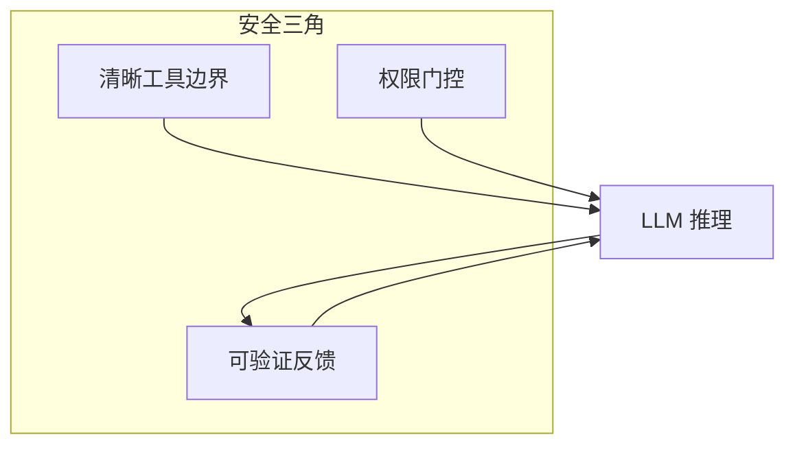
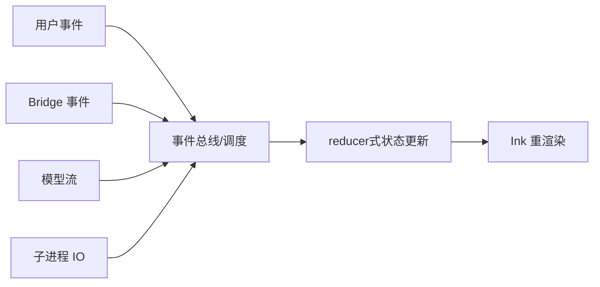
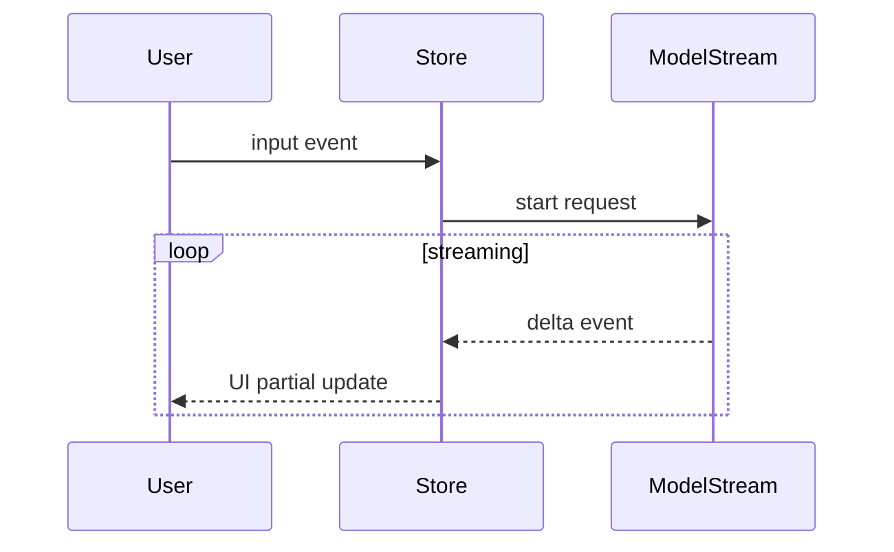
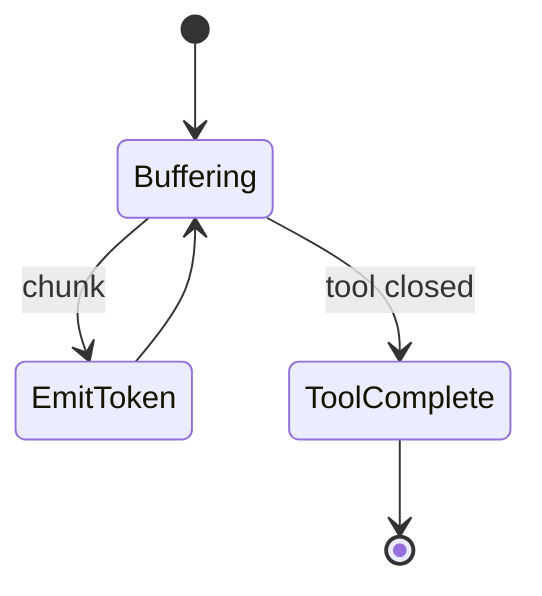
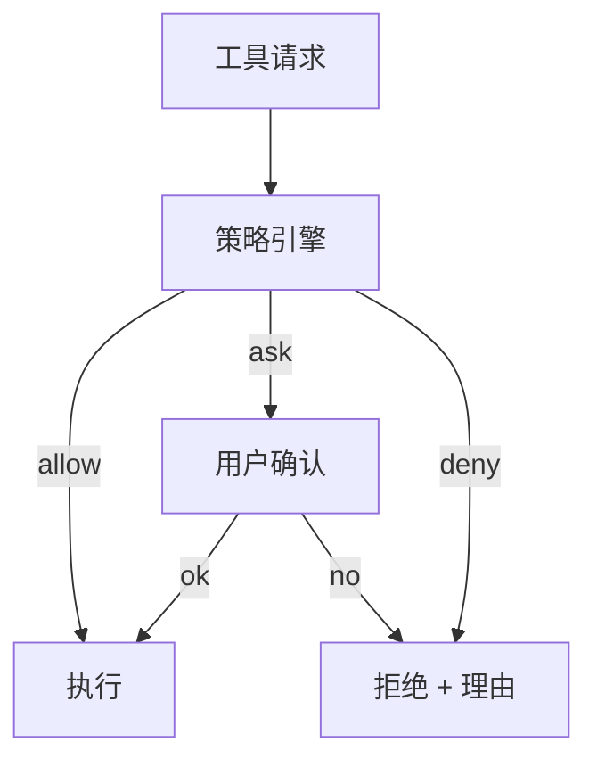
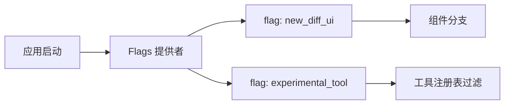
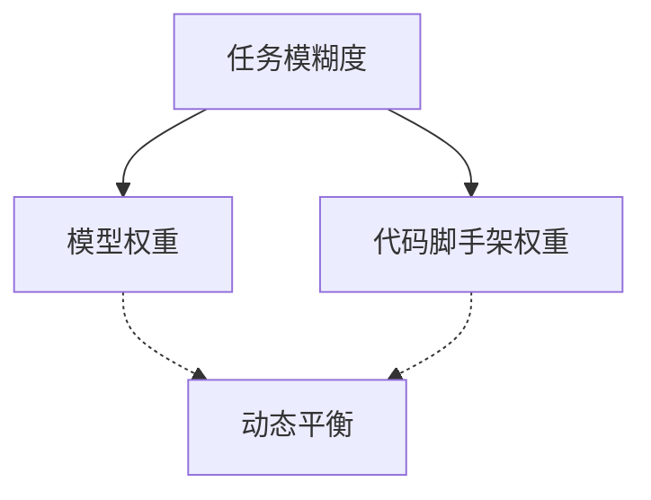
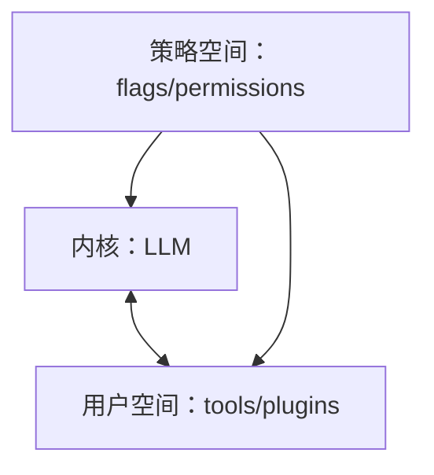
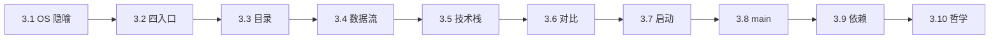

# 3.10 设计哲学总结：Less scaffolding, more model

## 学习目标

完成本节后，你将能够：

1. 用一句话解释 **「Less scaffolding, more model」** 在 Agent 架构中的含义与边界
2. 说明 **事件驱动** 与 **流式处理** 如何共同塑造终端体验
3. 将 **权限门控** 视为产品设计而非单纯安全补丁
4. 理解 **Feature Flags** 在「渐进发布」中的系统位置

---

## 3.10.1 核心理念：少脚手架，多模型

**Scaffolding** 在此泛指：硬编码业务流程、庞大 if-else 决策树、过度手写的任务状态机。**Model** 指：让 LLM 在 **工具边界清晰** 的前提下承担 **规划、纠错、解释**。

| 取向 | 优点 | 风险 |
|------|------|------|
| **多脚手架** | 行为可预测、易测 | 维护成本随场景指数爆炸 |
| **多模型** | 泛化强、迭代快 | 需 **工具/权限/验证** 三角约束 |

**生活类比**：模型像 **经验丰富的船长**；工具像 **舵轮与引擎**；权限像 **海事法规**。你要给船长 **决策权**，但不能给他 **随意凿船底的能力**。

---

## 3.10.2 事件驱动：UI、Bridge、工具结果的「多源时钟」

Claude Code 不是「请求-响应一次结束」，而是 **事件流**：

- 用户按键、粘贴、命令面板
- IDE Bridge 消息
- 模型 token 流
- 子进程 stdout 流
- 工具完成/失败回调

**第二幅图：从「轮询」到「推送」**

**要点**：事件驱动让 **多源异步** 共存；缺点是 **调试复杂**——需要良好日志与可重复会话导出。

---

## 3.10.3 流式处理：体验与协议的双宿主

1. **体验**：终端 UI 像聊天软件一样 **逐字出现**。
2. **协议**：工具调用可能以 **增量 JSON** 形式到达，需要 **流式解析器** 与 **强校验**（`zod` 等）。

| 非流式 | 流式 |
|--------|------|
| 等待整包响应 | 边到边展示 |
| 解析简单 | 需要状态机 |
| 延迟体感高 | 延迟体感低 |

---

## 3.10.4 权限门控：产品哲学，不是「吓唬用户」

**权限系统**在架构上实现三类目标：

1. **安全**：限制高危操作（删除、远程访问、凭据）
2. **可解释**：用户知道「AI 将要做什么」
3. **可配置**：团队策略与个人偏好共存

**与「9 层安检」叙事的关系**：安检不是羞辱用户，而是 **把不可逆动作变成可撤销决策**。

---

## 3.10.5 Feature Flags：渐进发布与 A/B

**Feature Flags** 让团队 **在同一二进制** 上：

- 灰度新工具、新 UI
- 快速关闭事故功能
- 分层遥测（与 GrowthBook 等集成，见 services 专章）

**生活类比**：Flags 像 **剧院彩排时的活动挡板**——观众席（全量用户）还没看到新布景，但演员（部分用户）可以先走台。

---

## 3.10.6 「Less scaffolding」的边界：什么时候该多写代码？

| 场景 | 倾向 |
|------|------|
| **确定性协议**（序列化、CRC、Git 对象格式） | 多代码、少模型 |
| **模糊需求探索**（产品原型、重构建议） | 多模型、强工具 |
| **合规审计** | 多日志、多策略、模型辅助但不可越权 |

---

## 3.10.7 遥测与隐私：哲学的一体两面

- **事件驱动** 让系统可观测；**可观测** 又需要 **最小化采集原则**。
- 常见工程约束：**禁止字符串型敏感元数据**、采样、可关闭。

（实现细节见 `services/analytics` 相关文档。）

---

## 3.10.8 与操作系统隐喻的收束

回到 `index.md` 的隐喻：若 LLM 是 **内核**，则：

- **事件 + 流式** = 中断与 DMA（直观类比，非严格学术）
- **权限** = capability
- **Feature Flags** = 内核参数动态调优

---

## 3.10.9 本篇（第 3 章）学习路线回顾

---

## 3.10.10 自测题（简答）

1. 为什么「多模型」必须配「清晰工具边界」？
2. 事件驱动架构下，**状态单一真源**应放在哪一层（概念即可）？
3. Feature Flags 与「分支发布」相比，最大工程优势是什么？

**参考答案方向**：

1. 否则模型会 **幻觉调用** 或 **参数胡编**，副作用不可控。
2. 通常在 **协调器 + store**；UI 只投影。
3. **同一产物渐进开闸**，降低发布矩阵复杂度。

---

## 本篇结语

第 3 篇从 **操作系统隐喻** 出发，经 **入口、目录、数据流、技术栈、竞品、启动、主入口、依赖**，最后落到 **设计哲学**。你此刻应能 **在源码树里不迷路**，并 **用架构语言** 与团队讨论演进。

若你接下来要深入：**工具系统** → 第 3 篇工具专章；**Bridge** → 第 9 篇；**状态管理** → 第 7 篇。

**上一节**：[09-dependencies.md](./09-dependencies.md) · **返回目录**：[index.md](./index.md)
