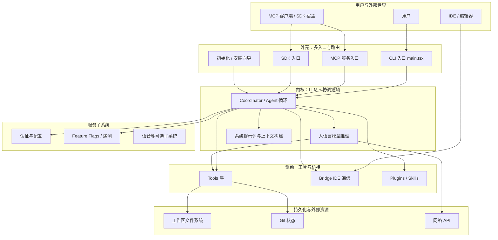
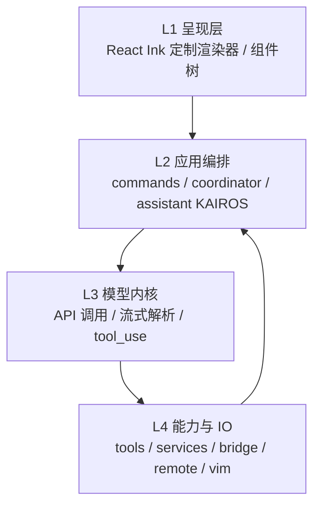
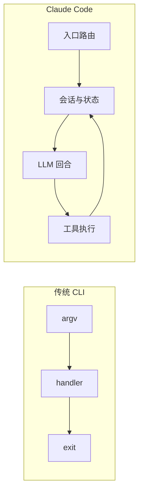
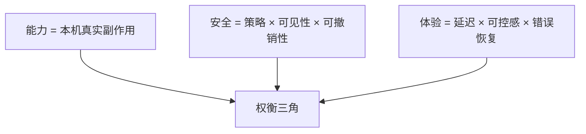
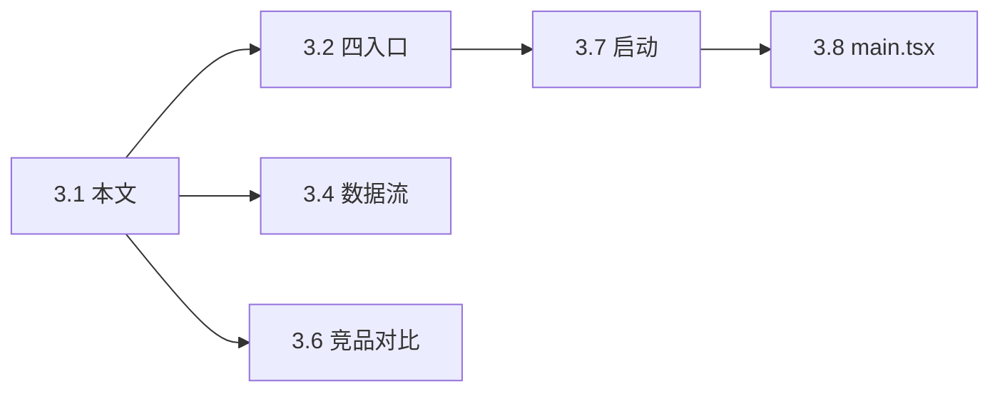

# 第 3 篇 · 3.1 不是 CLI，是「以 LLM 为内核的操作系统」

## 学习目标

完成本节后，你将能够：

1. 用「操作系统」隐喻理解 Claude Code 的整体定位，而不仅把它当成「又一个命令行工具」
2. 从多入口、进程/会话、权限、文件系统、插件生态五个维度，论证它与普通 CLI 的本质差异
3. 读懂一张「分层操作系统」式的架构示意图，并能向他人复述各层职责
4. 建立后续章节（四入口、目录结构、数据流、技术栈）的心理地图

---

## 3.1.1 核心论点：内核是 LLM，外壳是运行时与策略

如果把传统 CLI 工具比作**一把瑞士军刀**——功能再多，本质仍是「你拨一下、它动一下」的**被动工具**——那么 Claude Code 更接近**一台装了智能调度器的计算机**：

| 维度 | 普通 CLI 工具 | Claude Code（操作系统隐喻） |
|------|---------------|---------------------------|
| **调度中心** | 无，或仅脚本顺序执行 | **LLM** 持续规划、决策、纠错 |
| **I/O** |  stdin/stdout 为主 | 终端 UI、Bridge、MCP、SDK 多通道 |
| **资源** | 单次命令作用域 | **工具**、**服务**、**会话状态** 长期协作 |
| **安全** | 通常「全有或全无」（当前 shell 权限） | **多层门控**（权限、确认、沙箱策略等） |
| **扩展** | 子命令/插件零散 | **插件、Skills、MCP** 形成生态位 |

**生活类比**：普通 CLI 像**自动售货机**——你按按钮、掉货；Claude Code 像**带门禁与工牌的办公楼**——有前台（入口路由）、物业（服务层）、安保（权限）、装修队（工具执行），而「大楼的大脑」是 LLM 对任务的持续推理。

---

## 3.1.2 为什么说它是「操作系统」而非「大脚本」？

操作系统（OS）的典型特征包括：**多程序入口**、**进程/任务生命周期**、**权限与安全模型**、**统一文件与设备抽象**、**可扩展的软件生态**。Claude Code 在工程形态上与之对应：

1. **多入口**：同一套核心能力，可通过 CLI、`main.tsx` 启动路径、MCP 服务模式、SDK 编程模式进入（详见 `02-four-entries.md`）。
2. **进程/会话管理**：Agent 会话、Bridge 与 IDE 的跨进程通信、远程模式等，都涉及**长生命周期**与状态恢复，而非「一条命令结束即消失」。
3. **权限系统**：工具调用前的允许/拒绝、用户确认、策略配置——类似 OS 的 **capability** 思想。
4. **文件系统访问**：大量工具围绕读写、搜索、Git、diff 展开，相当于在「用户工作区」这一**挂载卷**上作业。
5. **插件生态**：Plugins、Skills、MCP 服务器——类似 OS 上的**驱动与扩展包**。



---

## 3.1.3 分层视角：从「终端画面」到「模型决策」

再缩小一层粒度，可以把运行时看成 **呈现层 → 应用编排 → 模型内核 → 工具与 IO**：



**类比**：L1 是**屏幕和键盘**；L2 是**窗口管理与任务栏**；L3 是**CPU 执行指令**（这里换成 LLM 生成「下一步」）；L4 是**磁盘、网卡、USB**（工具与外部世界）。注意 **L4 → L2 的回路**：工具结果会回到编排层，进入下一轮推理——这是 Agent 循环，不是单次管道。

---

## 3.1.4 与普通「开发类 CLI」的对比表

| 对比项 | 典型 CLI（如构建器、脚手架） | Claude Code |
|--------|------------------------------|-------------|
| **主循环** | 解析参数 → 执行 → 退出 | **对话/Agent 循环**，可长期驻留 |
| **状态** | 多为无状态或配置文件 | 会话、历史、压缩上下文、Bridge 会话等 |
| **扩展点** | 固定子命令 | MCP、Plugin、Skill、内部 Feature Flag |
| **UI** | 日志行 | **自研 Ink + Yoga** 的富终端 UI |
| **风险面** | 本地命令即用户权限 | **显式门控** + 可配置策略（多道安检） |



---

## 3.1.5 关键源码「锚点」（阅读路线）

以下路径为**教学用锚点**：具体仓库版本可能微调，但职责分区稳定，便于你在源码树中「着陆」：

```typescript
// 概念锚点：命令行入口通常集中注册子命令（Commander.js）
// 实际文件：src/main.tsx（体量很大，宜配合 08-main-entry.md 分段阅读）
program
  .name("claude")
  .description("...")
  // .command(...) 注册各命令 → 对应 src/commands/
```

```typescript
// 概念锚点：工具注册与调用 —— OS 的「系统调用」入口
// 实际目录：src/tools/（数十个工具模块）
export const toolDefinitions = [
  // read, write, bash, grep, ...
];
```

**学习建议**：先记住「**一个内核（LLM）+ 多入口 + 工具 syscall + 权限门控**」四句话，再进入 `02-four-entries.md` 看四种「开机方式」。

---

## 本节小结

- Claude Code 的**产品形态**在终端，但**系统形态**是围绕 LLM 的**长期运行、可扩展、带安全策略的代理平台**。
- 用操作系统分层图理解 **入口 / 协调 / 模型 / 工具 / 持久化** 最不容易迷路。
- 与普通 CLI 的本质区别不在「能不能跑命令」，而在**是否有 Agent 闭环**与**工程化安全与扩展**。

**下一节**：[`02-four-entries.md`](./02-four-entries.md) —— 四种独立入口如何分流到同一套核心能力。

---

## 3.1.6 术语迷你表（本篇通用）

| 术语 | 零基础解释 |
|------|------------|
| **Agent** | 能多步执行任务、会根据结果调整策略的程序化「搭档」 |
| **tool / tool_use** | 模型发起、运行时真正执行的「能力调用」（读文件、跑命令等） |
| **Bridge** | 与 IDE 的跨进程通信子系统，让终端代理与编辑器协同 |
| **MCP** | 标准协议层，便于不同客户端接入同一后端能力 |
| **Reconciler** | React 将「状态变更」映射到「终端节点更新」的协调器 |

---

## 3.1.7 安全与能力的「再平衡」示意图



**读图方式**：任何把 **能力** 拉满的产品，必须在 **安全** 与 **体验** 上付利息；Claude Code 选择 **显式门控** 来付息，而不是假装没有风险。

---

## 3.1.8 常见追问（FAQ）

**Q：既然有 Bridge，为什么还要强终端？**  
A：终端在 **SSH、CI、低图形环境** 下仍是 **最大公约数**；Bridge 是 **增强面**，不是 **替代面**。

**Q：把 LLM 叫「内核」会不会过度炒作？**  
A：这是 **教学隐喻**：强调 **调度权在模型**；真实计算机内核有严格数学定义，二者不可混为一谈。

**Q：我是前端，为什么要读 `tools/`？**  
A：因为 Agent 产品的「前端」不仅是 UI，还包括 **工具契约** 与 **错误反馈如何回到模型**——这决定交互是否「聪明」。

---

## 3.1.9 动手练习（不写代码也能做）

1. 打开官方或开源仓库，搜索 `command(` 与 `Tool`，各记下 **5 个命中文件名**。
2. 用本节的 OS 分层图，给每个文件名 **标上所属层**。
3. 向一位同事用 **2 分钟** 讲解「为什么不是普通 CLI」——不讲技术名词，只讲 **装修队类比**。

---

## 3.1.10 与后续章节的导航关系



完成 **3.1～3.4** 后，你具备「动态视角」；完成 **3.5～3.9** 后，你具备「静态地图」；**3.10** 负责把地图 **收束为价值观**，便于你做 **二次开发与内部选型**。
