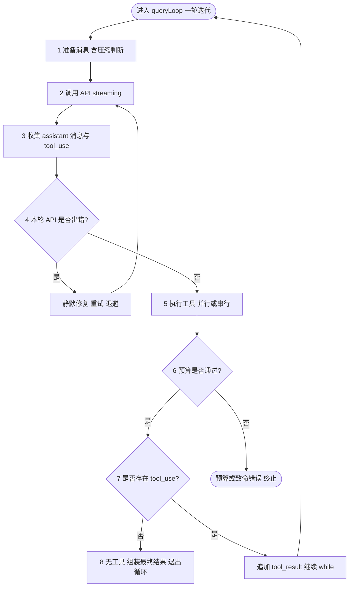
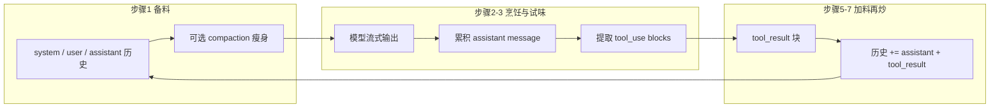
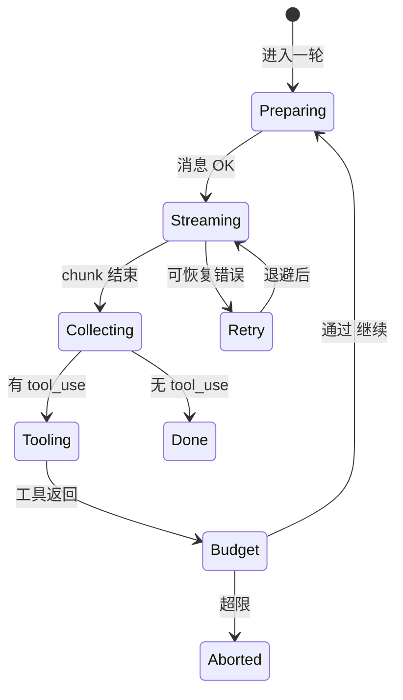

# 4.2 八步循环：QueryEngine 的「主菜流水线」

> **本节学习目标**
>
> - 背下 **8 步循环** 的顺序与职责，并能用自己的话复述。
> - 通过 **Mermaid 流程图** 建立「数据—控制流」双视角。
> - 用 **厨师做菜** 类比，把抽象步骤映射到可感知场景。

---

## 八步口诀（建议朗读三遍）

1. **准备消息**（压缩如需）  
2. **调用 API**（streaming）  
3. **收集响应 + 工具请求**  
4. **处理错误**（静默修复）  
5. **执行工具**  
6. **检查预算**（token / 金钱 / 轮次）  
7. **有工具则发送结果继续**  
8. **无工具则退出**

下面这张表是「职责—产出」速查。

| 步骤 | 核心动作 | 主要产出 | 若失败常见后果 |
|------|----------|----------|----------------|
| 1 | 组装 `messages[]`，触发压缩 | 可发送的上下文窗口 | 压缩熔断、上下文爆炸 |
| 2 | `stream: true` 调 Messages API | SSE / chunk 流 | 网络错误 → 进入步骤 4 |
| 3 | 解析 `content` 块 | 文本 + `tool_use` 列表 | 解析异常 → 重试或降级 |
| 4 | 分类错误、退避、重试 | 恢复后的流或终止决策 | 用户无感或温和提示 |
| 5 | 并行/串行执行工具 | `tool_result` 块 | 权限拒绝、工具超时 |
| 6 | 估算 token、费用、轮次 | `continue` / `break` | **硬停止** |
| 7 | 把工具结果追加进历史 | 下一轮 `messages` | 历史不一致 |
| 8 | 无 `tool_use` | `return` 最终结果 | 正常结束 |

---

## 总览流程图（控制流）



---

## 数据流视角：消息袋如何变重又变轻



**厨师类比**：

- **步骤 1**：开餐前清点食材（历史），冰箱塞不下就做 **真空压缩**（Compaction）。
- **步骤 2～3**：开火炒菜，师傅边做边尝（streaming），同时记下「要去冷库取哪几样配料」（`tool_use`）。
- **步骤 5～7**：小工取回配料（工具执行），把新配料倒进锅（`tool_result`），**同一道菜继续炒**（下一轮循环）。

---

## 逐步详解（与厨师流水线对照）

### 步骤 1：准备消息（压缩如需）

- **做什么**：把 `State` 里的会话历史整理成 API 接受的 `messages` 数组；若上下文占用超过阈值（教学中常记 **约 87%** 窗口），触发 **自动压缩**。
- **厨师类比**：备菜台只那么大，先把 **切好的半成品** 装进统一规格的保鲜盒（摘要），腾出台面。

详见：[4.4 消息准备与历史](./04-message-preparation.md)。

### 步骤 2：调用 API（streaming）

- **做什么**：向 Anthropic **Messages** 端点发起 **流式** 请求；底层多为 SSE 或等价 chunk 协议。
- **厨师类比**：师傅炒菜时 **不断翻动**（chunk），而不是炒完一整锅才端出来。

详见：[4.5 API 调用与流式响应](./05-api-streaming.md)。

### 步骤 3：收集响应 + 工具请求

- **做什么**：在流式解析器里拼接完整 `assistant` 消息；扫描 `content` 中的 **`tool_use`** 块，收集 `id`、`name`、`input`。
- **厨师类比**：师傅一边炒一边 **写小纸条**：「需要去冷库取 X、Y」。

详见：[4.6 工具请求收集](./06-tool-collection.md)。

### 步骤 4：处理错误（静默修复）

- **做什么**：对 **429 速率限制**、**5xx**、**网络抖动** 等做 **退避 + 重试**；尽量不让用户看到堆栈。
- **厨师类比**：油烟机突然响了（API 咳嗽），师傅 **关火等两秒再开**（backoff），客人只感觉「火候稳」。

详见：[4.7 静默错误修复](./07-silent-error-handling.md)。

### 步骤 5：执行工具

- **做什么**：根据工具元数据决定 **并行**（`isConcurrencySafe`）或 **串行**；与权限系统交互后真正执行。
- **厨师类比**：洗生菜和烧开水 **可同时进行**；但「切生肉」与「拌沙拉」可能要 **分开台面**（串行）。

详见：[4.11 并行工具执行器](./11-parallel-executor.md)。

### 步骤 6：检查预算

- **做什么**：三重关卡——**Token 窗口**（常记 **200K 量级**）、**金钱预算**、**maxTurns 轮次**。
- **厨师类比**：餐厅打烊前要看 **煤气表、食材成本单、今日接单次数**。

详见：[4.8 预算三重关卡](./08-budget-checks.md)。

### 步骤 7：有工具则发送结果继续

- **做什么**：把每个 `tool_use` 的 `tool_result` 按 API 规范塞回 `messages`，`continue` 外层循环。
- **厨师类比**：小工把取回的配料 **交回灶台**，师傅 **继续炒同一道菜**。

### 步骤 8：无工具则退出

- **做什么**：若模型本轮 **未请求工具**（或仅输出文本），组装最终 UI 状态，`return` / `break` 离开 `queryLoop`。
- **厨师类比**：菜已装盘，**关火收工**。

详见：[4.9 循环终止条件](./09-termination.md)。

---

## 序列图：一轮迭代中的「时间顺序」

```mermaid
sequenceDiagram
  participant Loop as queryLoop
  participant Prep as 消息准备
  participant API as Messages API
  participant Parse as 流解析器
  participant Tools as 工具执行器
  participant Bud as 预算检查

  Loop->>Prep: 1 准备消息
  Prep-->>Loop: messages[]
  Loop->>API: 2 streaming 请求
  API-->>Loop: chunk 流
  Loop->>Parse: 3 累积 assistant + tool_use
  Parse-->>Loop: 完整消息 + 工具列表
  alt API 错误
    Loop->>Loop: 4 静默重试 / 退避
  end
  Loop->>Tools: 5 执行工具
  Tools-->>Loop: tool_result[]
  Loop->>Bud: 6 预算检查
  alt 预算失败
    Bud-->>Loop: 终止
  else 预算通过
    alt 有 tool_use
      Loop->>Loop: 7 注入结果 继续下一轮
    else 无 tool_use
      Loop->>Loop: 8 结束 返回
    end
  end
```

---

## 「while(true)」并不可怕：退出条件在 6、7、8 汇聚

初学者看到 `while (true)` 会紧张。实际上 **出口** 由三类条件共同把守：

| 出口类型 | 典型触发 | 在哪一步最密集 |
|----------|----------|----------------|
| 正常完成 | 无 `tool_use` | 步骤 8 |
| 预算耗尽 | token / 钱 / 轮次 | 步骤 6 |
| 用户中断 | 信号 / UI 取消 | 任意 `yield` 间可协作取消 |
| 致命错误 | 不可恢复、压缩熔断 | 步骤 1 或 4 |



---

## 与异步生成器的结合点

八步循环 **不是** 一次性跑完再返回；而是在 **步骤 2～3** 持续 `yield`：

```typescript
// 教学伪代码：步骤 2-3 与 yield 交织
for await (const chunk of apiStream) {
  const partial = parser.push(chunk);
  if (partial?.type === "content_block_delta") {
    yield { kind: "stream", delta: partial }; // UI 实时显示
  }
}
const finalAssistant = parser.finalize();
const toolUses = extractToolUses(finalAssistant);
```

这解释了为何 **心脏** 必须用生成器：**步骤与可观测性** 同构。

---

## 小结

- **8 步** 是 QueryEngine 的 **主节拍**：准备 → 问模型 → 收工具意图 → 容错 → 动手 → 算账 → 有工具再转一圈 → 没工具就停。
- **厨师做菜** 类比帮助记忆：**备料—翻炒—写配料单—处理灶火不稳—取料—看成本—回锅—装盘**。
- 下一篇将把这一切 **钉回 `query.ts` 的真实骨架**：[4.3 query.ts 逐段走读](./03-source-walkthrough.md)。
