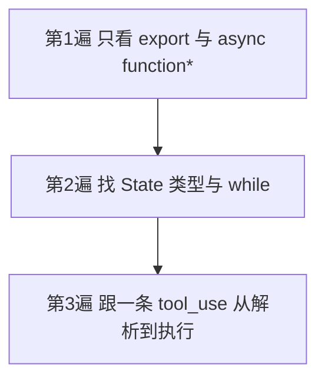
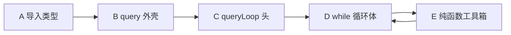
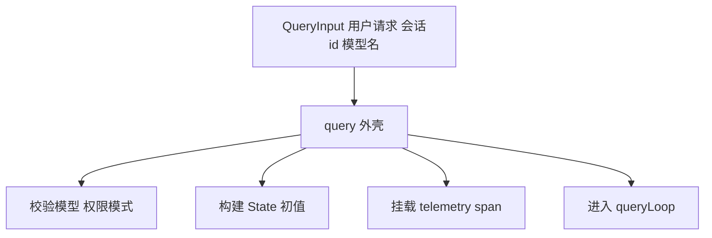
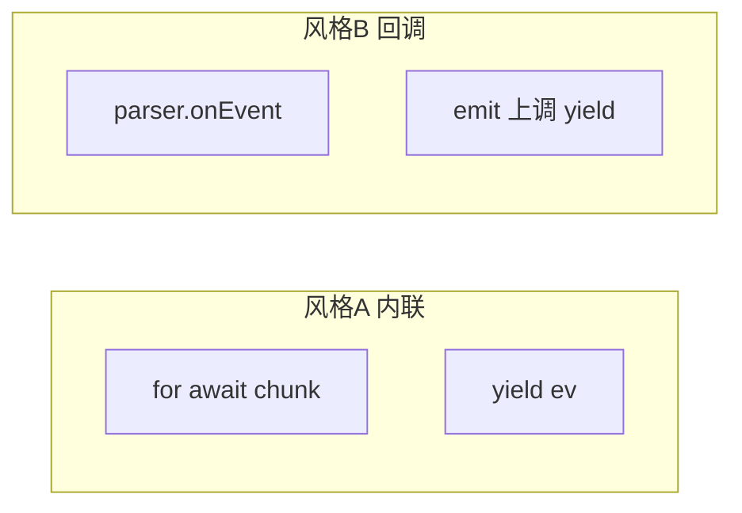
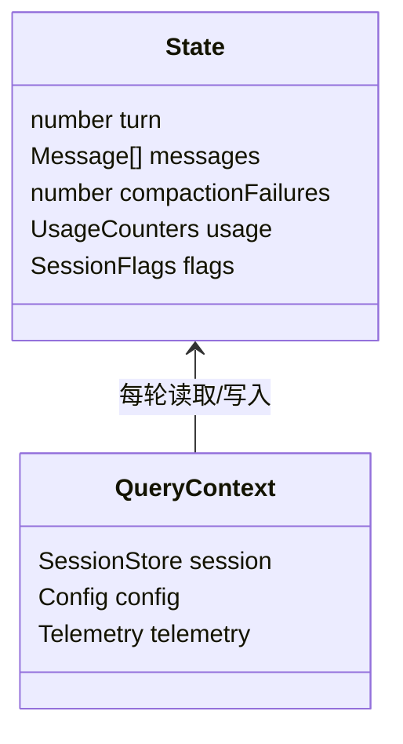
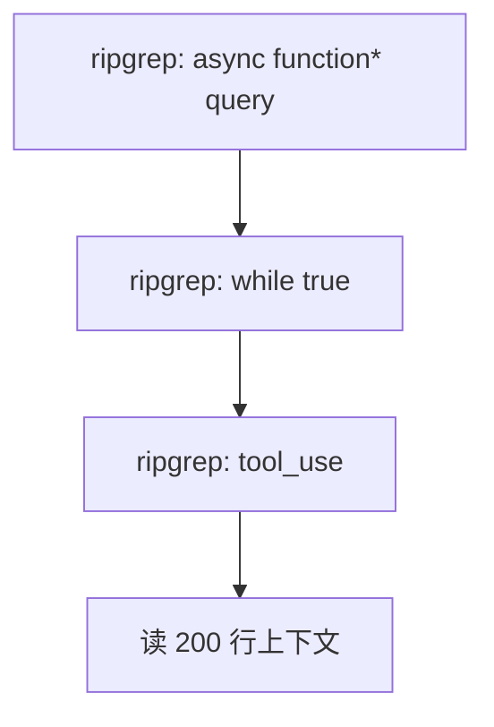

# 4.3 `query.ts` 逐段走读：从 `query()` 外壳到 `while(true)` 心室

> **本节学习目标**
>
> - 能在白板上画出 **`query` → `queryLoop` → `State` → 循环体** 四层结构。
> - 理解 **为何** 把「初始化」与「无限迭代」拆开，而不是写成一个巨型函数。
> - 对照下面 **分段伪代码**，在真实仓库中快速定位同名符号（函数名可能因版本略有差异）。

---

## 读源码的心态：1730 行不是 1730 个概念

`query.ts` 行数多，主要来自：

| 来源 | 你应关注的抽象 |
|------|----------------|
| 类型定义与联合判别 | `StreamEvent`、`ToolUseBlock` |
| 遥测 / 日志 / Feature Flag 分支 | 可略读，知道「有开关」即可 |
| 错误处理与重试 | 与 [4.7](./07-silent-error-handling.md) 对照 |
| 工具与权限交接 | 与 [4.6](./06-tool-collection.md)、Part 权限篇对照 |

**读法**：先抓 **骨架**，再按需「钻血管」。



---

## 地图：`query.ts` 推荐的「五段式」划分

下面分区名是 **教学标签**，真实文件可能把部分逻辑拆到 `*.ts` 友元模块，但 **语义分区** 稳定。

| 区段 | 典型内容 | 关联小节 |
|------|----------|----------|
| A. 导入与类型 | SDK、内部 `Message`、`Tool` 类型 | 全书各处 |
| B. `query()` 外壳 | 参数归一、遥测、构造初始 `State` | 本节 |
| C. `queryLoop()` 签名 | `AsyncGenerator` 的 yield 类型 | 本节 |
| D. `while (true)` 体 | 8 步循环主逻辑 | [4.2](./02-eight-steps.md) |
| E. 辅助纯函数 | `extractToolUses`、`estimateTokens` 等 | 4.4～4.8 |



---

## 区段 A：导入层——心脏的「供血名单」

教学上你把 import 想成 **术前核对器械**：

```typescript
// 教学示意：import 区块常出现这些「家族」
import Anthropic from "@anthropic-ai/sdk"; // 或等价封装
import type { MessageParam, ContentBlock } from "./types/messages";
import { runToolExecutor } from "./tool-executor"; // 名称示意
import { maybeCompactConversation } from "./compaction"; // 名称示意
import { checkBudgets } from "./budget"; // 名称示意
```

| 依赖家族 | 用途 |
|----------|------|
| SDK / HTTP | 真正发起 Messages 请求 |
| 消息类型 | 保证 `role` 与 `content` 块合法 |
| 工具执行器 | 步骤 5 |
| 压缩模块 | 步骤 1 |
| 预算模块 | 步骤 6 |

---

## 区段 B：`query()` 外壳——一次性装配

**外壳原则**：把「只该做一次」的事从循环里踢出去，避免每轮重复付成本。



### 伪代码：外壳长什么样？

```typescript
export async function* query(
  input: QueryInput,
  ctx: QueryContext,
): AsyncGenerator<StreamEvent, QueryResult, undefined> {
  // 1) 参数与模式归一（例如从 CLI flag 合并）
  const mode = resolvePermissionMode(input, ctx.config);

  // 2) 构造初始 State：轮次=0、历史来自会话存储
  let state: State = {
    turn: 0,
    messages: await ctx.session.loadMessages(input.threadId),
    model: input.model,
    compactionFailures: 0,
    // ... 预算指针、元数据 ...
  };

  // 3) 可选：最外层 try/finally 做 span.end()
  try {
    yield* queryLoop(state, ctx, mode);
  } finally {
    await ctx.telemetry.flush();
  }
}
```

**生活类比**：`query()` 像 **婚礼前的彩排安排**：确认场地、名单、流程表；真正 **每一遍走位** 在 `queryLoop()`。

---

## 区段 C：`queryLoop()`——异步生成器的「心室入口」

注意返回类型：**`AsyncGenerator<Yield, Return, Next>`**。

```typescript
async function* queryLoop(
  state: State,
  ctx: QueryContext,
  mode: PermissionMode,
): AsyncGenerator<StreamEvent, QueryResult, undefined> {
  while (true) {
    // ... 见下一区段 ...
  }
}
```

| 泛型参数 | 在 QueryEngine 中的实例化直觉 |
|----------|------------------------------|
| `Yield` | `StreamEvent`（流式 token、工具状态、系统提示） |
| `Return` | `QueryResult`（最终文本、用量统计、退出原因） |
| `Next` | 多为 `undefined`（CLI 不向生成器「投喂」中间值） |

```mermaid
sequenceDiagram
  participant Shell as query 外壳
  participant Loop as queryLoop
  participant Consumer as for await UI

  Shell->>Loop: yield* 委托
  loop 每一轮 while
    Loop-->>Consumer: yield StreamEvent
    Consumer-->>Loop: next() 继续
  end
  Loop-->>Shell: return QueryResult
```

---

## 区段 D：`while (true)` 循环体——八步落地

下面是 **结构级伪代码**，把 [4.2 的八步](./02-eight-steps.md) 嵌进真实控制形状：

```typescript
while (true) {
  state.turn += 1;

  // === 1. 准备消息（压缩如需）===
  state.messages = await prepareMessagesWithCompaction(state, ctx);
  if (state.compactionCircuitOpen) {
    return finalizeResult(state, "compaction_circuit_breaker");
  }

  // === 2. 调用 API（streaming）===
  const stream = await createMessageStream(state.messages, ctx, { stream: true });

  // === 3. 收集响应 + 工具请求（yield 交织）===
  let assistantMsg: AssistantMessage;
  try {
    assistantMsg = await collectAssistantMessage(stream, (ev) => {
      // 边收边 yield —— 这是「心脏泵血」的关键
      // 在真实代码里可能是 generator 内部函数或 async iterator 包装
    });
  } catch (e) {
    // === 4. 处理错误（静默修复）===
    const recovered = await handleStreamError(e, ctx);
    if (!recovered) {
      return finalizeResult(state, "fatal_api_error");
    }
    continue; // 重试本轮
  }

  state.messages.push(assistantMsg);

  const toolUses = extractToolUses(assistantMsg);

  // === 6. 预算检查（工具执行前后都可能出现，实现可能分两处）===
  const budget = checkBudgets(state, ctx, assistantMsg);
  if (!budget.ok) {
    return finalizeResult(state, budget.reason);
  }

  if (toolUses.length === 0) {
    // === 8. 无工具则退出 ===
    return finalizeResult(state, "completed");
  }

  // === 5. 执行工具 ===
  const toolResults = await executeTools(toolUses, state, ctx, mode);

  // === 7. 有工具则发送结果继续 ===
  state.messages.push(...toolResults);
  continue;
}
```

### `collectAssistantMessage` 与 `yield` 如何缝合？

真实实现常见两种风格：

| 风格 | 优点 | 缺点 |
|------|------|------|
| 在 `queryLoop` 内联 `for await` + `yield` | 易读 | 函数会膨胀 |
| 传入 `emit(ev)` 回调，由外层 `yield` | 分层清晰 | 跳转多 |



---

## 区段 E：`State` 初始化——循环在记什么账？

**State** 不是 Redux 那种全局 store，而是 **「本轮会话的循环账本」**。

| 字段（教学名） | 含义 |
|----------------|------|
| `turn` / `maxTurns` | 当前轮次与用户配置上限 |
| `messages` | 完整对话历史（含 tool 块） |
| `compactionFailures` | 连续压缩失败次数，触 **熔断**（教学中常记 **连续 3 次**） |
| `usage` | 累积 input/output token，用于 **87% 阈值** 与费用 |
| `flags` | 是否用户取消、是否进入只读模式等 |



### 初始化时与循环中的变化

| 阶段 | `messages` | `turn` | `compactionFailures` |
|------|------------|--------|------------------------|
| `query()` 结束初始化 | 来自磁盘 / 内存会话 | `0` 或 `1`（依实现） | `0` |
| 每轮工具后 | 追加 `assistant` + `tool_result` | `+1` | 成功压缩则清零失败计数 |
| 压缩连续失败 | 可能不变或部分回滚 | - | `+1`，达阈值则熔断 |

---

## 如何自己在仓库里「锚定」行号？

1. 搜索 **`async function* query`** 或 **`function* query`**。  
2. 搜索 **`queryLoop`**、`**while (true)`**（注意有些版本用 `for (;;)`）。  
3. 搜索 **`tool_use`**、`**tool_result`** 字符串——快速跳到 **步骤 3、5、7**。  
4. 打开 Git blame（若你有重建仓库）：看 **最近修改** 是否集中在 **streaming 解析**。



---

## 小结

- **`query()`** 负责 **一次性的装配与收尾**；**`queryLoop()`** 负责 **可重复的八步节拍**。  
- **`State`** 是循环的 **账本**：历史、轮次、压缩失败、用量全在这里汇聚。  
- **`while (true)`** 的合法性由 **预算、无工具、熔断、用户取消** 共同保证出口。  

下一篇：[4.4 消息准备与历史](./04-message-preparation.md)。
