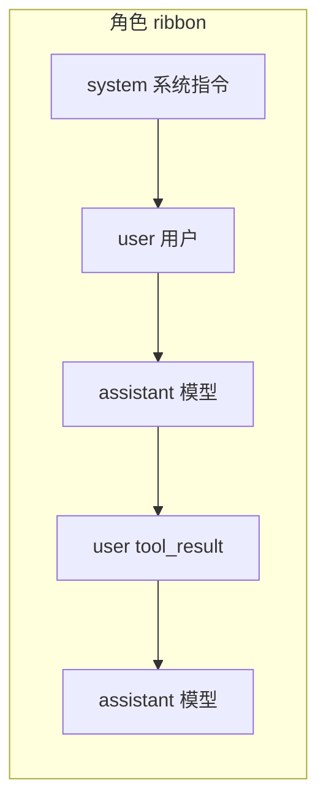
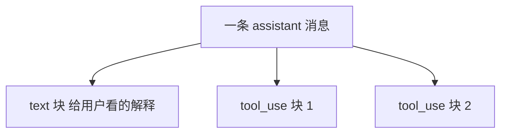
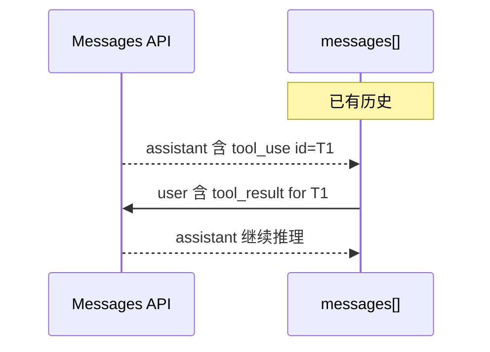
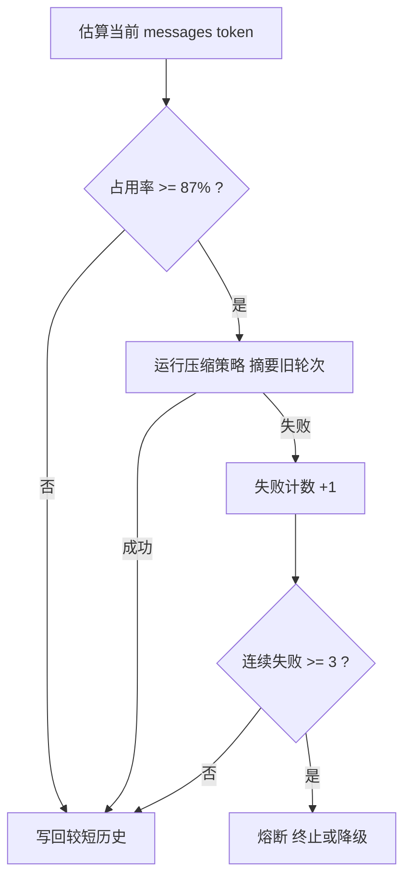
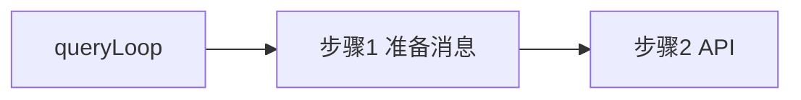

# 4.4 消息准备与历史：对话的「行李箱」怎么打包

> **本节学习目标**
>
> - 能画出 **`messages[]` 数组** 中 `system` / `user` / `assistant` 的相对位置与典型内容。
> - 理解 **为何要压缩**：窗口上限、成本、延迟三者的三角约束。
> - 记住教学中常用的 **87% 阈值** 与 **连续 3 次压缩失败熔断** 的工程意图。

---

## 消息数组：不是聊天记录那么简单

Anthropic **Messages API** 把一次「多轮对话」建模为 **有序消息列表**。在 QueryEngine 里，这个列表既是：

- **输入**：每轮 API 请求的 payload；  
- **输出载体**：模型返回的 `assistant` 消息会被 **追加** 回去；  
- **工具闭环**：`tool_use` 与 `tool_result` 必须 **成对、同序** 出现在历史中。



### 三种角色的「语气」与职责

| 角色 | 典型内容 | 可否包含 `tool_use`？ |
|------|----------|------------------------|
| `system` | 行为规范、工具说明摘要、项目 `CLAUDE.md` 注入 | 否（概念上） |
| `user` | 人类输入、**或** 工具结果包装块 | 否 |
| `assistant` | 自然语言 + **`tool_use` 块** | 是 |

**生活类比**：

- **system** 像 **员工手册**：所有人进场前读一遍。  
- **user** 像 **顾客点单 + 仓库回货单**（工具结果是「后台告诉前台」的事实）。  
- **assistant** 像 **店长口头回复 + 手写采购条**（`tool_use`）。

---

## `content` 块：一条消息内部的「乐高」

单条消息常见结构（教学简化）：

```typescript
type Message = {
  role: "user" | "assistant" | "system";
  content: ContentBlock[] | string; // 复杂场景多为块数组
};

type ContentBlock =
  | { type: "text"; text: string }
  | { type: "tool_use"; id: string; name: string; input: unknown }
  | { type: "tool_result"; tool_use_id: string; content: unknown }
  // thinking 等扩展见 4.10
  ;
```



### 为何用块数组而不是纯字符串？

| 方案 | 优点 | 缺点 |
|------|------|------|
| 纯字符串 | 人类可读 | 工具调用难结构化、难校验 |
| 块数组 | API 原生、可混合文本与工具 | 客户端需维护拼接顺序 |

---

## 历史追加规则：工具轮的特殊形状

当模型在一轮里发出工具调用，后续 **必须** 出现携带 `tool_result` 的 `user` 消息（或 SDK 约定的等价结构），且 `tool_use_id` **对齐**。



**错误示例（教学）**：漏掉 `tool_result` 或顺序颠倒 → API **400** 或模型 **胡编**（以为工具已执行）。

---

## 压缩（Compaction）：行李箱满了怎么办？

### 触发条件（教学口径）

| 信号 | 含义 |
|------|------|
| 估算上下文 token **≥ 窗口的 ~87%** | 主动压缩，留出安全余量给下一轮输出 |
| 用户显式触发 | 部分产品形态支持「整理上下文」 |
| 硬失败前 | 作为 **避免请求被拒** 的最后一道整理 |



### 连续 3 次失败熔断：为什么需要？

- **避免死循环**：压缩本身也调用模型 → 可能再失败 → 再压缩……  
- **保护用户钱包**：无意义的重复摘要请求会 **烧钱**。  
- **可观测性**：熔断后应 **明确退出原因**（见 [4.9](./09-termination.md)）。

**生活类比**：行李箱拉链卡住了，你不会无限 **用力硬拉三次以上**——第三次还失败就该 **换箱子策略**（清空、托运、分装），而不是和拉链搏斗一整天。

---

## 压缩策略家族（概念表）

| 策略 | 做法 | 代价 |
|------|------|------|
| 滑动窗口 | 丢掉最早若干轮 | 丢事实，可能忘需求 |
| 摘要替换 | 用短摘要替代大块 `user/assistant` | 摘要可能丢细节 |
| 结构化保留 | 保留「当前任务描述 + 最近 N 轮」 | 实现复杂 |
| 工具轨迹裁剪 | 删冗长 `tool_result`，保留结论 | 调试信息变少 |

真实 `query.ts` 往往组合多种策略，并受 **Feature Flag** 控制。

---

## `prepareMessages` 伪代码

```typescript
async function prepareMessagesWithCompaction(
  state: State,
  ctx: QueryContext,
): Promise<Message[]> {
  let messages = clone(state.messages);

  const usageRatio = await estimateContextUsageRatio(messages, state.model);
  if (usageRatio < 0.87) {
    return injectSystemIfNeeded(messages, ctx);
  }

  try {
    messages = await runCompaction(messages, ctx);
    state.compactionFailures = 0;
  } catch (e) {
    state.compactionFailures += 1;
    if (state.compactionFailures >= 3) {
      state.compactionCircuitOpen = true;
      throw new CompactionCircuitOpenError();
    }
    // 可能：降级为滑动窗口
    messages = fallbackTrim(messages);
  }

  return injectSystemIfNeeded(messages, ctx);
}

function injectSystemIfNeeded(messages: Message[], ctx: QueryContext): Message[] {
  // system 可能在队首合并，也可能与项目记忆拼接
  const system = buildSystemPrompt(ctx);
  if (messages[0]?.role === "system") {
    return [mergeSystem(messages[0], system), ...messages.slice(1)];
  }
  return [{ role: "system", content: system }, ...messages];
}
```

---

## 与 QueryEngine 八步的衔接



| 步骤 1 子任务 | 说明 |
|---------------|------|
| 归一化角色 | 修正畸形历史（崩溃恢复） |
| 注入系统提示 | `CLAUDE.md`、工具列表摘要 |
| 压缩判断 | 87% 阈值 |
| 失败熔断 | 连续 3 次 |

---

## 小结

- **`messages[]`** 是 QueryEngine 的 **主数据结构**：角色有序、`content` 分块、工具成对。  
- **压缩** 是 **步骤 1** 的核心压力阀：**87%** 触发、**三次失败** 熔断是典型工程护栏。  
- 下一篇进入 **步骤 2～3** 的动脉：[4.5 API 调用与流式响应](./05-api-streaming.md)。
