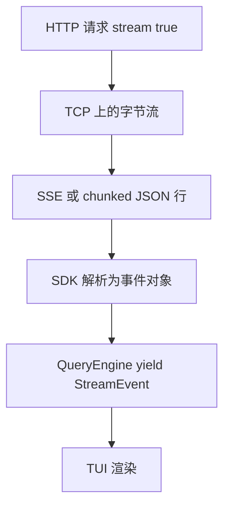
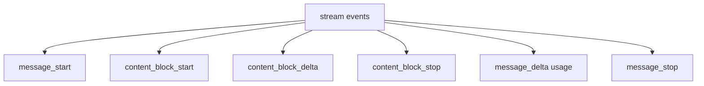
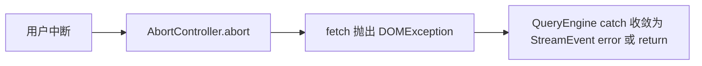
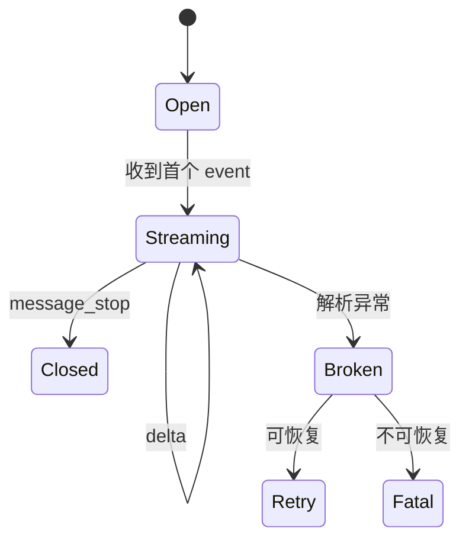

# 4.5 API 调用与流式响应：逐词「泵血」到终端

> **本节学习目标**
>
> - 理解 **Messages API** 在 QueryEngine 中的调用形状（`stream: true`）。  
> - 能把 **SSE / chunk** 事件映射到 **`yield StreamEvent`**。  
> - 区分 **网络字节流**、**SDK 事件**、**UI 增量** 三层。

---

## 非流式 vs 流式：餐厅上菜两种模式

| 模式 | 用户体验 | QueryEngine 亲和度 |
|------|----------|-------------------|
| 非流式 | 等整段生成完才显示 | 差：长推理像卡死 |
| 流式 | **边生成边显示** | 优：与 `async generator` 同构 |

**生活类比**：非流式像 **等整桌菜齐才上**；流式像 **火锅边涮边吃**——你立刻有反馈，心理等待时间更短。



---

## Anthropic Messages API：教学级请求骨架

真实字段名以 SDK 为准，下面是 **结构等价** 的 JSON 示意：

```json
{
  "model": "claude-sonnet-4-20250514",
  "max_tokens": 8192,
  "stream": true,
  "system": "你是 Claude Code 代理……",
  "messages": [
    { "role": "user", "content": "请读取 package.json" }
  ],
  "tools": [ /* 工具 schema 列表 */ ]
}
```

| 字段 | QueryEngine 侧职责 |
|------|-------------------|
| `model` | 来自配置 / CLI flag |
| `messages` | [4.4](./04-message-preparation.md) 准备 |
| `tools` | 工具注册表序列化 |
| `stream` | **必须为 true** 才能边下边解析 |

---

## 流式响应：事件类型「家族树」

不同版本 SDK 命名略有差异，教学中可归纳为：



### `content_block_delta`：UI 最关心的节点

```typescript
// 教学伪类型
type TextDelta = {
  type: "content_block_delta";
  index: number;
  delta: { type: "text_delta"; text: string };
};

type ToolInputDelta = {
  type: "content_block_delta";
  index: number;
  delta: { type: "input_json_delta"; partial_json: string };
};
```

| Delta 类型 | 说明 |
|------------|------|
| `text_delta` | 用户可见的逐段文本 |
| `input_json_delta` | `tool_use.input` 的 JSON **增量**（需拼接） |
| thinking 相关 | 见 [4.10](./10-thinking-mode.md) |

---

## 从字节到 `yield`：三层解码器

```mermaid
sequenceDiagram
  participant HTTP as HTTP 连接
  participant Line as 按行分割器
  participant JSON as JSON 解析
  participant Acc as 块累积器
  participant Loop as queryLoop

  HTTP-->>Line: raw chunk
  Line-->>JSON: data: {...}
  JSON-->>Acc: event object
  Acc-->>Loop: 可归一为 StreamEvent
  Loop-->>Loop: yield 给 UI
```

### 教学伪代码：`for await` + `yield`

```typescript
async function* streamAssistant(
  apiStream: AsyncIterable<StreamRawEvent>,
): AsyncGenerator<StreamEvent, AssistantMessage, undefined> {
  const acc = createMessageAccumulator();

  for await (const ev of apiStream) {
    acc.ingest(ev);

    // 立刻把「可展示增量」泵出去
    if (ev.type === "content_block_delta" && ev.delta.type === "text_delta") {
      yield {
        kind: "assistant_text_delta",
        text: ev.delta.text,
      };
    }

    if (ev.type === "content_block_delta" && ev.delta.type === "input_json_delta") {
      yield {
        kind: "tool_input_delta",
        index: ev.index,
        partialJson: ev.delta.partial_json,
      };
    }
  }

  return acc.finalizeAssistantMessage();
}
```

**要点**：`return` 的 `AssistantMessage` 在 TypeScript 异步生成器里需通过 **消费者** 特殊方式获取；真实代码可能用 **辅助结构** 或 **非 generator** 子函数。此处强调 **概念**：**yield 负责「过程」，`finalize` 负责「结果」**。

---

## 背压与取消：流式不是「无限快」

| 问题 | 工程对策 |
|------|----------|
| UI 渲染跟不上 | UI 侧节流（requestAnimationFrame / batching） |
| 用户 Ctrl+C | `AbortController` 中断 fetch |
| 网络抖动 | [4.7](./07-silent-error-handling.md) 重试 |



---

## `usage` 与流式结束：`message_delta`

流式结束前，服务器常通过 **`message_delta`** 报告 **本消息** 的 token 用量。QueryEngine 把它 **累加进 State**，供 [4.8 预算](./08-budget-checks.md) 使用。

```typescript
// 教学示意
if (event.type === "message_delta" && event.usage) {
  state.usage.input_tokens += event.usage.input_tokens ?? 0;
  state.usage.output_tokens += event.usage.output_tokens ?? 0;
}
```

| 字段 | 用途 |
|------|------|
| `input_tokens` | 窗口占用、计费 |
| `output_tokens` | 计费、是否逼近 `max_tokens` |

---

## 错误在流中途出现怎么办？

| 阶段 | 表现 | 归属步骤 |
|------|------|----------|
| 连接建立前 | `fetch` 失败 | 4.7 |
| 头几个 chunk 后 | HTTP 非 200 | 4.7 |
| 解析到一半 | JSON 行损坏 | 4.7，可能重试整轮 |



---

## 与八步循环的对照

| 八步 | 本节覆盖 |
|------|----------|
| 2 调用 API | 请求构造、`stream: true` |
| 3 收集响应 | accumulator 完结为 `assistant` 消息 |
| 4 错误 | 流中断的恢复策略（详见 4.7） |

---

## 小结

- **流式** 让 QueryEngine 与 **异步生成器** 天然契合：`content_block_delta` → **`yield`**。  
- 解码链路是 **字节 → 行 → JSON 事件 → 累积消息 → UI**。  
- **用量统计** 在流末尾回填 **State**，服务预算系统。  

下一篇：[4.6 工具请求收集](./06-tool-collection.md)。
