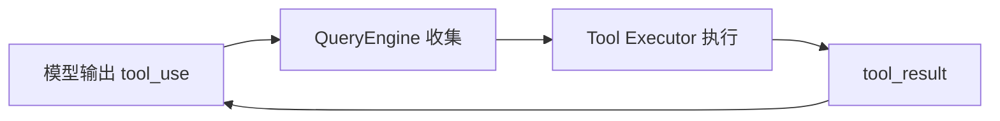
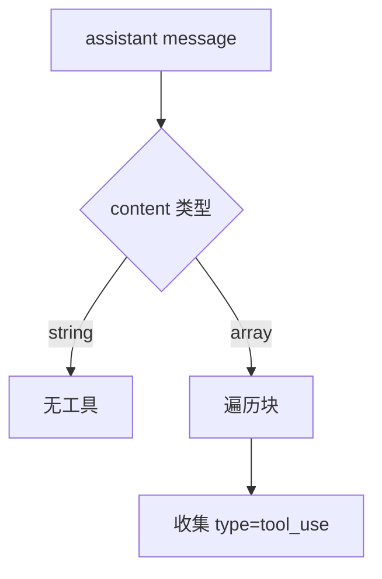
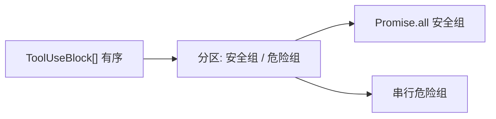
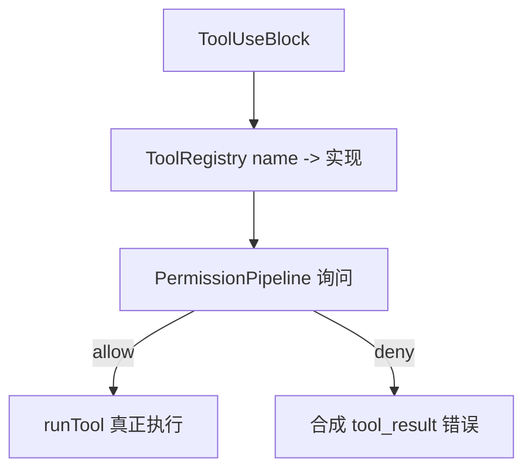

# 4.6 工具请求收集：从模型「意图」到可执行清单

> **本节学习目标**
>
> - 能从 `assistant` 消息的 `content` 中 **识别并提取** `tool_use` 块。  
> - 理解 **`ToolUseBlock`** 在内部如何传递，直到 **工具执行器** 接手。  
> - 知道 **多工具一轮** 时，顺序与 ID 的重要性。

---

## 工具调用在 API 里的长相

模型不「直接跑函数」；它输出结构化 **`tool_use`** 块，由客户端 **代为执行** 再把结果喂回。

```typescript
type ToolUseBlock = {
  type: "tool_use";
  id: string;        // 全局唯一，用于 tool_result 对齐
  name: string;      // 与注册表中的工具名一致
  input: unknown;    // 通常是对象，来自 JSON 解析
};
```

**生活类比**：模型写 **外包申请单**（`tool_use`），行政（QueryEngine）**盖章编号**（`id`），后勤部（工具执行器）**真正采购**（读文件、跑命令），再把 **发票复印件**（`tool_result`）交回模型。



---

## 流式阶段如何「长」出完整 `tool_use`

工具调用的 `input` 常通过 **`input_json_delta`** 一块块到达，需要 **拼接 + JSON.parse**。

```mermaid
flowchart TB
  subgraph stream["流式增量"]
    D1["partial { "]
    D2["\"path\": \"src"]
    D3["/index.ts\"}"]
  end
  subgraph acc["累积器"]
    BUF["raw buffer"]
    PARSE["JSON.parse 校验"]
    TU["ToolUseBlock"]
  end
  D1 --> BUF
  D2 --> BUF
  D3 --> BUF
  BUF --> PARSE --> TU
```

### 教学伪代码：块索引与 buffer

```typescript
class StreamingAccumulator {
  private buffers = new Map<number, string>();

  pushToolInputDelta(index: number, partial: string) {
    const prev = this.buffers.get(index) ?? "";
    this.buffers.set(index, prev + partial);
  }

  finalizeToolUse(index: number, name: string, id: string): ToolUseBlock {
    const raw = this.buffers.get(index) ?? "{}";
    let input: unknown;
    try {
      input = JSON.parse(raw);
    } catch {
      input = { _parse_error: true, raw };
    }
    return { type: "tool_use", id, name, input };
  }
}
```

| 风险 | 缓解 |
|------|------|
| JSON 未闭合就 `parse` | 只在 `content_block_stop` 后 parse |
| 模型生成非法 JSON | 标记错误，走 [4.7](./07-silent-error-handling.md) 或工具内纠错 |

---

## `extractToolUses`：从消息到数组

当流结束，`assistant` 消息应包含 0..N 个工具块（可与 `text` 块混排）。

```typescript
function extractToolUses(msg: AssistantMessage): ToolUseBlock[] {
  if (typeof msg.content === "string") {
    return [];
  }
  return msg.content.filter((b): b is ToolUseBlock => b.type === "tool_use");
}
```



---

## 多工具并行 vs 顺序：收集阶段要保守

**收集**本身不改变顺序——它只做 **列表化**。是否并行由 [4.11](./11-parallel-executor.md) 决策。

| 场景 | 典型策略 |
|------|----------|
| 三个 `read_file` 不同路径 | 可能并行（若均 `isConcurrencySafe`） |
| `edit` 后立刻 `read_file` 同路径 | 常需串行 |



---

## 分发：从 `ToolUseBlock` 到「具体实现」



### 教学伪代码

```typescript
async function dispatchToolUses(
  uses: ToolUseBlock[],
  ctx: QueryContext,
  mode: PermissionMode,
): Promise<ToolResultBlock[]> {
  const plan = buildExecutionPlan(uses, ctx.registry);
  const results: ToolResultBlock[] = [];

  for (const group of plan.groups) {
    if (group.mode === "parallel") {
      const chunk = await Promise.all(
        group.items.map((u) => executeOne(u, ctx, mode)),
      );
      results.push(...chunk);
    } else {
      for (const u of group.items) {
        results.push(await executeOne(u, ctx, mode));
      }
    }
  }

  return results;
}
```

---

## `tool_result` 块：收集的「镜像」

每个 `tool_use` 必须 **恰好对应** 一个 `tool_result`（教学中一对一；复杂实现可能有批处理，但 API 约束仍以 id 对齐为准）。

```typescript
type ToolResultBlock = {
  type: "tool_result";
  tool_use_id: string;
  content: unknown;
};
```

| 字段 | 常见错误 |
|------|----------|
| `tool_use_id` | 拼写错、重复用 id |
| `content` | 把大对象直接塞爆上下文 |

---

## 与八步循环的编号对齐

| 八步 | 本节对应 |
|------|----------|
| 3 | 从流与最终消息 **提取** `tool_use` |
| 5 | **执行**（收集之后） |
| 7 | 把 `tool_result` **写回** `messages` |


---

## 小结

- **`tool_use`** 是模型意图的 **结构化锚点**；`id` 是 **闭环凭证**。  
- 流式 JSON 需要 **缓冲—解析—校验** 三件套。  
- **收集**与 **执行** 解耦：前者产出 `ToolUseBlock[]`，后者对接 **权限 + 注册表**。  

下一篇：[4.7 静默错误修复](./07-silent-error-handling.md)。
