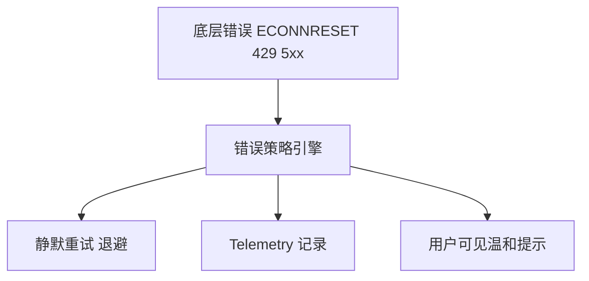
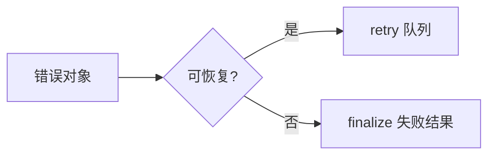
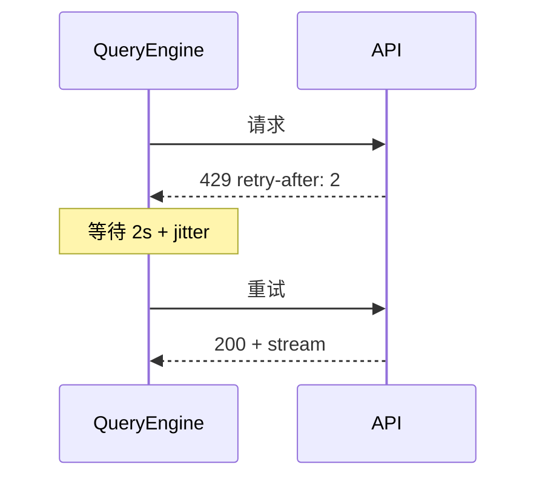
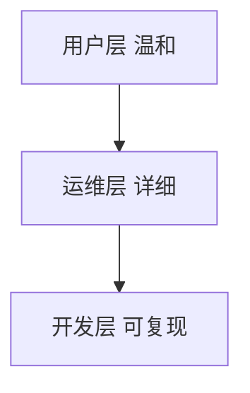
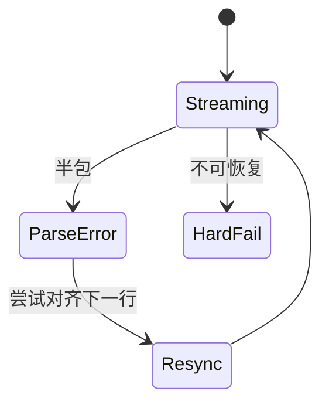
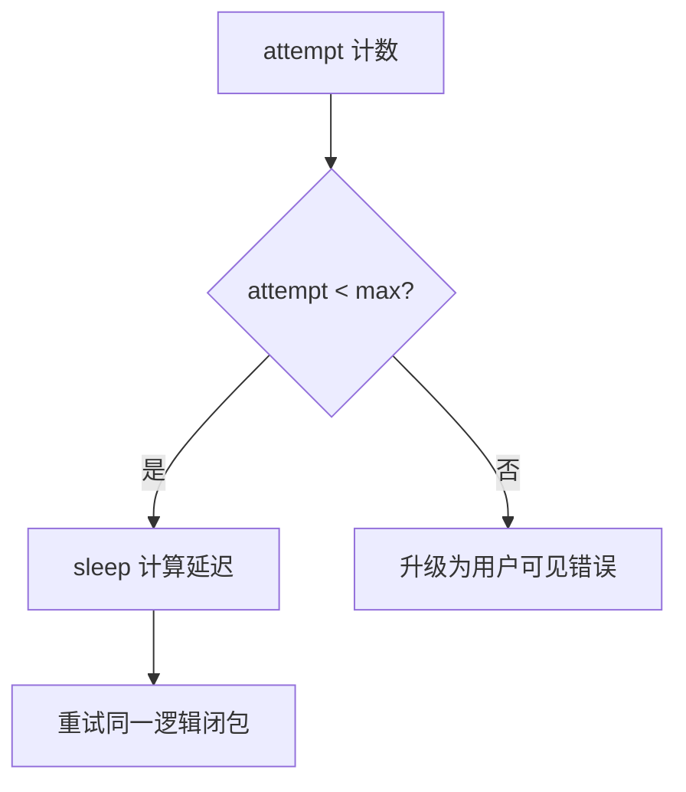
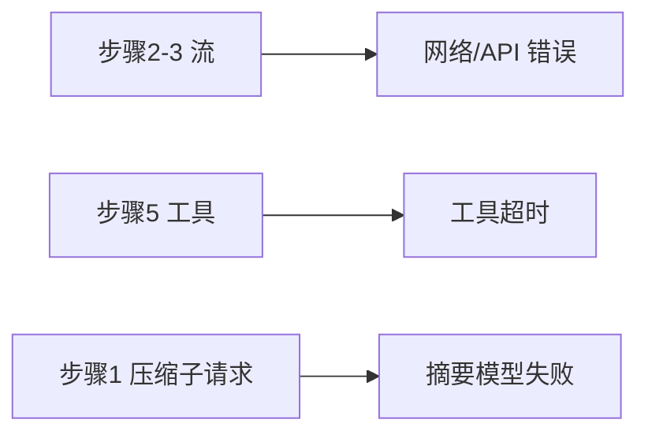

# 4.7 静默错误修复：用户看不见的「免疫系统」

> **本节学习目标**
>
> - 能对错误做 **粗分类**：API 错误 / 429 速率限制 / 网络超时 / 解析失败。  
> - 理解 **退避（backoff）+ 抖动（jitter）+ 上限（cap）** 三件套。  
> - 区分 **用户应知** 与 **应静默** 的边界，避免「沉默式失败」的伦理风险。

---

## 为何需要「静默」？

QueryEngine 面向 **交互式 CLI**：用户心理模型是「在和助手聊天」，而不是「在盯 nginx 日志」。

| 若每次都抛堆栈 | 体验后果 |
|----------------|----------|
| 打断心流 | 用户以为产品坏了 |
| 暴露内部路径 | 信息泄露风险 |
| 重复可恢复错误 | 显得「不智能」 |

**生活类比**：优秀服务员不会在客人面前 **大喊厨房着火了**；他会说「请稍等，我们为您重新上一份」——背后可能是 **重试一次出餐**。



---

## 错误分类矩阵

| 类型 | 典型信号 | 默认可恢复？ | 常见策略 |
|------|----------|--------------|----------|
| **429 速率限制** | HTTP 429、`retry-after` | 是 | 尊重 header 等待 |
| **5xx 服务端** | 502/503/504 | 是 | 指数退避重试 |
| **网络超时** | `ETIMEDOUT` | 是 | 重试 + 降并发 |
| **DNS / 断网** | `ENOTFOUND` | 视情况 | 有限次重试后提示 |
| **401/403 鉴权** | 密钥错、组织策略 | 否 | **必须**明确提示用户 |
| **400 请求体** | 消息结构不合法 | 多半否 | 记录上下文，可能需开发介入 |
| **压缩熔断** | 连续失败计数 | 否 | 终止并解释原因 |



---

## 重试策略：指数退避 + 抖动

### 公式（教学）

\[
\text{delay} = \min\left(\text{cap},\ \text{base} \times 2^{\text{attempt}} + \text{jitter}\right)
\]

| 参数 | 典型取值（示意） |
|------|------------------|
| `base` | 200ms～1s |
| `cap` | 30s～120s |
| `jitter` | 随机 0～250ms |

**为何要有 jitter？** 大量客户端同时 429 时，若都 **精确同一秒重试**，会造成 **重试风暴**。



### 教学伪代码

```typescript
async function withSilentRetries<T>(
  fn: () => Promise<T>,
  opts: { maxAttempts: number; baseMs: number; capMs: number },
): Promise<T> {
  let attempt = 0;
  // eslint-disable-next-line no-constant-condition
  while (true) {
    try {
      return await fn();
    } catch (e) {
      attempt += 1;
      if (attempt >= opts.maxAttempts || !isRetriableError(e)) {
        throw e;
      }
      const delay = computeBackoffWithJitter(attempt, opts.baseMs, opts.capMs);
      await sleep(delay);
      yieldRetryTelemetry(e, attempt); // 用户不可见
    }
  }
}
```

---

## 「静默」不是「隐瞒」：可观测性必须存在

| 渠道 | 内容 |
|------|------|
| 本地日志文件 | 完整 stack、request id |
| 遥测（若启用） | 错误码聚合 |
| UI | 一句「正在重试…」或进度条 |



**伦理边界**：若错误导致 **任务未完成**，最终仍应 **明确告知**「未完成的原因」，而不是无限重试后假装成功。

---

## 与流式解析错误的交织

| 阶段 | 错误 | 处理 |
|------|------|------|
| 半条 SSE 行 | JSON.parse 失败 | 丢弃坏行或整轮重试 |
| `message_stop` 未到达 | 连接断开 | 视为可恢复，重试本轮 |
| `tool_use` JSON 坏 | 输入非法 | 生成 `tool_result` 描述错误，让模型自纠 |



---

## 与八步循环的挂钩

| 八步 | 静默修复发生点 |
|------|----------------|
| 2～3 | API 流、解析 |
| 5 | 工具执行超时（可重试一次） |
| 1 | 压缩子请求失败（计入熔断） |

---

## 小结

- **分类**决定 **重试还是停机**；**429/5xx/超时** 常走静默恢复。  
- **退避 + jitter + cap** 是工业标准，防止 **重试风暴**。  
- **静默**面向 UI，**日志/遥测**面向真相——二者缺一不可。  

---

## 重试次数与退避：推荐配置表（教学）

下表 **不是** 泄露源码的硬编码值，而是 **工业 CLI** 常见量级，便于你做实验或读代码时对照。

| 错误族 | 建议 `maxAttempts` | `baseMs` | `capMs` | 备注 |
|--------|-------------------|----------|---------|------|
| 429 | 5～8 | 500 | 60000 | 优先读 `retry-after` |
| 503/502 | 3～5 | 300 | 30000 | 可略激进 |
| 网络抖动 | 3 | 200 | 15000 | 配合 DNS 缓存 |
| 解析半包 | 1～2 | 0 | 0 | 多 **重拉整流** 而非死 parse |



---

## `isRetriableError` 判别伪代码

```typescript
function isRetriableError(e: unknown): boolean {
  if (isHttpError(e)) {
    if (e.status === 429) return true;
    if (e.status >= 500 && e.status <= 599) return true;
    if (e.status === 408) return true; // Request Timeout
    return false;
  }
  if (isNodeNetError(e)) {
    return ["ECONNRESET", "ETIMEDOUT", "EAI_AGAIN"].includes(e.code);
  }
  return false;
}
```

| 返回 `false` 的典型情况 | 处理 |
|-------------------------|------|
| 401 | 引导用户检查 `ANTHROPIC_API_KEY` |
| 400 + `invalid_request_error` | 记录 `messages` 摘要到日志，避免上传密钥 |

---

## 与 QueryEngine 八步的「挂钩点」速查



| 步骤 | 可静默？ | 典型用户感知 |
|------|----------|--------------|
| 2～3 | 常可 | 「稍等」或无明显提示 |
| 5 | 部分可 | 工具卡片显示重试中 |
| 1 | 有限 | 压缩失败或触发熔断文案 |

---

## 可观测性字段：建议 always-on

| 字段 | 用途 |
|------|------|
| `request_id` | 对齐 Anthropic 支持工单 |
| `attempt` | 区分首次与重试 |
| `error_class` | `429` / `5xx` / `net` / `parse` |
| `backoff_ms` | 复盘退避是否合理 |

---

## 常见误解

| 误解 | 澄清 |
|------|------|
| 「静默 = 吞掉错误」 | 错：应 **记录 + 聚合**，只是 **默认不刷屏** |
| 「所有 400 都可重试」 | 错：多数 400 需 **修请求体** |
| 「重试越多越好」 | 错：会放大 **雪崩** 与 **账单** |

---

下一篇：[4.8 预算三重关卡](./08-budget-checks.md)。
