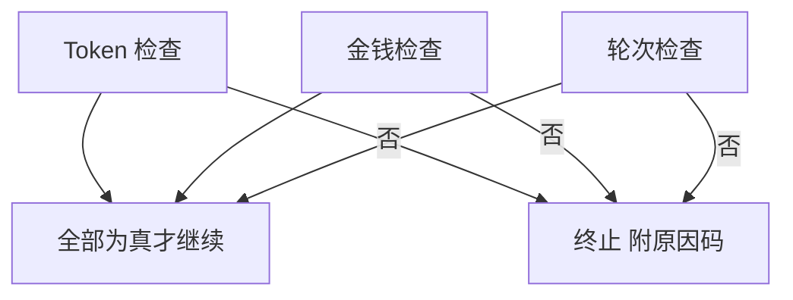
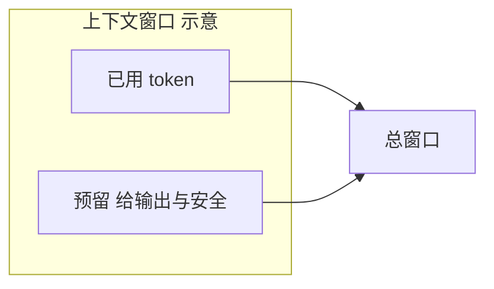
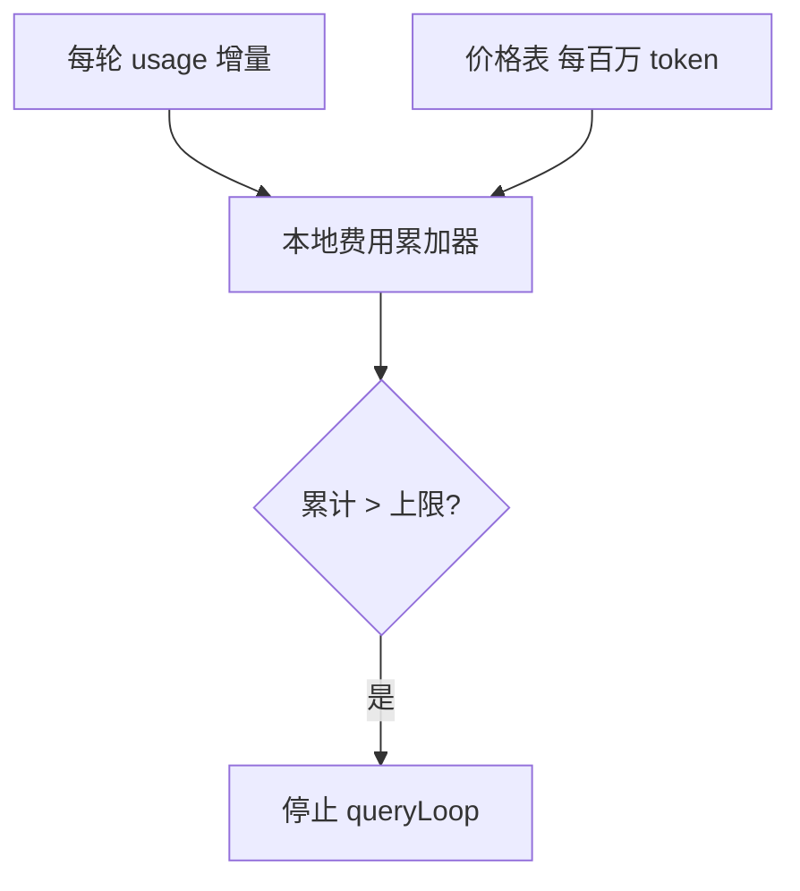
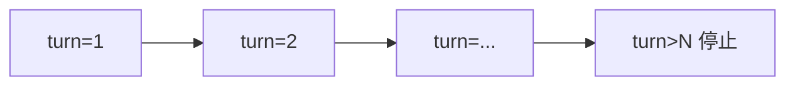
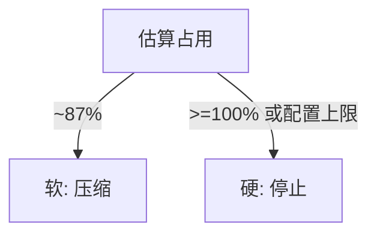

# 4.8 预算三重关卡：Token、金钱与轮次

> **本节学习目标**
>
> - 说出 **三重预算** 各自守护什么，以及 **任一超限** 如何终止循环。  
> - 理解 **~200K 上下文窗口** 在教学中的数量级意义（具体以模型卡为准）。  
> - 能把 **软预警（87% 压缩）** 与 **硬停止（预算）** 区分开。

---

## 一句话：三重关卡是「加油站 + 钱包 + 末班车」

| 关卡 | 类比 | 技术对象 |
|------|------|----------|
| **Token 预算** | 油箱表显剩余里程 | 上下文窗口 + 累计用量 |
| **金钱预算** | 钱包里的今日额度 | 组织/用户的费用上限配置 |
| **轮次预算 `maxTurns`** | 末班车还剩几站 | 单轮 `queryLoop` 迭代计数 |

**任一失败** → QueryEngine **不得继续** 调 API（否则既贵又可能直接被服务端拒绝）。



---

## 关卡一：Token 预算（200K 窗口的教学口径）

### 为何是「窗口」而不是「累计聊天字数」？

大模型每次推理看到的是 **当前请求里塞进去的全部 token**（系统提示 + 历史 + 工具结果）。因此：

- **长历史** 会挤占窗口；  
- **大工具输出** 可能一次性吃掉数万 token；  
- **输出长度** 也受 `max_tokens` 约束。

教学中常把旗舰上下文记为 **约 200K tokens** 量级——真实数字请始终以 **模型发布说明** 为准。

| 概念 | 说明 |
|------|------|
| **上下文占用** | 估算 `messages` 序列化后的 token |
| **软阈值 ~87%** | 触发压缩，留出响应余量（见 [4.4](./04-message-preparation.md)） |
| **硬上限 100%** | 再请求可能被拒或严重截断 |



### 估算 vs 精确

| 方法 | 精度 | 成本 |
|------|------|------|
| 本地 tokenizer 估算 | 中 | 低 |
| 依赖 API 返回 `usage` | 高 | 已付请求费 |
| 混合：估算 + 周期校准 | 工程常用 | 中 |

```typescript
// 教学伪代码：预算检查点之一
function tokenBudgetOk(state: State, model: string): BudgetVerdict {
  const estimated = estimateTokens(state.messages, model);
  const limit = getContextWindow(model); // 如 200_000
  if (estimated >= limit) {
    return { ok: false, reason: "token_window_exceeded" };
  }
  return { ok: true };
}
```

---

## 关卡二：金钱预算（$ 限制）

部分部署形态允许配置 **单次会话 / 日 / 月** 的费用上限，或对接 **组织预算 API**。

| 信号来源 | 说明 |
|----------|------|
| 配置项 | `maxCostUsd` 等（名称示意） |
| 用量 API | 云端账单聚合（延迟更高） |
| 本地累计 | 按 `usage * 价格表` 近似 |

**生活类比**：手机 **流量封顶**——未到月底也可能被停，因为「本地计数器」说你已经超了。



### 教学伪代码

```typescript
type PriceTable = {
  inputPerMtokUsd: number;
  outputPerMtokUsd: number;
};

function addCost(state: State, usage: UsageDelta, prices: PriceTable) {
  const dollars =
    (usage.input_tokens / 1_000_000) * prices.inputPerMtokUsd +
    (usage.output_tokens / 1_000_000) * prices.outputPerMtokUsd;
  state.usage.estimated_cost_usd += dollars;
}

function moneyBudgetOk(state: State, cap?: number): BudgetVerdict {
  if (cap == null) return { ok: true };
  if (state.usage.estimated_cost_usd > cap) {
    return { ok: false, reason: "money_budget_exceeded" };
  }
  return { ok: true };
}
```

---

## 关卡三：轮次限制 `maxTurns`

**一轮**通常指 `queryLoop` 的一次完整迭代：准备消息 → 调模型 →（可能有）工具 → 写回历史。

| 为何需要？ | 说明 |
|------------|------|
| 防无限循环 | 模型反复调用同一工具 |
| 防成本爆炸 | 每轮都花钱 |
| 防 UX 失控 | 用户以为「卡死」 |

```typescript
function turnBudgetOk(state: State, maxTurns: number): BudgetVerdict {
  if (state.turn > maxTurns) {
    return { ok: false, reason: "max_turns_exceeded" };
  }
  return { ok: true };
}
```

**生活类比**：出租车 **跳表次数** 有上限——不是路不能继续开，而是 **产品规则** 说「本次行程最多绕路 N 圈」。



---

## 检查时机：放在循环的哪个节拍？

实现可能在 **多个点** 调用 `checkBudgets`，教学中记住 **「出大钱之前」** 即可。

| 时机 | 理由 |
|------|------|
| 每轮开始 | 防止上下文已炸还请求 |
| 收到 `assistant` 后 | 已产生新用量 |
| 工具执行前 | 防止并行工具放大 I/O 与后续 token |

```mermaid
sequenceDiagram
  participant Loop as queryLoop
  participant B as checkBudgets

  Loop->>B: 轮首检查
  B-->>Loop: ok
  Loop->>Loop: API + 工具
  Loop->>B: 轮末检查
  B-->>Loop: ok 或 stop
```

### 聚合伪代码

```typescript
type BudgetVerdict =
  | { ok: true }
  | { ok: false; reason: string };

function checkBudgets(
  state: State,
  cfg: { maxTurns: number; moneyCapUsd?: number; model: string },
): BudgetVerdict {
  const a = turnBudgetOk(state, cfg.maxTurns);
  if (!a.ok) return a;

  const b = tokenBudgetOk(state, cfg.model);
  if (!b.ok) return b;

  const c = moneyBudgetOk(state, cfg.moneyCapUsd);
  if (!c.ok) return c;

  return { ok: true };
}
```

---

## 与压缩的协同：软 vs 硬

| 机制 | 类型 | 目的 |
|------|------|------|
| **87% 压缩** | 软 | 腾空间，尽量避免硬失败 |
| **Token 预算超限** | 硬 | 再跑会失败或浪费钱 |
| **熔断** | 硬 | 压缩自己失败太多次 |



---

## 用户可见文案 vs 内部原因码

| `reason`（内部） | 用户文案方向 |
|------------------|--------------|
| `token_window_exceeded` | 上下文过长，请开启新会话或精简文件 |
| `money_budget_exceeded` | 已达费用上限，请联系管理员调整 |
| `max_turns_exceeded` | 本轮交互步数过多，请拆分任务 |

---

## 与八步循环的对照

| 八步 | 本节 |
|------|------|
| 6 | **检查预算** —— 三重关卡 |

---

## 小结

- **Token / 金钱 / 轮次** 是三道独立闸门，**逻辑 OR 式失败**：一个不行就停。  
- **87% 压缩** 是 **避免** 触发 token 硬限制的「软护栏」。  
- 预算检查应 **贴近花钱点**，并输出 **可诊断的 reason**。  

下一篇：[4.9 循环终止条件](./09-termination.md)。
