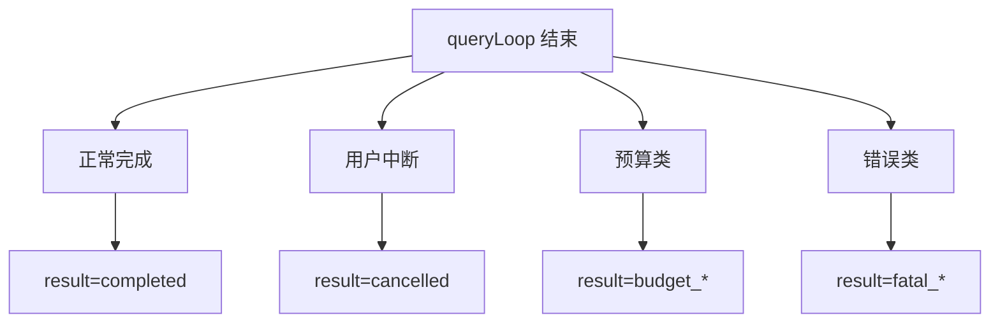
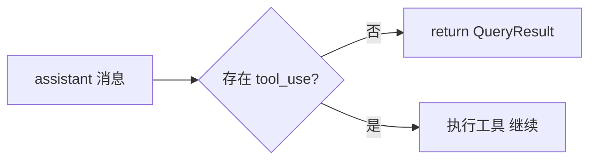
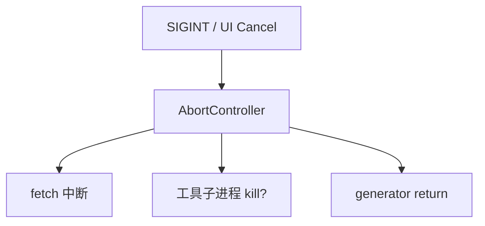
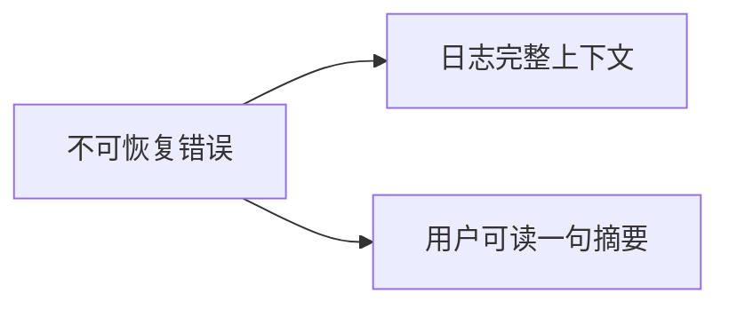
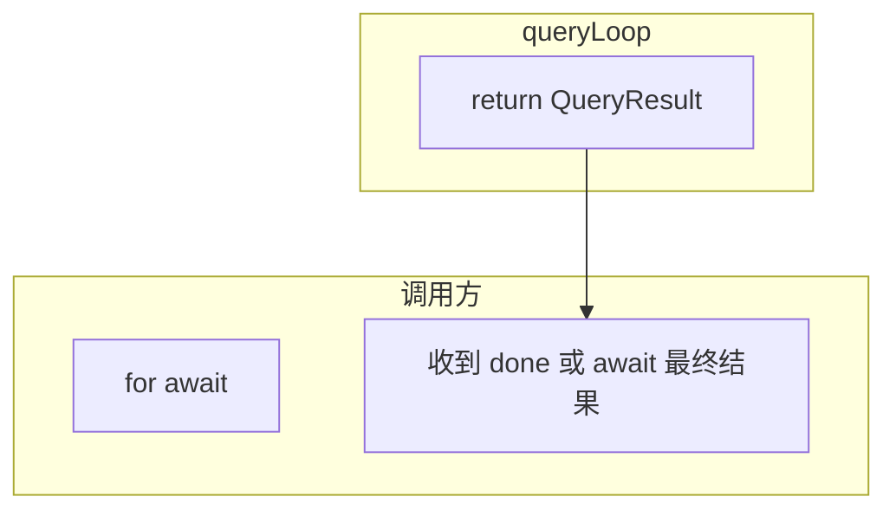

# 4.9 循环终止条件：何时「关火收工」

> **本节学习目标**
>
> - 列举 **至少五种** 正常与异常终止路径。  
> - 能把 **「无工具」正常退出** 与 **预算耗尽** 从 UI 表现上区分开。  
> - 理解 **用户中断** 如何协作式地打断 `async generator`。

---

## 终止 ≠ 失败：先分「出锅」与「糊锅」

| 类型 | 是否成功 | 用户心理 |
|------|----------|----------|
| 正常终止（无工具） | 成功 | 「说完了」 |
| 用户主动取消 | 中性 | 「我不想等了」 |
| 预算耗尽 | 受限成功/失败 | 「被规则挡住」 |
| 致命错误 | 失败 | 「出问题了」 |



---

## 条件一：正常终止——本轮无 `tool_use`

当模型输出的 `assistant` 消息 **不再包含** 任何 `tool_use` 块，QueryEngine 认为 **「推理闭环已闭合」**。



### 伪代码锚点

```typescript
const toolUses = extractToolUses(assistantMsg);
if (toolUses.length === 0) {
  return {
    status: "completed",
    finalText: extractVisibleText(assistantMsg),
    usage: state.usage,
  };
}
```

**生活类比**：厨师尝完汤说「可以上桌了」，**没有**再开采购单——这一桌结束。

---

## 条件二：预算耗尽（三重其一）

详见 [4.8](./08-budget-checks.md)。终止时 **`status`** 应携带 **`reason`**，便于 UI 与日志一致。

| reason | 典型 UI |
|--------|---------|
| `token_window_exceeded` | 建议压缩 / 新会话 |
| `money_budget_exceeded` | 费用上限 |
| `max_turns_exceeded` | 步数上限 |

```mermaid
sequenceDiagram
  participant Loop as queryLoop
  participant B as Budget

  Loop->>B: checkBudgets
  B-->>Loop: not ok
  Loop->>Loop: return 不继续 API
```

---

## 条件三：用户中断（协作式取消）

CLI 中常见 **`AbortController`** 或 **信号**（SIGINT）。QueryEngine 应在：

- `fetch` 层绑定 `signal`；  
- 工具执行层支持超时/取消；  
- `yield` 之间检查 `cancelled` 标志。



### 教学伪代码

```typescript
async function* queryLoop(state: State, ctx: QueryContext) {
  while (true) {
    if (ctx.abortSignal.aborted) {
      return { status: "cancelled", reason: "user_abort" };
    }
    // ... 八步 ...
  }
}
```

**注意**：**协作式**意味着：若某工具 **忽略** `signal`，终止会「慢半拍」——这是工程现实，不是理论缺陷。

---

## 条件四：致命 API / 鉴权错误

| 场景 | 是否重试 | 终止方式 |
|------|----------|----------|
| 401/403 | 否 | 立即返回，**明确**提示检查密钥 |
| 400 结构错误 | 通常否 | 带 `request_id` 记录 |
| 模型不存在 | 否 | 配置错误 |



---

## 条件五：压缩熔断（连续失败）

当自动压缩 **连续失败** 达到阈值（教学中 **3 次**），继续对话风险是 **无限烧钱 + 无限错误**。

```typescript
if (state.compactionCircuitOpen) {
  return {
    status: "aborted",
    reason: "compaction_circuit_breaker",
  };
}
```

**生活类比**：吸尘器 **三次堵死** 还硬吸，会烧电机——必须 **停机清灰**。

---

## 条件六：空安全与实现守护（少见但真实）

| 守护 | 说明 |
|------|------|
| 历史损坏 | 无法修复的 `messages` → 终止并建议重置会话 |
| 工具注册表为空但模型强要工具 | 降级或终止（视产品策略） |

---

## `QueryResult` 形状（教学）

```typescript
type QueryResult = {
  status:
    | "completed"
    | "cancelled"
    | "budget_exceeded"
    | "fatal_error"
    | "compaction_circuit_breaker";
  reason?: string;
  finalText?: string;
  usage: UsageCounters;
  diagnostics?: { requestId?: string };
};
```

| 字段 | 用途 |
|------|------|
| `status` | UI 主分支 |
| `reason` | 细粒度分析与翻译文案 |
| `diagnostics` | 对接支持工单 |

---

## 与 `async generator` 的 `return`

消费者侧（简化）：

```typescript
const it = query(input, ctx);
for await (const ev of it) {
  render(ev);
}
// TS 里获取 generator return 值需额外 API；真实项目常把 result 放在最后一条 StreamEvent
```

教学中记住：**终止** 要么体现为 **最后的 `StreamEvent: done`**，要么为 **`query()` Promise 解析值**——具体以源码为准。



---

## 终止后的世界：资源清理

| 资源 | 动作 |
|------|------|
| HTTP 连接 | `finally` 里释放 |
| 子进程 | `kill` 或等待优雅退出 |
| 临时文件 | 清理 sandbox |
| Telemetry | `flush()` |

---

## 与八步循环的对照

| 八步 | 终止关联 |
|------|----------|
| 6 | 预算失败 → 终止 |
| 8 | 无工具 → 正常终止 |
| 4 | 不可恢复错误 → 终止 |
| 1 | 压缩熔断 → 终止 |

---

## 小结

- **正常终止** 的核心判据：**无 `tool_use`**。  
- **预算与用户** 是两大「外部刹车」。  
- **熔断与鉴权** 是「不能再自欺欺人往下跑」的 **硬出口**。  

下一篇：[4.10 Thinking 模式](./10-thinking-mode.md)。
