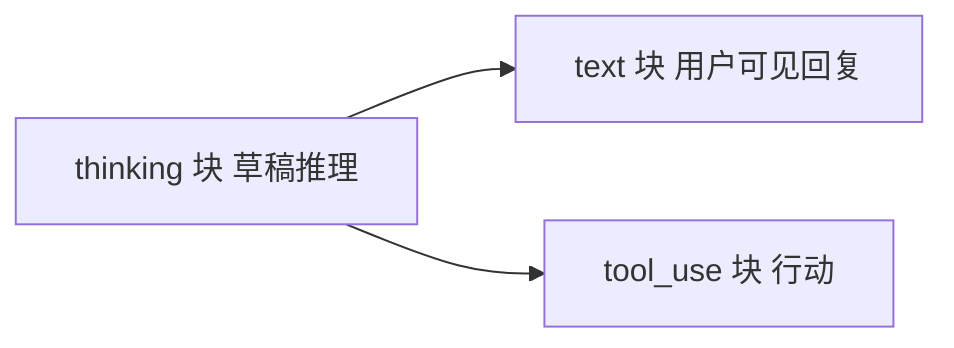
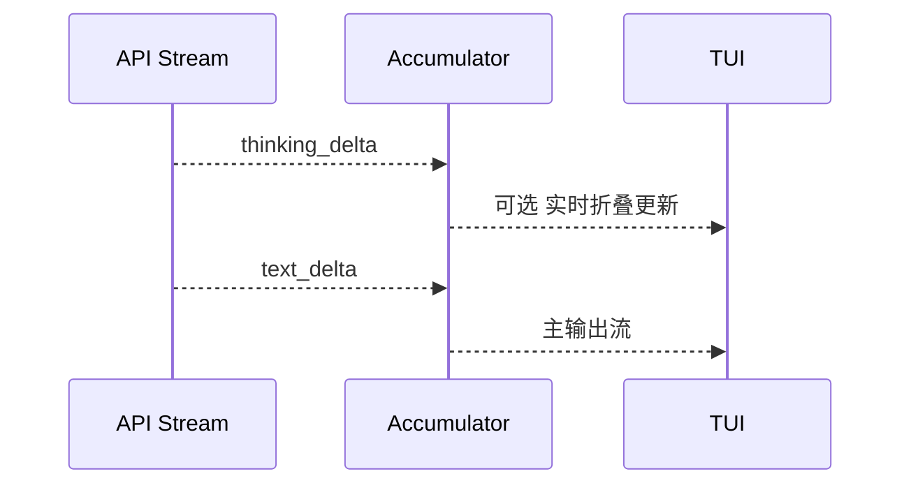
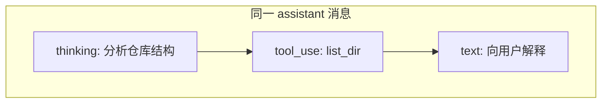
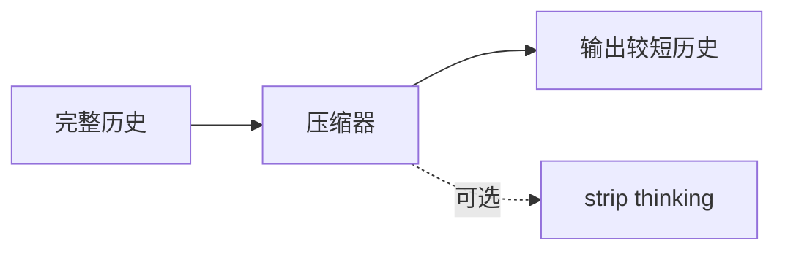
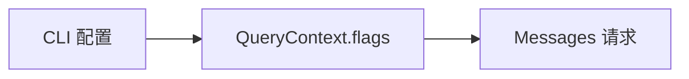
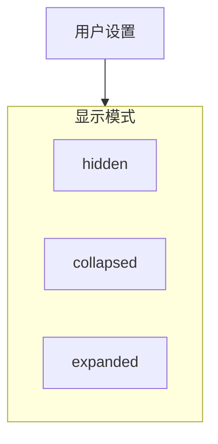
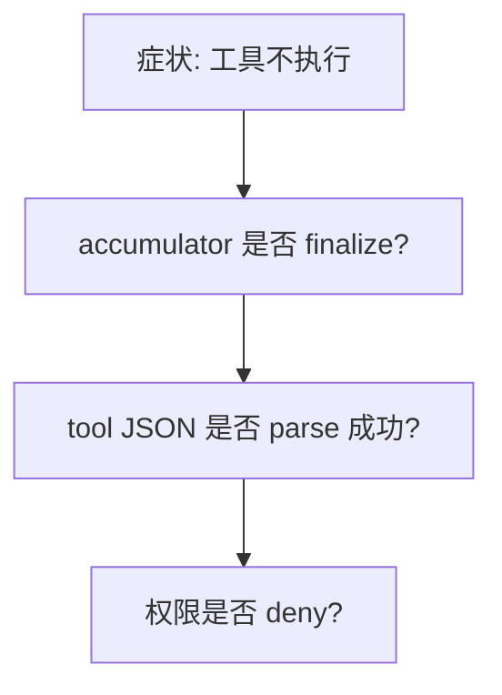

# 4.10 Thinking 模式：Extended Thinking 与 `thinking` 块

> **本节学习目标**
>
> - 解释 **Extended Thinking** 在 API 层面的基本语义（模型先「想」再答）。  
> - 理解 **`thinking` 内容块** 与 **`text` / `tool_use`** 的共存关系。  
> - 评估 Thinking 对 **工具调用时机、token 计费、UI 展示** 的影响。

---

## 为何需要「先想后说」？

常规模型输出是 **直接文本**；复杂推理任务中，用户希望看到 **中间推理链**（或至少让模型在内部有更长的推理预算）。**Extended Thinking** 让模型可以产出 **`thinking` 块**——在教学上可视为 **「草稿纸」**。

**生活类比**：数学题 **草稿纸** 与 **答题卡** 分离——草稿可以不交，但答题卡要工整；Thinking 类似 **草稿**，`text` 类似 **正式答案**。



---

## 消息内容中的块类型扩展

在 [4.4](./04-message-preparation.md) 的基础上，增加：

```typescript
type ThinkingBlock = {
  type: "thinking";
  thinking: string; // 或结构化字段，视 API 版本而定
};

type AssistantContentBlock =
  | { type: "text"; text: string }
  | ThinkingBlock
  | ToolUseBlock;
```

| 块类型 | UI 默认 | 是否进入用户剪贴板 | 典型策略 |
|--------|---------|---------------------|----------|
| `thinking` | 可折叠 / 仅调试可见 | 依产品设置 | 尊重用户隐私与简洁 |
| `text` | 完整展示 | 是 | 主通道 |
| `tool_use` | 显示为工具卡片 | 是（元数据） | 与执行器绑定 |

---

## 流式事件：Thinking 也有 delta

与 `text_delta` 类似，可能存在 `thinking_delta`（名称以 SDK 为准）。



### 教学伪代码

```typescript
for await (const ev of stream) {
  if (isThinkingDelta(ev)) {
    yield { kind: "thinking_delta", text: ev.delta.thinking };
  }
  if (isTextDelta(ev)) {
    yield { kind: "assistant_text_delta", text: ev.delta.text };
  }
}
```

---

## 对工具调用的影响：「想完再动手」？

| 行为 | 说明 |
|------|------|
| 同一轮内顺序 | 常见顺序：**thinking → text/tool**（非严格保证） |
| 多 `tool_use` | Thinking 可能 **预先规划** 多个调用 |
| 错误恢复 | 若 thinking 显示「我搞错了」，模型可能在 **下一轮** 自纠 |



**教学结论**：QueryEngine **不必** 等 thinking 结束才开始收集 `tool_use`——收集逻辑仍 **以块类型为准**；但 UI 可能 **延迟高亮工具卡片** 直到 thinking 折叠完成（产品决策）。

---

## Token 与计费：Thinking 通常不免费

| 维度 | 影响 |
|------|------|
| 输入窗口 | thinking 文本占用 **输出侧** token |
| 费用 | 常计入 **output tokens** |
| 压缩 | 长 thinking 加速触达 **87% 阈值** |

**生活类比**：草稿纸也用本子页数——**页数（token）** 会计入总消耗。

---

## 与历史压缩的摩擦

压缩策略需要决定：**是否保留 thinking**。

| 策略 | 优点 | 缺点 |
|------|------|------|
| 保留 | 调试价值高 | 占空间 |
| 丢弃 | 省 token | 丢推理轨迹 |
| 摘要 | 平衡 | 实现复杂 |



---

## 安全与隐私：Thinking 可能更「直白」

| 风险 | 缓解 |
|------|------|
| 泄露内部策略 | 默认不记录到共享日志 |
| 误导用户 | UI 标注「模型思考过程，非最终结论」 |
| 合规 | 企业版可 **关闭** Extended Thinking |

---

## QueryEngine 集成检查清单

| 检查项 | 说明 |
|--------|------|
| 解析器 | 识别 `thinking` 起止事件 |
| Accumulator | 与 `text`、`tool_use` 同索引管理 |
| `extractToolUses` | **忽略** thinking，只扫 `tool_use` |
| `yield` | 单独事件类型，供 UI 订阅 |
| 预算 | 将 thinking token 计入 `usage` |

---

## 与八步循环的映射

| 八步 | Thinking 相关 |
|------|----------------|
| 2～3 | 流式解析新增 delta 类型 |
| 1 | 压缩是否保留 thinking |
| 6 | token 预算更快触线 |

---

## 小结

- **Extended Thinking** 通过 **`thinking` 块** 暴露或强化推理过程。  
- QueryEngine 把它当作 **又一类 `content` 块** 做流式累积与 `yield`。  
- **工具调用** 仍以 `tool_use` 为准；Thinking 主要影响 **体验、计费与压缩策略**。  

---

## API / SDK 侧：如何「打开」Extended Thinking（概念）

具体字段名以 **当前 SDK 与模型能力** 为准，教学中可记三层：

| 层级 | 示意 |
|------|------|
| HTTP | 请求体中带 **扩展思考开关**（或模型族隐式支持） |
| SDK | `client.messages.stream({ ..., /* thinking options */ })` |
| 响应 | 流里出现 **`thinking` 相关事件** |



> 本书不绑定某一泄露版本的 **精确字段名**，避免与你本地重建仓库不一致；你在 `query.ts` 附近搜索 **`thinking`**、`extended` 即可锚定。

---

## UI 策略矩阵

| 用户画像 | 推荐展示 |
|----------|----------|
| 默认开发者 | 折叠面板 + 「显示思考过程」快捷键 |
| 演示模式 | 仅显示 `text`，避免泄露中间推理 |
| 调试模式 | 完整 thinking + 原始事件时间线 |



---

## 与工具治理的交叉：Thinking 里「计划」是否算承诺？

| 观点 | 工程处理 |
|------|----------|
| 计划可变更 | **以实际 `tool_use` 为准**，thinking 仅为解释 |
| 计划误导用户 | UI 提示「可能修订」 |

这能避免 **把草稿当合同** 的法律/体验风险。

---

## 调试清单：Thinking 相关 bug 从哪查？

1. **事件类型未识别** → 流解析器缺分支，`thinking` 被丢弃。  
2. **块顺序错乱** → `index` 与 `content_block_start` 映射错误。  
3. **token 暴涨** → 长 thinking 未参与压缩策略。  
4. **工具未触发** → 误以为 thinking 结束才算「模型说完」—应检查 **`tool_use` 是否已闭合**。



---

## 与异步生成器：`yield` 顺序保证

Thinking delta 与 text delta **交错** `yield` 时，UI 应 **按时间序** 渲染；不要在客户端 **重排** 为「全文 thinking 在前」除非产品明确要求。

| 做法 | 结果 |
|------|------|
| 保序 | 与模型真实节奏一致 |
| 强行重排 | 可能 **误导** 用户理解因果 |

---

下一篇：[4.11 并行工具执行器](./11-parallel-executor.md)。
