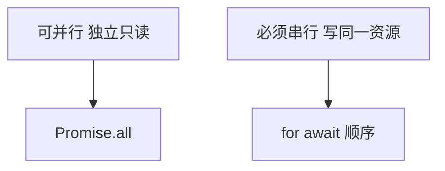
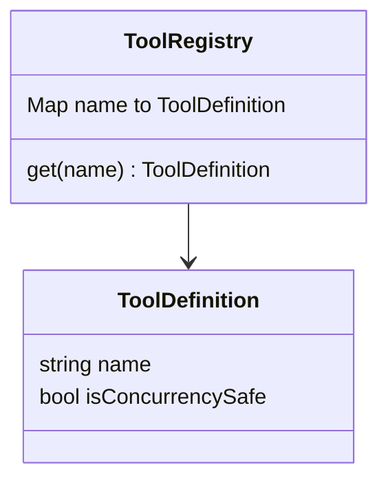
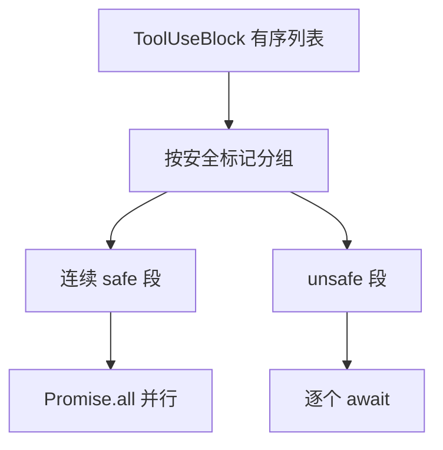
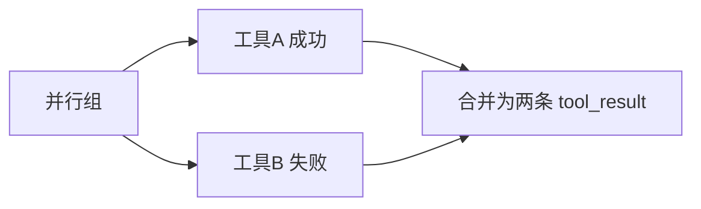
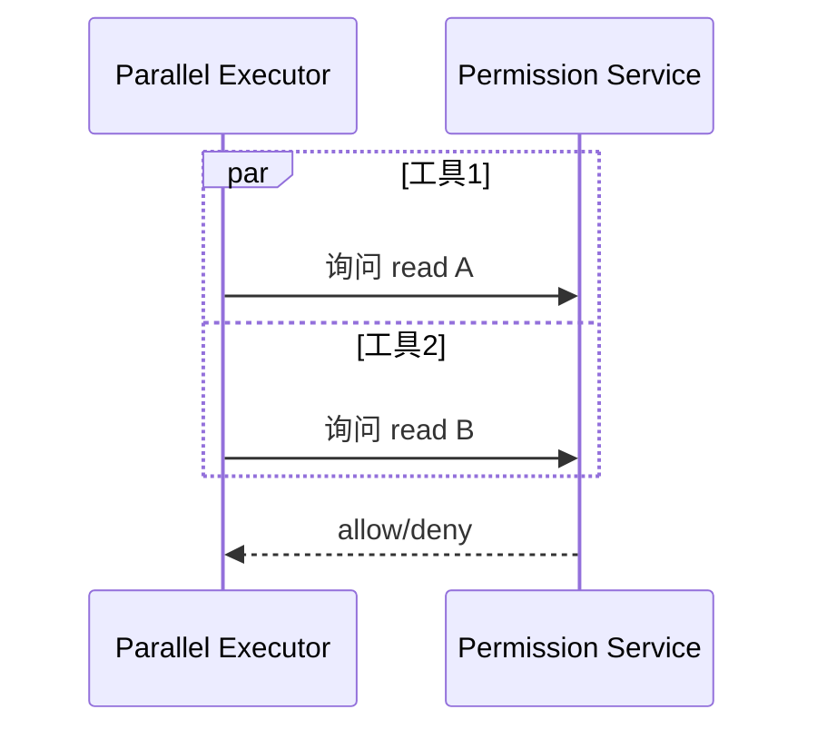

# 4.11 并行工具执行器：`isConcurrencySafe` 与 `Promise.all`

> **本节学习目标**
>
> - 解释 **为何** 默认谨慎串行，**何时** 可以并行。  
> - 理解 **`isConcurrencySafe`（或等价标记）** 在注册表中的角色。  
> - 能写出 **分区算法** 的教学伪代码：`Promise.all` + 串行尾部。

---

## 工具执行不是「越多越好并发」

并行能 **降低墙钟时间**，但会引入：

| 风险 | 例 |
|------|-----|
| **竞态** | 两个 `edit` 写同一文件 |
| **依赖** | `read_file` 必须在 `write` 之后 |
| **副作用顺序** | 两个 `bash` 改同一全局状态 |
| **权限风暴** | 同时弹 10 个确认框 |

**生活类比**：洗碗机 **可以** 和洗衣机 **并行**；但「切生肉」与「拌即食沙拉」**不应** 并行——交叉污染。



---

## `isConcurrencySafe`：注册表上的「绿灯」

每个工具在注册时携带元数据（名称示意）：

```typescript
type ToolDefinition = {
  name: string;
  description: string;
  inputSchema: unknown;
  isConcurrencySafe: boolean; // 核心标记
  handler: (input: unknown, ctx: ToolContext) => Promise<unknown>;
};
```

| `isConcurrencySafe` | 含义（教学口径） |
|---------------------|------------------|
| `true` | 无交叉副作用，或副作用隔离；只读类优先 |
| `false` | 可能写共享资源、需顺序语义 |



---

## 并行 vs 串行：决策流程图



### 保守策略（默认）

即使标记为 safe，也可加 **全局上限**：

| 护栏 | 说明 |
|------|------|
| `maxParallelTools` | 例如最多 4 个 |
| 资源键冲突检测 | 对 `path` 参数做归一化比较 |
| 用户权限模式 | `acceptEdits` 下更保守 |

---

## 教学伪代码：分区 + 执行

```typescript
type PlannedGroup =
  | { mode: "parallel"; items: ToolUseBlock[] }
  | { mode: "serial"; items: ToolUseBlock[] };

function planToolExecution(
  uses: ToolUseBlock[],
  registry: ToolRegistry,
): PlannedGroup[] {
  const groups: PlannedGroup[] = [];
  let buffer: ToolUseBlock[] = [];

  const flushParallel = () => {
    if (buffer.length) {
      groups.push({ mode: "parallel", items: buffer });
      buffer = [];
    }
  };

  for (const u of uses) {
    const def = registry.get(u.name);
    const safe = def?.isConcurrencySafe ?? false;

    if (safe) {
      buffer.push(u);
    } else {
      flushParallel();
      groups.push({ mode: "serial", items: [u] });
    }
  }
  flushParallel();
  return groups;
}

async function executePlan(
  plan: PlannedGroup[],
  ctx: QueryContext,
  mode: PermissionMode,
): Promise<ToolResultBlock[]> {
  const out: ToolResultBlock[] = [];

  for (const g of plan) {
    if (g.mode === "parallel") {
      const chunk = await Promise.all(
        g.items.map((u) => runSingleTool(u, ctx, mode)),
      );
      out.push(...chunk);
    } else {
      for (const u of g.items) {
        out.push(await runSingleTool(u, ctx, mode));
      }
    }
  }

  return out;
}
```

---

## `Promise.all` 失败语义

| 行为 | 说明 |
|------|------|
| 一个工具抛错 | **整组** reject（默认） |
| 工程变体 | `Promise.allSettled` 收集部分失败 |

QueryEngine 常选择：**将错误封装进 `tool_result`**，让模型 **下一轮自纠**，而不是整个进程崩溃。



```typescript
async function runSingleTool(
  u: ToolUseBlock,
  ctx: QueryContext,
  mode: PermissionMode,
): Promise<ToolResultBlock> {
  try {
    const data = await executeWithPermission(u, ctx, mode);
    return { type: "tool_result", tool_use_id: u.id, content: data };
  } catch (e) {
    return {
      type: "tool_result",
      tool_use_id: u.id,
      content: { error: String(e) },
    };
  }
}
```

---

## 与权限系统的时序

并行工具可能 **同时** 请求权限决策：



UI 需 **合并或排队** 弹窗，避免 **竞态导致的错点**。

---

## 与 [4.6 工具收集](./06-tool-collection.md) 的边界

| 阶段 | 职责 |
|------|------|
| 收集 | 产出 **有序** `ToolUseBlock[]` |
| 本节的执行器 | 在 **不改变语义顺序** 的前提下 **重排执行调度** |

> 注意：`tool_result` 在消息里仍应按 API 要求 **与 `tool_use` 对齐**；并行只是 **墙钟优化**。

---

## 与八步循环的对照

| 八步 | 本节 |
|------|------|
| 5 | **执行工具** —— 并行化发生在这里 |

---

## 小结

- **并行** 是优化；**正确性** 优先靠 **`isConcurrencySafe` + 资源冲突检测**。  
- **`Promise.all`** 适合 **同质、独立只读** 工具群。  
- 错误应 **落袋为 `tool_result`**，维持 QueryEngine **循环韧性**。  

下一篇：[4.12 协作全景图](./12-ecosystem.md)。
