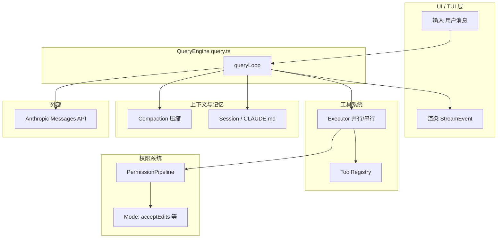
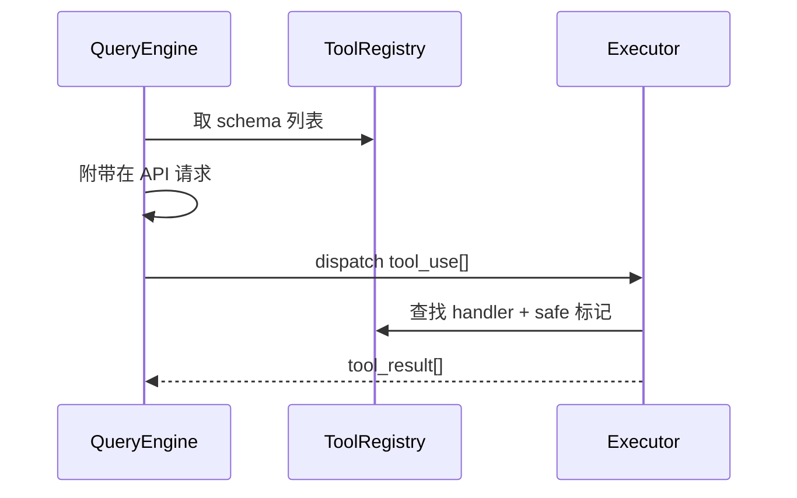
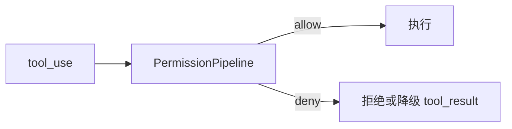
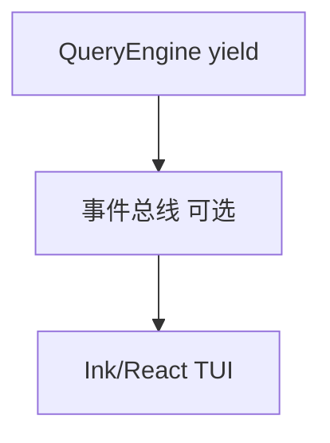
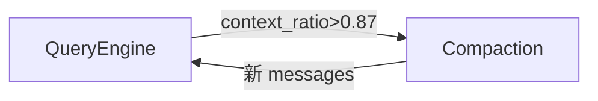
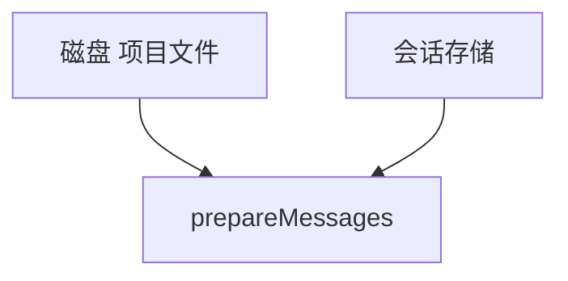
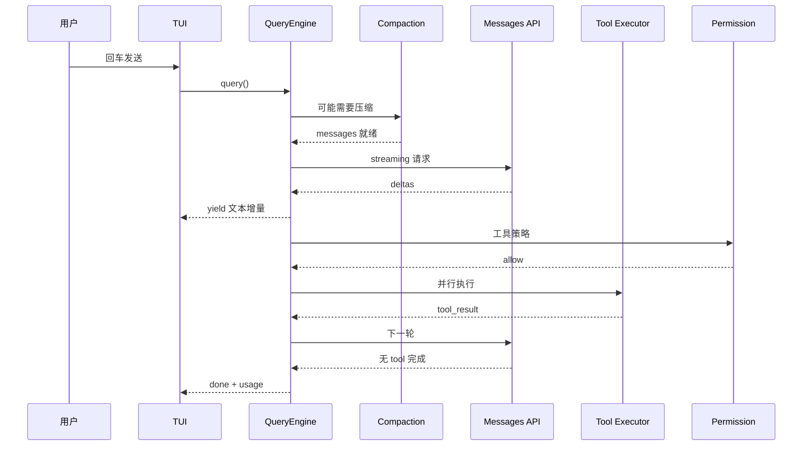

# 4.12 协作全景图：QueryEngine 在系统中的位置

> **本节学习目标**
>
> - 画出 QueryEngine 与 **工具、权限、UI、压缩、记忆** 模块的 **依赖方向**。  
> - 理解 **为何** QueryEngine 不应「什么都自己实现」，而应 **编排**。  
> - 能向他人讲解：**一次用户回车** 触发的跨模块调用链。

---

## 一张总图：心脏与五脏六腑

**生活类比**：QueryEngine 是 **指挥**；乐手是各子系统。指挥 **不亲自拉小提琴**，但决定 **何时齐奏、何时独奏**。

---

## 与工具系统：注册表 + 执行器

| 交互点 | 方向 | 说明 |
|--------|------|------|
| 序列化 `tools[]` | QE → API | 来自 `ToolRegistry` |
| `tool_use` 解析 | API → QE | 在流式累积器完成 |
| 真正执行 | QE → Executor | [4.11](./11-parallel-executor.md) |
| 结果回注 | Executor → QE | `tool_result` 块 |

---

## 与权限系统：闸门在「执行前」

| 若无权限模块 | 后果 |
|--------------|------|
| 模型可随意删文件 | 安全事故 |
| 无法审计 | 合规失败 |

QueryEngine **不** 内嵌复杂策略，而是调用 **`askPolicy(tool, input, mode)`** 式接口——具体模式见本书权限篇。

---

## 与 UI：StreamEvent 是契约

| 事件类型（示意） | UI 行为 |
|------------------|---------|
| `assistant_text_delta` | 增量打字 |
| `tool_card` | 展示工具名与参数 |
| `permission_prompt` | 弹确认 |
| `budget_warning` | 黄条提示 |
| `done` | 显示用量与耗时 |

**解耦价值**：同一 QueryEngine 可接 **CLI / VSCode 插件 / 自动化测试桩**。

---

## 与压缩系统：步骤 1 的外包

| 职责划分 | QueryEngine | Compaction 模块 |
|----------|-------------|-----------------|
| 决定 **何时** 压 | ✓（阈值判断） | |
| 决定 **怎么** 压 | | ✓（摘要算法、调用模型） |
| 写回 `messages` | ✓（接收产物） | |

详见：[4.4](./04-message-preparation.md)。

---

## 与记忆系统：`CLAUDE.md`、会话持久化

| 数据源 | 注入点 |
|--------|--------|
| 项目 `CLAUDE.md` | `system` 或首条 `user` 前缀 |
| 用户偏好 | `QueryContext.config` |
| 跨会话记忆 | 上层存储（若启用） |

QueryEngine **读取** 上下文，但 **不负责** 长期学习的伦理与策略——那是产品与合规层的决策。

---

## 与 Hooks / MCP（预告）

| 扩展 | 典型挂钩点 |
|------|------------|
| Hooks | 工具前后、会话开始结束 |
| MCP | 工具作为 **远程注册** 注入 `ToolRegistry` |

本书后续篇章会展开；此处只需 **定位**：QueryEngine 是 **编排中心**，MCP 是 **工具供应侧**。

---

## 反模式：QueryEngine 变成「上帝对象」

| 反模式 | 症状 | 正解 |
|--------|------|------|
| 把 tokenizer 粘进 `query.ts` | 文件无限膨胀 | 独立 `token-estimate` 模块 |
| UI 逻辑混入循环 | 难测试 | `yield` 纯事件 |
| 权限 if-else 散落 | 难审计 | `PermissionPipeline` |

---

## 端到端：用户按一次回车的故事

---

## 小结

- QueryEngine **位于中心**，但 **能力向外委托**：工具、权限、压缩、记忆、UI 各司其职。  
- **StreamEvent** 是跨层契约；**messages[]** 是跨轮契约。  
- 读懂协作图，你就读懂了 **51 万行仓库的主干叙事**。  

**本篇回顾**：[返回 4.1 索引](./index.md)。
