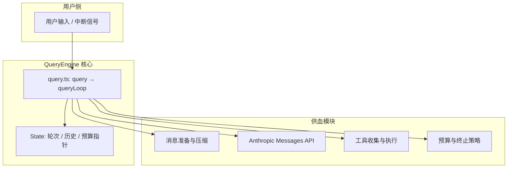
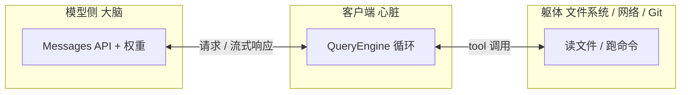
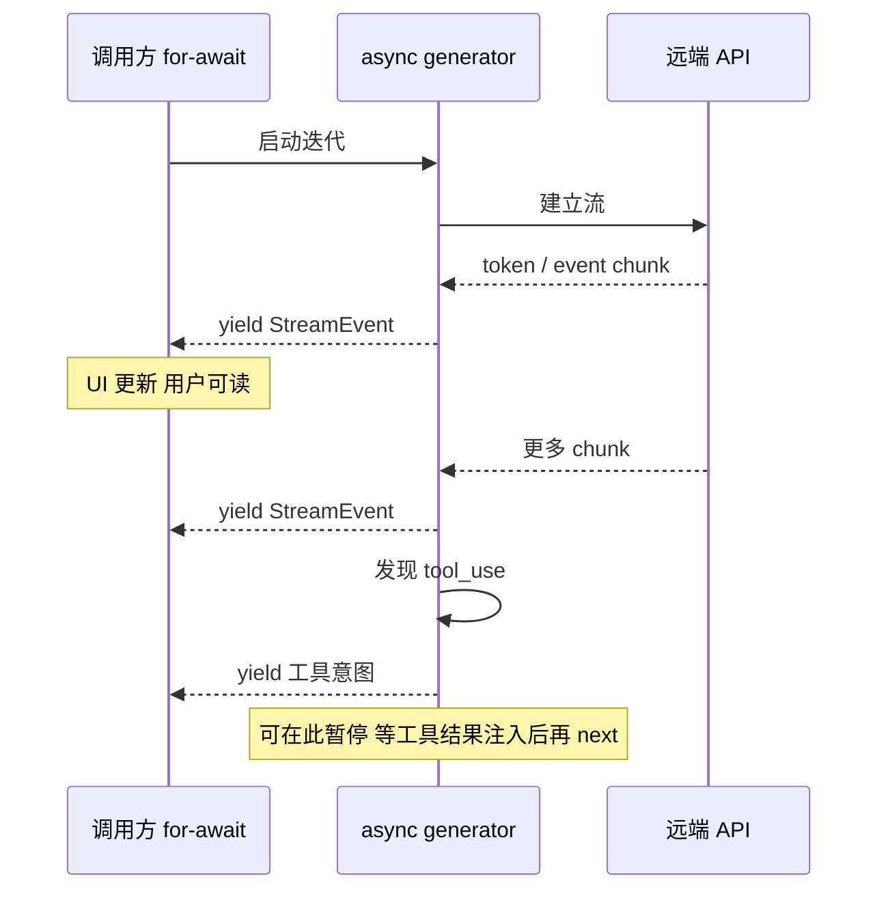
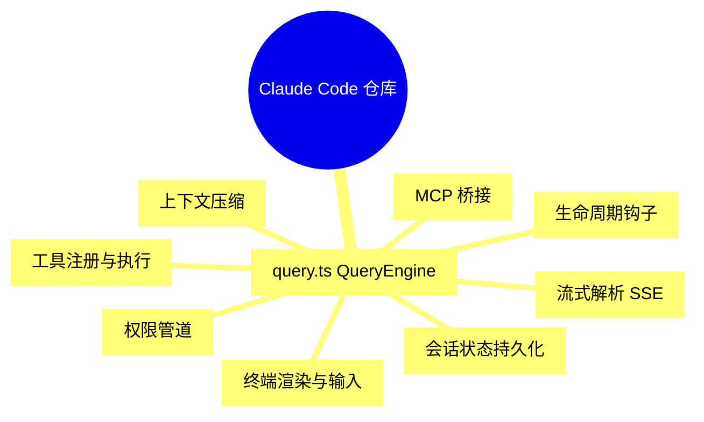
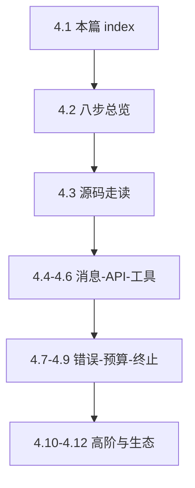
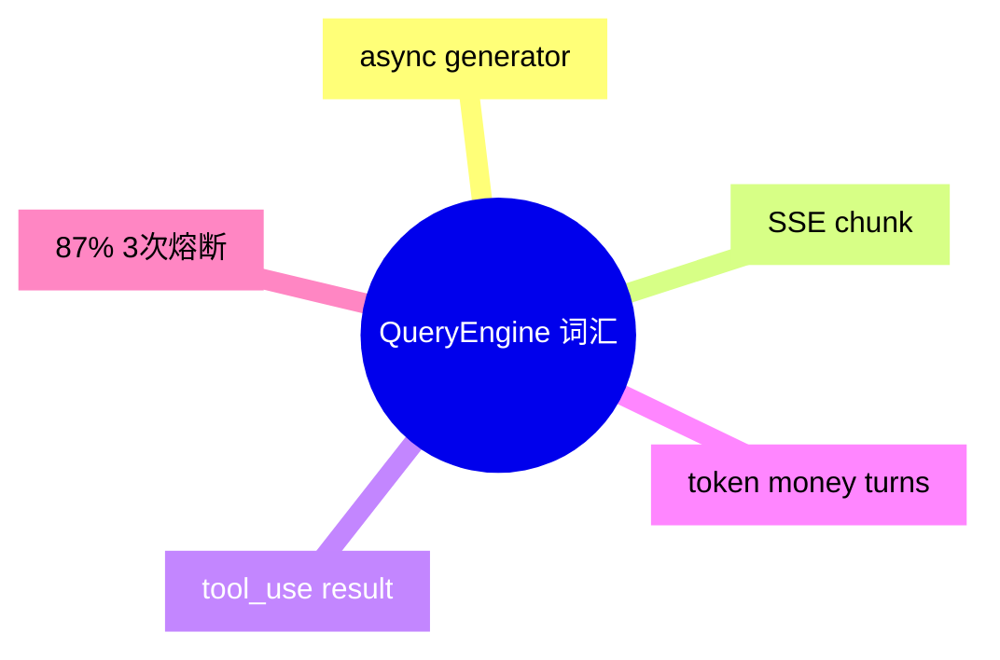
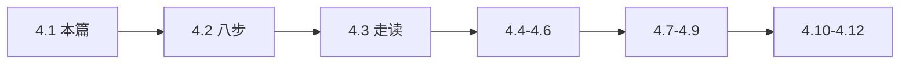

# 4.1 QueryEngine 是什么：整本「51 万行史诗」的心脏

> **本节学习目标**
>
> - 用一句话说清：QueryEngine 在 Claude Code 里扮演什么角色，以及为何称它为「心脏」。
> - 理解 **异步生成器（async generator）** 如何支撑「可暂停、可流式、可恢复」的对话循环。
> - 建立心智模型：约 **51.2 万行**（俗称「半百万级」）TypeScript 中，大量模块最终都为 **query 循环** 供血。

---

## 一句话定位

在泄露版源码树中，`query.ts`（约 **1730 行**）集中实现了 **QueryEngine**：把「用户输入 → 模型推理 → 工具执行 → 再推理」这条链路，编排成一个 **可中断、可观测、可预算** 的无限接近 `while (true)` 的工程循环。

**生活类比**：如果把 Claude Code 比作一座 **24 小时营业的综合体**，那么：

| 楼层（子系统） | 比喻 | 与 QueryEngine 的关系 |
|----------------|------|------------------------|
| UI / TUI | 前台与显示屏 | 消费 `StreamEvent`，把字「蹦」出来 |
| 工具系统 | 后勤与外包团队 | 被循环 **调度** 执行 |
| 权限系统 | 安保与审批 | 在工具真正落地前 **拦截或放行** |
| 压缩 / Compaction | 仓库理货员 | 在循环的「准备消息」阶段 **腾空间** |
| QueryEngine | **中央调度电梯** | 决定这一趟先上谁、到哪层、是否继续跑 |



---

## 为什么是「心脏」而不是「大脑」？

- **大脑**更像 **模型本身**（Anthropic 云端推理）与 **系统提示词**：负责「想」。
- **心脏**负责 **节律与泵血**：在固定节拍内把 **上下文、工具结果、错误恢复、预算检查** 泵进泵出，让整个 CLI **活着**。



没有 QueryEngine，你仍可以「单次调用 API」；但 **Agent 行为**（多轮、工具、自动重试、压缩）会散落成脚本，无法形成 **可维护的产品级编排**。

---

## 异步生成器：比 Promise 多一维的「时间切片」

普通 `async function` 像 **一次性外卖**：调用 → 等到全好 → 返回整单。

`async function*`（异步生成器）像 **自动贩卖机按步骤出货**：

1. 你投币（发起 `query()`）。
2. 机器先掉一瓶水（`yield` 一个 `StreamEvent`：UI 立刻显示）。
3. 你不必等「所有货道清空」才能看第一瓶上的标签。
4. 若你中途按了退款（用户中断），机器可以在「下一步出货前」停住。



### 与 QueryEngine 的对应关系

| 生成器能力 | 在 QueryEngine 中的用途 |
|------------|-------------------------|
| `yield` 部分结果 | **流式输出**：逐词 / 逐块刷新 TUI |
| 函数体在 `yield` 之间暂停 | **等工具**：把 `tool_result` 拼回消息再续跑 |
| `for await` 消费 | UI、日志、测试桩可以 **边收边渲染** |
| `throw` / `return` | 致命错误、用户取消、预算耗尽时 **结束迭代** |

**类比强化**：自动贩卖机每一格出货，都对应一次 `yield`；若某一格卡住了（API 错误），心脏层可以 **静默重试** 或换货道（退避），用户只看到「稍慢了一点」，未必看到异常堆栈——详见 [4.7 静默错误修复](./07-silent-error-handling.md)。

---

## 「512K 行」到底在忙什么？

本书前言将泄露还原规模概括为约 **51.2 万行 TypeScript**。数量级上，你可以把它记成 **「半百万行」量级的客户端编排层**。

这些代码并非每一行都在 `query.ts` 里，但 **产品行为** 上，多数模块是 **径向依赖** QueryEngine 的：



**教学结论**：读源码时，不要从随机文件「布朗运动」式乱翻。以 **QueryEngine** 为圆心，向外辐射：你每读懂一个相邻模块，就等于给心脏 **接上一根更清晰的血管**。

---

## `query()` 与 `queryLoop()`：外壳与心室

泄露版结构（概念级）可记为：

| 符号 | 角色 | 记忆口诀 |
|------|------|----------|
| `query()` | **外壳** | 参数校验、遥测、把「第一次消息」交给循环 |
| `queryLoop()` | **心室** | `while (true)` 或等价结构，真正跑 8 步 |
| `State` | **心电图记录** | 轮次、累积 token、是否已压缩等 |

下面是一段 **教学用伪代码**（与真实 `query.ts` 行号不必逐字对齐，但结构一致）：

```typescript
// 概念骨架：异步生成器 = 可暂停的循环
export async function* query(
  input: QueryInput,
  deps: QueryDependencies,
): AsyncGenerator<StreamEvent, QueryResult, undefined> {
  // 外壳：一次性准备（权限模式、会话 id、feature flags 等）
  const initialState = await buildInitialState(input, deps);
  yield* queryLoop(initialState, deps);
}

async function* queryLoop(
  state: State,
  deps: QueryDependencies,
): AsyncGenerator<StreamEvent, QueryResult, undefined> {
  while (true) {
    // 8 步循环见下一节文档；此处仅示意「yield 贯穿全程」
    const events = prepareMessagesMaybeCompact(state, deps);
    // ... API streaming ...
    for await (const ev of streamFromApi(...)) {
      yield ev; // 前台立刻看到「字在流」
    }
    // ... 收集 tool_use、执行工具、预算检查、决定 break 或 continue ...
  }
}
```

---

## 与本 Part 其他小节的路线图

| 小节 | 文件 | 你将深入什么 |
|------|------|----------------|
| 4.2 | [02-eight-steps.md](./02-eight-steps.md) | 8 步循环总图 + 厨师做菜类比 |
| 4.3 | [03-source-walkthrough.md](./03-source-walkthrough.md) | `query.ts` 逐段走读 |
| 4.4～4.6 | 消息 / 流式 / 工具 | 循环的「输入—感知—手」 |
| 4.7～4.9 | 错误 / 预算 / 终止 | 循环的「免疫系统与刹车」 |
| 4.10～4.12 | Thinking / 并行 / 生态 | 高级特性与全景图 |



---

## 小结

- **QueryEngine** 是 Claude Code 的 **节律器官**：它不替代模型「思考」，但决定 **何时问、问什么、出错怎么办、钱和 token 还够不够**。
- **异步生成器** 让这一过程 **对用户可见（流式）**、对工程 **可组合（yield 事件）**、对工具调用 **可插拔（暂停—恢复）**。
- 把 **51 万行** 读成「围绕 query 循环的星系」，你会少很多迷路。

---

## 术语快闪表（本篇专用）

| 术语 | 一句话 |
|------|--------|
| `AsyncGenerator` | 可多次 `yield`、可 `return` 最终值的异步生成器 |
| `StreamEvent` | 泵给 UI/日志的「增量事实」事件 |
| `State` | 一轮会话在循环里的可变账本 |
| `tool_use` | 模型签发的「外包申请单」 |
| `tool_result` | 客户端回填的「外包回执」 |
| Compaction | 为省窗口而做的历史摘要/裁剪 |
| Circuit breaker | 连续失败后的 **强制停机** 护栏 |



---

## 自测（不用交作业，心里答即可）

1. 为什么 **`yield`** 比「等整段 JSON」更适合 CLI？  
2. **`query()`** 与 **`queryLoop()`** 各适合放哪类逻辑？  
3. **无 `tool_use`** 时循环为何可以停？  
4. **87%** 与 **100%** 窗口有何本质区别？  
5. **`isConcurrencySafe`** 是为了解决哪类 bug？

<details>
<summary>参考答案提示（点击展开）</summary>

1. 降低感知延迟、可协作取消、与流式 API 同构。  
2. 外壳一次性；循环内可重复。  
3. 模型已给出可交付答复，无需再执行环境动作。  
4. 前者是 **软压缩**，后者常意味着 **硬失败或拒请求**。  
5. 并行执行时的 **竞态与副作用顺序** 问题。

</details>

---

## 推荐阅读顺序（零基础）



若你 **时间极紧**：只读 **4.1 + 4.2 + 4.12**，也能建立 **可用的心智模型**；细节再按需回溯。

---

下一篇：[4.2 八步循环：从备菜到上桌](./02-eight-steps.md)。
