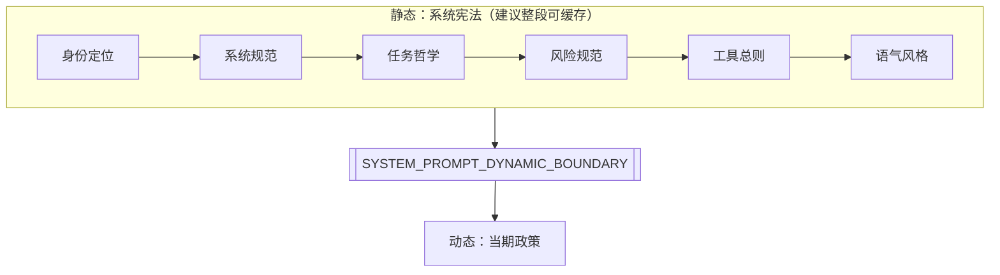
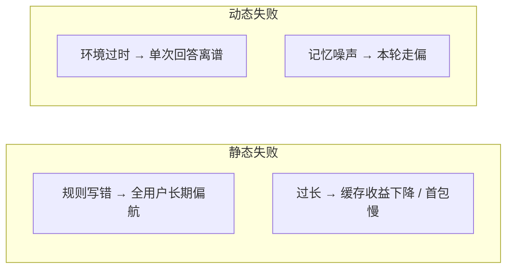

# 5.2 静态部分：系统宪法（System Constitution）

## 学习目标

- 说出 Claude Code 风格系统提示中 **静态六大块** 各自解决什么问题。
- 解释 **为何** 静态块要尽量稳定（与 prompt cache、行为一致性相关）。
- 能判断某段新文案应归入静态还是动态，避免破坏缓存结构。
- 用一张表对比「宪法」与「政策」在失败时的表现差异。

---

## 生活类比：国家的宪法 vs 每日新闻头条

- **宪法**：公民基本权利、政府组织原则——**不常改**，改了要全民严肃讨论。
- **头条**：今天股市、天气、突发事件——**天天变**，但不该推翻宪法里的底线。

静态系统提示就是 **AI 雇员的宪法**：无论今天在哪台机器、哪个仓库、哪次会话，**底线能力、工具纪律、风险意识、语气** 都应一致。这样产品体验可预期，工程上还能让 **长前缀缓存** 持续命中。

---

## 静态六大组成部分（教学模型）

> 以下为与 Claude Code 架构 **对齐的常见拆分**；具体段落标题以实际实现为准。

### 1. 身份定位（Who am I）

**作用**：锚定模型在产品中的角色——例如「终端里的编程助手」「可调用工具的 Agent」，而非泛泛的聊天机器人。

**为何静态**：

- 角色漂移会导致用户困惑（一会儿像导师，一会儿像客服）。
- 身份描述通常 **不随仓库变化**，适合进入缓存前缀。

**典型内容方向**：

- 与产品名、场景（CLI / IDE / Web）一致的自我描述。
- 「你不是通用搜索引擎替代品」这类 **边界声明**（若产品需要）。

---

### 2. 系统规范（Operational norms）

**作用**：定义 **工作方式**：如何规划、如何汇报、如何对待用户指令优先级。

**为何静态**：

- 属于 **组织级纪律**，不应因「今天多装了一个 MCP」而改变。
- 与身份一起构成 **稳定行为 OS**。

**典型内容方向**：

- 先理解再动手 vs 直接执行的默认策略（产品选择）。
- 对用户不透明操作的禁止或限制（视安全模型而定）。

---

### 3. 任务哲学（Task philosophy）

**作用**：回答「什么叫把事做完」——例如：**聚焦用户请求、反对范围蔓延、反对为炫技而抽象**。

**为何静态**：

- 这是 **价值观层** 约束，和具体任务无关。
- 常与 `getSimpleDoingTasksSection` 类 **短平快铁律** 一起出现（详见 [5.7](./07-behavior-constraints.md)）。

---

### 4. 风险规范（Risk & safety rails）

**作用**：在 **不替代完整安全审计** 的前提下，降低删库、泄密、误操作概率。

**为何静态**：

- 风险底线 **不应** 因会话而放松。
- 与合规、内部红线一致，属于长期文本。

**典型内容方向**：

- 对密钥、令牌、隐私数据的处理原则。
- 对破坏性命令（如 `rm -rf`、强制 Git 操作）的态度（具体禁令常落在工具手册与 Bash 协议中）。

---

### 5. 工具使用规范（Tools — global rules）

**作用**：**跨工具** 的总则：何时并行、何时必须先读后写、Fail-closed 默认值等。

**为何静态**：

- 工具 **名单与细则** 可能动态加载，但 **总则**（纪律）通常稳定。
- 避免模型在不同会话里一会儿「爱用 cat」一会儿「爱用 read」。

**与 5.8 的关系**：

- 本章是 **交通规则**；`prompt.ts` 是 **每辆车的说明书**。

---

### 6. 语气风格（Voice & tone）

**作用**：统一 **输出体验**：简洁/教学式/正式、是否默认中文、列表偏好等。

**为何静态**：

- 品牌与 UX 要求 **长期一致**。
- 不宜让「今天记忆片段」偶然改写全局语气（除非产品刻意允许）。

---

## Mermaid：静态块在拼装管线中的位置



---

## Mermaid：静态 vs 动态在「失败模式」上的差异



---

## 为什么「不变」如此重要？（工程视角）

### 1. Prompt caching 的前缀稳定性

若静态块频繁因 **小改动**（例如加时间戳、插入随机 ID）而整体变化：

- 缓存 **前缀无法命中**。
- 长对话下输入 Token 费用 **线性放大**。

**结论**：静态块应像 ** semver 主版本** 一样谨慎修改；日常波动应塞进动态块。

### 2. 行为一致性与可调试性

当用户反馈「昨天和今天表现不一致」时：

- **静态稳定** → 更容易归因到 **动态注入**（记忆、环境、CLAUDE.md、MCP）。
- **静态乱动** → 难以区分是模型漂移还是提示词漂移。

### 3. 安全与合规审计

审计人员通常希望：**底线规则** 有明确版本与变更记录。静态块天然适合放进 **变更管理**；动态块更适合 **运行时日志**。

---

## 表格：六大静态块 — 职责 / 稳定性 / 典型反模式

| 模块 | 核心职责 | 应保持稳定的原因 | 常见反模式 |
|------|----------|------------------|------------|
| 身份定位 | 角色与边界 | UX 一致、减少角色漂移 | 把「当前仓库名」写进身份 |
| 系统规范 | 工作流与优先级 | 可预期、可测试 | 每轮插入不同「口号」 |
| 任务哲学 | 完成定义与克制 | 防止范围蔓延 | 把具体 bug 描述写进哲学段 |
| 风险规范 | 安全与隐私底线 | 合规、不可会话级削弱 | 用动态块覆盖删库禁令 |
| 工具总则 | 跨工具纪律 | 并行/先读后写等一致 | 在总则里写某个工具的 JSON 细节 |
| 语气风格 | 品牌与可读性 | 体验一致 | 让 CLAUDE.md 覆盖全局语气（若冲突） |

---

## 源码片段（概念）：静态块生成器

```typescript
/**
 * 教学用伪代码：静态部分只依赖「产品配置」，不依赖「本次会话」。
 */
function buildStaticConstitution(product: ProductConfig): string {
  return [
    renderIdentity(product.name, product.surface), // 身份定位
    renderSystemNorms(product.normsVersion),       // 系统规范
    renderTaskPhilosophy(),                          // 任务哲学
    renderRiskRails(product.redlines),               // 风险规范
    renderGlobalToolRules(),                         // 工具总则
    renderVoiceAndTone(product.locale, product.voice),
  ].join("\n\n");
}
```

要点：`SessionContext` **不进** 此函数（或仅进与「版本号」无关的字段），才能从工程上保证 **缓存友好**。

---

## 静态块的「版本治理」建议（给自建 Agent 的读者）

| 实践 | 说明 |
|------|------|
| 单一来源 | 静态文本集中在一处生成，避免复制粘贴分叉 |
| 变更记录 | 每次改静态块记版本号与原因，便于回滚 |
| 长度预算 | 过长的宪法挤占用户消息与工具结果空间 |
| 与动态对齐 | 动态块不得与宪法 **语义打架**（例如宪法要求先读后写，动态却鼓励「直接 sed」） |

---

## 自测题

1. 「当前工作目录路径」应放在静态块还是动态块？为什么？
2. 若你把「记忆片段」误写入静态块，缓存与隐私分别会出现什么问题？
3. 工具总则与单个工具的 `prompt.ts` 应如何分工，才能既死板又可扩展？

---

## 导航

- [← 5.1 动态拼装](./index.md)
- [5.3 动态部分：当期政策 →](./03-dynamic-policy.md)
