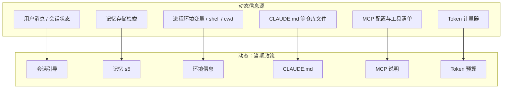
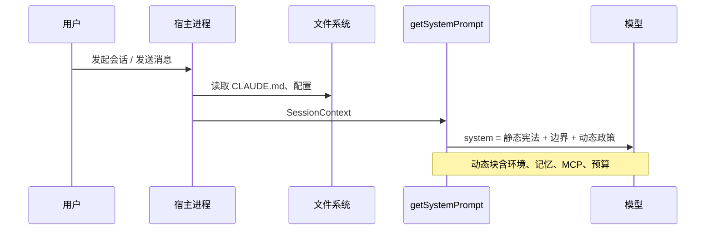

# 5.3 动态部分：当期政策（Dynamic Policy）

## 学习目标

- 列举 **六大动态注入** 及其「每次不同」的来源。
- 解释动态块如何赋予 Agent **环境感知** 与 **会话连贯**。
- 能说明 **记忆片段上限（如 5 条）** 的工程原因（上下文、噪声、成本）。
- 绘制一条从「仓库文件」到「模型读到的系统提示」的数据路径。

---

## 生活类比：导航里的「实时路况」

离线地图告诉你：**道路规则、限速、单行道**（像静态宪法）。

导航 App 叠加：**此刻拥堵、施工、你家的目的地**（像动态政策）。

没有路况，你仍能开车；没有规则，路况再好也会乱套。**Claude Code 的动态块就是「实时路况层」**——让模型知道 **此刻** 为谁、在哪、读过什么、能用什么插件、还剩多少预算。

---

## 动态六大注入内容（教学模型）

### 1. 会话引导（Session preamble）

**是什么**：本轮或本会话的 **开场白式上下文**——例如任务摘要、用户显式目标、多轮对话中的「当前子任务」指针。

**为何每次不同**：

- 会话 ID、用户最新一句、子任务切换都会变。
- 若写进静态块，等于 **所有用户共用同一段开场**，产品不可用。

**环境感知价值**：

- 把「用户刚说了什么」压缩成 **对模型可见的短期意图**，减少遗忘与跑题。

---

### 2. 记忆片段（Memory injections，常上限 5 条）

**是什么**：从长期记忆存储里检索出的 **短摘要**，注入系统提示（条数受限）。

**为何每次不同**：

- 检索依赖 **当前查询 / 会话主题**；不同问题命中不同记忆。
- 用户可能随时 **新增 / 修正** 记忆。

**为何常限制 ≤5 条**：

| 原因 | 说明 |
|------|------|
| 上下文窗口 | 记忆过长挤压用户消息与工具输出 |
| 噪声 | 过多记忆引入 **错误先验**（模型过度「觉得你过去一定…」） |
| 成本 | 动态前缀越长，缓存命中越难，费用越高 |
| 延迟 | 检索与拼装本身耗时 |

---

### 3. 环境信息（Environment）

**是什么**：OS、Shell、路径、时区、语言、Node 版本、Git 状态摘要等 **运行时事实**。

**为何每次不同**：

- 用户换机器、换目录、升级运行时，事实即变。
- 同一静态宪法无法承载 **无限多环境**。

**环境感知价值**：

- 避免模型 **假设** 用户在 Linux 而实为 macOS。
- 对路径分隔符、权限、包管理器的建议更接地气。

---

### 4. CLAUDE.md（仓库级指令）

**是什么**：工作区内的项目说明文件（名称以产品为准），通常包含：构建命令、测试命令、目录约定、团队规范。

**为何每次不同**：

- **换仓库即换内容**；同一用户在项目 A 与 B 的规则不同。
- 文件可能被用户 **随时编辑**。

**环境感知价值**：

- 把 **领域知识** 从模型先验转移到 **可验证的本地文本**。
- 减少「通用建议」与「此仓库实际做法」的冲突。

---

### 5. MCP 插件说明（MCP tool / server blurbs）

**是什么**：当前会话启用的 MCP 服务器、工具名、参数约束、调用注意事项的 **拼接说明**。

**为何每次不同**：

- 用户 **增减 MCP**、改配置、换密钥，工具可见集即变。
- 与 [5.6 缓存失效](./06-cache-pitfalls.md) 中「加减 MCP」强相关。

**环境感知价值**：

- 让模型知道 **此刻真能调用什么**，而不是背诵训练数据里的过时 API。

---

### 6. Token 预算提示（Budget hints）

**是什么**：对剩余上下文、压缩策略、何时需要总结的对话 **管理提示**（实现各异）。

**为何每次不同**：

- 每轮对话消耗不同，剩余预算 **随轮次变化**。
- 长对话中可能触发 **不同的截断或摘要策略**，提示需同步更新。

**环境感知价值**：

- 引导模型 **省着用上下文**：少废话、多引用、必要时主动要用户精简输入。

---

## Mermaid：六大动态块的数据来源



---

## Mermaid：从仓库到 system 提示的路径



---

## 表格：动态块 — 变化触发因素 / 风险

| 动态块 | 典型触发变化 | 主要风险 |
|--------|----------------|----------|
| 会话引导 | 新消息、子任务切换 | 摘要错误导致误解用户意图 |
| 记忆 | 检索词变化、记忆库更新 | 陈旧或矛盾记忆 |
| 环境 | 换目录、升级运行时 | 过时环境块误导命令建议 |
| CLAUDE.md | 用户编辑、切分支 | 与代码实际不一致 |
| MCP | 增删插件、改 tool 列表 | **缓存失效**、工具幻觉 |
| Token 预算 | 每轮消耗 | 过度激进截断损失信息 |

---

## 源码片段（概念）：动态尾部的拼装

```typescript
type Memory = { id: string; text: string; score: number };

function buildDynamicTail(ctx: SessionContext): string {
  const memories = topK(ctx.memoryCandidates, 5); // 最多 5 条

  return [
    renderSessionPreamble(ctx.turnSummary),
    renderMemories(memories),
    renderEnvironment(ctx.envSnapshot),
    renderClaudeMd(ctx.workspace.claudeMdText),
    renderMcpSection(ctx.mcp.tools),
    renderTokenBudget(ctx.meter.remainingTokens),
  ]
    .filter(Boolean)
    .join("\n\n");
}
```

---

## 「环境感知」的三层模型（进阶）

| 层级 | 内容 | 是否适合动态注入 |
|------|------|------------------|
| L1 运行时 | cwd、OS、版本号 | 是 |
| L2 仓库 | CLAUDE.md、目录结构摘要 | 是（常需工具先读后注入） |
| L3 组织 | 内部策略、合规 | 常放静态或受控配置；**慎用**用户可编辑文件 |

---

## 与静态宪法的协作原则

1. **动态不推翻静态**：例如宪法要求先读后写，动态块不应写「可直接 sed」。
2. **冲突时显式排序**：在提示中写明 **优先级**（产品决策），避免模型仲裁。
3. **可验证优先**：环境块里尽量 **事实**（可 `uname`），少 **猜测**。

---

## 自测题

1. 为什么「记忆」不适合无上限注入？
2. MCP 工具列表变化如何同时影响 **行为** 与 **成本**？
3. CLAUDE.md 与「任务哲学」若冲突，你会把裁决规则写在哪一层？

---

## 导航

- [← 5.2 静态宪法](./02-static-constitution.md)
- [5.4 缓存边界设计 →](./04-cache-boundary.md)
