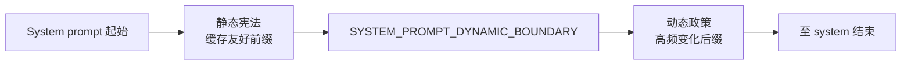
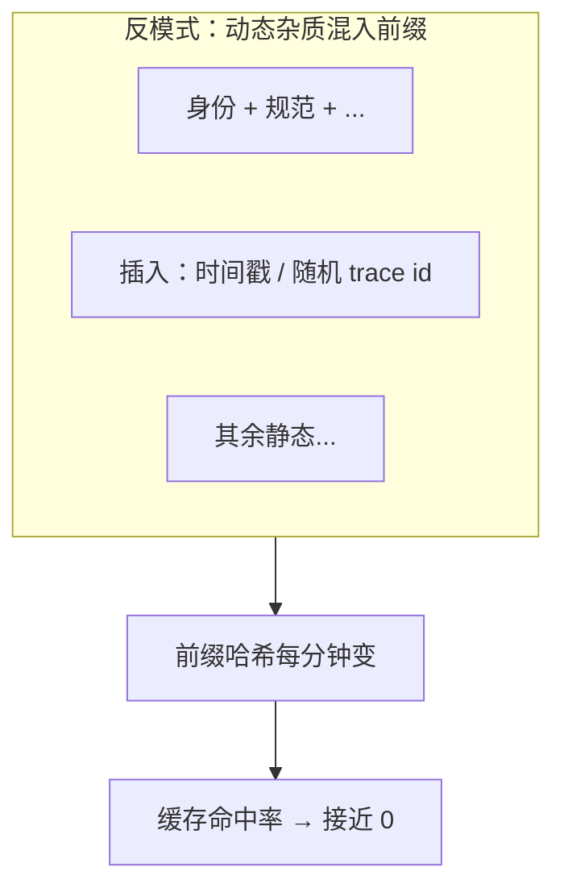

# 5.4 缓存边界设计：`SYSTEM_PROMPT_DYNAMIC_BOUNDARY`

## 学习目标

- 解释 **边界标记** 在「静态前缀 + 动态后缀」架构中的角色。
- 对比 **边界之上** 与 **边界之下** 的内容在 **稳定性、缓存、风险** 上的差异。
- 说明为何边界设计是 **工程上的精妙一刀**，而非文档排版技巧。
- 能向同事用一张表说清：什么必须永远在边界 **上方**。

---

## 生活类比：精装书的「固定正文」与「可撕便签」

一本教材：

- **胶印正文**：出版社一次排版，成千上万册相同 → 像 **可缓存的静态宪法**。
- **便签 / 勘误条**：贴在末页，每个学生拿到的可能不同 → 像 **动态政策**。

`SYSTEM_PROMPT_DYNAMIC_BOUNDARY` 就是 **出版社规定的「便签只能贴在勘误页」**：

- 你改便签，**不必重印整本书**（类比：不必使整个 system 前缀失效）。
- 若你把便签糊在第一章中间，**整本书的「相同页」定义就崩了**（类比：缓存前缀无法稳定命中）。

---

## 核心概念：边界是「缓存一致性」的语义锚点

在支持 **prompt caching**（或前缀缓存）的推理栈中，供应商通常对 **完全相同的前缀** 给予较低单价。

因此产品侧目标非常明确：

1. **最大化** 从 system 开头到某一点为止的 **字节级稳定**。
2. **把必然变化的内容** 挤到该点 **之后**，使变化 **局部化**。

边界标记 `SYSTEM_PROMPT_DYNAMIC_BOUNDARY`（名称教学化；实现可能是常量字符串）正是 **切分点声明**：

```text
[ 静态：系统宪法 · 超长稳定前缀 ]
<<< SYSTEM_PROMPT_DYNAMIC_BOUNDARY >>>
[ 动态：当期政策 · 每会话/每轮可变 ]
```

模型会把整段都读进去；**缓存子系统** 则可能对 **前半** 与 **后半** 采用不同计费与失效策略。

---

## 边界「之上」与「之下」：对比表

| 维度 | 边界之上（静态宪法） | 边界之下（动态政策） |
|------|----------------------|----------------------|
| **变化频率** | 低（版本发布级） | 高（会话 / 轮次级） |
| **典型内容** | 身份、规范、哲学、风险、工具总则、语气 | 会话引导、记忆、环境、CLAUDE.md、MCP、预算 |
| **缓存诉求** | 强烈希望长期命中 | 接受频繁失效 |
| **隐私敏感** | 一般较低（无用户数据） | 高（记忆、路径、仓库信息） |
| **调试归因** | 变更应可版本化 | 变更常与上下文采集相关 |

---

## 精妙设计体现在哪里？

### 1. 失效局部化（Localization of invalidation）

没有边界时，常见反模式是：

- 在静态块末尾 **顺手** 拼接 `new Date().toISOString()`「方便调试」。
- 结果：**整个 system 每秒变一次**，缓存 **永久报废**。

有边界时，工程约定清晰：

- **时间戳、会话 ID、记忆** → 只能出现在边界 **下**。
- Code review 一眼可抓违规。

### 2. 心智模型对齐（Human + machine）

新同事读代码：

- 看到常量 `SYSTEM_PROMPT_DYNAMIC_BOUNDARY` 即理解 **架构分層**。
- 比散落在各处的 `if (dynamic)` 更易维护。

### 3. 与安全策略同构（Optional coupling）

部分实现会把 **「可审计的静态红线」** 完整放在边界上侧，使得：

- 动态块再花里胡哨，也 **较难** 在结构上「盖掉」宪法（仍需防 **语义冲突**）。

---

## Mermaid：边界在拼装中的「刀位」



---

## Mermaid：错误放置导致的缓存雪崩（反例）



---

## 源码片段（概念）：边界常量与拼接

```typescript
/** 教学用：显式可检索的切分标记 */
export const SYSTEM_PROMPT_DYNAMIC_BOUNDARY =
  "<<<<CC_DYNAMIC_POLICY_BOUNDARY>>>>";

export function assembleSystemPrompt(parts: {
  staticConstitution: string;
  dynamicPolicy: string;
}): string {
  return [
    parts.staticConstitution.trimEnd(),
    "",
    SYSTEM_PROMPT_DYNAMIC_BOUNDARY,
    "",
    parts.dynamicPolicy.trim(),
  ].join("\n");
}
```

**注意**：真实产品中的标记字符串可能 **刻意避免** 与用户/仓库内容撞车；有时会用极少见 Unicode 或长随机常量（教学简化为可读字符串）。

---

## 边界上下内容示例（虚构、缩略）

### 边界之上（摘录）

```text
你是 CLI 中的编程助手。你必须遵守工具纪律：读文件用专用读取工具，不得用 shell 文本命令替代……
（中略：风险、语气）
```

### 边界之下（摘录）

```text
## 当前会话
工作目录: /Users/alice/proj-foo
Shell: zsh, OS: darwin

## 记忆（最多 5 条）
- 用户偏好：提交信息用中文。

## CLAUDE.md
运行测试：pnpm test

## MCP 工具
- mcp__linear__create_issue …
```

可见：**上侧** 像员工手册；**下侧** 像 **今日值班白板**。

---

## 与「ToolSearchTool / 延迟加载」的边界关系（预告）

工具细则可能 **不在** 全量塞进静态块，而是通过 **ToolSearchTool** 按需检索各工具目录的 `prompt.ts`（见 [5.8](./08-tool-manuals.md)）。

此时仍建议：

- **工具总则**（并行、先读后写、Fail-closed）留在 **边界之上** 或 **极稳定** 区域。
- **单个工具的长说明** 可走检索链，避免 **静态前缀无限膨胀**。

---

## Checklist：Code Review 问句

1. 本次 MR 是否改变了边界 **之上** 的文本？若是，是否评估缓存与全用户影响？
2. 是否有 **用户数据** 误入边界之上？（隐私与缓存复用风险）
3. 动态块是否 **重复** 了宪法内容导致维护分叉？

---

## 自测题

1. 为什么说边界标记主要是 **工程与计费结构** 问题，而不只是「排版好看」？
2. 若把 `CLAUDE.md` 全文挪到边界之上，对 **多仓库场景** 有何后果？
3. 边界之下的内容是否「可以随便写」？还有哪些约束（长度、冲突、安全）？

---

## 导航

- [← 5.3 动态政策](./03-dynamic-policy.md)
- [5.5 Token 缓存经济学 →](./05-token-economics.md)
