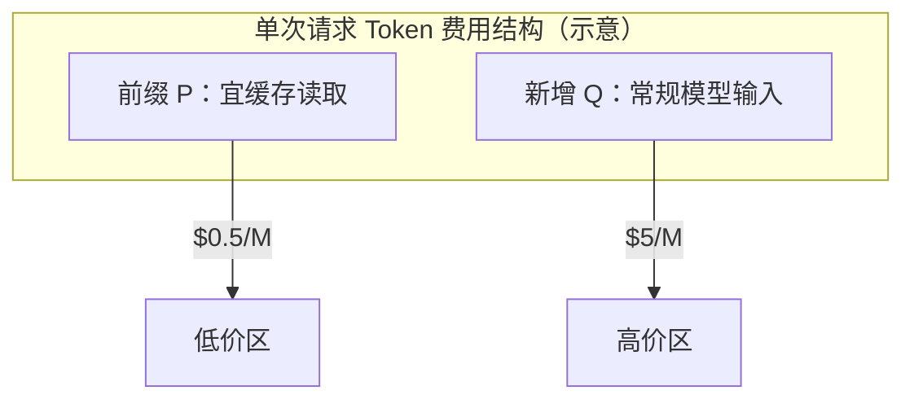
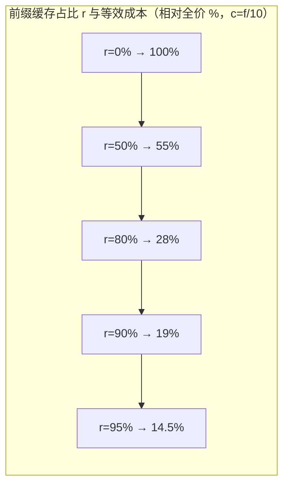
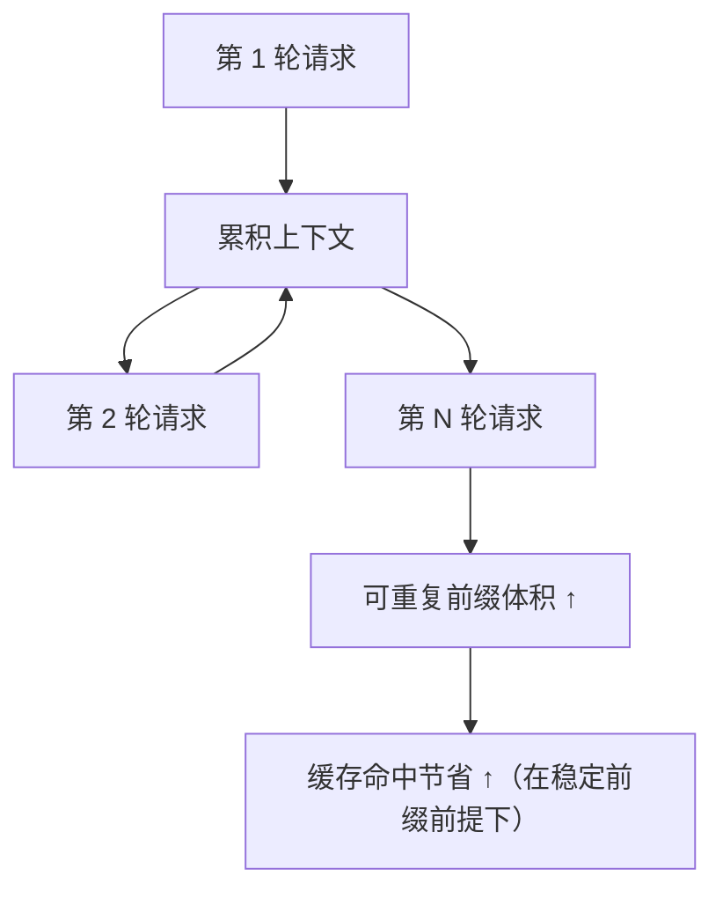

# 5.5 Token 缓存经济学（Prompt Cache Economics）

## 学习目标

- 理解 **缓存读取单价** 相对 **常规模型输入单价** 的数量级差异（教学用比例：约 90% 减免）。
- 会用简单算术估算 **长对话** 在「高命中」vs「零命中」下的费用区间。
- 解释 **命中率** 如何非线性地影响总成本。
- 读懂一张 **命中率–成本因子** 关系图（Mermaid）。

---

## 生活类比：图书馆借书 vs 复印整本

- **常规模型输入**：每次把厚书 **全文复印** 交给教授读——贵。
- **缓存读取**：教授 **记得** 上周读过同一本的前 200 页，只收 **重读已备案部分** 的低价——便宜。

Prompt caching 的本质：**稳定前缀不必每次全价「重新教」**。Claude Code 把 **静态宪法** 尽量放在前缀，就是在 **优化复印费**。

---

## 关键价格假设（教学示例，非实时报价）

> 以下数字 **仅用于课堂推算**；请以 Anthropic 控制台与文档的 **当期定价** 为准。

| 计费项 | 假设单价（示例） | 备注 |
|--------|------------------|------|
| 模型输入（未命中缓存） | **$5 / 百万 tokens** | 与官方 Opus 量级同阶的整数假设 |
| 缓存读取（cache read） | **$0.50 / 百万 tokens** | 约为常规模型输入的 **1/10** → **节省约 90%** |
| 缓存写入（若有） | 另计，本篇从略 | 首次建立前缀时可能发生 |

**用户给出的经验表述**：缓存读取约 **$0.50/百万**，正常输入约 **$5/百万** → **节省 80–90%**（与 1/10 一致）。

---

## 100 轮 Opus 级对话：从 $50–100 降到 $10–19（推演）

### 设定（简化模型）

- 每轮 **用户 + 助手 + 工具** 往返后，进入下一请求时，**system 前缀 + 历史** 中有 **S** tokens 属于「可缓存前缀」结构（教学上常包含长 system 与累积历史，具体以平台规则为准）。
- 为突出 **system 静态块** 的收益，假设每轮 **新增** 用户与助手内容合计 **U** tokens。
- **仅演示数量级**：设每轮请求里，有 **P = 200,000** tokens 的前缀在本次请求中走 **缓存读取价**，每轮另有 **Q = 10,000** tokens 走 **常规模型输入价**（新内容、未命中部分）。

> 真实产品中 P/Q 随历史长度、截断策略、是否多模态等剧烈变化；此处取 **「长上下文 + 高前缀重复」** 的保守夸张例，用于展示 **降费潜力**。

### 零缓存命中（极端差）

每轮全部按 $5/百万：

- 每轮 tokens 假设 `P + Q = 210,000`
- 100 轮总 tokens ≈ `21,000,000`
- 费用 ≈ `21 × 5 = **$105**`

（与用户说的 **$50–100** 同量级，可通过调低 P/Q 对齐。）

### 高缓存命中（前缀按 $0.50/百万）

同一轮：

- `P` 走缓存读：`200,000 × $0.50/1e6 = $0.10`
- `Q` 走常规模型输入：`10,000 × $5/1e6 = $0.05`
- **每轮合计 ≈ $0.15**

100 轮 ≈ **$15**

若 Q 略大或 P 略小，落在 **$10–19** 区间非常自然。

### 算术小结表

| 场景 | 每轮费用（示例公式） | 100 轮近似 |
|------|----------------------|------------|
| 全价前缀 | `(P+Q) × $5/M` | ~$105 |
| 前缀缓存读 | `P×$0.5/M + Q×$5/M` | ~$15 |

**结论（教学）**：**长且稳定的前缀** 是降本核心；**动态污染前缀** 是回本杀手（见 [5.6](./06-cache-pitfalls.md)）。

---

## Mermaid：成本结构饼图意念（流程版）



---

## Mermaid：命中率与「等效单价倍数」

设一次请求中，前缀占比为 `r`（0–1），仅两档价：缓存读 `c`，全价 `f`，且忽略写入费。

**等效每 token 单价**（极度简化）：

\[
\text{eff} = r \cdot c + (1-r) \cdot f
\]

当 `c = f/10`：

| 命中率 r（前缀走缓存） | 等效相对全价的比例（近似） |
|------------------------|----------------------------|
| 0% | 100% |
| 50% | 55% |
| 80% | 28% |
| 90% | 19% |
| 95% | 14.5% |



> 上图用 **流程链** 表达「r 越高、相对全价成本越低」的单调关系；精确数值以下表为准（兼容不支持 xychart 的渲染器）。

| r | 相对全价成本 % |
|---|----------------|
| 0 | 100 |
| 0.5 | 55 |
| 0.8 | 28 |
| 0.9 | 19 |
| 0.95 | 14.5 |

---

## 缓存命中率对成本的「杠杆效应」

1. **前缀越长、重复越高** → 绝对节省的美元越大（线性于 tokens）。
2. **小幅命中率下滑** → 在高价区多烧的钱 **不成比例地痛**（因为贵的是 $5/M 那段）。
3. **动态块膨胀** 不仅多 token，还可能 **打碎前缀** → 双重打击。

---

## 给团队的可执行建议（与提示词工程联动）

| 动作 | 预期收益 |
|------|----------|
| 静态宪法与动态政策 **硬边界** | 稳定前缀，提升命中 |
| 禁止在静态区写时间戳 / 随机 ID | 避免伪变化 |
| MCP 工具列表稳定化（少抖动） | 减少动态区对前缀的「牵连」（视实现而定） |
| 监控「缓存读写 tokens」指标 | 把降本变成可观测 KPI |

---

## 源码片段（概念）：按层统计 tokens（观测用）

```typescript
type Pricing = { modelPerM: number; cacheReadPerM: number };

function estimateInputCost(tokens: {
  cacheRead: number;
  fullPrice: number;
}, p: Pricing): number {
  return (
    (tokens.cacheRead * p.cacheReadPerM) / 1_000_000 +
    (tokens.fullPrice * p.modelPerM) / 1_000_000
  );
}

// 例：cacheRead=200_000, fullPrice=10_000 → 约 $0.15（沿用本节假设价）
```

---

## 灵敏度：Q 与 P 同时变化时（100 轮）

固定 **单价假设**（$5/M 全价，$0.5/M 缓存读），只调 **每轮 token 结构**：

| 每轮 P（缓存读） | 每轮 Q（全价） | 每轮费用 | 100 轮合计 |
|------------------|----------------|----------|------------|
| 200,000 | 10,000 | $0.15 | ~$15 |
| 150,000 | 20,000 | $0.175 | ~$17.5 |
| 100,000 | 30,000 | $0.20 | ~$20 |
| 50,000 | 40,000 | $0.225 | ~$22.5 |

**读表直觉**：即使 **前缀变短**（P 降），只要 **全价区 Q 不大**，总账单仍可能落在 **$10–25** 量级。若 **完全无缓存**，每轮费用改为 `(P+Q) × $5/M`（例如 P=200k、Q=10k 时每轮约 **$1.05**），100 轮约 **$105**，与「高命中」场景相差约 **7 倍**（该倍数随 P/Q 与价差假设而变）。

---

## Mermaid：长对话下的「前缀滚雪球」



> 若前缀因陷阱被污染，滚雪球的是 **费用** 而不是 **红利**。

---

## 与产品指标对接（观测面板建议）

| 指标 | 含义 | 异常时排查 |
|------|------|------------|
| `cache_read_tokens` | 走低价读的 tokens | 突然归零 → 提示词或模型切换 |
| `input_tokens` 全价部分 | 新增/未命中 | 对话变长或截断策略变 |
| `cost_per_turn` | 每轮美元 | 与命中率表对照 |
| `static_block_version` | 静态宪法版本 | 发版后对比命中曲线 |

---

## 自测题

1. 若缓存读价不是 f/10 而是 f/5，100 轮示例总费用会上浮多少（定性即可）？
2. 为什么「长对话」比「短对话」更吃缓存红利？
3. 你会如何把「降本」写成 CI 里的告警规则（指标 + 阈值思路）？

---

## 导航

- [← 5.4 缓存边界](./04-cache-boundary.md)
- [5.6 缓存失效陷阱 →](./06-cache-pitfalls.md)
