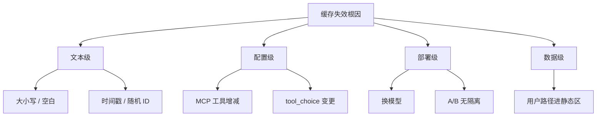

# 5.6 缓存失效 7 大陷阱

## 学习目标

- 列举 **七种** 常见导致 prompt 缓存前缀失效或命中率暴跌的做法。
- 每个陷阱能给出 **反面示例** 与 **规避手段**。
- 建立「改提示词 = 改计费」的成本意识。

---

## 生活类比：指纹打卡机

公司门禁认 **指纹**。你 **整过容**（全脸变化）或 **手指贴了新创可贴**（局部变化），识别率都会掉。

缓存前缀就像 **指纹模板**：任何你以为「无所谓」的小改动，都可能让系统认为 **换了一根手指**。

---

## 总览表

| # | 陷阱 | 典型症状 | 核心规避 |
|---|------|----------|----------|
| 1 | 改大小写 / 空白规范化 | 前缀哈希突变 | 统一 formatter、禁止随意 trim 规则变更 |
| 2 | 加减 MCP 工具 | 工具列表变化 | 稳定工具集、批量变更、版本化说明块 |
| 3 | 换模型 | 供应商侧缓存键变 | 升级评估缓存命中回归 |
| 4 | 注入时间戳 | 每轮前缀不同 | **只放动态区** 或日志侧 |
| 5 | 改 `tool_choice` / 工具模式 | API 行为变、拼接变 | 谨慎改默认调用策略 |
| 6 | 静态区混入用户路径 | 多用户互相污染或无法命中 | 路径仅动态区 |
| 7 | 提示词 A/B 无版本隔离 | 实验污染生产缓存统计 | 分环境、分 key、分前缀 |

---

## 陷阱 1：改大小写与空白

### 现象

`FileRead` 与 `fileread`、`\n\n` 与 `\n`、行尾空格，在 **字节级** 都不相等。某些团队在「美化提示词」时无意改了大小写，导致 **缓存整段失效**。

### 反面示例

```diff
- You MUST use FileRead for reading files.
+ You must use fileread for reading files.
```

### 避免方法

- 提示词 **规范化管道**（单一 builder），禁止手改散落副本。
- Code review 关注 **非语义**  diff（大小写、换行）。

---

## 陷阱 2：加减 MCP 工具

### 现象

MCP 工具清单常拼进 **system 或 tools 模式描述**。增删一个工具 → 描述字符串变 → **前缀变化**。

### 反面示例

```text
# 今日注入
可用工具：Read, Edit, Bash, mcp__slack__post_message  # 新增一行
```

### 避免方法

- **批量** 更新工具说明，减少日内抖动。
- 把易变清单 **固定放在动态区** 且接受失效，但 **勿** 向上渗透污染静态宪法（架构约定）。
- 对实验性 MCP 使用 **单独 profile**。

---

## 陷阱 3：换模型

### 现象

不同模型族可能对应 **不同计费与缓存实现**；即便文本相同，平台也可能 **不复用** 另一模型的缓存条目。

### 反面示例

「本周从 A 模型切到 B 模型，费用报表突然难看」——部分来自 **命中归集变化**。

### 避免方法

- 模型升级做 **A/B 费用对比**（同任务、同前缀策略）。
- 大版本切换时 **预期** 短期命中率波动。

---

## 陷阱 4：加时间戳 / 随机 trace id

### 现象

调试时在 system 顶部加入：

```typescript
const banner = `Build time: ${Date.now()}`;
```

每请求变一次 → **缓存永久 0 命中**。

### 避免方法

- 时间信息放 **日志**，不要进 **可缓存前缀**。
- 若必须给模型「当前时间」，放在 **动态区** 并 **接受** 该区不命中。

---

## 陷阱 5：改 `tool_choice` 或工具调用模式

### 现象

部分 API 层在切换 `tool_choice`（如 auto / required / none）时，会 **重组消息或 system 附加说明**，间接改变前缀或系统拼装路径。

### 反面示例

全局把 `tool_choice` 从 `auto` 改为 `required`，触发不同的 **工具调用引导语** 注入。

### 避免方法

- 变更默认工具策略前读 **供应商文档** 与 **内部拼装 diff**。
- 分阶段灰度，观察 **cache read tokens** 曲线。

---

## 陷阱 6：静态区混入用户特定信息

### 现象

为「省事」把用户名、home 路径、仓库绝对路径写进 **静态宪法生成器**：

- 多用户场景下 **无法共享缓存** 或 **错误共享**（严重）。
- 单用户场景也会因 **路径变化** 频繁失效。

### 反面示例

```text
你是专为 /Users/alice/my-app 服务的助手……
```

### 避免方法

- **用户与路径** 永远在 `SYSTEM_PROMPT_DYNAMIC_BOUNDARY` **之下**。

---

## 陷阱 7：A/B 实验污染前缀

### 现象

同时在产线注入多种提示变体，但 **无稳定前缀**；或把实验 flag 随机插进前缀中间。

### 反面示例

```text
[[experiment_variant=37]]  # 随机
你是……
```

### 避免方法

- 实验变体 **整块替换** 且 **版本号稳定**（按 cohort 固定）。
- 指标按 **变体 ID** 分桶看缓存命中。

---

## Mermaid：陷阱 4 的因果链


---

## Mermaid：七陷阱分类（树状）



---

## 快速自查脚本思路（伪代码）

```typescript
function auditPromptForCaching(s: string): string[] {
  const issues: string[] = [];
  if (/\d{4}-\d{2}-\d{2}T/.test(s)) issues.push("疑似 ISO 时间戳");
  if (/trace[_-]?id/i.test(s)) issues.push("疑似 trace id");
  if (/Users\/|C:\\Users\\/i.test(s)) issues.push("疑似用户路径");
  return issues;
}
```

---

## 自测题

1. 为什么「美化换行」也可能比「改一句中文翻译」更伤缓存？
2. MCP 变更同时影响 **功能** 与 **成本** 的路径各是什么？
3. 若必须把「当前时间」给模型，你会放在哪一层、如何接受成本？

---

## 导航

- [← 5.5 Token 经济学](./05-token-economics.md)
- [5.7 铁血行为约束 →](./07-behavior-constraints.md)
