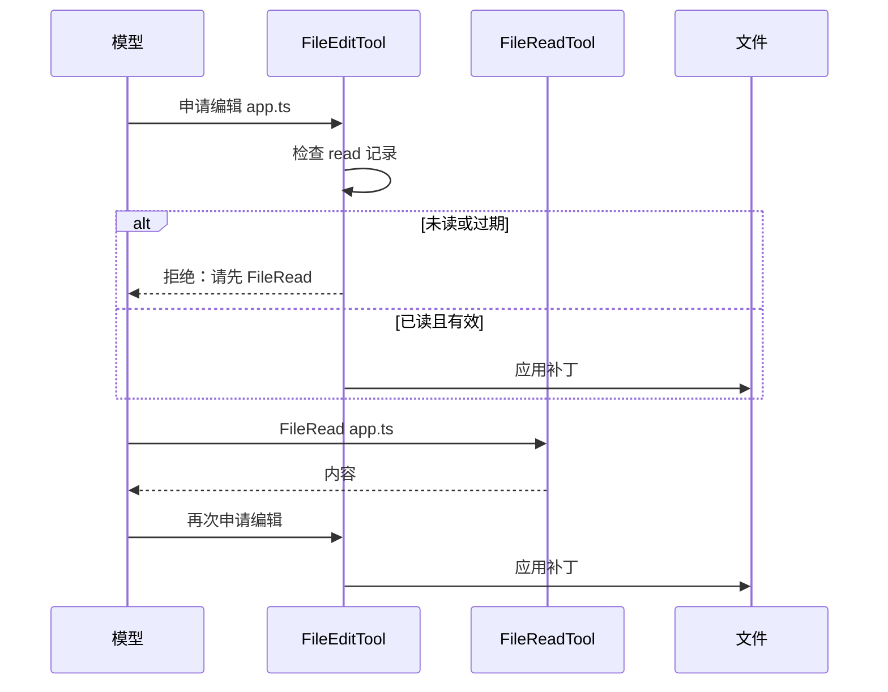
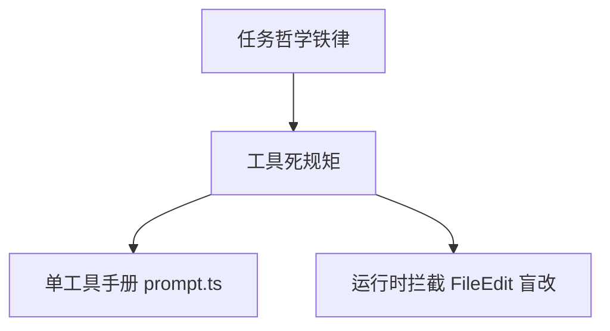

# 5.7 铁血行为约束（Behavior Constraints）

## 学习目标

- 复述 `getSimpleDoingTasksSection` 类 **任务哲学铁律**（不加无关功能、不过度抽象等）。
- 背熟 **工具使用死规矩**：读用 `FileRead`、改用 `FileEdit`、无依赖并行。
- 说明 **BashTool Git 安全协议** 三条：**不** `push --force`、**不** `reset --hard`、**总是新 commit** 不 amend。
- 解释 **Fail-closed**：`isConcurrencySafe` 与 `isReadOnly` **默认 false** 的工程含义。
- 说明 **FileEditTool 强制先 FileReadTool**：盲改拦截逻辑的产品价值。
- 了解 **`USER_TYPE === 'ant'`** 分支对内部员工可能 **更激进** 的策略差异（概念层）。

---

## 生活类比：手术室的核对清单

再厉害的医生也要：**先读病历再开刀**、**不擅自加戏（额外器官别乱切）**、**危险操作双人确认**。

Agent 的「铁血约束」就是 **手术室清单**：不是为了刁难模型，是为了 **可恢复、可审计、少翻车**。

---

## 一、任务哲学铁律（`getSimpleDoingTasksSection` 教学归纳）

> 以下为对常见 **「Doing tasks」** 短章节的语义归纳；函数名对齐你的技术说明。

| 铁律 | 含义 | 反面行为 |
|------|------|----------|
| 不加无关功能 | 只做用户要的，拒绝「我顺便帮你重构整个项目」 | scope creep |
| 不过度抽象 | 够用即可，避免为模式而模式 | 引入不必要框架 |
| 不乱加注释 | 注释服务维护，不服务「显得我很努力」 | 满屏噪声注释 |
| 不给时间估计 | 避免幻觉式 deadline | 「大约 5 分钟搞定」 |
| 失败先诊断再换策略 | 先定位根因，再换工具/思路 | 随机重试三连 |
| 结果如实汇报 | 失败说失败，不确定说不确定 | 粉饰输出 |

### 源码片段（概念）

```typescript
function getSimpleDoingTasksSection(): string {
  return [
    "- 不添加用户未要求的无关功能。",
    "- 避免过度抽象；优先最小可行修改。",
    "- 不堆砌无意义注释。",
    "- 不对耗时给出武断估计。",
    "- 出错时先诊断再更换策略，禁止盲目重试。",
    "- 如实汇报结果与限制，不夸大成功。",
  ].join("\n");
}
```

---

## 二、工具使用「极死板」规范

### 核心规矩

1. **读文件**：使用 **`FileRead`**（或产品等价物），**禁止**用 `cat`/`head` 等 shell 代替（除非产品明确允许例外）。
2. **改文件**：使用 **`FileEdit`**（或结构化补丁工具），**禁止**用 `sed -i` 等盲改。
3. **无依赖的工具调用**：**必须并行** 发起，降低延迟。

### 为什么死板？

| 理由 | 说明 |
|------|------|
| 可审计 | structured read/edit 可记录路径与版本 |
| 跨平台 | shell 文本命令在 Windows/引号/转义上脆弱 |
| 与安全钩子结合 | 工具层可做策略拦截（盲改、敏感路径） |

### 反面示例

```bash
# 反模式：用 cat「读」——绕过 FileRead 的统一策略
cat src/app.ts
```

```bash
# 反模式：sed 原地改——难以 diff、难以回滚对齐
sed -i '' 's/foo/bar/' src/app.ts
```

### 推荐心智

**「Shell 是胶水，文件真相在专用工具里。」**

---

## 三、BashTool：Git 安全协议（教学版）

| 禁止 / 要求 | 说明 |
|-------------|------|
| **禁止** `git push --force` | 避免覆盖他人历史，破坏协作 |
| **禁止** `git reset --hard` | 防止未备份工作丢失（除非产品另有撤销机制） |
| **总是新 commit** | 用新提交记录变更，**不要** `git commit --amend` 改写已发布历史 |

### 生活类比

Git 历史像 **银行流水**：你可以 **新记一笔冲正**，但不该 **偷偷改昨天那条记录**（amend / force push 的协作风险）。

---

## 四、Fail-closed 设计

### 定义

对工具元数据中的开关：

- `isConcurrencySafe` **默认 `false`**
- `isReadOnly` **默认 `false`**

除非工具作者 **显式证明** 并发安全或只读，否则调度器 **保守处理**。

### 工程含义

| 默认值 | 若误标为 true 的后果 | Fail-closed 避免 |
|--------|----------------------|------------------|
| `isConcurrencySafe` | 并行调用 **竞态**、文件损坏 | 默认不并行 |
| `isReadOnly` | 误以为只读而 **并行+缓存** | 默认按「有副作用」处理 |

### 伪代码

```typescript
interface ToolMeta {
  isConcurrencySafe?: boolean;
  isReadOnly?: boolean;
}

function isSafeToParallelize(meta: ToolMeta): boolean {
  return meta.isConcurrencySafe === true; // 必须显式 true
}

function treatAsReadOnly(meta: ToolMeta): boolean {
  return meta.isReadOnly === true;
}
```

---

## 五、FileEditTool：强制先 FileReadTool

### 规则

在允许编辑前，系统校验：**目标文件已被 FileRead（或等价）读取** 且版本仍有效；否则 **拦截盲改**。

### 价值

- 防止模型在 **未看到最新内容** 的情况下覆盖他人修改。
- 降低 **上下文幻觉** 导致的灾难性补丁。

### 流程示意（Mermaid）



---

## 六、`USER_TYPE === 'ant'`：内部员工分支（概念）

部分部署为 **内部用户** 提供 **更激进** 策略（更高自动性、更宽工具范围等），通过：

```typescript
const policy =
  ctx.userType === "ant"
    ? loadInternalAggressivePolicy()
    : loadDefaultPolicy();
```

**教学提醒**：

- 这是 **风险与信任模型** 选择，不是「能力更强」的同义词。
- 对外用户默认应 **更保守**，避免合规与数据泄露面扩大。

---

## Mermaid：行为约束在提示词中的层次



---

## 表格：约束落点（提示 vs 代码）

| 约束类型 | 主要靠提示词 | 主要靠代码拦截 |
|----------|--------------|----------------|
| 不加无关功能 | 是 | 难 |
| 不用 cat 读文件 | 是 | 可部分 |
| 禁止 force push | 是 | **应用层强烈建议** |
| FileEdit 先读 | 提示辅助 | **应硬拦截** |
| Fail-closed | 解释性 | **调度器实现** |

---

## 自测题

1. 为什么「禁止时间估计」属于 **产品体验** 而不只是风格？
2. Fail-closed 与「默认允许」在 **并行调度** 上各适合什么组织文化？
3. 若移除 FileEdit 先读拦截，最可能出现的 **真实事故** 是什么？

---

## 导航

- [← 5.6 缓存陷阱](./06-cache-pitfalls.md)
- [5.8 工具使用手册 →](./08-tool-manuals.md)
