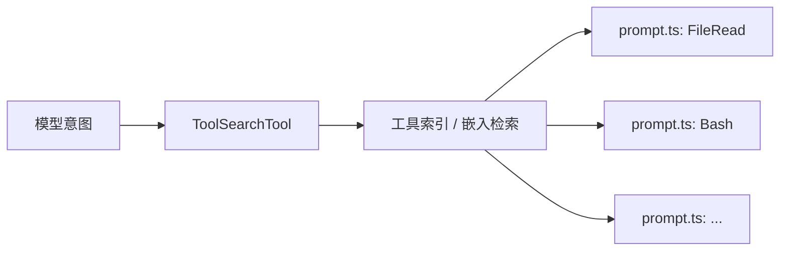
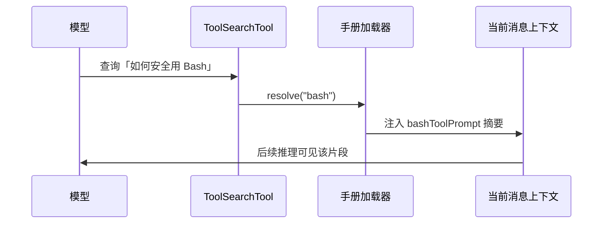

# 5.8 工具使用手册：每个工具的 `prompt.ts`

## 学习目标

- 理解 **42 个工具按需延迟加载** 与 **ToolSearchTool 注入** 的协作方式。
- 能描述 **工具目录 `prompt.ts`** 的职责：写给 **模型** 看的说明，而非给人类运维读的长文。
- 分析一份 **BashTool 手册示例**：参数约束、Git 子协议、反模式。
- 区分 **全局工具总则**（宪法层）与 **单工具手册**（条例层）。

---

## 生活类比：宜家家具说明书

全屋装修规范（**宪法**）说：「用电钻注意安全」。

具体到 **书柜 B**：步骤图、螺丝编号、「不要用锤子敲卡扣」——这是 **B 的说明书**。

`prompt.ts` 就是 **每件家具的折叠说明书**：模型 **按需翻页**，而不是一次塞满 42 本。

---

## 架构：ToolSearchTool 与延迟加载

### 要点（对齐你的技术信息）

- 全量 42 个工具的 **长描述** 若全部塞进 system → **前缀爆炸**、成本高、噪声大。
- **ToolSearchTool**（名称教学化）允许模型 **检索** 当前任务相关的工具手册片段。
- 每个工具目录维护 **`prompt.ts`**（或等价模块），导出 **短而硬** 的使用说明字符串。

### Mermaid：从「我要干活」到「读到正确手册」



### Mermaid：延迟加载 vs 全量注入


---

## `prompt.ts` 写什么？（结构模板）

| 区块 | 内容 |
|------|------|
| **一句话职责** | 这个工具解决什么问题 |
| **何时用 / 何时不用** | 与相邻工具的分工 |
| **参数契约** | 必填、可选、格式、路径约定 |
| **硬禁令** | 与 Bash/Git/读写的边界 |
| **好例子 / 坏例子** | 各 1 组即可 |
| **并行与依赖** | 能否与谁并行；是否必须先读 |

### 源码片段（概念）：工具 prompt 模块

```typescript
// tools/bash/prompt.ts — 教学示例
export const bashToolPrompt = `
## BashTool

用途：在受控环境中执行 shell 命令以完成构建、测试、包管理。

何时使用：
- 需要运行 npm/pnpm/pytest 等项目命令。
- 需要 git status/diff 等只读查询（仍须遵守 Git 安全协议）。

何时不使用：
- 读取文件内容 → 使用 FileReadTool，不要用 cat。
- 修改源文件 → 使用 FileEditTool，不要用 sed -i。

Git 安全协议（摘要）：
- 禁止 git push --force。
- 禁止 git reset --hard。
- 提交使用新 commit；禁止 git commit --amend 改写已共享历史。

并行：与其他无数据依赖的工具调用并行发起。
`.trim();
```

---

## BashTool 手册扩展示例（可直接当模板骨架）

```markdown
## BashTool — 扩展手册（示例）

### 安全边界
- 假定所有命令可被用户审计；避免在命令中拼接密钥。
- 长输出可能截断；需要完整内容时优先专用只读工具或分页策略（若产品提供）。

### 推荐模式
- 先 `pwd` / `git status` 建立情境，再执行目标命令（在需要时）。
- 构建失败时，保留完整错误输出片段，便于诊断。

### 反模式
- 用 `rm -rf` 清理构建产物前未确认路径。
- 用 `curl | sh` 安装未知脚本。

### 与 File 工具协作
1. FileRead 获取配置或源码上下文。
2. Bash 运行与上下文一致的命令。
3. FileEdit 根据结果改代码；勿用 awk/sed 代替 FileEdit。
```

---

## 表格：总则 vs `prompt.ts`

| 维度 | 全局工具总则（静态宪法侧） | 单工具 `prompt.ts` |
|------|----------------------------|---------------------|
| 受众 | 所有工具调用 | 单一工具 |
| 稳定性 | 高 | 中（随工具演进） |
| 长度 | 短 | 可中等，但检索片段宜短 |
| 典型内容 | 并行纪律、先读后写 | 参数、反模式、Git 细则 |

---

## 「42 个工具」治理建议

1. **每个工具单一文件**，避免 README 与 prompt 分叉。
2. **索引一致性**：ToolSearch 的元数据（名称、标签）与 `prompt.ts` 同步更新。
3. **抽检**：新工具上线前跑一轮 **模型开卷考试**（给定任务，看是否先检索正确手册）。

---

## 与 Fail-closed / 盲改拦截的衔接

- `prompt.ts` 写明 **必须先 FileRead** 是 **软约束**。
- **FileEdit 硬拦截** 是 **硬约束**。

二者叠加，**降低模型钻空子概率**。

---

## `prompt.ts` 长度与信息密度指南

| 篇幅 | 建议 | 原因 |
|------|------|------|
| 极短（< 30 行） | 适合高频、语义单一工具 | 检索命中后噪声低 |
| 中等（30–120 行） | Bash、Git、测试运行器等 | 需示例与反模式 |
| 过长（> 200 行） | 拆成「总则 + 场景附录」 | 避免单次注入吞没用户消息 |

**写作原则**：模型 **不会** 像人类一样「通读全书」，而是 **边做边查**。段落标题要 **可扫描**，禁令要 **可执行**（动词开头）。

---

## 与 42 个工具的版本协同

```typescript
// 概念：工具版本 bump 时同步索引，避免「搜得到但说明过期」
export const TOOL_MANUAL_INDEX = [
  { name: "FileRead", version: 3, path: "tools/file-read/prompt.ts" },
  { name: "Bash", version: 12, path: "tools/bash/prompt.ts" },
  // ...
] as const;
```

| 变更类型 | 需要更新 |
|----------|----------|
| 新增必填参数 | `prompt.ts` + Schema + 索引 |
| 仅修复 bug | 宿主代码为主；prompt 可选微调 |
| 重命名工具 | **破坏性**：索引、历史会话、缓存 |

---

## Mermaid：手册片段如何进入当轮上下文



---

## BashTool 手册「反面教材」片段（刻意糟糕）

```text
## Bash
你可以运行任何命令。随便 push。
```

**问题**：无 Git 协议、无 File 工具分工、无并行提示 → 模型行为 **不可预期**。对比前文「扩展手册示例」可见差异。

---

## 自测题

1. 若把 42 个 `prompt.ts` 全文塞进静态宪法，会破坏哪两个工程目标？
2. ToolSearchTool 检索失败时，产品应 **降级** 为什么体验（全量？拒绝？）？
3. Bash 手册里为什么要 **重复** Git 三条（若宪法已写过）？

---

## 导航

- [← 5.7 行为约束](./07-behavior-constraints.md)
- [5.9 策略对比 →](./09-comparison.md)
